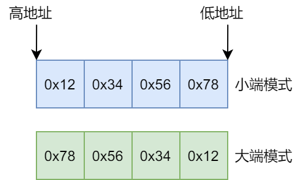

### 基本概念

&emsp;&emsp;`大端`是高字节存放到内存的低地址，`小端`是高字节存放到内存的高地址。<!--more-->
&emsp;&emsp;假设有一个`32`位`int`型整数`0x12345678`，它在内存中有`2`种存放方式：



### 判断方法

&emsp;&emsp;判断大小端的方法如下：

``` cpp
// 共用体很重要的一点：a和b都是从内存低地址开始存放的
union myunion {
    int a;
    char b;
};

// 小端模式返回1，大端模式返回0
int is_little_endian ( void ) {
    union myunion u1;
    u1.a = 0x12345678;

    if ( 0x78 == u1.b ) {
        return 1;
    } else if ( 0x12 == u1.b ) {
        return 0;
    }
}
```