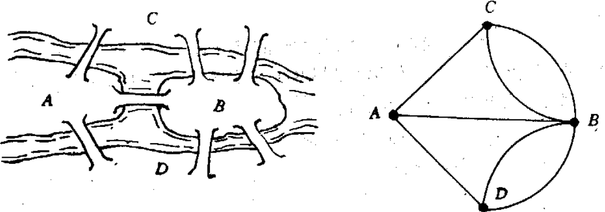

&emsp;&emsp;在`1736`年，欧拉向圣彼得堡科学院递交了`哥尼斯堡的七座桥`的论文，在解答问题的同时，开创了数学的一个新的分支，即`图论`与`几何拓扑`。七桥问题提出后，很多人对此很感兴趣，纷纷进行试验，但在相当长的时间里，始终未能解决。欧拉通过对七桥问题的研究，不仅圆满地回答了哥尼斯堡居民提出的问题，而且得到并证明了更为广泛的有关一笔画的三条结论，人们通常称之为`欧拉定理F`。
&emsp;&emsp;`18`世纪初普鲁士的哥尼斯堡有一条河穿过，河上有两个小岛，有七座桥把两个岛与河岸联系起来。有个人提出一个问题：一个步行者怎样才能不重复、不遗漏地一次走完七座桥，最后回到出发点。后来大数学家欧拉把它转化成一个几何问题，他不仅解决了此问题，且给出了连通图可以一笔画的充要条件是：奇点的数目不是`0`个就是`2`个(连到一点的数目如果是奇数条，就称为`奇点`；如果是偶数条，就称为`偶点`)。要想一笔画成，必须中间点均是偶点，也就是有来路必有另一条去路；奇点只可能在两端，即起点和终点。如果起点和终点相同，则所有的点都是偶点；如果起点和终点不同，则只有它们是奇点。

