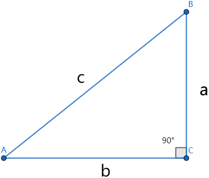

### 基本定义

&emsp;&emsp;假设有如下的三角形：<!--more-->

则各个三角函数的定义如下：

名称 | 公式                                    | 名称 | 公式
-----|-----------------------------------------|-----|-----
正弦 | $\displaystyle{sin \; A = \frac{a}{c}}$ | 余弦 | $\displaystyle{cos \; A = \frac{b}{c}}$
正切 | $\displaystyle{tan \; A = \frac{a}{b}}$ | 余切 | $\displaystyle{cot \; A = \frac{b}{a}}$
正割 | $\displaystyle{sec \; A = \frac{c}{b}}$ | 余割 | $\displaystyle{csc \; A = \frac{c}{a}}$

&emsp;&emsp;一般地，在直角坐标系中，给定一个半径为$r$的圆，对于任意角$\alpha$，使角$\alpha$的顶点与原点重合，始边与`x`轴非负半轴重合，终边与该圆交于点$P(x, \; y)$，那么：

$$
sin \ \alpha = \frac{y}{r} \qquad cos \ \alpha = \frac{x}{r} \qquad tan \ \alpha = \frac{y}{x}
$$

注意，当$\displaystyle{\alpha = \frac{\pi}{2} + k\pi \; (k \in Z)}$时，$\alpha$的终边始终在`y`轴，这时$x = 0$，所以$tan \; \alpha$没有意义。 

### 诱导公式

&emsp;&emsp;同角三角函数的基本关系式：

$$
(sin \ \alpha)^2 + (cos \ \alpha)^2 = 1 \qquad \frac{sin \ \alpha}{cos \ \alpha} = tan \ \alpha
$$

&emsp;&emsp;终边相同的三角函数值：

$$
sin(\alpha + k \ast 2 \pi) = sin \ \alpha \qquad cos(\alpha + k \ast 2 \pi) = cos \ \alpha \qquad tan(\alpha + k \ast 2 \pi) = cos \ \alpha
$$

&emsp;&emsp;$\pi + \alpha$的三角函数值与$\alpha$的三角函数值之间的关系：

$$
sin(\pi + \alpha) = -sin \ \alpha \qquad cos(\pi + \alpha) = -cos \ \alpha \qquad tan(\pi + \alpha) = tan \ \alpha
$$

&emsp;&emsp;$\alpha$的三角函数值与$-\alpha$的三角函数值之间的关系：

$$
sin(-\alpha) = -sin \ \alpha \qquad cos(-\alpha) = cos \ \alpha \qquad tan(-\alpha) = -tan \ \alpha
$$

&emsp;&emsp;$\pi - \alpha$的三角函数值与$\alpha$的三角函数值之间的关系：

$$
sin(\pi - \alpha) = sin \ \alpha \qquad cos(\pi - \alpha) = -cos \ \alpha \qquad tan(\pi - \alpha) = -tan \ \alpha
$$

$$
sin \left ( \frac{\pi}{2} - \alpha \right ) = cos \ \alpha \qquad sin \left ( \frac{\pi}{2} + \alpha \right ) = cos \ \alpha
$$

$$
cos \left ( \frac{\pi}{2} - \alpha \right ) = sin \ \alpha \qquad cos \left ( \frac{\pi}{2} + \alpha \right ) = -sin \ \alpha
$$

### 周期函数

&emsp;&emsp;`周期函数`：对于函数$y = f(x)$，如果存在一个不为零的常数`T`，使得当`x`取定义域内的每一个值时，$f(x + T) = f(x)$都成立，那么就把函数$y = f(x)$叫做`周期函数`，不为零的常数`T`叫做这个函数的`周期`。如果在所有周期中有一个最小的正数，则称它是函数$f(x)$的最小正周期。 
&emsp;&emsp;函数$y = sin(x)$的周期是$2k \pi \; (k \in Z且k \neq 0)$，最小正周期是$T = 2\pi$。 
&emsp;&emsp;函数$y = cos(x)$的周期是$2k \pi \; (k \in Z且k \neq 0)$，最小正周期是$T = 2\pi$。 
&emsp;&emsp;一般地，函数$y = Asin(\omega x + \varphi) \; (A \neq 0且\omega > 0)$的最小正周期是$\displaystyle{T = \frac{2 \pi}{|\omega|}}$，函数$y = Acos(\omega x + \varphi) \; (A \neq 0且\omega > 0)$也是同样的。 
&emsp;&emsp;一般地，函数$y = Atan(\omega x + \varphi) \; (A \neq 0且\omega > 0)$的最小正周期是$\displaystyle{T = \frac{\pi}{|\omega|}}$。 

### 对称性

&emsp;&emsp;$y = sin(x)$的对称中心是$(k\pi, \; 0) \; (k \in Z)$，对称轴是$\displaystyle{x = \frac{\pi}{2} + k \pi \; (k \in Z)}$；单调增区间是$\displaystyle{ \left [ -\frac{\pi}{2} + 2k\pi, \; \frac{\pi}{2} + 2k \pi \right ] \; (k \in Z)}$，单调减区间是$\displaystyle{ \left [ \frac{\pi}{2} + 2k\pi, \; \frac{3}{2} \pi + 2k \pi \right ] \; (k \in Z)}$。 
&emsp;&emsp;$y = cos(x)$的对称中心是$\displaystyle{\left ( k\pi + \frac{\pi}{2}, \; 0 \right ) \; (k \in Z)}$，对称轴是$x = k \pi \; (k \in Z)$；单调增区间是$[\pi + 2k\pi, \; 2\pi + 2k\pi] \; (k \in Z)$，单调减区间是$[2k\pi, \; \pi + 2k\pi] \; (k \in Z)$。 
&emsp;&emsp;$y = tan(x)$是奇函数，单调增区间是$\displaystyle{\left ( -\frac{\pi}{2} + k \pi, \; \frac{\pi}{2} + k \pi \right ) \; (k \in Z)}$，对称中心是$\displaystyle{\left ( \frac{k \pi}{2}, \; 0 \right )}$。 

### 余弦公式

&emsp;&emsp;两角差的余弦公式：$cos(\alpha - \beta) = cos \; \alpha \; cos \; \beta + sin \; \alpha \; sin \; \beta$ 
&emsp;&emsp;两角和的余弦公式：$cos(\alpha + \beta) = cos \; \alpha \; cos \; \beta - sin \; \alpha \; sin \; \beta$ 

### 正弦公式

&emsp;&emsp;两角和的正弦公式：$sin(\alpha + \beta) = sin \; \alpha \; cos \; \beta + cos \; \alpha \; sin \; \beta$ 
&emsp;&emsp;两角差的正弦公式：$sin(\alpha - \beta) = sin \; \alpha \; cos \; \beta - cos \; \alpha \; sin \; \beta$ 

### 正切公式

&emsp;&emsp;两角和的正切公式：$\displaystyle{tan(\alpha + \beta) = \frac{tan \; \alpha + tan \; \beta}{1 - tan \; \alpha \; tan \; \beta}}$ 
&emsp;&emsp;两角差的正切公式：$\displaystyle{tan(\alpha - \beta) = \frac{tan \; \alpha - tan \; \beta}{1 + tan \; \alpha \; tan \; \beta}}$ 

### 二倍角公式

&emsp;&emsp;二倍角的正弦公式：$sin \; 2 \alpha = 2 sin \; \alpha \; cos \; \alpha$ 
&emsp;&emsp;二倍角的余弦公式：$cos \; 2 \alpha = (cos \; \alpha)^2 - (sin \; \alpha)^2 = 2(cos \; \alpha)^2 - 1 = 1 - 2(sin \; \alpha)^2$ 
&emsp;&emsp;二倍角的正切公式：$\displaystyle{tan(2\alpha) = \frac{2tan \; \alpha}{1 - (tan \; \alpha)^2}}$ 

### 半角公式

&emsp;&emsp;半角公式如下，其中符号由$\displaystyle{\frac{\alpha}{2}}$所在的象限决定：

$$
\displaystyle{sin \; \left ( \frac{\alpha}{2} \right ) = \pm \sqrt{\frac{1 - cos \; \alpha}{2}}} \qquad
\displaystyle{cos \; \left ( \frac{\alpha}{2} \right ) = \pm \sqrt{\frac{1 + cos \; \alpha}{2}}} \qquad
\displaystyle{tan \; \left ( \frac{\alpha}{2} \right ) = \pm \sqrt{\frac{1 - cos \; \alpha}{1 + cos \; \alpha}}}
$$

### 积化和差

&emsp;&emsp;积化和差公式：

$$
\displaystyle{sin \; \alpha \; cos \; \beta = \frac{1}{2}[sin(\alpha + \beta) + sin(\alpha - \beta)]} \qquad
\displaystyle{cos \; \alpha \; sin \; \beta = \frac{1}{2}[sin(\alpha + \beta) - sin(\alpha - \beta)]}
$$

$$
\displaystyle{cos \; \alpha \; cos \; \beta = \frac{1}{2}[cos(\alpha + \beta) + cos(\alpha - \beta)]} \qquad
\displaystyle{sin \; \alpha \; sin \; \beta = \frac{1}{2}[cos(\alpha + \beta) - cos(\alpha - \beta)]}
$$

### 和差化积

&emsp;&emsp;和差化积公式：

$$
\displaystyle{sin \; \theta \; + sin \; \varphi = 2sin \left (\frac{\theta + \varphi}{2} \right ) cos \left (\frac{\theta - \varphi}{2} \right )} \qquad
\displaystyle{sin \; \theta \; - sin \; \varphi = 2cos \left (\frac{\theta + \varphi}{2} \right ) sin \left (\frac{\theta - \varphi}{2} \right )}
$$

$$
\displaystyle{cos \; \theta \; + cos \; \varphi = 2cos \left (\frac{\theta + \varphi}{2} \right ) cos \left (\frac{\theta - \varphi}{2} \right )} \qquad
\displaystyle{cos \; \theta \; - cos \; \varphi = -2sin \left (\frac{\theta + \varphi}{2} \right ) sin \left (\frac{\theta - \varphi}{2} \right )}
$$

### 函数图像

&emsp;&emsp;函数$y = Asin(\omega x + \varphi) \; (A > 0且\omega > 0)$表示一个振动量时，`A`就表示这个量振动时离开平衡位置的最大距离，通常称为这个振动的`振幅`。往返一次的时间$\displaystyle{T = \frac{2\pi}{\omega}}$，称为这个振动的`周期`；单位时间内往返振动的次数$\displaystyle{f = \frac{1}{T} = \frac{\omega}{2\pi}}$，称为振动的`频率`。$\omega x + \varphi$称为`相位`，$x = 0$时的相位$\varphi$称为`初相`。
&emsp;&emsp;函数$y = Asin(x) \; (A > 0且A \neq 1)$的图像，可以看作是把$y = sin(x)$的图像上所有点的纵坐标伸长(当$A > 1$时)或缩短(当$0 < A < 1$)到原来的$A$倍，而得到的。$y = Asin(x)$的值域为$[-A, \; A]$。 
&emsp;&emsp;函数$y = sin(\omega x) \; (\omega > 0且\omega \neq 1)$的图像，可以看作是把$y = sin(x)$的图像上所有点的的横坐标缩短(当$\omega > 1$时)或伸长(当$0 < \omega < 1$)到原来的$\displaystyle{\frac{1}{\omega}}$倍，而得到的。 
&emsp;&emsp;函数$y = sin(x + \varphi)$的图像，可以看作是把$y = sin(x)$的图像上所有点的向左(当$\varphi > 0$时)或向右(当$\varphi < 0$时)平移$|\varphi|$个单位，而得到的。 
&emsp;&emsp;函数$y = sin(\omega x + \varphi)$的图像，可以看作是把$y = sin(\omega x)$的图像上所有点的向左(当$\varphi > 0$时)或向右(当$\varphi < 0$时)平移$\displaystyle{\left | \frac{\varphi}{\omega} \right |}$个单位，而得到的。 

### 降幂公式

&emsp;&emsp;降幂公式：

$$
cos^2 \alpha = \frac{1 + cos \; 2\alpha}{2} \qquad sin^2 \alpha = \frac{1 - cos \; 2\alpha}{2}
$$

### 升幂公式

&emsp;&emsp;升幂公式：

$$
1 + cos \; 2\alpha = 2 \; cos^2 \alpha \qquad 1 - cos \; 2\alpha = 2 \; sin^2 \alpha
$$

### 正弦定理

&emsp;&emsp;`正弦定理`：在$\bigtriangleup ABC$中，角`A`、`B`、`C`所对的边长分别为`a`、`b`、`c`，三角形外接圆的半径为`R`，直径为`D`，则有：

$$
\frac{a}{sin \; A} = \frac{b}{sin \; B} = \frac{c}{sin \; C} = 2R = D
$$

### 余弦定理

&emsp;&emsp;`余弦定理`：在$\bigtriangleup ABC$中，角`A`、`B`、`C`所对的边长分别为`a`、`b`、`c`，则有：

$$
a^2 = b^2 + c^2 - 2bc \; cos \; A \qquad b^2 = a^2 + c^2 - 2ac \; cos \; B \qquad c^2 = a^2 + b^2 - 2ab \; cos \; C
$$

### 边长和角

&emsp;&emsp;在$\bigtriangleup ABC$中，角`A`、`B`、`C`所对的边长分别为`a`、`b`、`c`，它们有如下性质：

$$
sin \; (A + B) = sin \; C \qquad cos \; (A + B) = - cos \; C \qquad tan \; (A + B) = - tan \; C
$$

$$
sin \; \frac{A + B}{2} = cos \; \frac{C}{2} \qquad cos \; \frac{A + B}{2} = sin \; \frac{C}{2}
$$

$$
tan \; A + tan \; B + tan \; C = tan \; A \ast tan \; B \ast \; tan \; C
$$

$$
\angle A > \angle B \Leftrightarrow a > b \Leftrightarrow sin \; A > sin \; B \Leftrightarrow cos \; A < cos \; B
$$

### 辅助角公式

&emsp;&emsp;`辅助角公式`：$a \; sin \; x + b \; cos \; x = \sqrt{a^2 + b^2} (cos \; \varphi \; sin \; x + sin \; \varphi \; cos \; x) = \sqrt{a^2 + b^2} sin(x + \varphi)$，其中$\displaystyle{sin \; \varphi = \frac{b}{\sqrt{a^2 + b^2}}}$，$\displaystyle{cos \; \varphi = \frac{a}{\sqrt{a^2 + b^2}}}$。