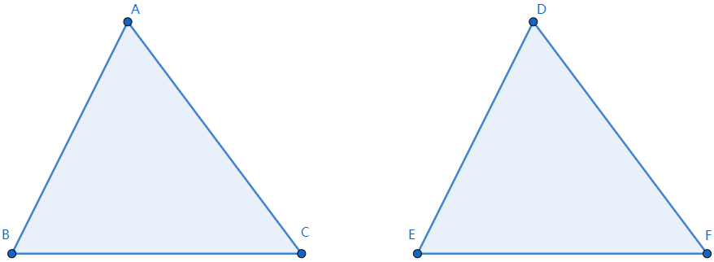

### 基本概念

&emsp;&emsp;由三条不在同一条直线上的线段顺次连接组成的平面图形叫做`三角形`。下图是$\Delta ABC$：<!--more-->

&emsp;&emsp;三角形面积的计算公式：`面积 = 底 * 高 ÷ 2`。
&emsp;&emsp;三角形的分类如下：

- `锐角三角形`：三个角都是锐角的三角形。
- `直角三角形`：有一个角是直角的三角形。
- `钝角三角形`：有一个角是钝角的三角形。

&emsp;&emsp;三角形具有稳定性，而四边形不具有稳定性。
&emsp;&emsp;三角形的内角和为$180^{\circ}$。 
&emsp;&emsp;三角形的任意两边之和大于第三条边，任意两边之差小于第三条边。

### 三线

&emsp;&emsp;从三角形中的一个顶点向它的对边所在的直线做垂线，顶点和垂足之间的线段叫做三角形的`高`。
&emsp;&emsp;在三角形中，连接一个顶点与它对边中点的线段，叫做这个三角形这条边上的`中线`。三角形的三条中线相交于一点，交点在三角形的内部。
&emsp;&emsp;在一个三角形中，一个内角的角平分线与它的对边相交，这个角的顶点与交点之间的线段，叫做三角形的`角平分线`。三角形的三条角平分线相交于一点，交点在三角形的内部。

### 外角

&emsp;&emsp;在三角形中，内角的一边与另一边的反向延长线组成的角，叫做三角形的`外角`，例如$\Delta ACD$：

&emsp;&emsp;三角形的一个外角等于与它不相邻的两个内角的和。三角形的一个外角大于任何一个与它不相邻的内角。

### 全等三角形

&emsp;&emsp;能够完全重合的两个三角形叫做`全等三角形`，例如下图是`2`个全等三角形，记作$\Delta ABC \cong \Delta DEF$，读作`三角形ABC全等于三角形DEF`：

&emsp;&emsp;在全等三角形中，互相重合的顶点叫做`对应顶点`，互相重合的边叫做`对应边`，互相重合的角叫做`对应角`。
&emsp;&emsp;注意，当$\Delta ABC \cong \Delta DEF$时，通常把对应顶点的字母写在对应的位置上。 
&emsp;&emsp;三角形全等判定：

1. 三边对应相等的两个三角形全等。
2. 两边和它们的夹角对应相等的两个三角形全等。
3. 两角和它们的夹边对应相等的两个三角形全等。
4. 有两角和其中一个角所对的边对应相等的两个三角形全等。
5. 斜边和一条直角边对应相等的两个直角三角形全等。

### 等腰三角形

&emsp;&emsp;有两条边相等的三角形叫做`等腰三角形`。相等的两边叫做`腰`，另一边叫做`底边`，两腰的夹角叫做`顶角`，腰和底边的夹角叫`底角`。
&emsp;&emsp;等腰三角形的底角相等。
&emsp;&emsp;等腰三角形的三线合一：等腰三角形的角平分线、底边的中垂线、底边上的高互相重合。

### 等边三角形

&emsp;&emsp;三条边都相等的三角形叫做`等边三角形`。等边三角形的内角都相等，为$60^{\circ}$。 
&emsp;&emsp;等边三角形的判定：

1. 三条边都相等。
2. 三个内角都相等。
3. 由一个内角为$60^{\circ}$的等腰三角形。

### 直角三角形

&emsp;&emsp;`勾股定理`：如果直角三角形的两直角边长分别为`a`、`b`，斜边长为`c`，那么$a^2 + b^2 = c^2$。 
&emsp;&emsp;勾股定理的逆定理：如果三角形的`3`个边长`a`、`b`、`c`满足$a^2 + b^2 = c^2$，那么这个三角形是直角三角形。 
&emsp;&emsp;在直角三角形中，如果一个锐角等于$30^{\circ}$，那么它所对的直角边等于斜边的一半。 
&emsp;&emsp;如果三角形一边上的中线等于这条边的一半，那么这个三角形是直角三角形。