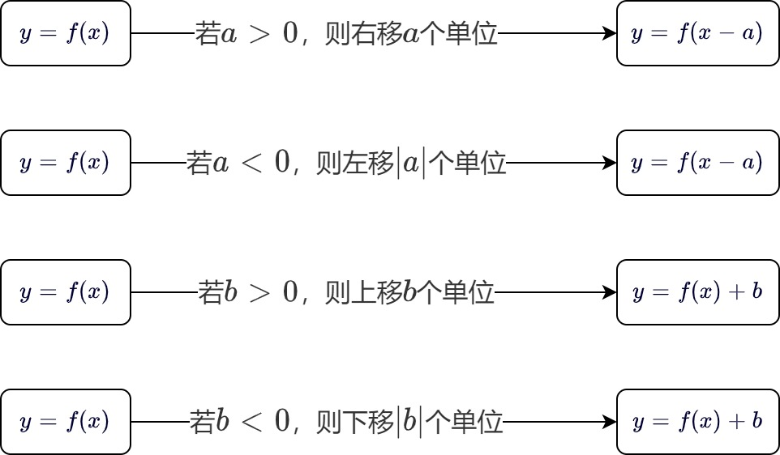
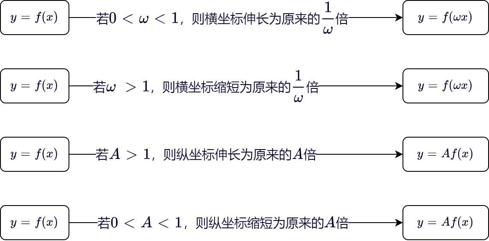
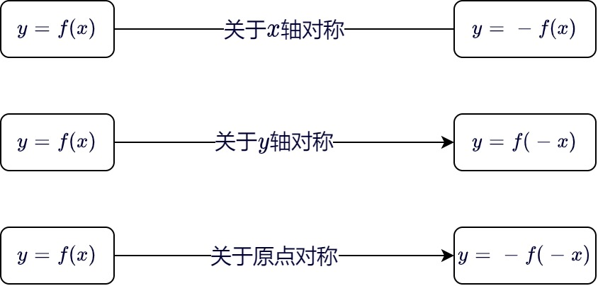

### 定义域和值域

&emsp;&emsp;`函数`：在一个变化过程中，假设有两个变量`x`、`y`，如果对于任意一个`x`都有唯一确定的一个`y`和它对应，那么就称`x`是自变量，`y`是`x`的函数。`x`的取值范围叫做这个函数的`定义域`，相应的`y`的取值范围叫做函数的`值域`。<!--more-->
&emsp;&emsp;判断两个函数相等的依据是，两个函数的定义域和对应关系完全一致。
&emsp;&emsp;设函数$f(x)$的定义域为$D_f$，$g(x)$的定义域为$D_g$，$D = D_f \cap D_g \neq \varnothing$，则：

- $(f + g)(x) = f(x) + g(x), \; x \in D$
- $(f - g)(x) = f(x) - g(x), \; x \in D$
- $(f \cdot g)(x) = f(x) \cdot g(x), \; x \in D$
- $\displaystyle{\left ( \frac{f}{g} \right )(x) = \frac{f(x)}{g(x)}, \; x \in D且g(x) \neq 0}$

### 单调性

&emsp;&emsp;设函数$f(x)$的定义域为`D`，如果对于定义域`D`内的某个区间上的任意两个自变量$x_1$、$x_2$，当$x_1 < x_2$时，都有$f(x_1) < f(x_2)$，那么就说$f(x)$在此区间上是`增函数`。此区间就叫做函数$f(x)$的`单调增区间`。
&emsp;&emsp;设函数$f(x)$的定义域为`I`，如果对于定义域`I`内的某个区间上的任意两个自变量$x_1$、$x_2$，当$x_1 < x_2$时，都有$f(x_1) > f(x_2)$，那么就说$f(x)$在此区间上是`减函数`。此区间就叫做函数$f(x)$的`单调减区间`。
&emsp;&emsp;用定义法判断函数单调性：

1. 取值：设$x_1$、$x_2$为该相应区间的任意两个值，并规定它们的大小，如$x_1 < x_2$。
2. 作差：计算$f(x_1) - f(x_2)$，并通过因式分解、配方、有理化等方法作有利于判断其符号的变形。
3. 定号：判断的符号，若不能确定，则可分区间讨论。
4. 结论：根据差的符号，得出单调性的结论。

&emsp;&emsp;设$\forall x_{1}, \; x_{2} \in D \; (x_{1} \ne x_{2})$，则：

1. $x_1 - x_2 > 0$，$f(x_1) - f(x_2) > 0$ $\Leftrightarrow$ $f(x)$在`D`上单调递增。
2. $x_1 - x_2 < 0$，$f(x_1) - f(x_2) > 0$ $\Leftrightarrow$ $f(x)$在`D`上单调递减。
3. $\displaystyle{\frac{f(x_1) - f(x_2)}{x_1 - x_2} > 0}$或$(x_1 - x_2) \ast [f(x_1) - f(x_2)] > 0$ $\Leftrightarrow$ $f(x)$在`D`上单调递增。
4. $\displaystyle{\frac{f(x_1) - f(x_2)}{x_1 - x_2} < 0}$或$(x_1 - x_2) \ast [f(x_1) - f(x_2)] < 0$ $\Leftrightarrow$ $f(x)$在`D`上单调递减。

### 最大值和最小值

&emsp;&emsp;`最大值`：一般地，设函数$y = f(x)$的定义域为`I`，如果存在实数`M`满足：

1. 对于任意的$x \in I$，都有$f(x) \le M$。
2. 存在$x_0 \in I$，使得$f(x_0) = M$。

那么称`M`是函数$y = f(x)$的最大值。 
&emsp;&emsp;`最小值`：一般地，设函数$y = f(x)$的定义域为`I`，如果存在实数`M`满足：

1. 对于任意的$x \in I$，都有$f(x) \ge M$。
2. 存在$x_0 \in I$，使得$f(x_0) = M$。

那么称`M`是函数$y = f(x)$的最小值。

### 有界性

&emsp;&emsp;设函数$f(x)$在数集$A$上有定义，如果存在常数$K_1$，使得对任意$x \in A$，有$f(x) \le K_1$，则称函数$f(x)$在数集$A$上有`上界`，并称$K_1$为在$A$上的`上界`。
&emsp;&emsp;设函数$f(x)$在数集$A$上有定义，如果存在常数$K_2$，使得对任意$x \in A$，有$f(x) \ge K_2$，则称函数$f(x)$在数集$A$上有`下界`，并称$K_2$为在$A$上的`下界`。
&emsp;&emsp;设函数$f(x)$在数集$A$上有定义，如果存在常数$M > 0$，使得对任意$x \in A$，有$|f(x)| \le M$，则称函数$f(x)$在数集$A$上`有界`，否则称为`无界`。

### 奇偶性

&emsp;&emsp;`奇函数`：对于函数$f(x)$的定义域内任意一个`x`，都有$f(-x) = -f(x)$，那么函数$f(x)$就叫做`奇函数`。
&emsp;&emsp;`偶函数`：对于函数$f(x)$的定义域内任意一个`x`，都有$f(-x) = f(x)$，那么函数$f(x)$就叫做`偶函数`。
&emsp;&emsp;奇函数的图像关于原点对称，偶函数的图像关于`y`轴对称。奇函数在两个对称的区间上具有相同的单调性，偶函数在两个对称的区间上具有相反的单调性。
&emsp;&emsp;如果一个奇函数$f(x)$在原点处有定义，即$f(0)$有意义，那么一定有$f(0) = 0$。 
&emsp;&emsp;如果函数$f(x)$是偶函数，那么$f(x) = f(|x|)$。 
&emsp;&emsp;奇函数与偶函数的运算法则：

1. 奇函数 $\pm$ 奇函数 $=$ 奇函数
2. 偶函数 $\pm$ 偶函数 $=$ 偶函数
3. 奇函数 $\ast$ 奇函数 $=$ 偶函数
4. 偶函数 $\ast$ 偶函数 $=$ 偶函数
5. 奇函数 $\ast$ 偶函数 $=$ 奇函数

### 对称性

&emsp;&emsp;若函数$f(a - x) = f(a + x)$，则函数$f(x)$的图像关于直线$x = a$对称。 
&emsp;&emsp;若对于$R$上的任意`x`都有$f(2a - x) = f(x)$或$f(2a + x) = f(x)$，则函数$f(x)$的图像关于直线$x = a$对称。 
&emsp;&emsp;若函数$f(-x + b) + f(x + b) = 0$，则函数$f(x)$关于点$(b, \; 0)$中心对称。 

### 平移变换

&emsp;&emsp;平移变换如下：

### 伸缩变换

&emsp;&emsp;伸缩变换如下：

### 对称变换

&emsp;&emsp;对称变换如下：

### 翻折变换

&emsp;&emsp;翻折变换：

1. 上下翻折变换：将函数$y = f(x)$图像在`x`轴及其上方的部分保留，再把下方的部分翻折到上方去，得到函数$y = |f(x)|$的图像。
2. 左右翻折变换：将函数$y = f(x)$图像在`y`轴及其右侧的部分保留，左侧的部分去掉，再将右侧图形复制并翻折到左侧去，得到函数$y = f(|x|)$的图像。

### 复合函数

&emsp;&emsp;设`y`是`u`的函数$y = f(u)$，`u`是`x`的函数$u = \varphi(x)$，如果$\varphi(x)$的值全部或部分在$f(u)$的定义域内，则`y`通过中间变量`u`成为`x`的函数，记作$y = f[g(x)]$，称为由函数$y = f(u)$与$u = \varphi(x)$复合而成的`复合函数`。

### 零点

&emsp;&emsp;对于函数$y = f(x)$，使$f(x) = 0$的实数`x`叫做函数$y = f(x)$的`零点`。
&emsp;&emsp;函数$y = f(x)$的零点就是方程$f(x) = 0$的实数根，也就是函数$y = f(x)$的图像与`x`轴的交点的横坐标。
&emsp;&emsp;如果函数$y = f(x)$在区间$[a, \; b]$上的图像是连续不断的一条曲线，并且有$f(a) \ast f(b) < 0$，那么函数$y = f(x)$在区间$(a, \; b)$内有零点，即存在$c \in (a, \; b)$，使得$f(c) = 0$，这个`c`也就是方程$f(x) = 0$的根。 
&emsp;&emsp;函数$F(x) = f(x) - g(x)$的零点就是方程$f(x) = g(x)$的实数根，也就是函数$y = f(x)$的图像与函数$y = g(x)$的图像交点的横坐标。

### 二分法求零点

&emsp;&emsp;二分法求$f(x)$零点的近似解： 
&emsp;&emsp;步骤1. 确定区间$[a, \; b]$，验证$f(a) \ast f(b) < 0$，给定精确度$\varepsilon$。 
&emsp;&emsp;步骤2. 求区间$(a, \; b)$的中点$x_1$。 
&emsp;&emsp;步骤3. 计算$f(x_1)$： 

1. 若$f(x_1) = 0$，则$x_1$就是函数的零点。
2. 若$f(a) \ast f(x_1) < 0$，则令$b = x_1$，此时零点$x \in (a, \; x_1)$。
3. 若$f(x_1) \ast f(b) < 0$，则令$a = x_1$，此时零点$x \in (x_1, \; b)$。

&emsp;&emsp;步骤4. 判断是否达到精确度$\varepsilon$，即$|a - b| < \varepsilon$。如果没有达到，则重复步骤`2`至步骤`4`。