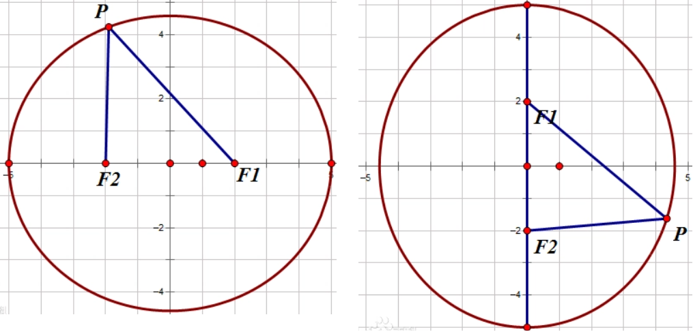
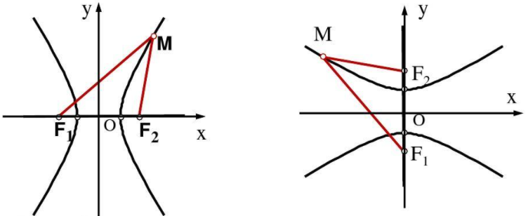

### 有理数

&emsp;&emsp;有理数的分类如下：<!--more-->

&emsp;&emsp;数`a`的绝对值记作$\left | a \right |$。绝对值是该数和数轴原点之间的距离。 
&emsp;&emsp;加法交换律：$a + b = b + a$；加法结合律：$a + b + c = a + (b + c)$。 
&emsp;&emsp;减去一个数等于加上这个数的相反数：$a - b = a + (-b)$。 
&emsp;&emsp;有理数乘法法则：

1. 两数相乘，同号得正，异号得负，并把绝对值相乘。
2. 任何数同`0`相乘，都得`0`。

&emsp;&emsp;乘法交换律：$a \ast b = b \ast a$；乘法结合律：$(a \ast b) \ast c = a \ast (b \ast c)$；乘法分配律：$a \ast (b + c) = a \ast b + a \ast c$。 
&emsp;&emsp;有理数的除法法则：

1. 除以一个不等于`0`的数，等于乘以这个数的倒数：$a \div  b = a \ast \frac{1}{b} \left (b \neq 0\right )$。 
2. 两数相除，同号得正，异号得负，并把绝对值相除。
3. `0`除以任何一个不等于`0`的数，都为`0`。

&emsp;&emsp;负数的奇次幂是负数，负数的偶次幂是正数；正数的任何次幂都是正数；`0`的任何正整数次幂都是`0`；`1`的任何次幂都是`1`。

### 整式

&emsp;&emsp;数字或字母的积的式子叫做`单项式`。单独的一个数字或一个字母也是单项式。
&emsp;&emsp;在单项式中，与字母乘积的数字称为这个单项式的`系数`。所有字母的指数的和称为这个单项式的`次数`。例如$-3x^{2}y^{3}$的系数是`-3`，次数为`2 + 3 = 5`。
&emsp;&emsp;几个单项式的和叫做`多项式`，例如$\frac{1}{2}ab - \pi r^{2}$。在多项式中，每个单项式叫做多项式的`项`，不含字母的项叫做`常数项`，次数最高项的次数叫做这个多项式的`次数`。注意，多项式的每一项包括它前面的符号。
&emsp;&emsp;单项式和多项式统称为`整式`。
&emsp;&emsp;像$3ab^{2}$与$-4ab^{2}$这样，所含字母相同，并且相同字母的指数也相同的项叫做`同类项`。几个常数项也是同类项。
&emsp;&emsp;把多项式中的同类项合并成一项称为`合并同类项`，其方法为`系数相加，字母和字母的指数不变`，例如$12x - 20x = -8x$。 
&emsp;&emsp;去括号法则：

1. 如果括号外的因数是正数，去括号后，原括号内各项的符号与原来的符号相同，即$a + (b + c) = a + b + c$。 
2. 如果括号外的因数是负数，去括号后，原括号内各项的符号与原来的符号相反，即$a - (b + c) = a - b - c$。 

&emsp;&emsp;等式的性质：

- 等式两边加(或减)同一个数(或式子)，结果仍相等，即如果$a = b$，那么$a \pm c = b \pm c$。 
- 等式两边乘以同一个数，或除以一个不为`0`的数，结果仍相等：

1. 如果$a = b$，那么$a \ast c = b \ast c$。 
2. 如果$a = b$，那么$\frac{a}{c} = \frac{b}{c}\left ( c \neq 0 \right )$。 

&emsp;&emsp;多项式与多项式相乘：$(a + b)(m + n) = am + an + bm + bn$。 
&emsp;&emsp;多项式除以单项式：先把这个多项式的每一项除以这个单项式，再把所得的商相加。
&emsp;&emsp;平方差公式：$(a + b)(a - b) = a^2 - b^2$。 
&emsp;&emsp;完全平方公式：

- $(a + b)^2 = a^2 + 2ab + b^2$ 
- $(a - b)^2 = a^2 - 2ab + b^2$ 

&emsp;&emsp;把一个多项式化成几个整式的积的形式，叫做多项式的`因式分解`，例如$x^2 + x = x(x + 1)$。 
&emsp;&emsp;分解因式的要求：必须进行到每一个多项式都不能再分解为止。
&emsp;&emsp;`ma + mb + mc`的各项都有一个公共的因式`m`，我们把这个因式`m`叫做这个多项式的`公因式`。从多项式中提取公因式叫做`提公因式法`。

### 分式

&emsp;&emsp;如果`A`、`B`表示两个整式，并且`B`中含有字母，那么式子$\frac{A}{B}$叫做`分式`，其中`A`叫做分式的`分子`，`B`叫做分式的`分母`。
&emsp;&emsp;当$B \neq 0$时，分式$\frac{A}{B}$有意义；当$A = 0$且$B \neq 0$时，分式$\frac{A}{B}$的值为`0`。
&emsp;&emsp;分式的基本性质：

- $\frac{A}{B} = \frac{A \ast C}{B \ast C}$，其中$C \neq 0$。
- $\frac{A}{B} = \frac{A \div C}{B \div C}$，其中$C \neq 0$。

&emsp;&emsp;把分式的分子和分母的公因式都约去，这种变形叫做分式的`约分`，例如$\frac{a^2bc}{ab} = \frac{a^2bc \div ab}{ab \div ab} = ac$。 
&emsp;&emsp;像$\frac{100}{20 + v} = \frac{60}{20 - v}$这样，分母中含有未知数的方程，叫做`分式方程`；分母中不含有未知数的方程叫做`整式方程`。

### 一元一次方程

&emsp;&emsp;只含有一个未知数，且未知数的次数都是`1`，这样的方程叫做`一元一次方程`。一般形式为$ax + b = 0\left ( a \neq 0\right )$。 

### 直线

&emsp;&emsp;直线的性质：经过两点有一条直线，并且只有一条直线。
&emsp;&emsp;怎样判断两条射线是同一射线：`端点相同`和`延伸方向相同`。
&emsp;&emsp;两点之间的所有连线中，线段最短。两点之间线段的长度叫做两点之间的`距离`。
&emsp;&emsp;如果两条直线只有一个公共点，就说这两条直线`相交`，该公共点叫做两条直线的`交点`。

### 角

&emsp;&emsp;由具有公共端点的两条射线组成的图形叫做`角`，例如下图是$\angle AOB$：

&emsp;&emsp;一条射线先绕它的端点旋转，当终边和始边成一条直线时，所成的角叫做`平角`，其角度为$180^{\circ}$。终边继续旋转，当它和始边重合时，所成的角叫做`周角`，其角度为$360^{\circ}$。 
&emsp;&emsp;锐角的角度为$0^{\circ}< \alpha < 90^{\circ}$，钝角的角度为$90^{\circ}< \alpha < 180^{\circ}$，直角为$90^{\circ}$。 
&emsp;&emsp;角度单位`度`、`分`和`秒`的转换：$1^{\circ} = {60}'$(读作`60分`)，${1}' = 60'$$'$(读作`60秒`)。
&emsp;&emsp;角的大小和角的两边画出的长短没有关系。角张开的程度越小，角度就越小。
&emsp;&emsp;在角的内部，自顶点引一条射线把这个角分成两个相等的角，那么这条射线叫做`角平分线`。
&emsp;&emsp;角平分线上的一点，到角的两边的距离相等。角的内部到角的两边的距离相等的点在角平分线上。
&emsp;&emsp;两个角的和为$90^{\circ}$，就说这两个角互为`余角`，简称`互余`；两个角的和为$180^{\circ}$，就说这两个角互为`补角`，简称`互补`。

### 直线和角

&emsp;&emsp;直线互相垂直：如下所示，当$\angle \alpha = 90^{\circ}$时，直线`AB`与直线`CD`互相垂直，符号表示为$AB \perp CD$，垂足为`O`：

&emsp;&emsp;一条直线的垂线有无数条。过直线上(或外)一点，有且只有一条直线与已知直线垂直。
&emsp;&emsp;垂线段：在下图中，线段`PO`与直线$l$互相垂直，我们称`PO`为点`P`到直线$l$的垂线段：

&emsp;&emsp;连接直线外的一点和直线上各点的所有线段中，垂线段最短。直线外一点到这条直线的垂线段的长度，叫做`点到直线的距离`。
&emsp;&emsp;三线八角：两条直线`AB`和`CD`被第三条直线`EF`所截，构成`8`个角，简称`三线八角`。直线`AB`和`CD`是被截直线，`EF`是截线：

&emsp;&emsp;上图中的$\angle 1$和$\angle 5$的关系是`同位角`，其特点如下：

1. 两角在截线的同侧。
2. 两角在被截直线的同一方。

&emsp;&emsp;上图中的$\angle 3$和$\angle 5$的关系是`内错角`，其特点如下：

1. 两角在截线的同侧。
2. 两角在被截直线之间。

&emsp;&emsp;上图中的$\angle 4$和$\angle 5$的关系是`同旁内角`，其特点如下：

1. 两角在截线的同侧。
2. 两角在被截直线之间。

&emsp;&emsp;平行线：在同一平面内，不相交的两条直线叫做`平行线`，记作$AB \parallel CD$。 
&emsp;&emsp;平行公理：经过直线外一点，有且仅有一条直线与这条直线平行。如果两条直线都和第三条直线平行，那么这两条直线也平行。
&emsp;&emsp;两条直线被第三条直线所截：

1. 如果同位角相等，那么这两条直线平行。
2. 如果内错角相等，那么这两条直线平行。
3. 如果同旁内角互补，那么这两条直线平行。

&emsp;&emsp;两条平行线被第三条直线所截，则同位角相等、内错角相等，并且同旁内角互补。

### 命题

&emsp;&emsp;一般的，在数学中把用语言、符号或式子表达的，可以判断真假的陈述句叫做`命题`。
&emsp;&emsp;如果题设成立，那么结论一定成立，这样的命题称为`真命题`；如果题设成立时，不能保证结论一定成立，那么这样的命题称为`假命题`。
&emsp;&emsp;一些命题的正确性是经过推理过程证明的，这样得到的真命题叫做`定理`，而这个推理过程叫做`证明`。
&emsp;&emsp;对于两个命题，如果一个命题的条件和结论分别是另外一个命题的结论和条件，那么这两个命题叫做`互逆命题`，其中一个命题叫做`原命题`，另外一个命题叫做原命题的`逆命题`。
&emsp;&emsp;四种命题的形式：设`p`为原命题条件，`q`为原命题结论，则：

1. `原命题`：若`p`则`q`。
2. `逆命题`：若`q`则`p`。
3. `否命题`：若`非p`则`非q`。
4. `逆否命题`：若`非q`则`非p`。

&emsp;&emsp;四种命题的真假关系：

1. 两个命题互为逆否命题，它们有相同的真假性。
2. 两个命题为互逆命题或互否命题，它们的真假性没有关系。

&emsp;&emsp;用联结词`且`把`p`与`q`联结起来称为一个新命题，记作$p \wedge q$，读作`p且q`。
&emsp;&emsp;用联结词`或`把`p`与`q`联结起来称为一个新命题，记作$p \vee q$，读作`p或q`。
&emsp;&emsp;对于一个命题`p`如果将它否定，就得到一个新命题，记作$\neg p$，读作`非p`。

$p$ | $q$ | $p \wedge q$ | $p \vee q$ | $\neg p$
----|-----|--------------|------------|---------
真  | 真  | 真            | 真         | 假
真  | 假  | 假            | 真         | 假
假  | 真  | 假            | 真         | 真
假  | 假  | 假            | 假         | 真

### 平移

&emsp;&emsp;把一个图形整体沿着某一直线方向移动，会得到一个新的图形，该图形与原图形的形状和大小完全相同。
&emsp;&emsp;新图形的每一个点，都是原图形中的某一点移动后得到的，这两个点是对应点，连接各组对应点的线段平行且相等。图形的这种移动叫做`平移变换`，简称`平移`。

### 平方根和算术平方根

&emsp;&emsp;如果$x^{2} = a \left ( x > 0\right )$，则`x`叫做`a`的`算术平方根`，记作$x = \sqrt{a}$。规定`0`的算术平方根是`0`，即$\sqrt{0} = 0$。 
&emsp;&emsp;如果$x^{2} = a$，那么`x`叫做`a`的`平方根`，也叫做`二次方根`。求一个数的平方根的运算，叫做`开平方`，其中`a`叫`被平方数`。
&emsp;&emsp;平方根和算术平方根的联系：

1. 平方根包含算术平方根，算术平方根是平方根的一种。
2. `0`的平方根和算术平方根都是`0`。

&emsp;&emsp;平方根和算术平方根的区别：

1. 一个正数有`2`个平方根，只有`1`个算术平方根。
2. 正数`a`的算术平方根表示为$\sqrt{a}$，而平方根表示为$\pm \sqrt{a}$。

### 二次根式

&emsp;&emsp;一般地，我们把形如$\sqrt{a}(a \geq 0)$的式子叫做`二次根式`。$\sqrt{a}$是一个非负数。 
&emsp;&emsp;非负数的算术平方根的平方等于它本身，即$(\sqrt{a})^2 = a (a \geq 0)$。 
&emsp;&emsp;二次根式还有如下性质：

$$
\sqrt{a^2} = \left\{\begin{matrix}
a & a > 0 \\
0 & a = 0 \\
-a & a < 0
\end{matrix}\right.
$$

&emsp;&emsp;二次根式乘法法则：$\sqrt{a} \ast \sqrt{b} = \sqrt{a \ast b}(a \geq 0且b \geq 0)$。 
&emsp;&emsp;二次根式除法法则：$\frac{\sqrt{a}}{\sqrt{b}} = \sqrt{\frac{a}{b}}(a \geq 0且b > 0)$。 
&emsp;&emsp;`最简二次根式`是满足下列两个条件的二次根式：

1. 被开方数不含分母，且分母中不含二次根式。
2. 被开方数中不含有能开得尽方的因数或因式。

### 立方根

&emsp;&emsp;一般的，如果一个数的立方等于`a`，这个数就叫做`a`的`立方根`，也叫做`三次方根`，记作$\sqrt[3]{a}$。求一个数的立方根的运算，叫做`开立方`。

### 无理数

&emsp;&emsp;任何一个有理数都可以写成有限小数或无线循环小数。无限不循环小数叫做`无理数`。
&emsp;&emsp;有理数和无理数统称为`实数`。实数与数轴上的点是一一对应的。

### 直角坐标系

&emsp;&emsp;象限图如下：

&emsp;&emsp;坐标轴上的点不属于任何象限。原点的坐标是$(0, 0)$。 
&emsp;&emsp;第一、二、三、四象限内的坐标的符号分别是$(+, +)$、$(-, +)$、$(-, -)$和$(+, -)$。 
&emsp;&emsp;坐标轴上点的坐标至少有一个是`0`：横坐标上点的纵坐标为`0`，表示为$(x, 0)$；纵坐标上点的横坐标为`0`，表示为$(0, y)$。 
&emsp;&emsp;纵坐标相同的点的连线平行于`x`轴；横坐标相同的点的连线平行于`y`轴。
&emsp;&emsp;点关于`x`轴对称，则横坐标相同，纵坐标互为相反数；点关于`y`轴对称，则纵坐标相同，横坐标互为相反数；点关于原点对称，则横坐标、纵坐标均互为相反数。
&emsp;&emsp;在平面直角坐标系中，将点$(x, y)$向右平移`a`个单位长度，可以得到对应点$(x + a, y)$；将点$(x, y)$向左平移`a`个单位长度，可以得到对应点$(x - a, y)$。 
&emsp;&emsp;在平面直角坐标系中，将点$(x, y)$向上平移`b`个单位长度，可以得到对应点$(x, y + b)$；将点$(x, y)$向下平移`b`个单位长度，可以得到对应点$(x, y - b)$。

### 立体图形

&emsp;&emsp;立体图形的分类如下：

### 二元一次方程

&emsp;&emsp;含有`2`个未知数，并且含有未知数的项的次数都是`1`，这样的方程叫做`二元一次方程`，例如$x + y = 22$。 
&emsp;&emsp;把具有相同未知数的`2`个二元一次方程合在一起，就组成了一个`二元一次方程组`。如下的方程组也可以称为二元一次方程组：

$$
\left\{\begin{matrix}
x = 6\\
x + y = 8
\end{matrix}\right.
$$

&emsp;&emsp;使二元一次方程两边的值都相同的`2`个未知数的值，叫做`二元一次方程的解`。二元一次方程组的两个方程的公共解，叫做`二元一次方程组的解`。

### 调查

&emsp;&emsp;考察全体对象的调查叫做`全面调查`，也叫做`普查`。
&emsp;&emsp;只抽取一部分对象进行调查，然后根据调查数据推断全体对象的情况叫做`抽样调查`。
&emsp;&emsp;要考察的全体对象称为`总体`。组成总体的每一个考察对象叫做`个体`。被抽取的那些个体组成一个`样本`。样本中的个体数量叫做`样本容量`。
&emsp;&emsp;一般地，设一个总体含有`N`个个体，如果通过逐个抽取的方法从中抽取一个样本，且每次抽取时各个个体被抽到的概率相等，则这样的抽样方法叫做`简单随机抽样`。
&emsp;&emsp;频率分布直方图如下，其制作步骤为：

1. 找出所有数据中的最大值和最小值，并算出它们的差。
2. 决定组距和组数。
3. 将数组进行分组。
4. 将数据以表格的形式列出来。
5. 画频数分布直方图。

### 三角形

&emsp;&emsp;由三条不在同一条直线上的线段顺次连接组成的平面图形叫做`三角形`。下图是$\Delta ABC$：

&emsp;&emsp;三角形面积的计算公式：`面积 = 底 * 高 ÷ 2`。
&emsp;&emsp;三角形的分类如下：

- `锐角三角形`：三个角都是锐角的三角形。
- `直角三角形`：有一个角是直角的三角形。
- `钝角三角形`：有一个角是钝角的三角形。

&emsp;&emsp;三角形的任意两边之和大于第三条边。这也说明三条线段要组成一个三角形，必须满足任意两条线段的和大于第三条边。
&emsp;&emsp;在三角形中，任意两边之差小于第三条边。
&emsp;&emsp;从三角形中的一个顶点向它的对边所在的直线做垂线，顶点和垂足之间的线段叫做三角形的`高`。
&emsp;&emsp;在三角形中，连接一个顶点与它对边中点的线段，叫做这个三角形这条边上的`中线`。三角形的三条中线相较于一点，交点在三角形的内部。
&emsp;&emsp;在一个三角形中，一个内角的角平分线与它的对边相交，这个角的顶点与交点之间的线段，叫做三角形的`角平分线`。三角形的三条角平分线相较于一点，交点在三角形的内部。
&emsp;&emsp;三角形具有稳定性，而四边形不具有稳定性。
&emsp;&emsp;三角形的内角和为$180^{\circ}$。 
&emsp;&emsp;在三角形中，内角的一边与另一边的反向延长线组成的角，叫做三角形的`外角`，例如$\Delta ACD$：

&emsp;&emsp;三角形的一个外角等于与它不相邻的两个内角的和。三角形的一个外角大于任何一个与它不相邻的内角。
&emsp;&emsp;能够完全重合的两个三角形叫做`全等三角形`，例如下图是`2`个全等三角形，记作$\Delta ABC \cong \Delta DEF$，读作`三角形ABC全等于三角形DEF`：

&emsp;&emsp;在全等三角形中，互相重合的顶点叫做`对应顶点`，互相重合的边叫做`对应边`，互相重合的角叫做`对应角`。
&emsp;&emsp;注意，当$\Delta ABC \cong \Delta DEF$时，通常把对应顶点的字母写在对应的位置上。 
&emsp;&emsp;三角形全等判定：

1. 三边对应相等的两个三角形全等。
2. 两边和它们的夹角对应相等的两个三角形全等。
3. 两角和它们的夹边对应相等的两个三角形全等。
4. 有两角和其中一个角所对的边对应相等的两个三角形全等。
5. 斜边和一条直角边对应相等的两个直角三角形全等。

&emsp;&emsp;在直角三角形中，如果一个锐角等于$30^{\circ}$，那么它所对的直角边等于斜边的一半。 
&emsp;&emsp;如果三角形一边上的中线等于这条边的一半，那么这个三角形是直角三角形。

### 多边形

&emsp;&emsp;一般的，由`n`条不在同一直线上的线段首尾顺次连接组成的图形，叫做`n边形`，又称为`多边形`。
&emsp;&emsp;在平面内，内角都相等，边也相等的多边形叫做`正多边形`。
&emsp;&emsp;`n`边形的内角和是$(n - 2) \ast 180^{\circ}$，外角和是$360^{\circ}$。 
&emsp;&emsp;`正n边形`是具有`n`条相等边的正多边形。
&emsp;&emsp;圆的内接正`n`边形：依次连接各分点所得的多边形是这个圆的内接正`n`边形，而这个圆称为正`n`边形的`外接圆`。
&emsp;&emsp;圆的外切正`n`边形：经过各分点作圆的切线，以相邻切线的交点为顶点的多边形是这个圆的外切正`n`边形，而这个圆称为正`n`边形的`内切圆`。
&emsp;&emsp;一个正多边形一定有外接圆和内切圆。
&emsp;&emsp;正多边形的外接圆(或内切圆)的圆心叫做正多边形的`中心`；正多边形的外接圆的半径叫做正多边形的`半径`；正多边形的每一条边所对的外接圆的圆心角叫做正多边形的`中心角`；正多边形的外接圆圆心(或内切圆圆心)到正多边形某一边的距离是正多边形的`边心距`。

### 轴对称

&emsp;&emsp;把一个图形沿着某一条直线折叠，如果它能够与另一个图形重合，那么就说明这两个图形关于这条直线对称，或者说这两个图形出`轴对称`。我们把这条直线叫做`对称轴`。折叠后重合的点是对应点，叫做`对称点`。
&emsp;&emsp;经过线段的中点且与之垂直的直线，就叫做`垂直平分线`，也叫`中垂线`。
&emsp;&emsp;如果两个图形关于某直线对称，那么对称轴是任何一对对称点所连线段的垂直平分线。
&emsp;&emsp;线段垂直平分线上的点到这条线段两个端点的距离相等。与一条线段两个端点距离相等的点，在这条线段的垂直平分线上。
&emsp;&emsp;三角形三条边的垂直平分线相交于一点，这个点到三角形三个顶点的距离相等。

### 等腰三角形

&emsp;&emsp;有两条边相等的三角形叫做`等腰三角形`。相等的两边叫做`腰`，另一边叫做`底边`，两腰的夹角叫做`顶角`，腰和底边的夹角叫`底角`。
&emsp;&emsp;等腰三角形的底角相等。
&emsp;&emsp;等腰三角形的三线合一：等腰三角形的角平分线、底边的中垂线、底边上的高互相重合。

### 等边三角形

&emsp;&emsp;三条边都相等的三角形叫做`等边三角形`。等边三角形的内角都相等，为$60^{\circ}$。 
&emsp;&emsp;等边三角形的判定：

1. 三条边都相等。
2. 三个内角都相等。
3. 由一个内角为$60^{\circ}$的等腰三角形。

### 勾股定理

&emsp;&emsp;`勾股定理`：如果直角三角形的两直角边长分别为`a`、`b`，斜边长为`c`，那么$a^2 + b^2 = c^2$。 
&emsp;&emsp;勾股定理的逆定理：如果三角形的`3`个边长`a`、`b`、`c`满足$a^2 + b^2 = c^2$，那么这个三角形是直角三角形。

### 幂

&emsp;&emsp;规定$a^0 = 1$，其中$a \neq 0$。 
&emsp;&emsp;同底数幂的相乘，底数不变，指数相加，即$a^{m} \ast a^{n} = a^{m + n}$，其中`m`和`n`都是整数。
&emsp;&emsp;同底数幂的相除，底数不变，指数相减，即$a^{m} \div a^{n} = a^{m - n}$，其中`m`和`n`都是整数。
&emsp;&emsp;幂的乘方的运算公式：$(a^{m})^{n} = a^{mn}$，其中`m`和`n`都是整数。
&emsp;&emsp;积的乘方的运算公式：$(ab)^{n} = a^{n}b^{n}$，其中`n`为整数。
&emsp;&emsp;商的乘方的运算公式：$(\frac{a}{b})^{n} = \frac{a^n}{b^n}$，其中`n`为整数。

### 一元二次方程

&emsp;&emsp;只含有一个未知数，并且未知数项的最高次数是`2`的整式方程叫做`一元二次方程`。
&emsp;&emsp;一元二次方程经过整理都可化成一般形式$ax^2 + bx + c = 0(a \neq 0)$，其中$ax^2$叫作`二次项`，$a$是二次项系数；$bx$叫作`一次项`，$b$是一次项系数；$c$叫作`常数项`。
&emsp;&emsp;使一元二次方程等号两边相等的未知数的值，叫做`一元二次方程的解`，也叫做`一元二次方程的根`。
&emsp;&emsp;一元二次方程的解的可能形式：形如$(x + m)^2 = n$的一元二次方程：

1. 当$n > 0$时，一元二次方程有两个不相等的实数根。
2. 当$n = 0$时，一元二次方程有两个相等的实数根。
3. 当$n < 0$时，一元二次方程没有实数根。

&emsp;&emsp;将一元二次方程转化为$(x + m)^2 = n(n \geq 0)$的形式叫做`配方法`。
&emsp;&emsp;求根公式：解一元二次方程$ax^2 + bx + c = 0(a \neq 0)$，若$b^2 - 4ac \geq 0$，可得方程的根：

$$
x = \frac{-b \pm \sqrt{b^2 - 4ac}}{2a}
$$

&emsp;&emsp;用求根公式解一元二次方程的方法叫做`公式法`。其中式子$b^2 - 4ac$叫做一元二次方程$ax^2 + bx + c = 0(a \neq 0)$的`判别式`，通常用$\Delta$表示，即$\Delta = b^2 - 4ac$。若$b^2 - 4ac < 0$，则原方程无解。 
&emsp;&emsp;`韦达定理`：设一元二次方程$ax^2 + bx + c = 0(a \neq 0)$的两个根分别为$x_1$、$x_2$，则它们有如下关系：

$$
\begin{align}
x_1 + x_2 &= -\frac{b}{a} \notag \\
x_1 * x_2 &= \frac{c}{a} \notag
\end{align}
$$

### 二次函数

&emsp;&emsp;一般地，把形如$y = ax^2 + bx + c(a \neq 0)$的函数叫做`二次函数`，其中$a$称为`二次项系数`，$b$为`一次项系数`，$c$为`常数项`。`x`为自变量，`y`为因变量。
&emsp;&emsp;二次函数的图像形如物体抛射时所经过的路径，我们把它叫做`抛物线`。对称轴与抛物线的交点叫做抛物线的`顶点`。顶点是抛物线的最高点或最低点。
&emsp;&emsp;当$a > 0$时，抛物线$y = ax^2$的对称轴是`y`轴，顶点是原点，开口向上，顶点是抛物线的最低点，$a$越大，抛物线的开口越小。 
&emsp;&emsp;当$a < 0$时，抛物线$y = ax^2$的对称轴是`y`轴，顶点是原点，开口向下，顶点是抛物线的最高点，$\left | a \right |$越大，抛物线的开口越小。 
&emsp;&emsp;抛物线$y = ax^2 + k$的图像可由$y = ax^2$图像向上或向下平移得到：当$k > 0$，向上平移；当$k < 0$，向下平移。 
&emsp;&emsp;抛物线$y = ax^2 + k$的性质：

1. 当$a > 0$时，开口向上；当$a < 0$时，开口向下。
2. 对称轴是`y`轴。
3. 顶点坐标是$(0, k)$。
4. $\left | a \right |$越大，开口越小。

&emsp;&emsp;抛物线$y = a(x - h)^2$的性质：

1. 当$a > 0$时，开口向上；当$a < 0$时，开口向下。
2. 对称轴是$x = h$。
3. 顶点坐标是$(h, 0)$。
4. $\left | a \right |$越大，开口越小。

&emsp;&emsp;抛物线左右移动的原则是`左加右减`：

1. 把抛物线$y = -\frac{1}{2}x^2$向左平移`1`个单位，就得到抛物线$y = -\frac{1}{2}(x + 1)^2$。 
2. 把抛物线$y = -\frac{1}{2}x^2$向右平移`1`个单位，就得到抛物线$y = -\frac{1}{2}(x - 1)^2$。

&emsp;&emsp;抛物线$y = a(x - h)^2 + k$的性质：

1. 当$a > 0$时，开口向上；当$a < 0$时，开口向下。
2. 对称轴是$x = h$。
3. 顶点坐标是$(h, k)$。
4. $\left | a \right |$越大，开口越小。

&emsp;&emsp;把函数$y = ax^2 + bx + c$通过配方法变成`顶点式`：

$$
y = ax^2 + bx + c = a(x + \frac{b}{2a})^2 + \frac{4ac - b^2}{4a}
$$

其中对称轴是$x = -\frac{b}{2a}$，顶点是$(-\frac{b}{2a}, \frac{4ac - b^2}{4a})$。 
&emsp;&emsp;二次函数$y = ax^2 + bx + c$的图像与`x`轴交点的个数：

1. 如果$b^2 - 4ac > 0$，则有`2`个交点。
2. 如果$b^2 - 4ac = 0$，则有`1`个交点。
3. 如果$b^2 - 4ac < 0$，则没有交点。

### 旋转

&emsp;&emsp;在平面内，一个图形绕着一个定点`O`转动一定的角度，得到另一个图形的变化叫做`旋转`。这个定点叫做`旋转中心`，旋转的角度叫做`旋转角`。如果一个图形上的点`A`经过旋转变为点`A'`，那么这两个点叫做旋转的`对应点`。
&emsp;&emsp;旋转的性质如下：

1. 旋转前、后的图形全等。
2. 对应点到旋转中心的距离相等。
3. 每一对对应点与旋转中心所连线段的夹角等于旋转角。

&emsp;&emsp;`中心对称`：如果把一个图形绕着某一点旋转$180^{\circ}$后，能与另一个图形重合，那么我们就说，这两个图形成中心对称。这个点叫做`对称中心`，这两个图形中的对应点叫做关于中心的`对称点`。
&emsp;&emsp;关于中心对称的两个图形，对称点所连线段经过对称中心，而且被对称中心平分。
&emsp;&emsp;`中心对称图形`：如果把一个图形绕着某一点旋转$180^{\circ}$后，能与自身重合，那么我们就说，这个图形成中心对称图形。 
&emsp;&emsp;点的对称变换：

1. 关于原点对称：两个点关于原点对称时，它们的坐标的符号相反，即点$P(x, y)$关于原点的对称点为$P'(-x, -y)$。
2. 关于`x`轴对称：两个点关于`x`轴对称时，它们的坐标中，`x`相等，`y`的符号相反，即点$P(x, y)$关于`x`轴的对称点为$P'(x, -y)$。
3. 关于`y`轴对称：两个点关于`y`轴对称时，它们的坐标中，`y`相等，`x`的符号相反，即点$P(x, y)$关于`y`轴的对称点为$P'(-x, y)$。
4. 关于直线$y = x$对称：两个点关于直线$y = x$对称时，横坐标与纵坐标互相对换，即$P(x, y)$关于直线$y = x$的对称点为$P'(y, x)$。
5. 两个点关于直线$y = -x$对称时，横坐标与纵坐标互相对换，并且取反，即$P(x, y)$关于直线$y = -x$的对称点为$P'(-y, -x)$。

### 扇形

&emsp;&emsp;一条圆弧和经过这条圆弧两端的两条半径所围成的图形叫`扇形`。
&emsp;&emsp;`弧长公式`：若设$\odot O$的半径为`R`，则$n^{\circ}$的圆心角所对的弧长$l$为：

$$
l = \frac{n \pi R}{180}
$$

&emsp;&emsp;若设$\odot O$的半径为`R`，则$n^{\circ}$的圆心角所对的弧长$S$为：

$$
S = \frac{n \pi R^2}{360}
$$

&emsp;&emsp;用弧长$l$来表示扇形的面积：$S = \frac{1}{2}lR$。

### 圆锥

&emsp;&emsp;以直角三角形的直角边所在直线为旋转轴，其余两边旋转$360^{\circ}$而成的曲面所围成的几何体叫做`圆锥`。
&emsp;&emsp;垂直于轴的边旋转而成的曲面叫做圆锥的`底面`。不垂直于轴的边旋转而成的曲面叫做圆锥的`侧面`。
&emsp;&emsp;圆锥的`高`：圆锥的顶点到圆锥的底面圆心之间的距离。
&emsp;&emsp;圆锥的`母线`：圆锥底面圆周上任意一点到顶点的距离。
&emsp;&emsp;设圆锥的底面半径为$r$，母线长度为$l$，高为$h$，则$l^2 = r^2 + h^2$。 
&emsp;&emsp;圆锥的`侧面积`：将圆锥的侧面沿母线展开，是一个扇形，这个扇形的弧长等于圆锥底面的周长，而扇形的半径等于圆锥的母线的长。
&emsp;&emsp;设圆锥的母线长度为$l$，底面半径为$r$，则：

$$
S_{侧} = \pi rl
$$
$$
S_{全} = S_{侧} + S_{底} = \pi rl + \pi r^2
$$

&emsp;&emsp;一个圆锥的体积等于与它等底等高的圆柱的体积的$\frac{1}{3}$。设圆锥的高为$h$，底面半径为$r$，则圆锥的体积为$V = \frac{1}{3} \pi r^2 h$。

### 随机事件

&emsp;&emsp;在条件`S`下，一定会发生的事件，叫做相对条件`S`的必然事件，简称`必然事件`。
&emsp;&emsp;在条件`S`下，一定不可能发生的事件，叫做相对条件`S`的不可能事件，简称`不可能事件`。
&emsp;&emsp;必然事件和不可能事件统称为相对条件`S`的确定事件，简称`确定事件`。
&emsp;&emsp;在随机试验中，可能出现也可能不出现，而在大量重复试验中具有某种规律性的事件叫做`随机事件`。
&emsp;&emsp;`概率`是反映随机事件出现的可能性大小。假设对某一随机现象进行了`n`次试验与观察，其中`A`事件出现了`m`次，即其出现的频率为$\frac{m}{n}$。经过大量反复试验，常有$\frac{m}{n}$越来越接近于某个确定的常数。该常数即为事件`A`出现的`概率`，常用$P(A)$表示。 
&emsp;&emsp;注意，在`n`种可能的结果中，事件`A`发生的次数`m`满足$0 \leq m \leq n$，所以$0 \leq \frac{m}{n} \leq 1$，因此$0 \leq P(A) \leq 1$。当$m = n$时，事件为必然事件，$P(A) = 1$；当$m = 0$时，事件为不可能事件，$P(A) = 0$。

### 复数

&emsp;&emsp;我们把形如$z = a + bi$($a$和$b$均为实数)的数称为`复数`，其中$a$称为`实部`，$b$称为`虚部`，$i$称为`虚数单位`。当$b \neq 0$时，$z$为实数；当$a = 0$，$b \neq 0$时，$z$为`纯虚数`。
&emsp;&emsp;复数相等：$a + bi = c + di \Leftrightarrow a = c且b = d$。 
&emsp;&emsp;对于复数$z = a + bi$，称复数$\overline{z} = a - bi$为$z$的`共轭复数`。
&emsp;&emsp;对于复数$z = a + bi$，它的模为$|z| = \sqrt{a^2 + b^2}$。 
&emsp;&emsp;设$z_1 = a + bi$，$z_2 = c + di$，则：

1. 加法：$z_1 + z_2 = (a + bi) + (c + di) = (a + c) + (b + d)i$。
2. 减法：$z_1 - z_2 = (a + bi) - (c + di) = (a - c) + (b - d)i$。
3. 乘法：$z_1 \ast z_2 = (a + bi) \ast (c + di) = (ac - bd) + (ad + bc)i$。
4. 除法：$\cfrac{z_1}{z_2} = \cfrac{a + bi}{c + di} = \cfrac{ac + bd}{c^2 + d^2} + \cfrac{bc - ad}{c^2 + d^2}i$。

&emsp;&emsp;复数常见的运算性质如下：

1. $i^2 = -1$。
2. 若$n \in N^{*}$，则$i^{4n} = 1$，$i^{4n + 1} = i$，$i^{4n + 2} = -1$，$i^{4n + 3} = -i$。
3. 若$n \in N^{*}$，则$i^{4n} + i^{4n + 1} + i^{4n + 2} + i^{4n + 3} = 0$。

### 数列

&emsp;&emsp;`数列`是以正整数集或它的有限子集为定义域的函数，是一列有序的数。
&emsp;&emsp;数列中的每一个数都叫做这个数列的`项`。排在第一位的数称为这个数列的`第1项`，通常也叫做`首项`，记为$a_1$。以此类推，排在第`n`位的数称为这个数列的`第n项`，通常用$a_n$表示。 
&emsp;&emsp;数列的第`n`项$a_n$与项的序数`n`之间的关系可以用一个公式$a_n = f(n)$来表示，这个公式就叫做这个数列的`通项公式`，例如$a_n = (-1)^{n + 1} + 1$。 
&emsp;&emsp;项数有限的数列称为`有穷数列`，项数无限的数列称为`无穷数列`。
&emsp;&emsp;常见数列有如下几种：

- 从第`2`项起，每一项都大于它的前一项的数列叫做`递增数列`。
- 从第`2`项起，每一项都小于它的前一项的数列叫做`递减数列`。
- 从第`2`项起，有些项大于它的前一项，有些项小于它的前一项的数列叫做`摆动数列`(或`摇摆数列`)。
- 各项呈周期性变化的数列叫做`周期数列`，例如`三角函数`。
- 各项相等的数列叫做`常数数列`。

&emsp;&emsp;在数列中，$S_n = a_1 + a_2 + \cdots + a_n$叫做数列的`前n项的和`。
&emsp;&emsp;$a_n$与$S_n$的关系：若数列$\{a_n\}$的和为$S_n$，则$a_n = \left\{\begin{matrix} S_1 & n = 1 \\\\ S_n - S_{n - 1} & n \ge 2 \end{matrix}\right.$

#### 等差数列

&emsp;&emsp;一般地，如果一个数列从第`2`项起，每一项与它的前一项的差等于同一个常数，这个数列就叫做`等差数列`，这个常数叫做等差数列的`公差`。公差通常用字母$d$表示，即$a_{n + 1} - a_{n} = d \; (n \in N^*)$。 
&emsp;&emsp;若等差数列$\{a_n\}$的首项是$a_1$，公差为$d$，则其通项公式为$a_n = a_1 + (n-1)d$。 
&emsp;&emsp;由三个数$\{a, \; A, \; b\}$组成的等差数列是最简单的等差数列，此时$A$叫做$a$与$b$的`等差中项`。
&emsp;&emsp;等差数列的前`n`项的和：

1. 若已知首项$a_1$和末项$a_n$，则$S_n = \cfrac{n(a_1 + a_n)}{2}$。
2. 若已知首项$a_1$和公差$d$，则$S_n = n a_1 + \cfrac{n(n - 1)}{2}d$。

&emsp;&emsp;等差数列的性质如下：

1. 任意两项$a_n$、$a_m$的关系为$a_m = a_n + (m - n)d$。
2. 在等差数列$\{a_n\}$中，当$m + n = p + q$时，则有$a_m + a_n = a_p + a_q$。特别的，若$m + n = 2p$，则$2a_p = a_m + a_n$。
3. 在等差数列$\{a_n\}$中，$S_n$、$S_{2n} - S_{n}$，$S_{3n} - S_{2n}$也是等差数列。
4. 在等差数列$\{a_n\}$中，相隔等距离的项组成的数列也是等差数列，即$a_k$、$a_{k + m}$、$a_{k + 2m}$也是等差数列，公差为$md$。

#### 等比数列

&emsp;&emsp;一般地，如果一个数列从第`2`项起，每一项与它的前一项的比等于同一个常数，这个数列就叫做`等比数列`。这个常数叫做等比数列的`公比`，公比通常用字母`q`表示。
&emsp;&emsp;若等比数列$\{a_n\}$的首项是$a_1$，公比为$q$，则其通项公式为$a_n = a_1 \cdot q^{n - 1}$。 
&emsp;&emsp;如果在`a`与`b`中间插入一个数`G`，使$\{a, \; G, \; b\}$成等比数列，那么`G`叫做`a`与`b`的`等比中项`，即$G^2 = ab$。 
&emsp;&emsp;设等比数列$\{a_n\}$的公比为$q$，其前`n`项的和为$S_n$：

1. 当$q = 1$时，$S_n = na_1$。
2. 当$q \neq 1$时，$S_n = \cfrac{a_1(1 - q^n)}{1 - q} = \cfrac{a_1 - a_n q}{1 - q}$。

&emsp;&emsp;等比数列的性质如下：

1. 在等比数列$\{a_n\}$中，当$m + n = p + q$时，则有$a_m a_n = a_p a_q$。特别的，若$2s = p + r$，则$(a_s)^2 = a_p a_r$。
2. 在等比数列$\{a_n\}$中，相隔等距离的项组成的数列也是等比数列，即$a_k$、$a_{k + m}$、$a_{k + 2m}$也是等比数列，公比为$q_m$。
3. 任意两项$a_m$和$a_n$的关系为$a_n = a_m q^{n - m}$。

### 圆

&emsp;&emsp;圆的标准方程为$(x - a)^2 + (y - a)^2 = r^2 \; (r > 0)$。 
&emsp;&emsp;圆的一般方程$x^2 + y^2 + Dx + Ey + F = 0$，该方程表示圆的充要条件为$D^2 + E^2 - 4F > 0$。圆心的坐标为$(-\cfrac{D}{2}, \; -\cfrac{E}{2})$，半径$r = \cfrac{1}{2} \sqrt{D^2 + E^2 - 4F}$。 
&emsp;&emsp;点`P`$(x_0, \; y_0)$与圆$(x - a)^2 + (y - b)^2 = r^2$的位置关系判断：

1. 如果$(x_0 - a)^2 + (y_0 - b)^2 < r^2$，则`P`在圆内。
2. 如果$(x_0 - a)^2 + (y_0 - b)^2 = r^2$，则`P`在圆上。
3. 如果$(x_0 - a)^2 + (y_0 - b)^2 > r^2$，则`P`在圆外。

&emsp;&emsp;圆的三个性质：

1. 圆心在过切点且垂直于切线的直线上。
2. 圆心在任一弦的中垂线上。
3. 两圆相切时，切点与两个圆心三点共线。

&emsp;&emsp;在解析几何中，符合特定条件的某些圆构成一个圆系，一个圆系所具有的共同形式的方程称为`圆系方程`。

- `同心圆系方程`：$(x - a)^2 + (y - b)^2 = r^2$，这里$a$、$b$是定值，$r$是参数。
- `半径相等的圆系方程`：$(x - a)^2 + (y - b)^2 = r^2$，这里$a$、$b$是参数，$r$是定值。

&emsp;&emsp;两圆相交时的公共弦：设圆`1`为$x^2 + y^2 + D_1x + E_1y + F_1 = 0$，圆`2`为$x^2 + y^2 + D_2x + E_2y + F_2 = 0$，若两圆相交，则有一条公共弦，该弦所在的直线方程为圆`1`的方程减去圆`2`的方程，即$(D_1 - D_2)x + (E_1 - E_2)y + (F_1 - F_2) = 0$。

### 椭圆

&emsp;&emsp;`椭圆`是平面内到定点$F_1$、$F_2$的距离之和等于常数(大于$|F_1 F_2|$)的动点`P`的轨迹，$F_1$、$F_2$称为椭圆的两个`焦点`，两焦点之间的距离叫做`焦距`。其数学表达式为$|PF_1| + |PF_2| = 2a \; (2a > |F_1 F_2|)$。 
&emsp;&emsp;集合$P = \{M \; | \; |MF_1| + |MF_2| = 2a\}$，$|F_1 F_2| = 2c$，其中$a > 0$，$c > 0$，且$a$和$c$为常数：

1. 若$a > c$，则集合`P`为椭圆。
2. 若$a = c$，则集合`P`为线段。
3. 若$a < c$，则集合`P`为空集。

&emsp;&emsp;椭圆截与两焦点连线重合的直线所得的弦为`长轴`，长为$2a$；椭圆截垂直平分两焦点连线的直线所得弦为`短轴`，长为$2b$。 
&emsp;&emsp;椭圆的标准方程有`2`种，取决于焦点所在的坐标轴：

1. 焦点在`x`轴时，标准方程为$\cfrac{x^2}{a^2} + \cfrac{y^2}{b^2} = 1 \; (a > b > 0)$。
2. 焦点在`y`轴时，标准方程为$\cfrac{y^2}{a^2} + \cfrac{x^2}{b^2} = 1 \; (a > b > 0)$。

&emsp;&emsp;椭圆的几何性质如下：

1. 范围：焦点在`x`轴上时，$-a \le x \le a$，$-b \le y \le b$；焦点在`y`轴上时，$-b \le x \le b$，$-a \le y \le a$。
2. 对称性：关于`x`轴对称，`y`轴对称，关于原点中心对称。
3. 焦点在`x`轴时，长轴顶点为$(-a, \; 0)$和$(a, \; 0)$，短轴顶点为$(0, \; b)$和$(0, \; -b)$；焦点在`y`轴时，长轴顶点为$(0, \; -a)$和$(0, \; a)$，短轴顶点为$(b, \; 0)$和$(-b, \; 0)$。
4. 焦点：当焦点在`x`轴上时，焦点坐标`F1`为$(-c, \; 0)$，`F2`为$(c, \; 0)$；当焦点在`y`轴上时，焦点坐标为`F1`$(0, \; -c)$，`F2`为$(0, \; c)$。
5. $a$、$b$和$c$的关系：$c^2 = a^2 - b^2$。
6. 离心率：$e = \cfrac{c}{a}$，其范围是$0 < e < 1$。离心率越小，其椭圆越接近于圆；越大，其椭圆就越扁。

&emsp;&emsp;设椭圆$\cfrac{x^2}{a^2} + \cfrac{y^2}{b^2} = 1 \; (a > b > 0)$上任意一点`P`$(x, \; y)$，则当$x = 0$时，$|OP|$有最小值$b$，`P`在短轴端点处；当$x = \pm a$时，$|OP|$有最大值$a$，`P`在长轴端点处。
&emsp;&emsp;椭圆的一个焦点、中心和短轴的一个端点构成一个直角三角形，其中$a$为斜边，其关系为$a^2 = b^2 + c^2$。 
&emsp;&emsp;已知过焦点`F1`的弦`AB`，则$\bigtriangleup ABF_2$的周长为$4a$。

### 双曲线

&emsp;&emsp;我们把平面内与两个定点$F_1$、$F_2$的距离的差的绝对值等于一个常数(常数为$2a$，小于$|F_1 F_2|$)的轨迹称为`双曲线`。定点叫双曲线的`焦点`，两焦点之间的距离称为`焦距`，用$2c$表示。 
&emsp;&emsp;集合$P = \{M \; | \; ||MF_1| - |MF_2|| = 2a\}$，$|F_1 F_2| = 2c$，其中$a > 0$，$c > 0$，且$a$和$c$为常数：

1. 若$a > c$，则集合`P`为椭圆。
2. 若$a = c$，则集合`P`为线段。
3. 若$a < c$，则集合`P`为空集。

&emsp;&emsp;双曲线的标准方程有`2`种，取决于焦点所在的坐标轴：

1. 焦点在`x`轴上：$\cfrac{x^2}{a^2} - \cfrac{y^2}{b^2} = 1 \; (a > 0, \; b > 0)$。
2. 焦点在`y`轴上：$\cfrac{y^2}{a^2} - \cfrac{x^2}{b^2} = 1 \; (a > 0, \; b > 0)$。

&emsp;&emsp;双曲线的取值范围有`2`种：

1. 焦点在`x`轴上：$|x| \gt a, \; y \in R$。
2. 焦点在`y`轴上：$|y| \gt a, \; x \in R$。

&emsp;&emsp;双曲线关于坐标轴成轴对称，关于原点成中心对称。
&emsp;&emsp;双曲线和其焦点连线所在直线有两个交点，它们叫做双曲线的`顶点`。线段$A_1 A_2$称为双曲线的`实轴`，其长度为$|A_1 A_2| = 2a$。双曲线的顶点有`2`种：

1. 焦点在`x`轴上：分为点$A_1 (a, \; 0)$和点$A_2 (-a, \; 0)$。
2. 焦点在`y`轴上：分为点$A_1 (0, \; a)$和点$A_2 (0, \; -a)$。

&emsp;&emsp;在标准方程$\cfrac{x^2}{a^2} - \cfrac{y^2}{b^2} = 1$中，令$x = 0$，得到$y^2 = -b^2$。该方程无实根，为便于作图，在`y`轴上画出$B_1 (0, \; b)$和$B_2 (0, \; -b)$，以$B_1 B_2$为`虚轴`，长度为$2b$。 
&emsp;&emsp;在标准方程$\cfrac{y^2}{a^2} - \cfrac{x^2}{b^2} = 1$中，令$y = 0$，得到$x^2 = -b^2$。该方程无实根，为便于作图，在`x`轴上画出$B_1 (b, \; 0)$和$B_2 (-b, \; 0)$，以$B_1 B_2$为`虚轴`，长度为$2b$。 
&emsp;&emsp;$a$叫做双曲线的`实半轴长`，$b$叫做双曲线的`虚半轴长`。
&emsp;&emsp;双曲线的焦点有`2`种：

1. 焦点在`x`轴上：分为点$F_1 (-c, \; 0)$和点$F_2 (c, \; 0)$。
2. 焦点在`y`轴上：分为点$F_1 (0, \; -c)$和点$F_2 (0, \; c)$。

&emsp;&emsp;双曲线有两条`渐近线`，渐近线和双曲线不相交。渐近线的方程求法：将标准方程的右边的常数改为`0`，即可用解二元二次的方法求出渐近线的解。
&emsp;&emsp;以焦点在`x`轴上的双曲线为例，将方程改为$\cfrac{x^2}{a^2} - \cfrac{y^2}{b^2} = 0$，移项之后两边开平方得$y = \pm \cfrac{b}{a} x$，这就是焦点在`x`轴上的双曲线的渐近线方程。
&emsp;&emsp;同理可知，焦点在`y`轴上的双曲线的渐近线方程为$y = \pm \cfrac{a}{b} x$。 
&emsp;&emsp;双曲线的离心率为$e = \cfrac{c}{a}$，范围为$(1, \; +\infty)$。

### 抛物线

&emsp;&emsp;`抛物线`是指平面内到一个定点$F$和一条定直线$l$距离相等的点的轨迹。点$F$叫做抛物线的`焦点`，直线$l$叫做抛物线的`准线`。
&emsp;&emsp;抛物线的标准方程有如下`4`类($p$是焦点到准线的距离)：

1. 右开口抛物线：方程为$y^2 = 2px$，焦点是$(\cfrac{p}{2}, \; 0)$，准线的方程为$x = -\cfrac{p}{2}$，离心率$e = 1$，范围是$x \ge 0$。
2. 左开口抛物线：方程为$y^2 = -2px$，焦点是$(-\cfrac{p}{2}, \; 0)$，准线的方程为$x = \cfrac{p}{2}$，离心率$e = 1$，范围是$x \le 0$。
3. 上开口抛物线：方程为$y^2 = 2py$，焦点是$(0, \; \cfrac{p}{2})$，准线的方程为$y = -\cfrac{p}{2}$，离心率$e = 1$，范围是$y \ge 0$。
4. 下开口抛物线：方程为$y^2 = -2py$，焦点是$(0, \; -\cfrac{p}{2})$，准线的方程为$y = \cfrac{p}{2}$，离心率$e = 1$，范围是$y \le 0$。

&emsp;&emsp;垂直于准线并通过焦点的线被称为抛物线的`对称轴`。与对称轴相交的抛物线上的点被称为`顶点`，一般为$(0, \; 0)$。沿着对称轴测量的顶点和焦点之间的距离是`焦距`。
&emsp;&emsp;设`AB`是过抛物线$y^2 = 2px \; (p > 0)$焦点`F`的弦，若点`A`为$(x_1, \; y_1)$，点`B`为$(x_2, \; y_2)$，则：

1. $x_1 x_2 = \cfrac{p^2}{2}$，$y_1 y_2 = -p^2$。
2. 弦长$|AB|$为$x_1 + x_2 + p$。
3. 以弦`AB`为直径的圆与准线相切。

&emsp;&emsp;通径是过焦点垂直于对称轴的弦，长度为$2p$。