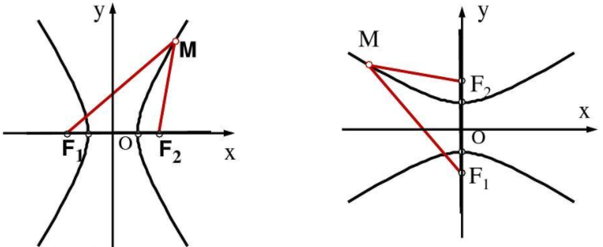

&emsp;&emsp;我们把平面内与两个定点$F_1$、$F_2$的距离的差的绝对值等于一个常数(常数为$2a$，小于$|F_1 F_2|$)的轨迹称为`双曲线`。定点叫双曲线的`焦点`，两焦点之间的距离称为`焦距`，用$2c$表示。 <!--more-->
&emsp;&emsp;集合$P = \{M \; | \; ||MF_1| - |MF_2|| = 2a\}$，$|F_1 F_2| = 2c$，其中$a > 0$，$c > 0$，且$a$和$c$为常数：

1. 若$a > c$，则集合`P`为椭圆。
2. 若$a = c$，则集合`P`为线段。
3. 若$a < c$，则集合`P`为空集。

&emsp;&emsp;双曲线的标准方程有`2`种，取决于焦点所在的坐标轴：

1. 焦点在`x`轴上：$\cfrac{x^2}{a^2} - \cfrac{y^2}{b^2} = 1 \; (a > 0, \; b > 0)$。
2. 焦点在`y`轴上：$\cfrac{y^2}{a^2} - \cfrac{x^2}{b^2} = 1 \; (a > 0, \; b > 0)$。

&emsp;&emsp;双曲线的取值范围有`2`种：

1. 焦点在`x`轴上：$|x| \gt a, \; y \in R$。
2. 焦点在`y`轴上：$|y| \gt a, \; x \in R$。

&emsp;&emsp;双曲线关于坐标轴成轴对称，关于原点成中心对称。
&emsp;&emsp;双曲线和其焦点连线所在直线有两个交点，它们叫做双曲线的`顶点`。线段$A_1 A_2$称为双曲线的`实轴`，其长度为$|A_1 A_2| = 2a$。双曲线的顶点有`2`种：

1. 焦点在`x`轴上：分为点$A_1 (a, \; 0)$和点$A_2 (-a, \; 0)$。
2. 焦点在`y`轴上：分为点$A_1 (0, \; a)$和点$A_2 (0, \; -a)$。

&emsp;&emsp;在标准方程$\cfrac{x^2}{a^2} - \cfrac{y^2}{b^2} = 1$中，令$x = 0$，得到$y^2 = -b^2$。该方程无实根，为便于作图，在`y`轴上画出$B_1 (0, \; b)$和$B_2 (0, \; -b)$，以$B_1 B_2$为`虚轴`，长度为$2b$。 
&emsp;&emsp;在标准方程$\cfrac{y^2}{a^2} - \cfrac{x^2}{b^2} = 1$中，令$y = 0$，得到$x^2 = -b^2$。该方程无实根，为便于作图，在`x`轴上画出$B_1 (b, \; 0)$和$B_2 (-b, \; 0)$，以$B_1 B_2$为`虚轴`，长度为$2b$。 
&emsp;&emsp;$a$叫做双曲线的`实半轴长`，$b$叫做双曲线的`虚半轴长`。
&emsp;&emsp;双曲线的焦点有`2`种：

1. 焦点在`x`轴上：分为点$F_1 (-c, \; 0)$和点$F_2 (c, \; 0)$。
2. 焦点在`y`轴上：分为点$F_1 (0, \; -c)$和点$F_2 (0, \; c)$。

&emsp;&emsp;双曲线有两条`渐近线`，渐近线和双曲线不相交。渐近线的方程求法：将标准方程的右边的常数改为`0`，即可用解二元二次的方法求出渐近线的解。
&emsp;&emsp;以焦点在`x`轴上的双曲线为例，将方程改为$\cfrac{x^2}{a^2} - \cfrac{y^2}{b^2} = 0$，移项之后两边开平方得$y = \pm \cfrac{b}{a} x$，这就是焦点在`x`轴上的双曲线的渐近线方程。
&emsp;&emsp;同理可知，焦点在`y`轴上的双曲线的渐近线方程为$y = \pm \cfrac{a}{b} x$。 
&emsp;&emsp;双曲线的离心率为$e = \cfrac{c}{a}$，范围为$(1, \; +\infty)$。