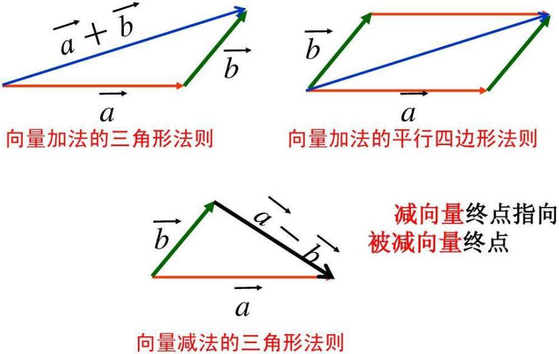
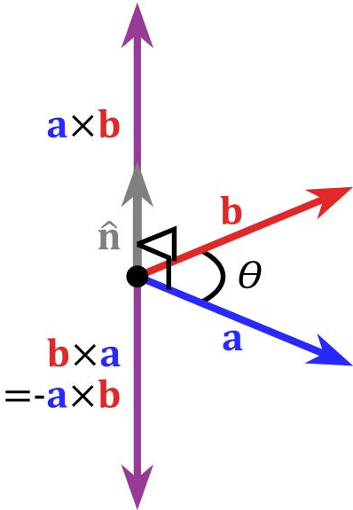

### 基本概念

&emsp;&emsp;`向量`是指具有大小和方向的量，例如$\vec{a}$。 <!--more-->
&emsp;&emsp;向量的大小叫做向量的`长度`或向量的`模`。向量$\vec{a}$的模记作$|\vec{a}|$。 
&emsp;&emsp;长度为`0`的向量叫做`零向量`，记作$\vec{0}$。零向量的方向是任意的。 
&emsp;&emsp;`单位向量`：长度等于`1`个单位的向量。若$\vec{a} \neq \vec{0}$，则与$\vec{a}$平行的单位向量为$\displaystyle{\pm \frac{\vec{a}}{|\vec{a}|}}$。 
&emsp;&emsp;`平行向量`：是指方向相同或相反的非零向量，也叫`共线向量`。零向量与任意向量平行。
&emsp;&emsp;`相等向量`：长度相等且方向相同的向量。`相反向量`：长度相等且方向相反的向量。
&emsp;&emsp;`自由向量`：一个向量只要不改变它的大小和方向，它的起点和终点可以任意平行移动的向量。
&emsp;&emsp;设$\vec{a}$为一个向量，与$\vec{a}$的模相同而方向相反的向量叫做$\vec{a}$的`负向量`。

### 向量运算

&emsp;&emsp;向量的加减法如下：

&emsp;&emsp;求$\vec{a}$与$\vec{b}$的相反向量$-\vec{b}$的和的运算，叫做$\vec{a}$与$\vec{b}$的`差`：$\vec{a} - \vec{b} = \vec{a} + (-\vec{b})$。 
&emsp;&emsp;向量加法的运算律：

- 交换律：$\vec{a} + \vec{b} = \vec{b} + \vec{a}$
- 结合律：$(\vec{a} + \vec{b}) + \vec{c} = \vec{a} + (\vec{b} + \vec{c})$

&emsp;&emsp;首尾相接的若干向量之和，等于由起始向量的起点指向末尾向量的终点的向量：$\overrightarrow{A_{1}A_{2}} + \overrightarrow{A_{2}A_{3}} + \dots + \overrightarrow{A_{n - 1}A_{n}} = \overrightarrow{A_{1}A_{n}}$。 
&emsp;&emsp;首尾相接的若干向量构成一个封闭图形，则它们的和为$\vec{0}$：$\overrightarrow{A_{1}A_{2}} + \overrightarrow{A_{2}A_{3}} + \dots + \overrightarrow{A_{n}A_{1}} =  \vec{0}$。 
&emsp;&emsp;实数与向量$\vec{\alpha}$的乘积$\lambda \vec{\alpha}$仍然是一个向量：

- 当$\lambda > 0$时，$\lambda \vec{\alpha}$与向量$\vec{\alpha}$的方向相同。
- 当$\lambda < 0$时，$\lambda \vec{\alpha}$与向量$\vec{\alpha}$的方向相反。
- 当$\lambda = 0$时，$\lambda \vec{\alpha}$是$\vec{0}$。

&emsp;&emsp;向量的数乘运算满足分配律和结合律：

- $\lambda(\vec{\alpha} + \vec{\beta}) = \lambda\vec{\alpha} + \lambda\vec{\beta}$
- $(\lambda + \mu)\vec{\alpha} = \lambda \vec{\alpha} + \mu \vec{\alpha}$
- $\lambda (\mu \vec{\alpha}) = (\lambda \mu)\vec{\alpha}$

&emsp;&emsp;两个向量之和的性质如下，其中等号在$\vec{a}$与$\vec{b}$同向或反向时成立：

1. $|\vec{a} + \vec{b}| \le |\vec{a}| + |\vec{b}|$
2. $|\vec{a} - \vec{b}| \le |\vec{a}| + |\vec{b}|$

### 共线与共面

&emsp;&emsp;`向量共线定理`：如果$\vec{a} \neq \vec{0}$，那么向量$\vec{b}$与$\vec{a}$共线的充要条件是：存在唯一实数$\lambda$，使得$\vec{b} = \lambda \vec{a}$。 
&emsp;&emsp;设有$k$($k \ge 3$)个向量，当把它们的起点放在同一点时，如果$k$个终点和公共起点在一个平面上，就称这$k$个向量`共面`。

### 数量积

&emsp;&emsp;向量的`数量积`：两个非零向量$\vec{\alpha}$、$\vec{\beta}$的数量积为$\vec{\alpha} \cdot \vec{\beta} = |\vec{\alpha}||\vec{\beta}|cos<\vec{\alpha}, \; \vec{\beta}>$。$\vec{0}$与任何向量的数量积为`0`。
&emsp;&emsp;设$\vec{a} = (x_1, \; y_1)$，$\vec{b} = (x_2, \; y_2)$，它们之间的夹角为$\theta$，则：

1. $\vec{a} \cdot \vec{b} = x_1 x_2 + y_1 y_2$。
2. $\vec{a}^2 = |\vec{a}|^2$，即$|\vec{a}| = \sqrt{\vec{a}^2}$。
3. $|\vec{a}| = \sqrt{(x_1)^2 + (y_1)^2}$，$\displaystyle{cos \; \theta = \frac{x_1 x_2 + y_1 y_2}{\sqrt{(x_1)^2 + (y_1)^2} \sqrt{(x_2)^2 + (y_2)^2}}}$。
4. $\vec{a}$在$\vec{b}$上的投影为$|\vec{a}|cos \; \theta$。
5. $\vec{a} \bot \vec{b} \Leftrightarrow \vec{a} \cdot \vec{b} = 0 \Leftrightarrow x_1 x_2 + y_1 y_2 = 0$。
6. $\vec{a} \parallel \vec{b} \Leftrightarrow x_1 y_1 - x_2 y_2 = 0$。

&emsp;&emsp;$\vec{a}$与$\vec{b}$同向时，$\vec{a} \cdot \vec{b} = |\vec{a}| |\vec{b}|$；反向时，$\vec{a} \cdot \vec{b} = -|\vec{a}| |\vec{b}|$。 
&emsp;&emsp;向量数量积的运算性质：

1. $\vec{a} \cdot \vec{b} = \vec{b} \cdot \vec{a}$
2. $(\lambda \vec{a} \cdot \vec{b}) = \lambda (\vec{a} \cdot \vec{b}) = \vec{a} \cdot (\lambda \vec{b})$
3. $(\vec{a} + \vec{b}) \cdot \vec{c} = \vec{a} \cdot \vec{c} + \vec{b} \cdot \vec{c}$

### 坐标运算

&emsp;&emsp;平面向量的坐标运算：设$\vec{a} = (x_1, \; y_1)$，$\vec{b} = (x_2, \; y_2)$，则：

1. $\vec{a} + \vec{b} = (x_1 + x_2, \; y_1 + y_2)$
2. $\vec{a} - \vec{b} = (x_1 - x_2, \; y_1 - y_2)$
3. $\lambda \vec{a} = (\lambda x_1, \; \lambda x_2)$

&emsp;&emsp;设点`A`的坐标为$(x_1, \; y_1)$，点`B`的坐标为$(x_2, \; y_2)$，则：

1. $\overrightarrow {AB} = (x_2 - x_1, \; y_2 - y_1)$
2. $|\overrightarrow {AB}| = \sqrt{(x_2 - x_1)^2 + (y_2 - y_1)^2}$

### 向量积

&emsp;&emsp;设向量$\vec{c}$由两个向量$\vec{a}$和$\vec{b}$按下列方式定出：$\vec{c}$的模$|\vec{c}| = |\vec{a}| |\vec{b}| sin \; \theta$，其中$\theta$为$\vec{a}$和$\vec{b}$间的夹角，$\vec{c}$的方向垂直于$\vec{a}$和$\vec{b}$所决定的平面，$\vec{c}$的指向按右手规则从$\vec{a}$转向$\vec{b}$来确定，向量$\vec{c}$叫做向量$\vec{a}$和$\vec{b}$的`向量积`，记作$\vec{c} = \vec{a} \times \vec{b}$。 

&emsp;&emsp;向量积具有如下性质：

1. $\vec{a} \times \vec{a} = 0$。
2. 对于两个非零向量$\vec{a}$、$\vec{b}$，如果$\vec{a} \times \vec{b} = 0$，那么$\vec{a} \parallel \vec{b}$；反之，如果$\vec{a} \parallel \vec{b}$，那么$\vec{a} \times \vec{b} = 0$。
3. $\vec{b} \times \vec{a} = - \vec{a} \times \vec{b}$。
4. $(\vec{a} + \vec{b}) \times \vec{c} = \vec{a} \times \vec{c} + \vec{b} \times \vec{c}$。
5. $(\lambda \vec{a}) \times \vec{b} = \vec{a} \times (\lambda \vec{b}) = \lambda (\vec{a} \times \vec{b})$($\lambda$是一个数)。

&emsp;&emsp;设$\vec{a} = a_x \vec{i} + a_y \vec{j} + a_z \vec{k}$，$\vec{b} = b_x \vec{i} + b_y \vec{j} + b_z \vec{k}$，所以$\vec{a} \times \vec{b} = (a_y b_z - a_z b_y) \vec{i} + (a_z b_x - a_x b_z) \vec{j} + (a_x b_y - a_y b_x) \vec{k}$。