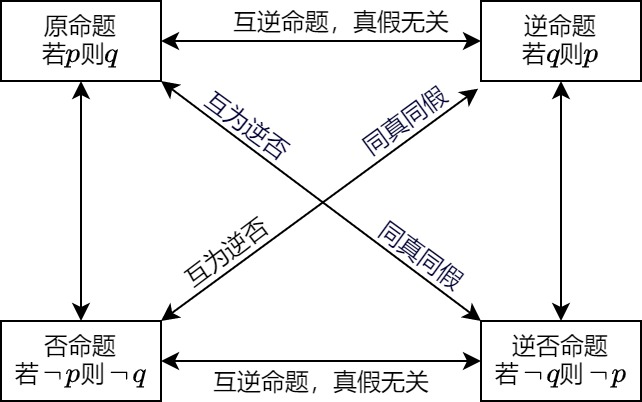

### 命题

&emsp;&emsp;一般的，在数学中把用语言、符号或式子表达的，可以判断真假的陈述句叫做`命题`。<!--more-->
&emsp;&emsp;如果题设成立，那么结论一定成立，这样的命题称为`真命题`；如果题设成立时，不能保证结论一定成立，那么这样的命题称为`假命题`。
&emsp;&emsp;一些命题的正确性是经过推理过程证明的，这样得到的真命题叫做`定理`，而这个推理过程叫做`证明`。
&emsp;&emsp;对于两个命题，如果一个命题的条件和结论分别是另外一个命题的结论和条件，那么这两个命题叫做`互逆命题`，其中一个命题叫做`原命题`，另外一个命题叫做原命题的`逆命题`。
&emsp;&emsp;四种命题的形式：设`p`为原命题条件，`q`为原命题结论，则：

1. `原命题`：若`p`则`q`。
2. `逆命题`：若`q`则`p`。
3. `否命题`：若`非p`则`非q`。
4. `逆否命题`：若`非q`则`非p`。

&emsp;&emsp;四种命题的真假关系：

1. 两个命题互为逆否命题，它们有相同的真假性。
2. 两个命题为互逆命题或互否命题，它们的真假性没有关系。

&emsp;&emsp;用联结词`且`把`p`与`q`联结起来称为一个新命题，记作$p \wedge q$，读作`p且q`。
&emsp;&emsp;用联结词`或`把`p`与`q`联结起来称为一个新命题，记作$p \vee q$，读作`p或q`。
&emsp;&emsp;对于一个命题`p`如果将它否定，就得到一个新命题，记作$\neg p$，读作`非p`。

$p$ | $q$ | $p \wedge q$ | $p \vee q$ | $\neg p$
----|-----|--------------|------------|---------
真  | 真  | 真            | 真         | 假
真  | 假  | 假            | 真         | 假
假  | 真  | 假            | 真         | 真
假  | 假  | 假            | 假         | 真

### 充分必要条件

&emsp;&emsp;如果命题`若p则q`为真，则记作$p \Rightarrow q$或$q \Leftarrow p$；如果命题`若p则q`为假，则记作$p \nRightarrow q$或$q \nLeftarrow p$。 
&emsp;&emsp;如果$p \Rightarrow q$，则说`p`是`q`的`充分条件`，`q`是`p`的`必要条件`。
&emsp;&emsp;充分条件的特征：当`p`成立时，必有`q`成立。必要条件的特征：当`q`不成立时，必有`p`不成立。例如$a = 0 \Rightarrow ab = 0$。 
&emsp;&emsp;如果$p \Leftrightarrow q$，则称`p`是`q`的`充分必要条件`，简称`充要条件`。
&emsp;&emsp;如果$p \Rightarrow q$且$q \nRightarrow p$，则称`p`是`q`的`充分不必要条件`。
&emsp;&emsp;如果$p \nRightarrow q$且$q \Rightarrow p$，则称`p`是`q`的`必要不充分条件`。
&emsp;&emsp;如果$p \nRightarrow q$且$q \nRightarrow p$，则称`p`是`q`的`既不充分也不必要条件`。

### 全称量词和存在量词

&emsp;&emsp;`全称量词`是指在语句中含有短语`全额`、`每一个`、`任意`、`一切`等都是在指定范围内，表示该指定范围内的全体对象或该指定范围整体的含义的词，记作$\forall$。 
&emsp;&emsp;含有全称量词的命题叫作`全称命题`。对于`M`中的任意`x`，都有$p(x)$成立，记作$\forall x \in M, \; p(x)$。 
&emsp;&emsp;`存在量词`是指在语句中含有短语`有些`、`至少有一个`、`有一个`、`存在`等表示个别或一部分含义的词，记作$\exists$。 
&emsp;&emsp;含有存在量词的命题叫作`特称命题`。存在`M`中的一个`x`，使$p(x)$成立，记作$\exists x \in M, \; p(x)$。 
&emsp;&emsp;对于含有一个量词的全称命题`p`，它的否定$\neg p$是：$\exists x \in M, \; \neg p(x)$。 
&emsp;&emsp;对于含有一个量词的特称命题`p`，它的否定$\neg p$是：$\forall x \in M, \; \neg p(x)$。