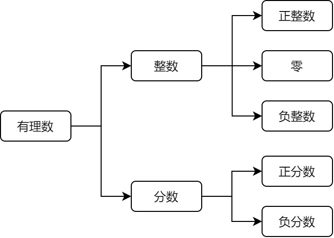

### 数理

&emsp;&emsp;如果数`a`能被数`b`整除，`a`就叫做`b`的`倍数`，`b`就叫做`a`的`约数`。<!--more-->
&emsp;&emsp;几个整数公有的约数，叫做这几个数的`公约数`；其中最大的一个，叫做这几个数的`最大公约数`。
&emsp;&emsp;几个自然数公有的倍数，叫做这几个数的`公倍数`；其中最小的一个自然数，叫做这几个数的`最小公倍数`。
&emsp;&emsp;`质数`或`素数`：在大于`1`的自然数中，除了`1`和它本身以外，不再有其他因数的自然数。
&emsp;&emsp;`合数`：在大于`1`的整数中，除了能被`1`和本身整除外，还能被其他数(`0`除外)整除的数。
&emsp;&emsp;乘积为`1`的数互为`倒数`。`1`的倒数是`1`，`0`没有倒数。

### 比

&emsp;&emsp;两个数相除又叫两个数的`比`，例如`3:2`。
&emsp;&emsp;比的基本性质：比的前项和后项同时乘以一个相同的数(`0`除外)，比值不变。
&emsp;&emsp;表示一个数是另一个数的百分之几，叫做`百分比`或`百分率`，例如`90%`。
&emsp;&emsp;`比例`表示两个或多个比相等的式子，例如`3:4 = 9:12`。
&emsp;&emsp;比例基本性质：两个外项的积等于两个内项的积。若`a:b = c:d`(`b`和`d`都不为`0`)，则有`a * d = b * c`。
&emsp;&emsp;满足关系式`y = k * x`(`k`为一定量)的两个变量，我们称这两个变量的关系成`正比例`。
&emsp;&emsp;满足关系式`k = x * y`(`k`为一定量)的两个变量，我们称这两个变量的关系成`反比例`。

### 小数

&emsp;&emsp;一个数从小数部分的某一位起，一个或几个数字一次不断地重复出现，这样的小数叫做`循环小数`，例如$5.1875875\cdots$可以写为$5.1\dot{8}7\dot{5}$。 
&emsp;&emsp;如果小数部分的位数是有限的，叫做`有限小数`；如果小数部分的位数是无限的，叫做`无限小数`。

### 方程

&emsp;&emsp;含有未知数的等式叫做`方程`，例如$x + 1 = 2$。

### 有理数

&emsp;&emsp;有理数的分类如下：

&emsp;&emsp;数`a`的绝对值记作$\left | a \right |$。绝对值是该数和数轴原点之间的距离。 
&emsp;&emsp;加法交换律：$a + b = b + a$；加法结合律：$a + b + c = a + (b + c)$。 
&emsp;&emsp;减去一个数等于加上这个数的相反数：$a - b = a + (-b)$。 
&emsp;&emsp;有理数的乘法法则：

1. 两数相乘，同号得正，异号得负，并把绝对值相乘。
2. 任何数同`0`相乘，都得`0`。
3. 乘法交换律：$a \ast b = b \ast a$。
4. 乘法结合律：$(a \ast b) \ast c = a \ast (b \ast c)$。
5. 乘法分配律：$a \ast (b + c) = a \ast b + a \ast c$。

&emsp;&emsp;有理数的除法法则：

1. 除以一个不等于`0`的数，等于乘以这个数的倒数：$\displaystyle{a \div  b = a \ast \frac{1}{b} \left (b \neq 0 \right )}$。 
2. 两数相除，同号得正，异号得负，并把绝对值相除。
3. `0`除以任何一个不等于`0`的数，都为`0`。

&emsp;&emsp;负数的奇次幂是负数，负数的偶次幂是正数；正数的任何次幂都是正数；`0`的任何正整数次幂都是`0`；`1`的任何次幂都是`1`。
&emsp;&emsp;去括号法则：

1. 如果括号外的因数是正数，去括号后，原括号内各项的符号与原来的符号相同，即$a + (b + c) = a + b + c$。
2. 如果括号外的因数是负数，去括号后，原括号内各项的符号与原来的符号相反，即$a - (b + c) = a - b - c$。

### 整式

&emsp;&emsp;数字或字母的积的式子叫做`单项式`。单独的一个数字或一个字母也是单项式。
&emsp;&emsp;在单项式中，与字母乘积的数字称为这个单项式的`系数`。所有字母的指数的和称为这个单项式的`次数`。例如$-3x^{2}y^{3}$的系数是`-3`，次数为`2 + 3 = 5`。
&emsp;&emsp;几个单项式的和叫做`多项式`，例如$\displaystyle{\frac{1}{2}ab - \pi r^{2}}$。在多项式中，每个单项式叫做多项式的`项`，不含字母的项叫做`常数项`，次数最高项的次数叫做这个多项式的`次数`。注意，多项式的每一项包括它前面的符号。
&emsp;&emsp;单项式和多项式统称为`整式`。
&emsp;&emsp;像$3ab^{2}$与$-4ab^{2}$这样，所含字母相同，并且相同字母的指数也相同的项叫做`同类项`。几个常数项也是同类项。
&emsp;&emsp;把多项式中的同类项合并成一项称为`合并同类项`，其方法为`系数相加，字母和字母的指数不变`，例如$12x - 20x = -8x$。 
&emsp;&emsp;多项式与多项式相乘：$(a + b)(m + n) = am + an + bm + bn$。 
&emsp;&emsp;多项式除以单项式：先把这个多项式的每一项除以这个单项式，再把所得的商相加。
&emsp;&emsp;平方差公式：$(a + b)(a - b) = a^2 - b^2$。 
&emsp;&emsp;完全平方公式：

- $(a + b)^2 = a^2 + 2ab + b^2$ 
- $(a - b)^2 = a^2 - 2ab + b^2$ 

&emsp;&emsp;把一个多项式化成几个整式的积的形式，叫做多项式的`因式分解`，例如$x^2 + x = x(x + 1)$。 
&emsp;&emsp;分解因式的要求：必须进行到每一个多项式都不能再分解为止。
&emsp;&emsp;`ma + mb + mc`的各项都有一个公共的因式`m`，我们把这个因式`m`叫做这个多项式的`公因式`。从多项式中提取公因式叫做`提公因式法`。

### 分式

&emsp;&emsp;如果`A`、`B`表示两个整式，并且`B`中含有字母，那么式子$\displaystyle{\frac{A}{B}}$叫做`分式`，其中`A`叫做分式的`分子`，`B`叫做分式的`分母`。
&emsp;&emsp;当$B \neq 0$时，分式$\displaystyle{\frac{A}{B}}$有意义；当$A = 0$且$B \neq 0$时，分式$\displaystyle{\frac{A}{B}}$的值为`0`。
&emsp;&emsp;分式的基本性质：

- $\displaystyle{\frac{A}{B} = \frac{A \ast C}{B \ast C}}$，其中$C \neq 0$。
- $\displaystyle{\frac{A}{B} = \frac{A \div C}{B \div C}}$，其中$C \neq 0$。

&emsp;&emsp;把分式的分子和分母的公因式都约去，这种变形叫做分式的`约分`，例如$\displaystyle{\frac{a^2bc}{ab} = \frac{a^2bc \div ab}{ab \div ab} = ac}$。 
&emsp;&emsp;像$\displaystyle{\frac{100}{20 + v} = \frac{60}{20 - v}}$这样，分母中含有未知数的方程，叫做`分式方程`；分母中不含有未知数的方程叫做`整式方程`。

### 等式

&emsp;&emsp;等式的性质：

- 等式两边加(或减)同一个数(或式子)，结果仍相等，即如果$a = b$，那么$a \pm c = b \pm c$。 
- 等式两边乘以同一个数，或除以一个不为`0`的数，结果仍相等：

1. 如果$a = b$，那么$a \ast c = b \ast c$。 
2. 如果$a = b$，那么$\displaystyle{\frac{a}{c} = \frac{b}{c}\left ( c \neq 0 \right )}$。 

### 无理数

&emsp;&emsp;任何一个有理数都可以写成有限小数或无限循环小数。无限不循环小数叫做`无理数`。
&emsp;&emsp;有理数和无理数统称为`实数`。实数与数轴上的点是一一对应的。