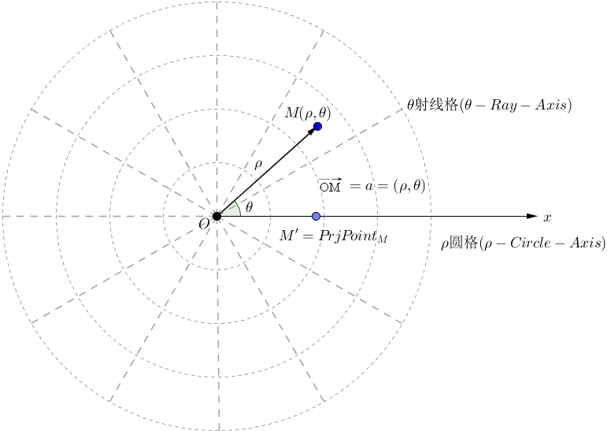

&emsp;&emsp;在平面上取定一点`O`，称为`极点`。从点`O`出发引一条射线`Ox`，称为`极轴`。再取定一个单位长度、一个角度单位(通常取弧度)以及其正方形(通常取逆时针方向为正)，就建立了`极坐标系`。<!--more-->
&emsp;&emsp;对于极坐标系所在平面内的任一点`M`，其位置就可以用线段`OM`的长度$\rho$以及从`Ox`到`OM`的角度$\theta$来确定，有序数对$(\rho, \; \theta)$就称为`M`点的`极坐标`，记为$P(\rho, \; \theta)$。$\rho$称为`M`点的`极径`，$\theta$称为`M`点的`极角`。

&emsp;&emsp;极坐标系转换为平面直角坐标：极坐标系中的两个坐标$\rho$和$\theta$可以由公式转换为直角坐标系下的坐标值：$x = \rho cos \theta$、$y = \rho sin \theta$。 
&emsp;&emsp;平面直角坐标系转换为极坐标系：直角坐标系中的两个坐标$x$和$y$可以由公式转换为极坐标系下的坐标值：$\rho = \sqrt{x^2 + y^2}$、$\displaystyle{tan \; \theta = \frac{y}{x} \; (x \neq 0)}$。 
&emsp;&emsp;用极坐标系描述的曲线方程称作`极坐标方程`：

1. 过极点且与极轴成$\alpha$的直线：$\theta = \alpha$。
2. 过极坐标点$(a, \; 0)$且垂直于极轴的直线：$\rho cos \; \theta = a$。
3. 过极坐标点$\displaystyle{\left (b, \; \frac{\pi}{2} \right )}$且平行于极轴的直线：$\rho sin \; \theta = b$。
4. 圆心在极点，半径为$r$的圆：$\rho = r$。
5. 圆心在极坐标点$(r, \; 0)$，半径为$r$的圆：$\rho = 2r cos \theta$。
6. 圆心在极坐标点$\displaystyle{\left (r, \; \frac{\pi}{2} \right )}$，半径为$r$的圆：$\rho = 2r sin \theta$。
