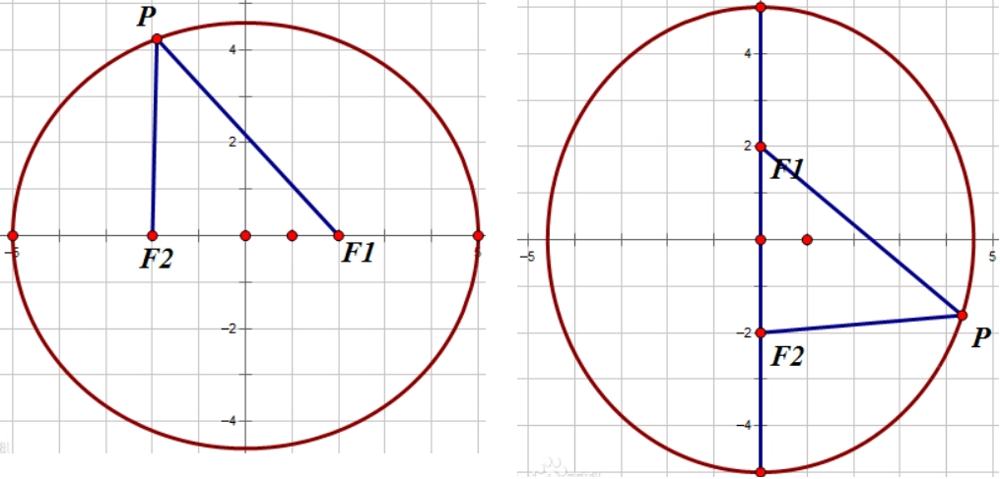

&emsp;&emsp;`椭圆`是平面内到定点$F_1$、$F_2$的距离之和等于常数(大于$|F_1 F_2|$)的动点`P`的轨迹，$F_1$、$F_2$称为椭圆的两个`焦点`，两焦点之间的距离叫做`焦距`。其数学表达式为$|PF_1| + |PF_2| = 2a \; (2a > |F_1 F_2|)$。 <!--more-->
&emsp;&emsp;集合$P = \{M \; | \; |MF_1| + |MF_2| = 2a\}$，$|F_1 F_2| = 2c$，其中$a > 0$，$c > 0$，且$a$和$c$为常数：

1. 若$a > c$，则集合`P`为椭圆。
2. 若$a = c$，则集合`P`为线段。
3. 若$a < c$，则集合`P`为空集。

&emsp;&emsp;椭圆截与两焦点连线重合的直线所得的弦为`长轴`，长为$2a$；椭圆截垂直平分两焦点连线的直线所得弦为`短轴`，长为$2b$。 
&emsp;&emsp;椭圆的标准方程有`2`种，取决于焦点所在的坐标轴：

1. 焦点在`x`轴时，标准方程为$\displaystyle{\frac{x^2}{a^2} + \frac{y^2}{b^2} = 1 \; (a > b > 0)}$。
2. 焦点在`y`轴时，标准方程为$\displaystyle{\frac{y^2}{a^2} + \frac{x^2}{b^2} = 1 \; (a > b > 0)}$。

&emsp;&emsp;椭圆的几何性质如下：

1. 范围：焦点在`x`轴上时，$-a \le x \le a$，$-b \le y \le b$；焦点在`y`轴上时，$-b \le x \le b$，$-a \le y \le a$。
2. 对称性：关于`x`轴对称，`y`轴对称，关于原点中心对称。
3. 焦点在`x`轴时，长轴顶点为$(-a, \; 0)$和$(a, \; 0)$，短轴顶点为$(0, \; b)$和$(0, \; -b)$；焦点在`y`轴时，长轴顶点为$(0, \; -a)$和$(0, \; a)$，短轴顶点为$(b, \; 0)$和$(-b, \; 0)$。
4. 焦点：当焦点在`x`轴上时，焦点坐标`F1`为$(-c, \; 0)$，`F2`为$(c, \; 0)$；当焦点在`y`轴上时，焦点坐标为`F1`$(0, \; -c)$，`F2`为$(0, \; c)$。
5. $a$、$b$和$c$的关系：$c^2 = a^2 - b^2$。
6. 离心率：$\displaystyle{e = \frac{c}{a}}$，其范围是$0 < e < 1$。离心率越小，其椭圆越接近于圆；越大，其椭圆就越扁。

&emsp;&emsp;设椭圆$\displaystyle{\frac{x^2}{a^2} + \frac{y^2}{b^2} = 1 \; (a > b > 0)}$上任意一点`P`$(x, \; y)$，则当$x = 0$时，$|OP|$有最小值$b$，`P`在短轴端点处；当$x = \pm a$时，$|OP|$有最大值$a$，`P`在长轴端点处。
&emsp;&emsp;椭圆的一个焦点、中心和短轴的一个端点构成一个直角三角形，其中$a$为斜边，其关系为$a^2 = b^2 + c^2$。 
&emsp;&emsp;已知过焦点`F1`的弦`AB`，则$\bigtriangleup ABF_2$的周长为$4a$。