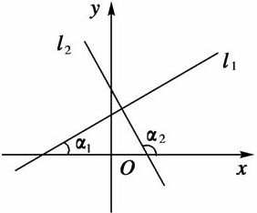

### 直线性质

&emsp;&emsp;直线的性质：经过两点有一条直线，并且只有一条直线。<!--more-->
&emsp;&emsp;怎样判断两条射线是同一射线：`端点相同`和`延伸方向相同`。
&emsp;&emsp;两点之间的所有连线中，线段最短。两点之间线段的长度叫做两点之间的`距离`。
&emsp;&emsp;如果两条直线只有一个公共点，就说这两条直线`相交`，该公共点叫做两条直线的`交点`。

### 倾斜角

&emsp;&emsp;平面直角坐标系内，当直线$l$与`x`轴相交时，我们取`x`轴作为基准，`x`轴正向与直线$l$向上方向之间所成的角$\alpha$叫做直线$l$的`倾斜角`：

&emsp;&emsp;当直线$l$和`x`轴平行或重合时，它的倾斜角为$0^{\circ}$。直线倾斜角的范围是$0^{\circ} \le \alpha < 180^{\circ}$。

### 斜率

&emsp;&emsp;一条直线与某平面直角坐标系横轴正半轴方向的夹角的正切值，就是该直线相对于该坐标系的`斜率`。如果直线与`x`轴垂直，直角的正切值无穷大，故此直线不存在斜率。
&emsp;&emsp;经过点$P_1 (x_1, \; y_1)$和点$P_2 (x_2, \; y_2)$的直线斜率为$\displaystyle{k = \frac{y_2 - y_1}{x_2 - x_1} \; (x_1 \neq x_2)}$。 
&emsp;&emsp;两直线平行的判定：设两直线$l_1$、$l_2$的斜率分别是$k_1$、$k_2$，则$l_1 \; \parallel \; l_2 \Leftrightarrow k_1 = k_2$。特别地，当两直线的倾斜角为$90^{\circ}$时，它们互相平行或重合。 
&emsp;&emsp;两直线垂直的判定：设两直线$l_1$、$l_2$的斜率分别是$k_1$、$k_2$，则$l_1 \perp l_2 \Leftrightarrow k_1 \cdot k_2 = -1$。特别地，一条直线的倾斜角为$90^{\circ}$，一条直线的倾斜角为$0^{\circ}$时，它们互相垂直。 

### 直线方程

&emsp;&emsp;直线的`点斜式方程`：由直线上一定点和直线的斜率确定的直线方程：过点$P_0 (x_0, \; y_0)$，斜率为`k`的直线方程为$y - y_0 = k(x - x_0)$。 
&emsp;&emsp;直线的`斜截式方程`：由直线的斜率`k`与它在`y`轴上的截距`b`确定：$y = kx + b$。 
&emsp;&emsp;直线的`两点式方程`：已知两点$P_1 (x_1, \; y_1)$和$P_2 (x_2, \; y_2)$，其中$x_1 \neq x_2$，$y_1 \neq y_2$，通过这两点的方程为$\displaystyle{\frac{y - y_1}{y_2 - y_1} = \frac{x - x_1}{x_2 - x_1}}$。两点式方程不能用来表示平行于坐标轴或与坐标轴重合的直线方程。 
&emsp;&emsp;直线的`截距式方程`：直线方程由直线在`x`轴的截距`a`，和`y`轴的截距`b`确定：$\displaystyle{\frac{x}{a} + \frac{y}{b} = 1}$。适用于横、纵截距都存在，且都不为`0`的直线。

直线方程名称 | 适用场景
------------|--------
点斜式      | 不垂直于`x`轴
斜截式      | 不垂直于`x`轴
两点式      | 不垂直于坐标轴
截距式      | 不垂直于坐标轴，且不经过原点

&emsp;&emsp;直线的`一般式方程`：在直角坐标系下，我们把关于`x`、`y`的方程$Ax + By + C = 0$(`A`、`B`不能同时等于`0`)叫做直线的`一般式方程`，简称`一般式`。一般式适用于任何一条直线。

### 直线相交

&emsp;&emsp;两直线的相交：设直线$l_1$的方程为$A_1x + B_1y + C = 0$，直线$l_2$的方程为$A_2x + B_2y + C = 0$，则它们的公共点坐标与方程组$\left\{\begin{matrix} A_1 x + B_1 y + C = 0 \\ A_2 x + B_2 y + C = 0 \end{matrix}\right.$的解一一对应：

- `相交`：方程组有唯一解，交点的坐标就是方程组的解。
- `平行`：方程组无解。
- `重合`：方程组有无数个解。

### 垂直和平行

&emsp;&emsp;与直线$Ax + By + C = 0 \; (A^2 + B^2 \neq 0)$垂直和平行的直线方程可设为：

- `垂直`：$Bx - Ay + m = 0$
- `平行`：$Ax + By + n = 0$

### 距离

&emsp;&emsp;点$(x_0, \; y_0)$到直线$Ax + By + C = 0$之间的距离为$\displaystyle{d = \frac{|Ax_0 + By_0 + C|}{\sqrt{A^2 + B^2}}}$。 
&emsp;&emsp;两条平行线$Ax + By + C_1 = 0$和$Ax + By + C_2 = 0$之间的距离为$\displaystyle{d = \frac{|C_1 - C_2|}{\sqrt{A^2 + B^2}}}$。 

### 线性规划

&emsp;&emsp;一般地，直线$l$的方程$ax^2 + bx + c = 0$把直角坐标平面分成了`3`个部分：

- 直线$l$上的点$(x, \; y)$的坐标满足$ax^2 + bx + c = 0$。
- 直线$l$一侧的点$(x, \; y)$的坐标满足$ax^2 + bx + c > 0$。
- 直线$l$另一侧的点$(x, \; y)$的坐标满足$ax^2 + bx + c < 0$。

&emsp;&emsp;只需在此直线的某一侧取一个特殊点$(x_0, \; y_0)$，由$a(x_{0})^2 + bx_0 + c$的符号即可判断$ax^2 + bx + c > 0$表示直线$ax^2 + bx + c = 0$哪一侧的平面区域。 
&emsp;&emsp;线性规划的基本概念如下：

- `约束条件`：由变量`x`、`y`组成的不等式(组)。
- `线性约束条件`：关于`x`、`y`的一次不等式(或等式)。
- `目标函数`：关于`x`、`y`的函数解析式，如$z = 2x + 3y$。
- `线性目标函数`：关于`x`、`y`的一次解析式。
- `可得解`：满足线性约束条件的解$(x, \; y)$。
- `可行域`：所有可行解组成的集合。
- `最优解`：使目标函数取得最大值或最小值的可得解。
- `线性规划问题`：在线性约束条件下求线性目标函数的最大值或最小值问题。

&emsp;&emsp;点`P1`$(x_1, \; y_1)$和点`P2`$(x_2, \; y_2)$位于直线$Ax + By + C = 0$两侧的充要条件为$(Ax_1 + By_1 + c)(Ax_2 + By_2 + c) < 0$，位于直线同侧的充要条件为$(Ax_1 + By_1 + c)(Ax_2 + By_2 + c) > 0$。