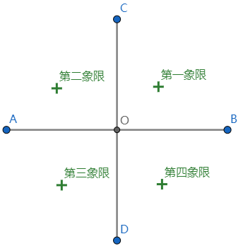

### 直角坐标系

&emsp;&emsp;象限图如下：<!--more-->

&emsp;&emsp;坐标轴上的点不属于任何象限。原点的坐标是$(0, \; 0)$。 
&emsp;&emsp;第一、二、三、四象限内的坐标的符号分别是$(+, \; +)$、$(-, \; +)$、$(-, \; -)$和$(+, \; -)$。 
&emsp;&emsp;坐标轴上点的坐标至少有一个是`0`：横坐标上点的纵坐标为`0`，表示为$(x, \; 0)$；纵坐标上点的横坐标为`0`，表示为$(0, \; y)$。 
&emsp;&emsp;纵坐标相同的点的连线平行于`x`轴；横坐标相同的点的连线平行于`y`轴。
&emsp;&emsp;点关于`x`轴对称，则横坐标相同，纵坐标互为相反数；点关于`y`轴对称，则纵坐标相同，横坐标互为相反数；点关于原点对称，则横坐标、纵坐标均互为相反数。
&emsp;&emsp;在平面直角坐标系中，将点$(x, \; y)$向右平移`a`个单位长度，可以得到对应点$(x + a, \; y)$；将点$(x, \; y)$向左平移`a`个单位长度，可以得到对应点$(x - a, \; y)$。 
&emsp;&emsp;在平面直角坐标系中，将点$(x, y)$向上平移`b`个单位长度，可以得到对应点$(x, \; y + b)$；将点$(x, \; y)$向下平移`b`个单位长度，可以得到对应点$(x, \; y - b)$。

### 任意角

&emsp;&emsp;通常把逆时针旋转的角称为`正角`，顺时针旋转的角称为`负角`；如果没有进行旋转，也视为形成了一个角，这个角叫做`零角`。
&emsp;&emsp;把角的顶点置于坐标原点，始边与`x`轴的非负半轴重合，那么角的终边落在第几象限时，就说这个角是`象限角`，或说这个角属于第几象限。
&emsp;&emsp;把角的顶点置于坐标原点，始边与`x`轴的非负半轴重合，那么角的终边落在坐标轴上时，就说这个角是`轴线角`，此时这个角不属于任何象限。
&emsp;&emsp;所有与角$\alpha$终边相同的角，连同角$\alpha$在内可以用$S = \{\beta \; | \; \beta = k \ast 360^{\circ} + \alpha, \; k \in Z\}$来表示。 
&emsp;&emsp;象限角的表示方法：

- 第一象限：$S = \{\alpha \; | \; k \ast 360^{\circ} < \alpha < k \ast 360^{\circ} + 90^{\circ}, \; k \in Z\}$
- 第二象限：$S = \{\alpha \; | \; k \ast 360^{\circ} + 90^{\circ} < \alpha < k \ast 360^{\circ} + 180^{\circ}, \; k \in Z\}$
- 第三象限：$S = \{\alpha \; | \; k \ast 360^{\circ} + 180^{\circ} < \alpha < k \ast 360^{\circ} + 270^{\circ}, \; k \in Z\}$
- 第四象限：$S = \{\alpha \; | \; k \ast 360^{\circ} - 90^{\circ} < \alpha < k \ast 360^{\circ}, \; k \in Z\}$

&emsp;&emsp;`x`轴正半轴：$\alpha = k \ast 360^{\circ}$，其中$k \in Z$。 
&emsp;&emsp;`x`轴负半轴：$\alpha = 180^{\circ} + k \ast 360^{\circ}$，其中$k \in Z$。 
&emsp;&emsp;`y`轴正半轴：$\alpha = 90^{\circ} + k \ast 360^{\circ}$，其中$k \in Z$。 
&emsp;&emsp;`y`轴负半轴：$\alpha = 270^{\circ} + k \ast 360^{\circ}$，其中$k \in Z$。 
&emsp;&emsp;终边在`x`轴上：$S = \{\alpha \; | \; \alpha = k \ast 180^{\circ} + \alpha, \; k \in Z\}$。 
&emsp;&emsp;终边在`y`轴上：$S = \{\alpha \; | \; \alpha = 90^{\circ} + k \ast 180^{\circ} + \alpha, \; k \in Z\}$。