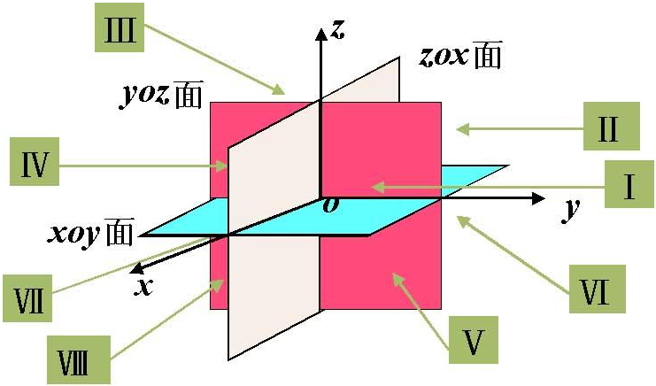
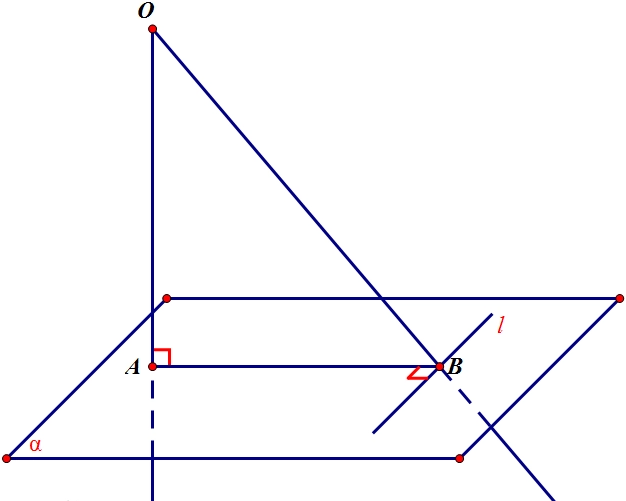
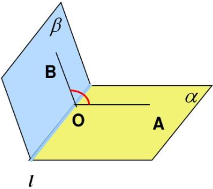

### 空间直角坐标系

&emsp;&emsp;三条坐标轴中的任意两条可以确定一个平面，这样定出的三个平面统称为`坐标面`。$x$轴与$y$轴所确定的坐标面叫做$xOy$面，另两个由$y$轴及$z$轴，和由$z$轴及$x$轴所确定的坐标面，分别叫做$yOz$面及$zOx$面。 <!--more-->
&emsp;&emsp;三个坐标面把空间分成八个部分，每一个部分叫做一个`卦限`：

&emsp;&emsp;`向径`又称作`位置矢量`，是在某一时刻，以坐标原点为起点，以运动质点所在位置为终点的有向线段。

### 空间向量

&emsp;&emsp;若点`A`的坐标为$(x_1, \; y_1, \; z_1)$，点`B`的坐标为$(x_2, \; y_2, \; z_2)$，则$\overrightarrow{AB} = \overrightarrow{OB} - \overrightarrow{OA} = (x_2 - x_1, \; y_2 - y_1, \; z_2 - z_1)$。 
&emsp;&emsp;空间向量长度的计算：已知$\vec{a} = (x, \; y, \; z)$，则$|\vec{a}| = \sqrt{x^2 + y^2 + z^2}$。 
&emsp;&emsp;设$\vec{a} = (a_1, \; a_2, \; a_3)$，$\vec{b} = (b_1, \; b_2, \; b_3)$，则：

1. $\vec{a} + \vec{b} = (a_1 + b_1, \; a_2 + b_2, \; a_3 + b_3)$
2. $\lambda \vec{a} = (\lambda a_1, \; \lambda a_2, \; \lambda a_3)$
3. $\vec{a} - \vec{b} = (a_1 - b_1, \; a_2 - b_2, \; a_3 - b_3)$
4. $\vec{a} \cdot \vec{b} = a_1b_1 + a_2b_2 + a_3b_3$

&emsp;&emsp;中点坐标公式：已知点`A`的坐标为$(x_1, \; y_1, \; z_1)$，点`B`的坐标为$(x_1, \; y_1, \; z_1)$，则线段`AB`的中点坐标为$\displaystyle{\left (\frac{x_{1} + x_{2}}{2}, \; \frac{y_{1} + y_{2}}{2}, \; \frac{z_{1} + z_{2}}{2} \right)}$。 
&emsp;&emsp;非零向量$\vec{r}$与三条坐标轴的夹角$\alpha$、$\beta$、$\gamma$称为向量$\vec{r}$的`方向角`。设$\vec{r} = (x, \; y, \; z)$，所以$\displaystyle{cos \; \alpha = \frac{x}{|\vec{r}|}}$、$\displaystyle{cos \; \beta = \frac{y}{|\vec{r}|}}$、$\displaystyle{cos \; \gamma = \frac{z}{|\vec{r}|}}$。以$\vec{r}$同方向的单位向量为$\displaystyle{(cos \; \alpha, \; cos \; \beta, \; cos \; \gamma) = \frac{1}{|\vec{r}|}(x, \; y, \; z) = \frac{\vec{r}}{|\vec{r}|} = \vec{e_r}}$。由此可得$cos^2 \alpha + cos^2 \beta + cos^2 \gamma = 1$。 
&emsp;&emsp;设点`A`的坐标为$(x_1, \; y_1, \; z_1)$，点`B`的坐标为$(x_2, \; y_2, \; z_2)$，$\alpha$、$\beta$、$\gamma$是$\overrightarrow {AB}$分别与`x`轴、`y`轴、`z`轴所成的夹角，则`方向余弦`：

- $\displaystyle{cos \; \alpha = \frac{x_2 - x_1}{\sqrt{(x_2 - x_1)^2 + (y_2 - y_1)^2 + (z_2 - z_1)^2}}}$
- $\displaystyle{cos \; \beta = \frac{y_2 - y_1}{\sqrt{(x_2 - x_1)^2 + (y_2 - y_1)^2 + (z_2 - z_1)^2}}}$
- $\displaystyle{cos \; \gamma = \frac{z_2 - z_1}{\sqrt{(x_2 - x_1)^2 + (y_2 - y_1)^2 + (z_2 - z_1)^2}}}$

&emsp;&emsp;向量$\vec{r}$在$u$轴上的投影，记作$Prj_{u} \vec{r}$。按此定义，向量$\vec{a}$在直角坐标系$Oxyz$中的坐标$a_x$、$a_y$和$a_z$就是$\vec{a}$在三条坐标轴上的投影，即$a_x = Prj_{x} \vec{a}$、$a_y = Prj_{y} \vec{a}$、$a_z = Prj_{z} \vec{a}$，或记作$a_x = (\vec{a})_x$、$a_y = (\vec{a})_y$、$a_z = (\vec{a})_z$。 
&emsp;&emsp;投影具有如下性质：

1. $Prj_{u} \vec{a} = |\vec{a}| cos \; \varphi$，其中$\varphi$为向量$\vec{a}$与$u$轴的夹角。
2. $Prj_{u} (\vec{a} + \vec{b}) = Prj_{u} \vec{a} + Prj_{u} \vec{b}$。
3. $Prj_{u} (\lambda \vec{a}) = \lambda Prj_{u} \vec{a}$。

### 空间直线

&emsp;&emsp;空间直线的方向用一个与该直线平行的非零向量来表示，该向量称为这条直线的一个`方向向量`。直线在空间中的位置，由它经过的空间一点，以及它的一个方向向量完全确定。
&emsp;&emsp;设直线$L_1$和$L_2$的方向向量分别为$\vec{s}_1 = (m_1, \; n_1, \; p_1)$、$\vec{s}_2 = (m_2, \; n_2, \; p_2)$，那么：

1. 两条直线之间的夹角为$\displaystyle{cos \; \varphi = \frac{\vec{s}_1 \cdot \vec{s}_2}{|\vec{s}_1||\vec{s}_2|} = \frac{|m_1 m_2 + n_1 n_2 + p_1 p_2|}{\sqrt{m_1^2 + n_1^2 + p_1^2} \sqrt{m_2^2 + n_2^2 + p_2^2}}}$。
2. 两条直线垂直相当于$\vec{s}_1 \cdot \vec{s}_2 = m_1 m_2 + n_1 n_2 + p_1 p_2 = 0$。
3. 两条直线平行或重合相当于$\displaystyle{\frac{m_1}{m_2} = \frac{n_1}{n_2} = \frac{p_1}{p_2}}$。

&emsp;&emsp;`点在直线上`的充要条件：$l$为经过已知点`A`且平行于已知非空向量$\vec{\alpha}$的直线，对于空间任意一点`O`，点`P`在直线上的充要条件是存在实数$t$，使得$\overrightarrow {OP} = \overrightarrow{OA} + t\overrightarrow{\alpha}$。 
&emsp;&emsp;`三点共线`的充要条件：已知空间中的任意两个不共线的向量$\overrightarrow{OA}$和$\overrightarrow{OB}$，如果它们满足向量关系式$\overrightarrow{OP} = x\overrightarrow{OA} + y\overrightarrow{OB}$，其中$x + y = 1$，则点`P`、`A`、`B`三点共线。
&emsp;&emsp;直线的任意方向向量$\vec{s}$的坐标$m$、$n$和$p$叫做这条直线的一组`方向数`，而向量$\vec{s}$的方向余弦叫做该直线的`方向余弦`。
&emsp;&emsp;`相交直线`：同一平面内，有且只有一个公共点。
&emsp;&emsp;`平行直线`：同一平面内，没有公共点。
&emsp;&emsp;`异面直线`：不在任何一个平面内，没有公共点。
&emsp;&emsp;异面直线所成的角：设$a$、$b$是两条异面直线，经过空间中任意一点`O`做直线$a' \parallel a$和$b' \parallel b$，把$a'$和$b'$所成的锐角(或直角)$\theta$叫做异面直线$a$与$b$所成的角，即$\displaystyle{cos \; \theta = \frac{|a \cdot b|}{|a| |b|}}$，范围是$\displaystyle{\left(0, \; \frac{\pi}{2} \right]}$。 
&emsp;&emsp;直线之间的基本性质：

1. 夹在两个平行平面间的平行线段长度相同。
2. 两条直线被三个平行平面所截，截得的对应线段成比例。
3. 如果一条直线和一个平面平行，经过这条直线的平面和这个平面相交，那么这条直线就和交线平行。
4. 垂直于同一个平面的两条直线平行。
5. 若两条平行线中的一条垂直于一个平面，则另一条也垂直于这个平面。
6. 平行于同一条直线的两条直线互相平行。

### 空间向量与平面

&emsp;&emsp;`四点共面`的充要条件：已知空间中的任意一点`O`和不共面的三个向量$\overrightarrow{OA}$、$\overrightarrow{OB}$、$\overrightarrow{OC}$，如果它们满足向量关系式$\overrightarrow{OP} = x\overrightarrow{OA} + y\overrightarrow{OB} + z\overrightarrow{OC}$，其中$x + y + z = 1$，则点`P`、`A`、`B`、`C`四点共面。
&emsp;&emsp;`共面向量基本定理`：如果两个向量$\vec{a}$、$\vec{b}$不共线，那么向量$\vec{p}$与向量$\vec{a}$、$\vec{b}$共面的充要条件是：存在唯一实数对`x`、`y`，使$\vec{p} = x\vec{a} + y\vec{b}$。 
&emsp;&emsp;`空间向量基本定理`：若存在三个不共面向量$\vec{a}$、$\vec{b}$、$\vec{c}$，那么对空间任一向量$\vec{p}$，存在唯一有序实数组$\{x, \; y, \; z\}$，使得$\vec{p} = x\vec{a} + y\vec{b} + z\vec{c}$。任意不共面的三个向量都可做为空间的一个基底，向量$\vec{a}$、$\vec{b}$、$\vec{c}$都叫做`基向量`。
&emsp;&emsp;如果一个非零向量$\vec{n}$与平面`a`垂直，则称向量$\vec{n}$为平面`a`的`法向量`，记作$\vec{n} \; \bot \; a$。 
&emsp;&emsp;给定一点`A`和一个向量$\vec{n}$，那么过点`A`，并且以向量$\vec{n}$为法向量的平面是完全确定的。一个平面的法向量都互相平行。 
&emsp;&emsp;平面法向量的具体步骤：

1. 设平面法向量$\vec{n} = (x, \; y, \; z)$。
2. 在平面内找出两个不共线的向量，记为$\vec{a} = (a_1, \; a_2, \; a_3)$和$\vec{b} = (b_1, \; b_2, \; b_3)$。
3. 根据法向量的定义，建立方程组$\left\{\begin{matrix} \vec{n} \cdot \vec{a} = 0 \\ \vec{n} \cdot \vec{b} = 0 \end{matrix}\right.$
4. 解方程组，取其中一组解即可。

### 直线与平面

&emsp;&emsp;直线与平面的关系：设直线为$l$，平面为$\alpha$：

- `相交`：$l \cap \alpha = A$，有一个公共点`A`。
- `平行`：$l \parallel \alpha$，没有公共点。
- `在平面内`：$l \subset \alpha$，有无数个公共点。

&emsp;&emsp;设直线的方向向量为$\vec{s} = (m, \; n, \; p)$，平面的法线向量为$\vec{n} = (A, \; B, \; C)$，那么：

1. 直线与平面的夹角为$\displaystyle{sin \; \varphi = \frac{\vec{s} \cdot \vec{n}}{|\vec{s}||\vec{n}|} = \frac{Am + Bn + Cp}{\sqrt{A^2 + B^2 + C^2} \sqrt{m^2 + n^2 + p^2}}}$。
2. 直线和平面垂直相当于$\displaystyle{\frac{A}{m} = \frac{B}{n} = \frac{C}{p}}$。
3. 直线和平面平行或在平面上相当于$\vec{s} \cdot \vec{n} = Am + Bn + Cp = 0$。

&emsp;&emsp;平面与直线的基本性质：

1. 如果直线上的两个点在一个平面内，那么这条直线在此平面内。
2. 过不在同一条直线上的三点，有且只有一个平面。
3. 平面外的一条直线与平面内的一条直线平行，则直线与此平面平行。
4. 如果一条直线与平面内的任意一条直线都垂直，那么该直线与该平面互相垂直。
5. 如果一条直线与一个平面内的两条相交直线都垂直，那么该直线与该平面。
6. 过一点有且只有一条直线与已知平面垂直。
7. 过一点有且只有一个平面与已知直线垂直。

### 平面与平面

&emsp;&emsp;平面与平面的关系：设平面为$\alpha$和$\beta$：

- `平行`：$\alpha \parallel \beta$，没有公共点。
- `相交`：$\alpha \cap \beta = l$，它们相交的点构成了直线$l$。

&emsp;&emsp;`三垂线定理`：平面内的一条直线，如果与穿过这个平面的一条斜线在这个平面上的射影垂直，那么它也和这条斜线垂直。如下所示，$OA \bot \alpha$，$OB \bot l$，$AB \bot l$：

&emsp;&emsp;`三垂线定理的逆定理`：如果平面内一条直线和穿过该平面的一条斜线垂直，那么这条直线也垂直于这条斜线在平面内的射影。
&emsp;&emsp;从一条直线出发的两个半平面所组成的图形叫做`二面角`，这条直线叫做二面角的`棱`，这两个半平面叫做二面角的`面`。
&emsp;&emsp;以二面角的公共直线上任意一点为端点，在两个面内分别作垂直于公共直线的两条射线，这两条射线所成的角叫做二面角的`平面角`。二面角的大小可用平面角表示。

&emsp;&emsp;设不重合的两个平面$\alpha$和$\beta$的法向量分别是$\vec{u} = (A_1, \; B_1, \; C_1)$和$\vec{v} = (A_2, \; B_2, \; C_2)$，那么：

1. 二面角$\alpha-l-\beta$的大小为$\theta \; (0 \le \theta \le \pi)$：$\displaystyle{|cos \; \theta| = \frac{\vec{u} \cdot \vec{v}}{|\vec{u}| |\vec{v}|} = \frac{A_1 A_2 + B_1 B_2 + C_1 C_2}{\sqrt{A_1^2 + B_1^2 + C_1^2} \sqrt{A_2^2 + B_2^2 + C_2^2}}}$。
2. 两个平面垂直相当于$\vec{u} \cdot \vec{v} = A_1 A_2 + B_1 B_2 + C_1 C_2 = 0$。
3. 两个平面互相平行或重合相当于$\displaystyle{\frac{A_1}{A_2} = \frac{B_1}{B_2} = \frac{C_1}{C_2}}$。

&emsp;&emsp;直线之间的基本性质：

1. 如果两个平面分别和第三个平面平行，那么这两个平面互相平行。
2. 如果两个不重合的平面有一个公共点，那么它们有且只有一条过该点的公共直线。
3. 如果两个平行平面同时和第三个平面相交，那么它们的交线平行。
4. 一个平面内的两条相交的直线与另一个平面平行，则这两个平面平行。
5. 如果两个平面平行，则其中一个平面内的任意一条直线平行于另一个平面。
6. 经过平面外的的一点，有且只有一个平面与已知平面平行。
7. 垂直于同一条直线的两个平面平行。
8. 一个平面经过另一个平面的一条直线，则这两个平面垂直。
9. 如果两个平面互相垂直，则一个平面内垂直于交线的直线垂直于另一个平面。

### 空间平面方程

&emsp;&emsp;如果曲面`S`与三元方程$F(x, \; y, \; z) = 0$有下述关系：

1. 曲面`S`上任一点的坐标都满足方程$F(x, \; y, \; z) = 0$。
2. 不在曲面`S`上的点的坐标都不满足方程$F(x, \; y, \; z) = 0$。

那么，方程$F(x, \; y, \; z) = 0$就叫做曲面`S`的方程，而曲面`S`就叫做方程$F(x, \; y, \; z) = 0$的图形。 
&emsp;&emsp;空间曲线可以看作两个曲面的交线，因此可以将两个曲面以联立方程组的形式来表示曲线：$\left\{\begin{matrix} F(x, \; y, \; z) = 0 \\ G(x, \; y, \; z) = 0 \end{matrix}\right.$，该方程组叫做空间曲线的`一般方程`。空间曲线的`参数方程`是$\left\{\begin{matrix} x = x(t) \\ y = y(t) \\ z = z(t) \end{matrix}\right.$。 
&emsp;&emsp;设$M_0 (x_0, \; y_0, \; z_0)$和$M (x, \; y, \; z)$是平面上的两个点，$\vec{n} = (A, \; B, \; C)$是垂直于该平面的向量，那么该平面的`点法式方程`为$A(x - x_0) + B(y - y_0) + C(z - z_0) = 0$。平面上的任意一点都满足该方程。 
&emsp;&emsp;$A(x - x_0) + B(y - y_0) + C(z - z_0) = 0$变成$Ax + By + Cz + D = 0$，即是平面的`一般方程`。
&emsp;&emsp;平面的`截距式方程`为$\displaystyle{\frac{x}{a} + \frac{y}{b} + \frac{z}{c} = 0}$，其中$a$、$b$和$c$分别是平面在$x$轴、$y$轴和$z$轴上的截距。

### 空间直线方程

&emsp;&emsp;空间直线$L$可以看作是两个平面$A_1 x + B_1 y + C_1 z + D_1 = 0$和$A_2 x + B_2 y + C_2 z + D_2 = 0$的交线，故空间直线$L$上的任一点的坐标应同时满足这两个平面的方程$\left\{\begin{matrix} A_1 x + B_1 y + C_1 z + D_1 = 0 \\ A_2 x + B_2 y + C_2 z + D_2 = 0 \end{matrix}\right.$。反过来，如果点$M$不在直线$L$上，那么它的坐标不满足该方程组。因此，直线$L$可以用该方程组来表示，该方程组叫做空间直线的`一般方程`。
&emsp;&emsp;如果直线过空间上一点$M_0 \; (x_0, \; y_0, \; z_0)$，且方向向量为$\vec{s} = (m, \; n, \; p)$，则该直线的`对称式方程`(或`点向式方程`)为$\displaystyle{\frac{x - x_0}{m} = \frac{y - y_0}{n} = \frac{z - z_0}{p}}$，直线的`参数方程`为$\left\{\begin{matrix} x = x_0+ mt \\ y = y_0+ nt \\ z = z_0+ pt \end{matrix}\right.$。 
&emsp;&emsp;直线$L$的`平面束方程`为$A_1 x + B_1 y + C_1 z + D_1 + \lambda(A_2 x + B_2 y + C_2 z + D_2) = 0$。 

### 距离

&emsp;&emsp;点到平面的距离：设点`A`为平面$\alpha$上的一个点，点`B`为平面外$\alpha$外的一个点，向量$\vec{n}$为平面$\alpha$的法向量，则点`B`到平面$\alpha$之间的距离为$\displaystyle{d = \frac{|\overrightarrow{AB} \cdot \vec{n}|}{|\vec{n}|}}$。 
&emsp;&emsp;点$P_0 \; (x_0, \; y_0, \; z_0)$到平面$Ax + By + Cz + D = 0$之间的距离为$\displaystyle{d = \frac{|Ax_0 + By_0 + Cz_0 + D|}{\sqrt{A^2 + B^2 + C^2}}}$。 
&emsp;&emsp;线面距、面面距均可以转换为点面距进行求解。