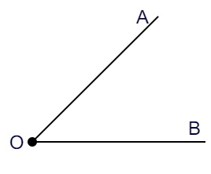
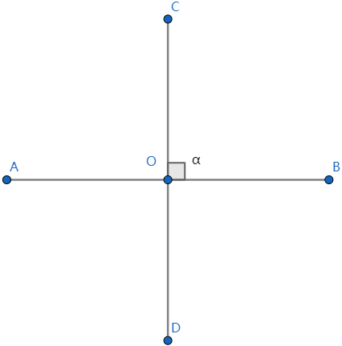
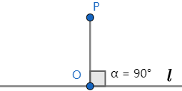
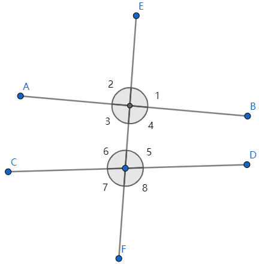

### 角

&emsp;&emsp;由具有公共端点的两条射线组成的图形叫做`角`，例如下图是$\angle AOB$：<!--more-->

&emsp;&emsp;一条射线先绕它的端点旋转，当终边和始边成一条直线时，所成的角叫做`平角`，其角度为$180^{\circ}$。终边继续旋转，当它和始边重合时，所成的角叫做`周角`，其角度为$360^{\circ}$。 
&emsp;&emsp;锐角的角度为$0^{\circ}< \alpha < 90^{\circ}$，钝角的角度为$90^{\circ}< \alpha < 180^{\circ}$，直角为$90^{\circ}$。 
&emsp;&emsp;角度单位`度`、`分`和`秒`的转换：$1^{\circ} = {60}'$(读作`60分`)，${1}' = 60''$(读作`60秒`)。
&emsp;&emsp;角的大小和角的两边画出的长短没有关系。角张开的程度越小，角度就越小。
&emsp;&emsp;在角的内部，自顶点引一条射线把这个角分成两个相等的角，那么这条射线叫做`角平分线`。
&emsp;&emsp;角平分线上的一点，到角的两边的距离相等。角的内部到角的两边的距离相等的点在角平分线上。
&emsp;&emsp;两个角的和为$90^{\circ}$，就说这两个角互为`余角`，简称`互余`；两个角的和为$180^{\circ}$，就说这两个角互为`补角`，简称`互补`。

### 垂线段

&emsp;&emsp;直线互相垂直：如下所示，当$\angle \alpha = 90^{\circ}$时，直线`AB`与直线`CD`互相垂直，符号表示为$AB \perp CD$，垂足为`O`：

&emsp;&emsp;一条直线的垂线有无数条。过直线上(或外)一点，有且只有一条直线与已知直线垂直。
&emsp;&emsp;垂线段：在下图中，线段`PO`与直线$l$互相垂直，我们称`PO`为点`P`到直线$l$的垂线段：

&emsp;&emsp;连接直线外的一点和直线上各点的所有线段中，垂线段最短。直线外一点到这条直线的垂线段的长度，叫做`点到直线的距离`。

### 三线八角

&emsp;&emsp;三线八角：两条直线`AB`和`CD`被第三条直线`EF`所截，构成`8`个角，简称`三线八角`。直线`AB`和`CD`是被截直线，`EF`是截线：

&emsp;&emsp;上图中的$\angle 1$和$\angle 5$的关系是`同位角`，其特点如下：

1. 两角在截线的同侧。
2. 两角在被截直线的同一方。

&emsp;&emsp;上图中的$\angle 3$和$\angle 5$的关系是`内错角`，其特点如下：

1. 两角在截线的同侧。
2. 两角在被截直线之间。

&emsp;&emsp;上图中的$\angle 4$和$\angle 5$的关系是`同旁内角`，其特点如下：

1. 两角在截线的同侧。
2. 两角在被截直线之间。

### 平行线

&emsp;&emsp;平行线：在同一平面内，不相交的两条直线叫做`平行线`，记作$AB \parallel CD$。 
&emsp;&emsp;平行公理：经过直线外一点，有且仅有一条直线与这条直线平行。如果两条直线都和第三条直线平行，那么这两条直线也平行。
&emsp;&emsp;两条直线被第三条直线所截：

1. 如果同位角相等，那么这两条直线平行。
2. 如果内错角相等，那么这两条直线平行。
3. 如果同旁内角互补，那么这两条直线平行。

&emsp;&emsp;两条平行线被第三条直线所截，则同位角相等、内错角相等，并且同旁内角互补。

### 等角定理

&emsp;&emsp;`等角定理`：如果一个角的两边和另一个角的两边分别平行，那么这两个角相等或互补。