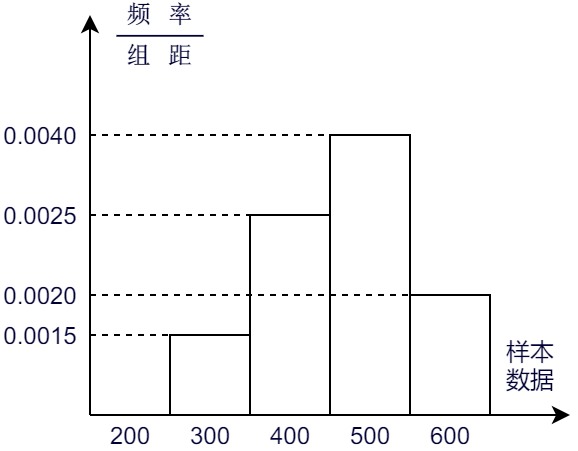

### 调查

&emsp;&emsp;考察全体对象的调查叫做`全面调查`，也叫做`普查`。<!--more-->
&emsp;&emsp;只抽取一部分对象进行调查，然后根据调查数据推断全体对象的情况叫做`抽样调查`。
&emsp;&emsp;要考察的全体对象称为`总体`。组成总体的每一个考察对象叫做`个体`。被抽取的那些个体组成一个`样本`。样本中的个体数量叫做`样本容量`。
&emsp;&emsp;一般地，设一个总体含有`N`个个体，如果通过逐个抽取的方法从中抽取一个样本，且每次抽取时各个个体被抽到的概率相等，则这样的抽样方法叫做`简单随机抽样`。
&emsp;&emsp;频率分布直方图如下，其制作步骤为：

1. 找出所有数据中的最大值和最小值，并算出它们的差。
2. 决定组距和组数。
3. 将数组进行分组。
4. 将数据以表格的形式列出来。
5. 画频数分布直方图。

&emsp;&emsp;连接频率分布直方图中各个小长方形上端的中点，就得到了频率分布折线图。
&emsp;&emsp;随着样本容量的增加，作图时所分的组数增加，组距减少，相应的频率折线图会越来越接近于一条光滑的曲线，这条曲线在统计中称为`总体密度曲线`。

### 统计

&emsp;&emsp;`平均数`：总数除以份数，即$\displaystyle{\overline {x} = \frac{1}{n}(x_1 + x_2 + \cdots + x_n)}$。 <!--more-->
&emsp;&emsp;`中位数`：按顺序排列的一组数据中，居于中间位置的数。

- 奇数个数据：中间一个是中位数。
- 偶数个数据：中间两个数的平均是中位数。

&emsp;&emsp;中位数和平均数的对比：

- 平均数：采集所有数据的信息；容易受到极端数据的影响。
- 中位数：不易受到极端数据的影响；采集数据信息不全面。

&emsp;&emsp;`众数`是在一组数据中，出现次数最多的数据，是一组数据中的原数据，而不是相应的次数。

- 数据$[1, \; 2, \; 3, \; 3, \; 4]$的众数是`3`。
- 数据$[1, \; 2, \; 2, \; 3, \; 3, \; 4]$的众数是`2`和`3`。
- 数据$[1, \; 2, \; 3, \; 4, \; 5]$没有众数。

&emsp;&emsp;`方差`为$\displaystyle{S^2 = \frac{1}{n}[(x_1 - \overline {x})^2 + (x_2 - \overline {x})^2 + \cdots + (x_n - \overline {x})^2]}$，其中$S$称为`标准差`。