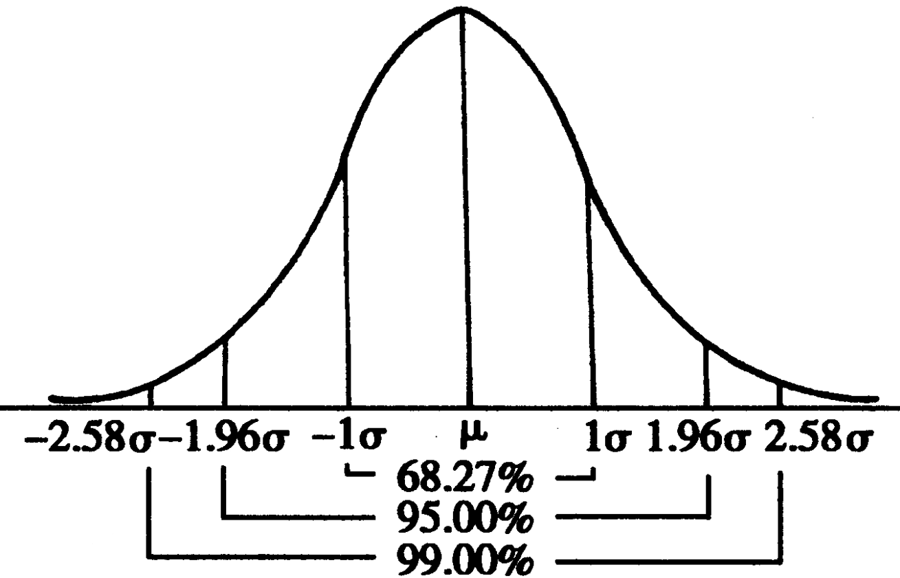

### 事件

&emsp;&emsp;在条件`S`下，一定会发生的事件，叫做相对条件`S`的必然事件，简称`必然事件`，记作$\Omega$。 <!--more-->
&emsp;&emsp;在条件`S`下，一定不可能发生的事件，叫做相对条件`S`的不可能事件，简称`不可能事件`，记作$\Phi$。 
&emsp;&emsp;必然事件和不可能事件统称为相对条件`S`的确定事件，简称`确定事件`。
&emsp;&emsp;在随机试验中，可能出现也可能不出现，而在大量重复试验中具有某种规律性的事件叫做`随机事件`。

### 概率

&emsp;&emsp;`概率`是反映随机事件出现的可能性大小。假设对某一随机现象进行了`n`次试验与观察，其中`A`事件出现了`m`次，即其出现的频率为$\displaystyle{\frac{m}{n}}$。经过大量反复试验，常有$\displaystyle{\frac{m}{n}}$越来越接近于某个确定的常数。该常数即为事件`A`出现的`概率`，常用$P(A)$表示。 
&emsp;&emsp;注意，在`n`种可能的结果中，事件`A`发生的次数`m`满足$0 \leq m \leq n$，所以$\displaystyle{0 \leq \frac{m}{n} \leq 1}$，因此$0 \leq P(A) \leq 1$。当$m = n$时，事件为必然事件，$P(A) = 1$；当$m = 0$时，事件为不可能事件，$P(A) = 0$。 
&emsp;&emsp;称`事件A、B中至少有一个发生`为事件`A`和事件`B`的`和事件`，也称`A`与`B`的`并事件`，记作$A \cup B$或$A + B$。 
&emsp;&emsp;称`事件A、B同时发生`为事件`A`与事件`B`的`积事件`，也称`A`与`B`的`交事件`，记作$A \cap B$或$AB$。 
&emsp;&emsp;若$AB$为不可能事件，则称事件`A`与事件`B`为`互斥事件`。若事件`A`与事件`B`互斥，则$P(A \cup B) = P(A) + P(B)$。 
&emsp;&emsp;若$A \cap B$为不可能事件，$A \cup B$为必然事件，则称事件`A`与事件`B`互为`对立事件`，其中$P(A) = 1 - P(B)$。事件`A`的对立事件是由不属于事件`A`的样本点组成，记作$\overline{A}$。 
&emsp;&emsp;事件`A`与事件`B`都不发生的事件为$\overline{A}\overline{B}$；事件`A`与事件`B`恰好有一个发生的事件为$(A \overline{B}) \cup (\overline{A} B)$；事件`A`与事件`B`至多有一个发生的事件为$(A \overline{B}) \cup (\overline{A} B) \cup (\overline{A} \overline{B})$。 

### 基本事件

&emsp;&emsp;在概率计算中，每一种可能的出现情况称为一个`基本事件`。基本事件必须具有以下特点：

1. 任何两个基本事件是互斥的。
2. 任何事件(除了不可能事件)都可以表示为若干个基本事件的和。

&emsp;&emsp;当一个事件包含多个结果，且各个结果彼此互斥时，要用概率加法公式的推广，即$P(A_1 \cup A_2 \cup \cdots \cup A_n) = P(A_1) + P(A_2) + \cdots + P(A_n)$。 

### 古典概型

&emsp;&emsp;如果一个随机试验所包含的单位事件是有限的，且每个单位事件发生的可能性均相等，则这种条件下的概率模型就叫`古典概型`。
&emsp;&emsp;古典概型的概率公式：$\displaystyle{P(A) = \frac{A包含的基本事件的个数m}{基本事件的总数n}}$。 

### 几何概型

&emsp;&emsp;如果每个事件发生的概率只与构成该事件区域的长度(面积、体积或度数)成比例，则这样的概率模型称为`几何概型`。其特点如下：

- `无限性`：试验中所有可能出现的基本事件有无限多个。
- `等可能性`：每个基本事件出现的可能性相等。

&emsp;&emsp;几何概型的概率公式：$\displaystyle{P(A) = \frac{构成事件A的区域长度(面积或体积)}{实验的全部结果所构成的区域长度(面积或体积)}}$。 

### 离散型随机变量

&emsp;&emsp;在随机试验中，确定一个对应关系，使得每一个试验结果都用一个确定的数字表示。在这个对应关系下，数字随着试验结果的变化而变化。像这种随着试验结果变化而变化的变量称为`随机变量`。所有取值可以一一列出的随机变量，称为`离散型随机变量`。
&emsp;&emsp;设`X`为离散型随机变量，它的一切可能取值为$x_1$、$x_2$、$\cdots$、$x_n$，则称$P(X = x_i) = P_i$为`X`的`概率函数`或`概率分布`。
&emsp;&emsp;离散型随机变量`X`的概率分布列为$\begin{array}{|l|l|l|l|l|l|l|} \hline X & x_1 & x_2 & \cdots & x_i & \cdots & x_n \\ \hline P & p_1 & p_2 & \cdots & p_i & \cdots & p_n \\ \hline \end{array}$。 

&emsp;&emsp;离散型随机变量的概率分布有两条基本性质：

1. $p_i \ge 0 \; (n = 1, \; 2, \; \cdots)$
2. $\displaystyle{\sum_{i = 1}^{n} p_i = 1}$

&emsp;&emsp;随机变量的线性关系：若`X`是随机变量，并且$Y = aX + b$，则`Y`也是随机变量。
&emsp;&emsp;在相同的条件下，重复做的`n`次试验称为`n次独立重复试验`，即若用$A_i \; (i = 1, \; 2, \; \cdots, \; n)$表示第`i`次试验结果，则$P(A_1 A_2 A_3 \cdots A_n) = P(A_1) P(A_2) P(A_3) \cdots P(A_n)$。 

### 两点分布

&emsp;&emsp;`两点分布`或`伯努利分布`：若随机变量`X`服从两点分布，则其分布列为$\begin{array}{|l|l|l|} \hline X & 0   & 1 \\ \hline P & 1-p & p \\ \hline \end{array}$。 

### 超几何分布

&emsp;&emsp;`超几何分布`：超几何分布描述了从有限`N`个物件(其中包含`M`个指定种类的物件)中抽出`n`个物件，成功抽出该指定种类的物件的次数(不放回)，记为$X \sim H(N, \; M, \; n)$。 
&emsp;&emsp;在含有`M`件次品的`N`件产品中，任取`n`件，恰好有`k`件次品，则事件$\{X = k\}$发生的概率为$\displaystyle{P(X = k) = \frac{C_M^k C_{N-M}^{n - k}}{C_N^n}, \; k = 1, \; 2, \; \cdots, \; min\{n, \; M\}}$。 

### 条件概率

&emsp;&emsp;`条件概率`：事件`A`在事件`B`发生的条件下发生的概率，表示为$P(A | B)$，其计算方法为$\displaystyle{P(A | B) = \frac{P(AB)}{P(B)}}$。 
&emsp;&emsp;条件概率的性质如下：

1. $0 \le P (A | B) \le 1$。
2. 若事件`B`与事件`C`是两个互斥事件，则$P((B \cup C) | A) = P(B | A) + P(C | A)$。

### 相互独立

&emsp;&emsp;`相互独立`：设`A`、`B`是两个事件，如果满足等式$P(A \cap B) = P(AB) = P(A)P(B)$，则称事件`A`与`B`相互独立。
&emsp;&emsp;如果事件`A`与`B`相互独立，那么$A$与$\overline{B}$、$\overline{A}$与$B$、$\overline{A}$与$\overline{B}$也都相互独立。 

### 二项分布

&emsp;&emsp;`二项分布`：在`n`次独立重复的试验中，设每次试验中事件`A`发生的概率为`p`。用`X`表示`n`次伯努利试验中事件`A`发生的次数，则`X`的可能取值为`0`、`1`、`...`、`n`。事件$\{X = k\}$为`n次试验中事件A恰好发生k次`，随机变量`X`的离散概率分布即为二项分布。
&emsp;&emsp;二项分布可以表示为$X \sim B(n, \; p)$，其公式为$P(X = k) = C_n^kp^k(1 - p)^{n - k} \; (k = 0, \; 1, \; \cdots , \; n)$。 

### 数学期望

&emsp;&emsp;若离散型随机变量`X`的概率分布列为$\begin{array}{|l|l|l|l|l|l|l|} \hline X & x_1 & x_2 & \cdots & x_i & \cdots & x_n \\ \hline P & p_1 & p_2 & \cdots & p_i & \cdots & p_n \\ \hline \end{array}$：

1. 称$E(X) = x_1p_1 + x_2p_2 + \cdots + x_ip_i + \cdots + x_np_n$为随机变量`X`的`均值`或`数学期望`，它反映了离散型随机变量取值的平均水平。
2. 称$\displaystyle{D(X) = \sum_{i =1}^n[x_i - E(X)]^2p_i}$为随机变量`X`的`方差`，它刻画了随机变量`X`与其均值$E(X)$的平均偏离程度。
3. 称$\sqrt{D(X)}$为随机变量`X`的`标准差`。

&emsp;&emsp;均值与方差的性质：

1. $E(aX + b) = aE(X) + b$
2. $D(aX + b) = a^2D(X)$

&emsp;&emsp;两点分布的均值与方差：$E(X) = p$，$D(X) = p(1 - p)$。二项分布的均值与方差：$E(X) = np$，$D(X) = np(1 - p)$。 

### 正态分布

&emsp;&emsp;`正态分布`也称`常态分布`或`高斯分布`。假如变量`X`的概率分布服从高斯分布，其中均值为$\mu$，方差为$\sigma^2$，那么将它记作$X \sim N(\mu, \; \sigma^2)$。表达式为$\displaystyle{f(x) = \frac{1}{\sqrt{2\pi}\sigma} exp \left(-\frac{(x - \mu)^2}{2\sigma^2} \right)}$，它是一条中间高，两端逐渐下降且完全对称的钟形曲线：

&emsp;&emsp;正态分布的曲线性质如下：

1. 曲线在`x`轴上方，与`x`轴不相交。
2. 曲线是单峰的，它关于直线$x = \mu$对称。
3. 曲线在$x = \mu$处达到峰值$\displaystyle{\frac{1}{\sqrt{2\pi}\sigma}}$。
4. 曲线与`x`轴之间的面积为`1`。
5. 当$\sigma$一定时，曲线随着$\mu$的变化而沿`x`轴平移。
6. 当$\mu$一定时，曲线的形状由$\sigma$决定：

- $\sigma$越小，曲线越`瘦高`，表示总体的分布越集中。
- $\sigma$越大，曲线越`矮胖`，表示总体的分布越分散。

&emsp;&emsp;正态分布常用的三个数据：

1. $P(\mu - \sigma < x \le \mu + \sigma) = 0.6826$
2. $P(\mu - 2\sigma < x \le \mu + 2\sigma) = 0.9544$
3. $P(\mu - 3\sigma < x \le \mu + 3\sigma) = 0.9974$