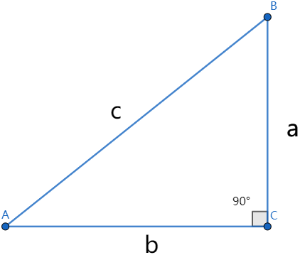
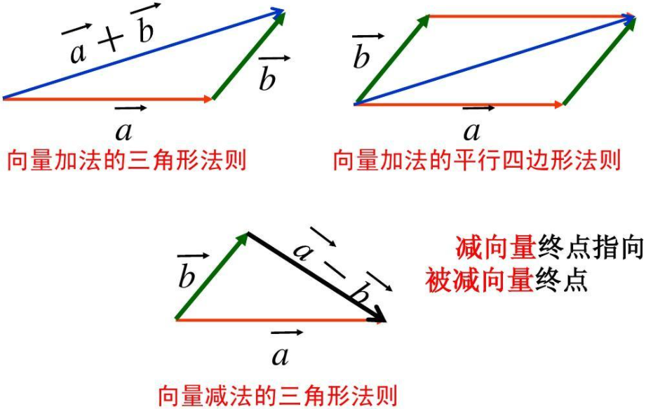
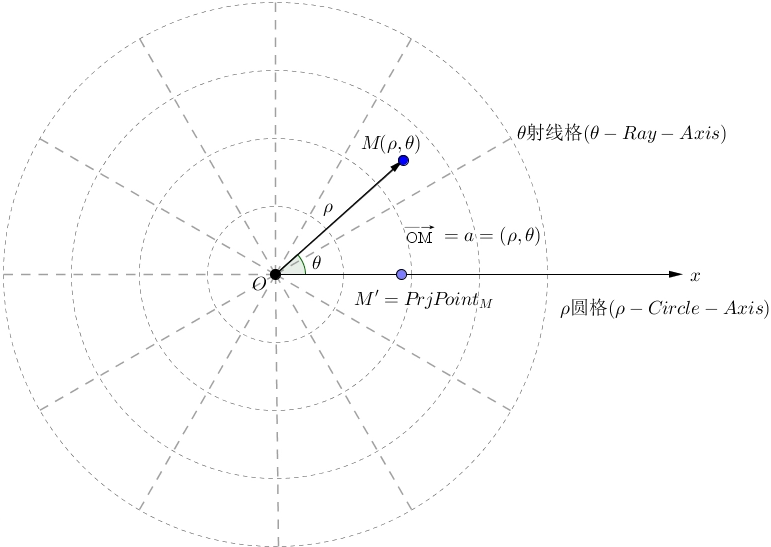

### 集合

&emsp;&emsp;`集合`简称为`集`，是指具有某种特定性质的具体的或抽象的对象汇总而成的集体。其中，构成集合的这些对象则称为该集合的`元素`。<!--more-->
&emsp;&emsp;集合具有如下性质：

- **确定性**：集合中的元素必须是确定的。
- **互异性**：集合中的元素必须是互不相同的。
- **无序性**：集合中的元素是无先后顺序的，任何两个元素都可以交换位置。

&emsp;&emsp;关于数字的集合如下：

符号 | 说明              | 符号         | 说明
-----|------------------|--------------|-----
$N$  | 自然数集(含有`0`) | $N_+$或$N^*$ | 正整数集(不含`0`)
$Z$  | 整数集            | $Q$         | 有理数集
$R$  | 实数集

&emsp;&emsp;若`x`是集合`S`的元素，则称`x`属于`S`，记为$x \in S$；若`y`不是集合`S`的元素，则称`y`不属于`S`，记为$y \notin S$。 
&emsp;&emsp;集合中元素的数目称为集合的`基数`，集合`A`的基数记作$card(A)$。一般的，把含有有限个元素的集合叫做`有限集`，含无限个元素的集合叫做`无限集`。如果不含有任何元素，则称为`空集`，记为$\varnothing$。 
&emsp;&emsp;`容斥原理`：$card(A \cup B) = card(A) + card(B) - card(A \cap B)$。 
&emsp;&emsp;集合的表示方法：

- **列举法**：列举法就是将集合的元素逐一列举出来，例如$A = \{a, b, c, d\}$。
- **描述法**：描述法的形式为$\{代表元素 | 满足的性质\}$，例如$B = \{x | x^2 = 2\}$。

&emsp;&emsp;设`A`、`T`是两个集合，如果`A`的所有元素都属于`B`，我们就说这两个集合具有包含关系，称集合`A`是集合`B`的`子集`，记作$A \subseteq B$或$B \supseteq A$，读作`A包含于B`或`B包含A`。
&emsp;&emsp;一个集合是它本身的子集，记作$A \subseteq A$。 
&emsp;&emsp;如果两个集合`A`和`B`的元素完全相同，则称`A`与`B`两个集合相等，记为$A = B$。若$A \subseteq B$且$B \subseteq A$，则$A = B$。 
&emsp;&emsp;对于两个集合`A`和`B`，如果$A \subseteq B$，但存在元素$x \in B$且$x \notin A$，则称集合`A`是集合`B`的`真子集`，记为$A \subsetneqq B$。 
&emsp;&emsp;空集是任何一个集合的子集，记作$\varnothing \subseteq A$；空集是任意一个非空集合的真子集，记作$\varnothing \subsetneqq A$。 
&emsp;&emsp;对于集合`A`、`B`和`C`，如果$A \subseteq B$，且$B \subseteq C$，则$A \subseteq C$。 
&emsp;&emsp;`交集`：由既属于`A`又属于`B`的所有元素组成的集合，记作$A \cap B$，读作`A交B`，即$A \cap B = \{x | x \in A且x \in B\}$。注意，交集越交越少。 
&emsp;&emsp;`并集`：由所有属于集合`A`或属于集合`B`的元素所组成的集合，记作$A \cup B$，读作`A并B`，即$A \cup B = \{x|x \in A或x \in B\}$。注意，并集越并越多。 
&emsp;&emsp;一般的，如果一个集合含有我们所研究问题中涉及的所有元素，那么就称这个集合为`全集`，通常记作$U$。 
&emsp;&emsp;`补集`又可分为`相对补集`和`绝对补集`：

- 相对补集：由属于`A`而不属于`B`的元素组成的集合，称为`B`关于`A`的相对补集，记作$A - B$，即$A - B = \{x|x \in A且x \notin B\}$。
- 绝对补集：集合`A`关于全集`U`的相对补集，称为`A`的绝对补集，记作$C_{U}A$，即$C_{U}A = \{x|x \in U且x \notin A\}$。

&emsp;&emsp;集合的运算定律：

- $A \cap A = A$；$A \cup A = A$。
- $A \cap B = B \cap A$；$A \cup B = B \cup A$。
- $A \cup \varnothing = A$；$A \cap \varnothing = \varnothing$。
- $A \cap U = A$；$A \cup U = U$。
- 若$A \cap B = A$，则$A \subseteq B$；若$A \cup B = A$，则$A \supseteq B$。
- $A \cap C_{U}A = \varnothing$；$A \cup C_{U}A = U$；$C_{U}(C_{U}A) = A$。

&emsp;&emsp;对于一个有`n`个元素的集合，其子集个数为$2^n$，非空子集个数为$2^n - 1$，真子集个数为$2^n - 1$，非空真子集个数为$2^n - 2$。

### 充分必要条件

&emsp;&emsp;如果命题`若p则q`为真，则记作$p \Rightarrow q$或$q \Leftarrow p$；如果命题`若p则q`为假，则记作$p \nRightarrow q$或$q \nLeftarrow p$。 
&emsp;&emsp;如果$p \Rightarrow q$，则说`p`是`q`的`充分条件`，`q`是`p`的`必要条件`。
&emsp;&emsp;充分条件的特征：当`p`成立时，必有`q`成立。必要条件的特征：当`q`不成立时，必有`p`不成立。例如$a = 0 \Rightarrow ab \neq 0$。 
&emsp;&emsp;如果$p \Leftrightarrow q$，则称`p`是`q`的`充分必要条件`，简称`充要条件`。
&emsp;&emsp;如果$p \Rightarrow q$且$q \nRightarrow p$，则称`p`是`q`的`充分不必要条件`。
&emsp;&emsp;如果$p \nRightarrow q$且$q \Rightarrow p$，则称`p`是`q`的`必要不充分条件`。
&emsp;&emsp;如果$p \nRightarrow q$且$q \nRightarrow p$，则称`p`是`q`的`既不充分也不必要条件`。

### 全称量词和存在量词

&emsp;&emsp;`全称量词`是指在语句中含有短语`全额`、`每一个`、`任意`、`一切`等都是在指定范围内，表示该指定范围内的全体对象或该指定范围整体的含义的词，记作$\forall$。 
&emsp;&emsp;含有全称量词的命题叫作`全称命题`。对于`M`中的任意`x`，都有$p(x)$成立，记作$\forall x \in M, p(x)$。 
&emsp;&emsp;`存在量词`是指在语句中含有短语`有些`、`至少有一个`、`有一个`、`存在`等表示个别或一部分含义的词，记作$\exists$。 
&emsp;&emsp;含有存在量词的命题叫作`特称命题`。存在`M`中的一个`x`，使$p(x)$成立，记作$\exists x \in M, p(x)$。 
&emsp;&emsp;对于含有一个量词的全称命题`p`，它的否定$\neg p$是：$\exists x \in M, \neg p(x)$。 
&emsp;&emsp;对于含有一个量词的特称命题`p`，它的否定$\neg p$是：$\forall x \in M, \neg p(x)$。

### 不等式

&emsp;&emsp;在数学中，表示不等式关系的式子叫做`不等式`。
&emsp;&emsp;不等式的性质：

1. 如果$x > y$，那么$y < x$；如果$y < x$，那么$x > y$。
2. 如果$x > y$，$y > z$，那么$x > z$。
3. 如果$x > y$，而`z`为任意实数或整式，那么$x + z > y + z$。
4. 如果$x > y$，$z > 0$，那么$xz > yz$；如果$x > y$，$z < 0$，那么$xz < yz$。
5. 如果$x > y$，$m > n$，那么$x + m > y + n$。
6. 如果$x > y > 0$，$m > n > 0$，那么$xm > yn$。
7. 如果$x > y > 0$，当`n`为正整数时，$x^n > y^n$；当`n`为负数时，$x^n < y^n$。
8. 如果$a > b > 0$，$n \in N^*$，那么$\sqrt[n]{a} > \sqrt[n]{b}$。
9. 如果$a > b$，$ab > 0$，那么$\cfrac{1}{a} < \cfrac{1}{b}$。
10. 如果$a > b >0$，$d > c > 0$，那么$\cfrac{a}{c} > \cfrac{b}{d}$。
11. 如果$b > x > a > 0$，$0 > b > x > a$，那么$\cfrac{1}{a} > \cfrac{1}{x} > \cfrac{1}{b}$。

&emsp;&emsp;使不等式成立的未知数的值，叫做`不等式的解`。一个含有未知数的不等式的所有解，组成这个不等式的`解集`，例如$x - 5 > 1$的解集是$x > 6$。 
&emsp;&emsp;不等式的解与解集之间的关系：

1. 不等式的解集包括不等式全体的解。
2. 解集中的任何一个数都是不等式的解。

&emsp;&emsp;在不等式组中，几个不等式的解集的公共部分叫做`不等式组的解集`。
&emsp;&emsp;`基本不等式`如下所示，当且仅当$a = b$时取等号。其中$\cfrac{a + b}{2}$叫做正数`a`与`b`的`算术平均数`，$\sqrt{ab}$叫做正数`a`与`b`的`几何平均数`：

$$
\cfrac{a + b}{2} \geq \sqrt{ab}(a > 0且b > 0)
$$

&emsp;&emsp;常用的几个重要不等式如下，不等式等号成立的条件为$a = b$：

1. $ab \le (\cfrac{a + b}{2})^2 \; (a > 0, \; b > 0)$
2. $(\cfrac{a + b}{2})^2 \le \cfrac{a^2 + b^2}{2} \; (a, \; b \in R)$
3. $\cfrac{b}{a} + \cfrac{a}{b} \ge 2 \; (a, \; b同号)$

&emsp;&emsp;`和定积`有最大值：$ab \le (\cfrac{a + b}{2})^2$；`积定和`有最小值：$a + b \ge 2\sqrt{ab}$。 
&emsp;&emsp;含有一个未知数且未知数的最高次数为`2`的不等式叫做`一元二次不等式`。
&emsp;&emsp;一元二次不等式恒成立的条件($\bigtriangleup = b^2 - 4ac$)：

1. $ax^2 + bx + c > 0 \; (a \neq 0)$恒成立的充要条件是$\left\{\begin{matrix} a > 0 \\ \triangle < 0 \end{matrix}\right.$
2. $ax^2 + bx + c < 0 \; (a \neq 0)$恒成立的充要条件是$\left\{\begin{matrix} a < 0 \\ \triangle < 0 \end{matrix}\right.$

### 区间

&emsp;&emsp;设`a`、`b`是两个实数，且$A \le B$，规定：

1. 满足不等式$A \le x \le B$的实数`x`的集合叫做`闭区间`，表示为$[a,b]$。
2. 满足不等式$A < x < B$的实数`x`的集合叫做`开区间`，表示为$(a,b)$。
3. 满足不等式$A \le x < B$的实数`x`的集合叫做`左闭右开区间`，表示为$[a,b)$。
4. 满足不等式$A < x \le B$的实数`x`的集合叫做`左开右闭区间`，表示为$(a,b]$。

`a`和`b`称为区间的`端点`，其中`a`为`左端点`，`b`为`右端点`，$b - a$则为`区间长度`。
&emsp;&emsp;引入区间的概念后，以实数为元素的集合就有两种表示法：

1. 集合表示法：$\{x | 3 < x <7\}$。
2. 区间表示法：$(3,7)$。

&emsp;&emsp;在数轴上，这些区间都可以用一条以`a`和`b`为端点的线段来表示，在图中，用`实心点`表示包括在区间内的端点，用`空心点`表示不包括在区间内的端点。
&emsp;&emsp;实数`R`可以用区间表示为$(-\infty, +\infty)$，$\infty$读作`无穷大`，$+\infty$读作`正无穷大`，$-\infty$读作`负无穷大`。
&emsp;&emsp;还可以把$x \ge a$表示为$[a, +\infty)$，把$x > a$表示为$(a, +\infty)$，把$x \le b$表示为$(-\infty, b]$，把$x < b$表示为$(-\infty, b)$。

### 函数

&emsp;&emsp;`函数`：在一个变化过程中，假设有两个变量`x`、`y`，如果对于任意一个`x`都有唯一确定的一个`y`和它对应，那么就称`x`是自变量，`y`是`x`的函数。`x`的取值范围叫做这个函数的`定义域`，相应的`y`的取值范围叫做函数的`值域`。
&emsp;&emsp;判断两个函数相等的依据是，两个函数的定义域和对应关系完全一致。
&emsp;&emsp;设函数$f(x)$的定义域为`D`，如果对于定义域`D`内的某个区间上的任意两个自变量$x_1$、$x_2$，当$x_1 < x_2$时，都有$f(x_1) < f(x_2)$，那么就说$f(x)$在此区间上是`增函数`。此区间就叫做函数$f(x)$的`单调增区间`。
&emsp;&emsp;设函数$f(x)$的定义域为`I`，如果对于定义域`I`内的某个区间上的任意两个自变量$x_1$、$x_2$，当$x_1 < x_2$时，都有$f(x_1) > f(x_2)$，那么就说$f(x)$在此区间上是`减函数`。此区间就叫做函数$f(x)$的`单调减区间`。
&emsp;&emsp;用定义法判断函数单调性：

1. 取值：设$x_1$、$x_2$为该相应区间的任意两个值，并规定它们的大小，如$x_1 < x_2$。
2. 作差：计算$f(x_1) - f(x_2)$，并通过因式分解、配方、有理化等方法作有利于判断其符号的变形。
3. 定号：判断的符号，若不能确定，则可分区间讨论。
4. 结论：根据差的符号，得出单调性的结论。

&emsp;&emsp;设$\forall x_{1}, \; x_{2} \in D \; (x_{1} \ne x_{2})$，则：

1. $x_1 - x_2 > 0$，$f(x_1) - f(x_2) > 0$ $\Leftrightarrow$ $f(x)$在`D`上单调递增。
2. $x_1 - x_2 < 0$，$f(x_1) - f(x_2) > 0$ $\Leftrightarrow$ $f(x)$在`D`上单调递减。
3. $\cfrac{f(x_1) - f(x_2)}{x_1 - x_2} > 0$或$(x_1 - x_2) \ast [f(x_1) - f(x_2)] > 0$ $\Leftrightarrow$ $f(x)$在`D`上单调递增。
4. $\cfrac{f(x_1) - f(x_2)}{x_1 - x_2} < 0$或$(x_1 - x_2) \ast [f(x_1) - f(x_2)] < 0$ $\Leftrightarrow$ $f(x)$在`D`上单调递减。

&emsp;&emsp;`最大值`：一般地，设函数$y = f(x)$的定义域为`I`，如果存在实数`M`满足：

1. 对于任意的$x \in I$，都有$f(x) \le M$。
2. 存在$x_0 \in I$，使得$f(x_0) = M$。

那么称`M`是函数$y = f(x)$的最大值。 
&emsp;&emsp;`最小值`：一般地，设函数$y = f(x)$的定义域为`I`，如果存在实数`M`满足：

1. 对于任意的$x \in I$，都有$f(x) \ge M$。
2. 存在$x_0 \in I$，使得$f(x_0) = M$。

那么称`M`是函数$y = f(x)$的最小值。 
&emsp;&emsp;`奇函数`：对于函数$f(x)$的定义域内任意一个`x`，都有$f(-x) = -f(x)$，那么函数$f(x)$就叫做`奇函数`。
&emsp;&emsp;`偶函数`：对于函数$f(x)$的定义域内任意一个`x`，都有$f(-x) = f(x)$，那么函数$f(x)$就叫做`偶函数`。
&emsp;&emsp;奇函数的图像关于原点对称，偶函数的图像关于`y`轴对称。奇函数在两个对称的区间上具有相同的单调性，偶函数在两个对称的区间上具有相反的单调性。
&emsp;&emsp;如果一个奇函数$f(x)$在原点处有定义，即$f(0)$有意义，那么一定有$f(0) = 0$。 
&emsp;&emsp;如果函数$f(x)$是偶函数，那么$f(x) = f(|x|)$。 
&emsp;&emsp;奇函数与偶函数的运算法则：

1. 奇函数 $\pm$ 奇函数 $=$ 奇函数
2. 偶函数 $\pm$ 偶函数 $=$ 偶函数
3. 奇函数 $\ast$ 奇函数 $=$ 偶函数
4. 偶函数 $\ast$ 偶函数 $=$ 偶函数
5. 奇函数 $\ast$ 偶函数 $=$ 奇函数

&emsp;&emsp;`分段函数`：对于自变量`x`的不同的取值范围，有着不同的解析式的函数。它是一个函数，而不是几个函数。分段函数的定义域是各段函数定义域的并集，值域也是各段函数值域的并集。
&emsp;&emsp;如下是一个分段函数：

$$
f(x) = \left\{\begin{matrix}
 10^x & x \le 1 \\
 x    & x > 1
\end{matrix}\right.
$$

&emsp;&emsp;对勾函数是形如$f(x) = ax + \cfrac{b}{x} \; (ab > 0)$的函数。增区间是$\{x \; | \; x \le -\sqrt{\cfrac{b}{a}}\}$和$\{x \; | \; x \ge -\sqrt{\cfrac{b}{a}}\}$；减区间是$\{ x | -\sqrt{\cfrac{b}{a}} \le x < 0 \}$和$\{x \; | \; 0 < x \le \sqrt{\cfrac{b}{a}}\}$。 
&emsp;&emsp;若函数$f(a - x) = f(a + x)$，则函数$f(x)$的图像关于直线$x = a$对称。 
&emsp;&emsp;若对于$R$上的任意`x`都有$f(2a - x) = f(x)$或$f(2a + x) = f(x)$，则函数$f(x)$的图像关于直线$x = a$对称。 
&emsp;&emsp;若函数$f(-x + b) + f(x + b) = 0$，则函数$f(x)$关于点$(b, \; 0)$中心对称。 
&emsp;&emsp;平移变换如下：

&emsp;&emsp;伸缩变换如下：

&emsp;&emsp;对称变换如下：

&emsp;&emsp;翻折变换：

1. 上下翻折变换：将函数$y = f(x)$图像在`x`轴及其上方的部分保留，再把下方的部分翻折到上方去，得到函数$y = |f(x)|$的图像。
2. 左右翻折变换：将函数$y = f(x)$图像在`y`轴及其右侧的部分保留，左侧的部分去掉，再将右侧图形复制并翻折到左侧去，得到函数$y = f(|x|)$的图像。

### 幂函数

&emsp;&emsp;一般地，函数$y = x^\alpha$称为`幂函数`，其中`x`是自变量，$\alpha$是常量。 
&emsp;&emsp;当$\alpha > 0$时，幂函数$y = x^\alpha$有下列性质：

1. 图像都经过点$(1,1)$和$(0,0)$。
2. 函数的图像在区间$[0, +\infty)$上是增函数。

&emsp;&emsp;当$\alpha < 0$时，幂函数$y = x^\alpha$有下列性质：

1. 图像都经过点$(1,1)$。
2. 函数的图像在区间$(0, +\infty)$上是减函数。

&emsp;&emsp;当$\alpha$为奇数时，幂函数是奇函数；当$\alpha$为偶数时，幂函数是偶函数。

### n次方根

&emsp;&emsp;一般地，如果$x^n = a$，那么`x`叫做`a`的`n次方根`，其中$n > 1$且$n \in N^*$。 
&emsp;&emsp;当`n`为奇数时，有下列性质：

1. 正数的奇数次方根是正数，负数的奇数次方根是负数。
2. 任何一个数的奇数次方根都是唯一的。
3. 此时`a`的`n`次方根可以表示为$\sqrt[n]{a}$。

&emsp;&emsp;当`n`为偶数时，有下列性质：

1. 正数的`n`次方根有`2`个，且互为相反数。
2. 负数没有`n`次方根。
3. 此时`a`的`n`次方根可以表示为$\pm \sqrt[n]{a}$。

&emsp;&emsp;根式的性质`1`：$(\sqrt[n]{a})^n = a$。 
&emsp;&emsp;根式的性质`2`：

$$
\sqrt[n]{a^n} = \left\{\begin{matrix}
a, n为奇数\\
|a|, n为偶数
\end{matrix}\right.
$$

&emsp;&emsp;正数的正分数指数幂：

$$
a^{\frac{m}{n}} = \sqrt[n]{a^m}(a > 0, m与n \in N^*且n > 1)
$$

&emsp;&emsp;负分数指数幂：

$$
a^{-\frac{m}{n}} = \frac{1}{a^{\frac{m}{n}}}(a > 0, m与n \in N^*且n > 1)
$$

&emsp;&emsp;`0`的正分数指数幂为`0`；`0`的负分数指数幂没有意义。

### 指数函数

&emsp;&emsp;一般地，函数$y = a^x(a > 0且a \neq 1)$叫做`指数函数`，函数的定义域是`R`。指数函数都经过点$(0, 1)$。 
&emsp;&emsp;当$a > 1$时，指数函数都是增函数；当$0 < a < 1$时，指数函数都是减函数。

### 对数

&emsp;&emsp;一般地，如果$a^x = N(a > 0且a \neq 1)$，那么数`x`叫做以`a`为底，`N`的对数，记作$x = log_{a}N$。其中，`a`叫做对数的`底数`，`N`叫做`真数`。
&emsp;&emsp;对数式$log_{a}N$可以看作一种记号，也可以看成是幂运算的逆运算。 
&emsp;&emsp;`常用对数`：以`10`为底的对数，将$log_{10}N$记为$lgN$。 
&emsp;&emsp;`自然对数`：以无理数`e`为底的对数，将$log_{e}N$记为$lnN$。 
&emsp;&emsp;负数和零没有对数。
&emsp;&emsp;对数的性质：

1. $log_{a}1 = 0$；$log_{a}a = 1$。
2. $a^{log_{a}N} = N$。
3. $log_{a}(MN) = log_{a}M + log_{a}N$。
4. $log_{a}(\cfrac{M}{N}) = log_{a}M - log_{a}N$。
5. $log_{a}M^n = nlog_{a}M$。
6. $log_{a}N = \cfrac{log_{m}N}{log_{m}a}$，称为`换底公式`。
7. $log_{a}b * log_{b}a = 1$。
8. $log_{a^m}{b^n} = \cfrac{n}{m}log_{a}b$。
9. $log_{a}^b \cdot log_{b}^c \cdot log_{c}^d = log_{a}^d$。

### 对数函数

&emsp;&emsp;一般地，函数$y = log_{a}x(a > 0且a \neq 1)$叫做`对数函数`，其中`x`是自变量，函数的定义域是$(0, +\infty)$，值域为`R`。指数函数过点$(0, 1)$。 
&emsp;&emsp;当$a > 1$时，具有如下性质：

1. 当$0 < x < 1$时，$y < 0$；当$x > 1$时，$y > 0$。
2. 在$(0, +\infty)$上是增函数。

&emsp;&emsp;当$0 < a < 1$时，具有如下性质：

1. 当$0 < x < 1$时，$y > 0$；当$x > 1$时，$y < 0$。
2. 在$(0, +\infty)$上是减函数。

### 反函数

&emsp;&emsp;设函数$y = f(x)$的定义域是`D`，值域是`f(D)`，如果对于值域`f(D)`中的每一个`y`，在`D`中有且只有一个`x`使得$g(y) = x$，则按此对应法则得到了一个定义在`f(D)`上的函数，并把该函数称为函数$y = f(x)$的`反函数`，记为$x = f^{-1}(y), y \in f(D)$。 
&emsp;&emsp;函数$f$的定义域`D`和值域`f(D)`恰好就是反函数$f^{-1}$的值域和定义域，并且$f^{-1}$的反函数就是$f$，也就是说，函数$f$和$f^{-1}$互为反函数。 
&emsp;&emsp;相对于反函数$y = f^{-1}(x)$来说，原来的函数$y = f(x)$称为`直接函数`。反函数和直接函数的图像关于直线$y = x$对称。

### 零点

&emsp;&emsp;对于函数$y = f(x)$，使$f(x) = 0$的实数`x`叫做函数$y = f(x)$的`零点`。
&emsp;&emsp;函数$y = f(x)$的零点就是方程$f(x) = 0$的实数根，也就是函数$y = f(x)$的图像与`x`轴的交点的横坐标。
&emsp;&emsp;如果函数$y = f(x)$在区间$[a, b]$上的图像是连续不断的一条曲线，并且有$f(a) \ast f(b) < 0$，那么函数$y = f(x)$在区间$(a, b)$内有零点，即存在$c \in (a, b)$，使得$f(c) = 0$，这个`c`也就是方程$f(x) = 0$的根。 
&emsp;&emsp;函数$F(x) = f(x) - g(x)$的零点就是方程$f(x) = g(x)$的实数根，也就是函数$y = f(x)$的图像与函数$y = g(x)$的图像交点的横坐标。 
&emsp;&emsp;二分法求$f(x)$零点的近似解： 
&emsp;&emsp;步骤1. 确定区间$[a, b]$，验证$f(a) \ast f(b) < 0$，给定精确度$\varepsilon$。 
&emsp;&emsp;步骤2. 求区间$(a, b)$的中点$x_1$。 
&emsp;&emsp;步骤3. 计算$f(x_1)$： 

1. 若$f(x_1) = 0$，则$x_1$就是函数的零点。
2. 若$f(a) \ast f(x_1) < 0$，则令$b = x_1$，此时零点$x \in (a, x_1)$。
3. 若$f(x_1) \ast f(b) < 0$，则令$a = x_1$，此时零点$x \in (x_1, b)$。

&emsp;&emsp;步骤4. 判断是否达到精确度$\varepsilon$，即$|a - b| < \varepsilon$。如果没有达到，则重复步骤`2`至步骤`4`。

### 任意角

&emsp;&emsp;通常把逆时针旋转的角称为`正角`，顺时针旋转的角称为`负角`；如果没有进行旋转，也视为形成了一个角，这个角叫做`零角`。
&emsp;&emsp;把角的顶点置于坐标原点，始边与`x`轴的非负半轴重合，那么角的终边落在第几象限时，就说这个角是`象限角`，或说这个角属于第几象限。
&emsp;&emsp;把角的顶点置于坐标原点，始边与`x`轴的非负半轴重合，那么角的终边落在坐标轴上时，就说这个角是`轴线角`，此时这个角不属于任何象限。
&emsp;&emsp;所有与角$\alpha$终边相同的角，连同角$\alpha$在内可以用$S = \{\beta | \beta = k \ast 360^{\circ} + \alpha, k \in Z\}$来表示。 
&emsp;&emsp;象限角的表示方法：

- 第一象限：$S = \{\alpha | k \ast 360^{\circ} < \alpha < k \ast 360^{\circ} + 90^{\circ}, k \in Z\}$
- 第二象限：$S = \{\alpha | k \ast 360^{\circ} + 90^{\circ} < \alpha < k \ast 360^{\circ} + 180^{\circ}, k \in Z\}$
- 第三象限：$S = \{\alpha | k \ast 360^{\circ} + 180^{\circ} < \alpha < k \ast 360^{\circ} + 270^{\circ}, k \in Z\}$
- 第四象限：$S = \{\alpha | k \ast 360^{\circ} - 90^{\circ} < \alpha < k \ast 360^{\circ}, k \in Z\}$

&emsp;&emsp;`x`轴正半轴：$\alpha = k \ast 360^{\circ}$，其中$k \in Z$。 
&emsp;&emsp;`x`轴负半轴：$\alpha = 180^{\circ} + k \ast 360^{\circ}$，其中$k \in Z$。 
&emsp;&emsp;`y`轴正半轴：$\alpha = 90^{\circ} + k \ast 360^{\circ}$，其中$k \in Z$。 
&emsp;&emsp;`y`轴负半轴：$\alpha = 270^{\circ} + k \ast 360^{\circ}$，其中$k \in Z$。 
&emsp;&emsp;终边在`x`轴上：$S = \{\alpha | \alpha = k \ast 180^{\circ} + \alpha, k \in Z\}$。 
&emsp;&emsp;终边在`y`轴上：$S = \{\alpha | \alpha = 90^{\circ} + k \ast 180^{\circ} + \alpha, k \in Z\}$。 

### 弧度

&emsp;&emsp;长度等于半径长的圆弧所对的圆心角叫做`1弧度的角`。用弧长与半径之比度量对应圆心角角度的方式，叫做`弧度制`，用符号`rad`表示，读作`弧度`。
&emsp;&emsp;正角的弧度值是一个正值，负角的弧度值是一个负值，零角的弧度值是零。
&emsp;&emsp;弧度的定义如下，其中$l$是弧长，`r`是半径：

$$
|\alpha| = \cfrac{l}{r}
$$

&emsp;&emsp;弧度和角度的转换：

$$
180^{\circ} = \pi \ rad
$$

$$
1^{\circ} = \cfrac{\pi}{180} \ rad \approx 0.01745 \ rad
$$

$$
1 \ rad = (\cfrac{180}{\pi})^{\circ} \approx 57.30^{\circ}
$$

&emsp;&emsp;扇形面积可以使用弧度来计算：

$$
S = \cfrac{1}{2}|\alpha|r^2
$$

### 三角函数

&emsp;&emsp;假设有如下的三角形：

则各个三角函数的定义如下：

名称 | 公式                     | 名称 | 公式
-----|-------------------------|-----|-----
正弦 | $sin \; A = \cfrac{a}{c}$ | 余弦 | $cos \; A = \cfrac{b}{c}$
正切 | $tan \; A = \cfrac{a}{b}$ | 余切 | $cot \; A = \cfrac{b}{a}$
正割 | $sec \; A = \cfrac{c}{b}$ | 余割 | $csc \; A = \cfrac{c}{a}$

&emsp;&emsp;一般地，在直角坐标系中，给定一个半径为$r$的圆，对于任意角$\alpha$，使角$\alpha$的顶点与原点重合，始边与`x`轴非负半轴重合，终边与该圆交于点$P(x, \; y)$，那么：

$$
sin \ \alpha = \frac{y}{r}
$$

$$
cos \ \alpha = \frac{x}{r}
$$

$$
tan \ \alpha = \frac{y}{x}
$$

注意，当$\alpha = \cfrac{\pi}{2} + k\pi(k \in Z)$时，$\alpha$的终边始终在`y`轴，这时$x = 0$，所以$tan \; \alpha$没有意义。 
&emsp;&emsp;以下公式称为`诱导公式`：
&emsp;&emsp;1. 同角三角函数的基本关系式：

$$
(sin \ \alpha)^2 + (cos \ \alpha)^2 = 1
$$

$$
\cfrac{sin \ \alpha}{cos \ \alpha} = tan \ \alpha
$$

&emsp;&emsp;2. 终边相同的三角函数值：

$$
sin(\alpha + k \ast 2 \pi) = sin \ \alpha
$$

$$
cos(\alpha + k \ast 2 \pi) = cos \ \alpha
$$

$$
tan(\alpha + k \ast 2 \pi) = cos \ \alpha
$$

&emsp;&emsp;3. $\pi + \alpha$的三角函数值与$\alpha$的三角函数值之间的关系：

$$
sin(\pi + \alpha) = -sin \ \alpha
$$

$$
cos(\pi + \alpha) = -cos \ \alpha
$$

$$
tan(\pi + \alpha) = tan \ \alpha
$$

&emsp;&emsp;4. $\alpha$的三角函数值与$-\alpha$的三角函数值之间的关系：

$$
sin(-\alpha) = -sin \ \alpha
$$

$$
cos(-\alpha) = cos \ \alpha
$$

$$
tan(-\alpha) = -tan \ \alpha
$$

&emsp;&emsp;5. $\pi - \alpha$的三角函数值与$\alpha$的三角函数值之间的关系：

$$
sin(\pi - \alpha) = sin \ \alpha
$$

$$
cos(\pi - \alpha) = -cos \ \alpha
$$

$$
tan(\pi - \alpha) = -tan \ \alpha
$$

$$
sin(\cfrac{\pi}{2} - \alpha) = cos \ \alpha \qquad sin(\cfrac{\pi}{2} + \alpha) = cos \ \alpha
$$

$$
cos(\cfrac{\pi}{2} - \alpha) = sin \ \alpha \qquad cos(\cfrac{\pi}{2} + \alpha) = -sin \ \alpha
$$

&emsp;&emsp;`周期函数`：对于函数$y = f(x)$，如果存在一个不为零的常数`T`，使得当`x`取定义域内的每一个值时，$f(x + T) = f(x)$都成立，那么就把函数$y = f(x)$叫做`周期函数`，不为零的常数`T`叫做这个函数的`周期`。如果在所有周期中有一个最小的正数，则称它是函数$f(x)$的最小正周期。 
&emsp;&emsp;函数$y = sin(x)$的周期是$2k\pi(k \in Z且k \neq 0)$，最小正周期是$T = 2\pi$。 
&emsp;&emsp;函数$y = cos(x)$的周期是$2k\pi(k \in Z且k \neq 0)$，最小正周期是$T = 2\pi$。 
&emsp;&emsp;一般地，函数$y = Asin(\omega x + \varphi)(A \neq 0且\omega > 0)$的最小正周期是$T = \cfrac{2 \pi}{|\omega|}$，函数$y = Acos(\omega x + \varphi)(A \neq 0且\omega > 0)$也是同样的。 
&emsp;&emsp;一般地，函数$y = Atan(\omega x + \varphi)(A \neq 0且\omega > 0)$的最小正周期是$T = \cfrac{\pi}{|\omega|}$。 
&emsp;&emsp;$y = sin(x)$的对称中心是$(k\pi, \; 0)(k \in Z)$，对称轴是$x = \cfrac{\pi}{2} + k \pi \; (k \in Z)$；单调增区间是$[-\cfrac{\pi}{2} + 2k\pi, \; \cfrac{\pi}{2} + 2k\pi] \; (k \in Z)$，单调减区间是$[\cfrac{\pi}{2} + 2k\pi, \; \cfrac{3}{2} \pi + 2k\pi] \; (k \in Z)$。 
&emsp;&emsp;$y = cos(x)$的对称中心是$(k\pi + \cfrac{\pi}{2}, \; 0)(k \in Z)$，对称轴是$x = k \pi \; (k \in Z)$；单调增区间是$[\pi + 2k\pi, \; 2\pi + 2k\pi] \; (k \in Z)$，单调减区间是$[2k\pi, \; \pi + 2k\pi] \; (k \in Z)$。 
&emsp;&emsp;$y = tan(x)$是奇函数，单调增区间是$(-\cfrac{\pi}{2} + k \pi, \; \cfrac{\pi}{2} + k \pi) \; (k \in Z)$，对称中心是$(\cfrac{k \pi}{2}, \; 0)$。 
&emsp;&emsp;两角差的余弦公式：

$$
cos(\alpha - \beta) = cos \; \alpha \; cos \; \beta + sin \; \alpha \; sin \; \beta
$$

&emsp;&emsp;两角和的余弦公式：

$$
cos(\alpha + \beta) = cos \; \alpha \; cos \; \beta - sin \; \alpha \; sin \; \beta
$$

&emsp;&emsp;两角和的正弦公式：

$$
sin(\alpha + \beta) = sin \; \alpha \; cos \; \beta + cos \; \alpha \; sin \; \beta
$$

&emsp;&emsp;两角差的正弦公式：

$$
sin(\alpha - \beta) = sin \; \alpha \; cos \; \beta - cos \; \alpha \; sin \; \beta
$$

&emsp;&emsp;两角和的正切公式：

$$
tan(\alpha + \beta) = \cfrac{tan \; \alpha + tan \; \beta}{1 - tan \; \alpha \; tan \; \beta}
$$

&emsp;&emsp;两角差的正切公式：

$$
tan(\alpha - \beta) = \cfrac{tan \; \alpha - tan \; \beta}{1 + tan \; \alpha \; tan \; \beta}
$$

&emsp;&emsp;二倍角的正弦公式：

$$
sin \; 2 \alpha = 2 sin \; \alpha \; cos \; \alpha
$$

&emsp;&emsp;二倍角的余弦公式：

$$
cos \; 2 \alpha = (cos \; \alpha)^2 - (sin \; \alpha)^2 = 2(cos \; \alpha)^2 - 1 = 1 - 2(sin \; \alpha)^2
$$

&emsp;&emsp;二倍角的正切公式：

$$
tan(2\alpha) = \cfrac{2tan \; \alpha}{1 - (tan \; \alpha)^2}
$$

&emsp;&emsp;半角公式如下，其中符号由$\cfrac{\alpha}{2}$所在的象限决定：

$$
sin \; (\cfrac{\alpha}{2}) = \pm \sqrt{\cfrac{1 - cos \; \alpha}{2}}
$$

$$
cos \; (\cfrac{\alpha}{2}) = \pm \sqrt{\cfrac{1 + cos \; \alpha}{2}}
$$

$$
tan \; (\cfrac{\alpha}{2}) = \pm \sqrt{\cfrac{1 - cos \; \alpha}{1 + cos \; \alpha}}
$$

&emsp;&emsp;积化和差公式：

$$
sin \; \alpha \; cos \; \beta = \frac{1}{2}[sin(\alpha + \beta) + sin(\alpha - \beta)]
$$

$$
cos \; \alpha \; sin \; \beta = \frac{1}{2}[sin(\alpha + \beta) - sin(\alpha - \beta)]
$$

$$
cos \; \alpha \; cos \; \beta = \frac{1}{2}[cos(\alpha + \beta) + cos(\alpha - \beta)]
$$

$$
sin \; \alpha \; sin \; \beta = \frac{1}{2}[cos(\alpha + \beta) - cos(\alpha - \beta)]
$$

&emsp;&emsp;和差化积公式：

$$
sin \; \theta  \; + sin \; \varphi = 2sin(\frac{\theta + \varphi}{2})cos(\frac{\theta - \varphi}{2})
$$

$$
sin \; \theta  \; - sin \; \varphi = 2cos(\frac{\theta + \varphi}{2})sin(\frac{\theta - \varphi}{2})
$$

$$
cos \; \theta  \; + cos \; \varphi = 2cos(\frac{\theta + \varphi}{2})cos(\frac{\theta - \varphi}{2})
$$

$$
cos \; \theta  \; - cos \; \varphi = -2sin(\frac{\theta + \varphi}{2})sin(\frac{\theta - \varphi}{2})
$$

&emsp;&emsp;函数$y = Asin(\omega x + \varphi)(A > 0且\omega > 0)$表示一个振动量时，`A`就表示这个量振动时离开平衡位置的最大距离，通常称为这个振动的`振幅`。往返一次的时间$T = \cfrac{2\pi}{\omega}$，称为这个振动的`周期`；单位时间内往返振动的次数$f = \cfrac{1}{T} = \cfrac{\omega}{2\pi}$，称为振动的`频率`。$\omega x + \varphi$称为`相位`，$x = 0$时的相位$\varphi$称为`初相`。
&emsp;&emsp;函数$y = Asin(x)(A > 0且A \neq 1)$的图像，可以看作是把$y = sin(x)$的图像上所有点的纵坐标伸长(当$A > 1$时)或缩短(当$0 < A < 1$)到原来的$A$倍，而得到的。$y = Asin(x)$的值域为$[-A, \; A]$。 
&emsp;&emsp;函数$y = sin(\omega x)(\omega > 0且\omega \neq 1)$的图像，可以看作是把$y = sin(x)$的图像上所有点的的横坐标缩短(当$\omega > 1$时)或伸长(当$0 < \omega < 1$)到原来的$\cfrac{1}{\omega}$倍，而得到的。 
&emsp;&emsp;函数$y = sin(x + \varphi)$的图像，可以看作是把$y = sin(x)$的图像上所有点的向左(当$\varphi > 0$时)或向右(当$\varphi < 0$时)平移$|\varphi|$个单位，而得到的。 
&emsp;&emsp;函数$y = sin(\omega x + \varphi)$的图像，可以看作是把$y = sin(\omega x)$的图像上所有点的向左(当$\varphi > 0$时)或向右(当$\varphi < 0$时)平移$|\cfrac{\varphi}{\omega}|$个单位，而得到的。 
&emsp;&emsp;降幂公式：

$$
cos^2 \alpha = \cfrac{1 + cos \; 2\alpha}{2} \qquad sin^2 \alpha = \cfrac{1 - cos \; 2\alpha}{2}
$$

&emsp;&emsp;升幂公式：

$$
1 + cos \; 2\alpha = 2 \; cos^2 \alpha \qquad 1 - cos \; 2\alpha = 2 \; sin^2 \alpha
$$

&emsp;&emsp;`正弦定理`：在$\bigtriangleup ABC$中，角`A`、`B`、`C`所对的边长分别为`a`、`b`、`c`，三角形外接圆的半径为`R`，直径为`D`，则有：

$$
\frac{a}{sin \; A} = \frac{b}{sin \; B} = \frac{c}{sin \; C} = 2R = D
$$

&emsp;&emsp;`余弦定理`：在$\bigtriangleup ABC$中，角`A`、`B`、`C`所对的边长分别为`a`、`b`、`c`，则有：

$$
a^2 = b^2 + c^2 - 2bc \; cos \; A
$$

$$
b^2 = a^2 + c^2 - 2ac \; cos \; B
$$

$$
c^2 = a^2 + b^2 - 2ab \; cos \; C
$$

&emsp;&emsp;在$\bigtriangleup ABC$中，角`A`、`B`、`C`所对的边长分别为`a`、`b`、`c`，它们有如下性质：

$$
sin \; (A + B) = sin \; C \qquad cos \; (A + B) = - cos \; C \qquad tan \; (A + B) = - tan \; C
$$

$$
sin \; \frac{A + B}{2} = cos \; \frac{C}{2} \qquad cos \; \frac{A + B}{2} = sin \; \frac{C}{2}
$$

$$
tan \; A + tan \; B + tan \; C = tan \; A \ast tan \; B \ast \; tan \; C
$$

$$
\angle A > \angle B \Leftrightarrow a > b \Leftrightarrow sin \; A > sin \; B \Leftrightarrow cos \; A < cos \; B
$$

&emsp;&emsp;`辅助角公式`：$a \; sin \; x + b \; cos \; x = \sqrt{a^2 + b^2} (cos \; \varphi \; sin \; x + sin \; \varphi \; cos \; x) = \sqrt{a^2 + b^2} sin(x + \varphi)$，其中$sin \; \varphi = \cfrac{b}{\sqrt{a^2 + b^2}}$，$cos \; \varphi = \cfrac{a}{\sqrt{a^2 + b^2}}$。

### 向量

&emsp;&emsp;`向量`是指具有大小和方向的量，例如$\vec{a}$。 
&emsp;&emsp;向量的大小叫做向量的`长度`或向量的`模`。向量$\vec{a}$的模记作$|\vec{a}|$。 
&emsp;&emsp;长度为`0`的向量叫做`零向量`，记作$\vec{0}$。零向量的方向是任意的。 
&emsp;&emsp;`单位向量`：长度等于`1`个单位的向量。若$\vec{a} \neq \vec{0}$，则与$\vec{a}$平行的单位向量为$\pm \cfrac{\vec{a}}{|\vec{a}|}$。 
&emsp;&emsp;`平行向量`：是指方向相同或相反的非零向量，也叫`共线向量`。零向量与任意向量平行。
&emsp;&emsp;`相等向量`：长度相等且方向相同的向量。`相反向量`：长度相等且方向相反的向量。
&emsp;&emsp;向量的加减法如下：

&emsp;&emsp;求$\vec{a}$与$\vec{b}$的相反向量$-\vec{b}$的和的运算，叫做$\vec{a}$与$\vec{b}$的`差`：

$$
\vec{a} - \vec{b} = \vec{a} + (-\vec{b})
$$

&emsp;&emsp;向量加法的运算律：

- 交换律：$\vec{a} + \vec{b} = \vec{b} + \vec{a}$。
- 结合律：$(\vec{a} + \vec{b}) + \vec{c} = \vec{a} + (\vec{b} + \vec{c})$。

&emsp;&emsp;首尾相接的若干向量之和，等于由起始向量的起点指向末尾向量的终点的向量：

$$
\overrightarrow{A_{1}A_{2}} + \overrightarrow{A_{2}A_{3}} + \dots \\
+ \overrightarrow{A_{n - 1}A_{n}} = \overrightarrow{A_{1}A_{n}}
$$

&emsp;&emsp;首尾相接的若干向量构成一个封闭图形，则它们的和为$\vec{0}$：

$$
\overrightarrow{A_{1}A_{2}} + \overrightarrow{A_{2}A_{3}} + \dots \\
+ \overrightarrow{A_{n}A_{1}} =  \vec{0}
$$

&emsp;&emsp;`向量共线定理`：如果$\vec{a} \neq \vec{0}$，那么向量$\vec{b}$与$\vec{a}$共线的充要条件是：存在唯一实数$\lambda$，使得$\vec{b} = \lambda \vec{a}$。 
&emsp;&emsp;实数与向量$\vec{\alpha}$的乘积$\lambda \vec{\alpha}$仍然是一个向量：

- 当$\lambda > 0$时，$\lambda \vec{\alpha}$与向量$\vec{\alpha}$的方向相同。
- 当$\lambda < 0$时，$\lambda \vec{\alpha}$与向量$\vec{\alpha}$的方向相反。
- 当$\lambda = 0$时，$\lambda \vec{\alpha}$是$\vec{0}$。

&emsp;&emsp;向量的数乘运算满足分配律和结合律：

- $\lambda(\vec{\alpha} + \vec{\beta}) = \lambda\vec{\alpha} + \lambda\vec{\beta}$
- $(\lambda + \mu)\vec{\alpha} = \lambda \vec{\alpha} + \mu \vec{\alpha}$
- $\lambda (\mu \vec{\alpha}) = (\lambda \mu)\vec{\alpha}$

&emsp;&emsp;向量的`数量积`：两个非零向量$\vec{\alpha}$、$\vec{\beta}$的数量积为$\vec{\alpha} \cdot \vec{\beta} = |\vec{\alpha}||\vec{\beta}|cos<\vec{\alpha}, \; \vec{\beta}>$。$\vec{0}$与任何向量的数量积为`0`。
&emsp;&emsp;设$\vec{a} = (x_1, \; y_1)$，$\vec{b} = (x_2, \; y_2)$，它们之间的夹角为$\theta$，则：

1. $\vec{a} \cdot \vec{b} = x_1 x_2 + y_1 y_2$。
2. $\vec{a}^2 = |\vec{a}|^2$，即$|\vec{a}| = \sqrt{\vec{a}^2}$。
3. $|\vec{a}| = \sqrt{(x_1)^2 + (y_1)^2}$，$cos \; \theta = \cfrac{x_1 x_2 + y_1 y_2}{\sqrt{(x_1)^2 + (y_1)^2} \sqrt{(x_2)^2 + (y_2)^2}}$。
4. $\vec{a}$在$\vec{b}$上的投影为$|\vec{a}|cos \; \theta$。
5. $\vec{a} \bot \vec{b} \Leftrightarrow \vec{a} \cdot \vec{b} = 0 \Leftrightarrow x_1 x_2 + y_1 y_2 = 0$。
6. $\vec{a} \parallel \vec{b} \Leftrightarrow x_1 y_1 - x_2 y_2 = 0$。

&emsp;&emsp;$\vec{a}$与$\vec{b}$同向时，$\vec{a} \cdot \vec{b} = |\vec{a}| |\vec{b}|$；反向时，$\vec{a} \cdot \vec{b} = -|\vec{a}| |\vec{b}|$。 
&emsp;&emsp;向量数量积的运算性质：

1. $\vec{a} \cdot \vec{b} = \vec{b} \cdot \vec{a}$
2. $(\lambda \vec{a} \cdot \vec{b}) = \lambda (\vec{a} \cdot \vec{b}) = \vec{a} \cdot (\lambda \vec{b})$
3. $(\vec{a} + \vec{b}) \cdot \vec{c} = \vec{a} \cdot \vec{c} + \vec{b} \cdot \vec{c}$

&emsp;&emsp;平面向量的坐标运算：设$\vec{a} = (x_1, \; y_1)$，$\vec{b} = (x_2, \; y_2)$，则：

1. $\vec{a} + \vec{b} = (x_1 + x_2, \; y_1 + y_2)$
2. $\vec{a} - \vec{b} = (x_1 - x_2, \; y_1 - y_2)$
3. $\lambda \vec{a} = (\lambda x_1, \; \lambda x_2)$

&emsp;&emsp;设点`A`的坐标为$(x_1, \; y_1)$，点`B`的坐标为$(x_2, \; y_2)$，则：

1. $\overrightarrow {AB} = (x_2 - x_1, \; y_2 - y_1)$
2. $|\overrightarrow {AB}| = \sqrt{(x_2 - x_1)^2 + (y_2 - y_1)^2}$

### 空间坐标系

&emsp;&emsp;`点在直线上`的充要条件：$l$为经过已知点`A`且平行于已知非空向量$\vec{\alpha}$的直线，对于空间任意一点`O`，点`P`在直线上的充要条件是存在实数$t$，使得$\overrightarrow {OP} = \overrightarrow{OA} + t\overrightarrow{\alpha}$。 
&emsp;&emsp;`三点共线`的充要条件：已知空间中的任意两个不共线的向量$\overrightarrow{OA}$和$\overrightarrow{OB}$，如果它们满足向量关系式$\overrightarrow{OP} = x\overrightarrow{OA} + y\overrightarrow{OB}$，其中$x + y = 1$，则点`P`、`A`、`B`三点共线。
&emsp;&emsp;`四点共面`的充要条件：已知空间中的任意一点`O`和不共面的三个向量$\overrightarrow{OA}$、$\overrightarrow{OB}$、$\overrightarrow{OC}$，如果它们满足向量关系式$\overrightarrow{OP} = x\overrightarrow{OA} + y\overrightarrow{OB} + z\overrightarrow{OC}$，其中$x + y + z = 1$，则点`P`、`A`、`B`、`C`四点共面。
&emsp;&emsp;`三垂线定理`：平面内的一条直线，如果与穿过这个平面的一条斜线在这个平面上的射影垂直，那么它也和这条斜线垂直。如下所示，$OA \bot \alpha$，$OB \bot l$，$AB \bot l$：

&emsp;&emsp;`三垂线定理的逆定理`：如果平面内一条直线和穿过该平面的一条斜线垂直，那么这条直线也垂直于这条斜线在平面内的射影。
&emsp;&emsp;`共面向量基本定理`：如果两个向量$\vec{a}$、$\vec{b}$不共线，那么向量$\vec{p}$与向量$\vec{a}$、$\vec{b}$共面的充要条件是：存在唯一实数对`x`、`y`，使$\vec{p} = x\vec{a} + y\vec{b}$。 
&emsp;&emsp;在平面直角坐标系中，分别取与`x`轴、`y`轴方向相同的两个单位向量$\vec{i}$、$\vec{j}$作为基底，$\vec{a}$为坐标平面内的任意向量，以坐标原点`O`为起点作向量$\overrightarrow{OP} = \vec{a}$。由平面向量基本定理可知，有且只有一对实数`x`、`y`，使得向量$\overrightarrow{OP} = x\vec{i} + y\vec{j}$，因此$\vec{a} = x\vec{i} + y\vec{j}$。我们把$(x, \; y)$叫做向量的`坐标`，记作$\vec{a} = (x, \; y)$。显然，其中$(x, \; y)$就是点`P`的坐标，向量$\overrightarrow{OP}$称为点`P`的`位置向量`。
&emsp;&emsp;`空间向量基本定理`：若存在三个不共面向量$\vec{a}$、$\vec{b}$、$\vec{c}$，那么对空间任一向量$\vec{p}$，存在唯一有序实数组$\{x, \; y, \; z\}$，使得$\vec{p} = x\vec{a} + y\vec{b} + z\vec{c}$。任意不共面的三个向量都可做为空间的一个基底，向量$\vec{a}$、$\vec{b}$、$\vec{c}$都叫做`基向量`。
&emsp;&emsp;若点`A`的坐标为$(x_1, \; y_1, \; z_1)$，点`B`的坐标为$(x_2, \; y_2, \; z_2)$，则$\overrightarrow{AB} = \overrightarrow{OB} - \overrightarrow{OA} = (x_2 - x_1, \; y_2 - y_1, \; z_2 - z_1)$。 
&emsp;&emsp;空间向量长度的计算：已知$\vec{a} = (x, \; y, \; z)$，则$|\vec{a}| = \sqrt{x^2 + y^2 + z^2}$。 
&emsp;&emsp;角度的计算：已知$\vec{a} = (x_1, \; y_1, \; z_1)$，$\vec{b} = (x_1, \; y_1, \; z_1)$，则：

$$
cos<\vec{a}, \; \vec{b}> = \frac{\vec{a} \cdot \vec{b}}{|\vec{a}||\vec{b}|} \\
= \frac{x_{1}x_{2} + y_{1}y_{2} + z_{1}z_{2}}{\sqrt{x_{1}^2 + \\
y_{1}^2 + z_{1}^2} \sqrt{x_{2}^2 + y_{2}^2 + z_{2}^2}}
$$

&emsp;&emsp;设$\vec{a} = (a_1, \; a_2, \; a_3)$，$\vec{b} = (b_1, \; b_2, \; b_3)$，则：

1. $\vec{a} + \vec{b} = (a_1 + b_1, \; a_2 + b_2, \; a_3 + b_3)$
2. $\lambda \vec{a} = (\lambda a_1, \; \lambda a_2, \; \lambda a_3)$
3. $\vec{a} - \vec{b} = (a_1 - b_1, \; a_2 - b_2, \; a_3 - b_3)$
4. $\vec{a} \cdot \vec{b} = a_1b_1 + a_2b_2 + a_3b_3$

&emsp;&emsp;中点坐标公式：已知点`A`的坐标为$(x_1, \; y_1, \; z_1)$，点`B`的坐标为$(x_1, \; y_1, \; z_1)$，则线段`AB`的中点坐标为$(\cfrac{x_{1} + x_{2}}{2}, \; \cfrac{y_{1} + y_{2}}{2}, \; \cfrac{z_{1} + z_{2}}{2})$。 
&emsp;&emsp;空间直线的方向用一个与该直线平行的非零向量来表示，该向量称为这条直线的一个`方向向量`。直线在空间中的位置，由它经过的空间一点，以及它的一个方向向量完全确定。
&emsp;&emsp;对于直线$l$上的任意一点`P`，存在实数`t`，使得$\overrightarrow{AP} = t \overrightarrow{AB}$。向量$\overrightarrow{AB}$称为直线的一个方向向量：

&emsp;&emsp;如果一个非零向量$\vec{n}$与平面`a`垂直，则称向量$\vec{n}$为平面`a`的`法向量`，记作$\vec{n} \; \bot \; a$。 
&emsp;&emsp;给定一点`A`和一个向量$\vec{n}$，那么过点`A`，并且以向量$\vec{n}$为法向量的平面是完全确定的。一个平面的法向量都互相平行。 
&emsp;&emsp;设不重合的两条直线$l$和$m$的方向向量分别是$\vec{a}$和$\vec{b}$，不重合的两个平面$\alpha$和$\beta$的法向量分别是$\vec{u}$和$\vec{v}$，那么：

- 线线平行：$l \; \parallel \; m \Leftrightarrow \vec{a} \; \parallel \; \vec{b} \Leftrightarrow \vec{a} = k \vec{b}$
- 线面平行：$l \; \parallel \; \alpha \Leftrightarrow \vec{a} \perp \vec{u} \Leftrightarrow \vec{a} \cdot \vec{u} = 0$
- 面面平行：$\alpha \; \parallel \; \beta \Leftrightarrow \vec{u} \; \parallel \; \vec{v} \Leftrightarrow \vec{u} = k \vec{v}$
- 线线垂直：$l \; \perp \; m \Leftrightarrow \vec{a} \; \perp \; \vec{b} \Leftrightarrow \vec{a} \cdot \vec{b} = 0$
- 线面垂直：$l \; \perp \; \alpha \Leftrightarrow \vec{a} \; \parallel \; \vec{u} \Leftrightarrow \vec{a} = k \vec{u}$
- 面面垂直：$\alpha \perp \beta \Leftrightarrow \vec{u} \perp \vec{v} \Leftrightarrow \vec{u} \cdot \vec{v} = 0$
- 两直线$l$和$m$所成的角为$\theta \; (0 \le \theta \le \cfrac{\pi}{2})$：$cos \; \theta = \cfrac{|\vec{a} \cdot \vec{b}|}{|\vec{a}| |\vec{b}|}$
- 直线$l$与平面$\alpha$所成的角为$\theta \; (0 \le \theta \le \cfrac{\pi}{2})$：$sin \; \theta = \cfrac{|\vec{a} \cdot \vec{u}|}{|\vec{a}| |\vec{u}|}$

&emsp;&emsp;从一条直线出发的两个半平面所组成的图形叫做`二面角`，这条直线叫做二面角的`棱`，这两个半平面叫做二面角的`面`。
&emsp;&emsp;以二面角的公共直线上任意一点为端点，在两个面内分别作垂直于公共直线的两条射线，这两条射线所成的角叫做二面角的`平面角`。二面角的大小可用平面角表示。

&emsp;&emsp;设不重合的两个平面$\alpha$和$\beta$的法向量分别是$\vec{u} = (A_1, \; B_1, \; C_1)$和$\vec{v} = (A_2, \; B_2, \; C_2)$，那么：

1. 二面角$\alpha-l-\beta$的大小为$\theta \; (0 \le \theta \le \pi)$：$|cos \; \theta| = \cfrac{|\vec{u} \cdot \vec{v}|}{|\vec{u}| |\vec{v}|} = \cfrac{A_1 A_2 + B_1 B_2 + C_1 C_2}{\sqrt{A_1^2 + B_1^2 + C_1^2} \sqrt{A_2^2 + B_2^2 + C_2^2}}$。
2. 两个平面垂直相当于$A_1 A_2 + B_1 B_2 + C_1 C_2 = 0$。
3. 两个平面互相平行或重合相当于$\cfrac{A_1}{A_2} = \cfrac{B_1}{B_2} = \cfrac{C_1}{C_2}$。

&emsp;&emsp;平面法向量的具体步骤：

1. 设平面法向量$\vec{n} = (x, \; y, \; z)$。
2. 在平面内找出两个不共线的向量，记为$\vec{a} = (a_1, \; a_2, \; a_3)$和$\vec{b} = (b_1, \; b_2, \; b_3)$。
3. 根据法向量的定义，建立方程组$\left\{\begin{matrix} \vec{n} \cdot \vec{a} = 0 \\ \vec{n} \cdot \vec{b} = 0 \end{matrix}\right.$
4. 解方程组，取其中一组解即可。

&emsp;&emsp;在空间直角坐标系中，点`P`$(x_1, \; y_1, \; z_1)$和点`Q`$(x_2, \; y_2, \; z_2)$的中点坐标为$x = \cfrac{x_1 + x_2}{2}$，$y = \cfrac{y_1 + y_2}{2}$和$z = \cfrac{z_1 + z_2}{2}$。 
&emsp;&emsp;平面与直线的基本性质：

1. 如果直线上的两个点在一个平面内，那么这条直线在此平面内。
2. 过不在同一条直线上的三点，有且只有一个平面。
3. 如果两个不重合的平面有一个公共点，那么它们有且只有一条过该点的公共直线。
4. 平行于同一条直线的两条直线互相平行。
5. 平面外的一条直线与平面内的一条直线平行，则直线与此平面平行。
6. 如果一条直线和一个平面平行，经过这条直线的平面和这个平面相交，那么这条直线就和交线平行。
7. 一个平面内的两条相交的直线与另一个平面平行，则这两个平面平行。
8. 如果两个平行平面同时和第三个平面相交，那么它们的交线平行。
9. 如果两个平面平行，则其中一个平面内的任意一条直线平行于另一个平面。
10. 夹在两个平行平面间的平行线段长度相同。
11. 经过平面外的的一点，有且只有一个平面与已知平面平行。
12. 两条直线被三个平行平面所截，截得的对应线段成比例。
13. 如果两个平面分别和第三个平面平行，那么这两个平面互相平行。
14. 如果一条直线与平面内的任意一条直线都垂直，那么该直线与该平面互相垂直。
15. 如果一条直线与一个平面内的两条相交直线都垂直，那么该直线与该平面。
16. 垂直于同一个平面的两条直线平行。
17. 一个平面经过另一个平面的一条直线，则这两个平面垂直。
18. 如果两个平面互相垂直，则一个平面内垂直于交线的直线垂直于另一个平面。
19. 若两条平行线中的一条垂直于一个平面，则另一条也垂直于这个平面。
20. 垂直于同一条直线的两个平面平行。
21. 过一点有且只有一条直线与已知平面垂直。
22. 过一点有且只有一个平面与已知直线垂直。

&emsp;&emsp;`相交直线`：同一平面内，有且只有一个公共点。
&emsp;&emsp;`平行直线`：同一平面内，没有公共点。
&emsp;&emsp;`异面直线`：不在任何一个平面内，没有公共点。
&emsp;&emsp;`等角定理`：如果一个角的两边和另一个角的两边分别平行，那么这两个角相等或互补。
&emsp;&emsp;异面直线所成的角：设$a$、$b$是两条异面直线，经过空间中任意一点`O`做直线$a' \parallel a$和$b' \parallel b$，把$a'$和$b'$所成的锐角(或直角)$\theta$叫做异面直线$a$与$b$所成的角，即$cos \; \theta = \cfrac{|a \cdot b|}{|a| |b|}$，范围是$(0, \; \cfrac{\pi}{2}]$。 
&emsp;&emsp;直线与平面的关系：设直线为$l$，平面为$\alpha$：

- `相交`：$l \cap \alpha = A$，有一个公共点`A`。
- `平行`：$l \parallel \alpha$，没有公共点。
- `在平面内`：$l \subset \alpha$，有无数个公共点。

&emsp;&emsp;平面与平面的关系：设平面为$\alpha$和$\beta$：

- `平行`：$\alpha \parallel \beta$，没有公共点。
- `相交`：$\alpha \cap \beta = l$，它们相交的点构成了直线$l$。

&emsp;&emsp;点到平面的距离：设点`A`为平面$\alpha$上的一个点，点`B`为平面外$\alpha$外的一个点，向量$\vec{n}$为平面$\alpha$的法向量，则点`B`到平面$\alpha$之间的距离为$d = \cfrac{|\overrightarrow{AB} \cdot \vec{n}|}{|\vec{n}|}$。 
&emsp;&emsp;线面距、面面距均可以转换为点面距进行求解。
&emsp;&emsp;两直线的相交：设直线$l_1$的方程为$A_1x + B_1y + C = 0$，直线$l_2$的方程为$A_2x + B_2y + C = 0$，则它们的公共点坐标与方程组$\left\{\begin{matrix} A_1 x + B_1 y + C = 0 \\ A_2 x + B_2 y + C = 0 \end{matrix}\right.$的解一一对应：

- `相交`：方程组有唯一解，交点的坐标就是方程组的解。
- `平行`：方程组无解。
- `重合`：方程组有无数个解。

&emsp;&emsp;点$(x_0, \; y_0)$到直线$Ax + By + C = 0$之间的距离为$d = \cfrac{|Ax_0 + By_0 + C|}{\sqrt{A^2 + B^2}}$。 
&emsp;&emsp;两条平行线$Ax + By + C_1 = 0$和$Ax + By + C_2 = 0$之间的距离为$d = \cfrac{|C_1 - C_2|}{\sqrt{A^2 + B^2}}$。 
&emsp;&emsp;与直线$Ax + By + C = 0 \; (A^2 + B^2 \neq 0)$垂直和平行的直线方程可设为：

- `垂直`：$Bx - Ay + m = 0$
- `平行`：$Ax + By + n = 0$

&emsp;&emsp;与对称问题相关的两个结论：

1. 点$(x_0, \; y_0)$关于点$(a, \; b)$的对称点为$(2a - x_0, \; 2b - y_0)$。
2. 设点`P`$(x_0, \; y_0)$关于直线$y = kx + b$的对称点为`P'`$(x', \; y')$，则有如下关系，即可求出$x'$和$y'$：

$$
\left\{\begin{matrix}
\begin{align*}
& \frac{y' - y_0}{x' - x_0} \cdot k = -1 \\
& \frac{y' + y_0}{2} = k \cdot \frac{x' + x_0}{2} + b
\end{align*}
\end{matrix}\right.
$$

### 直线

&emsp;&emsp;平面直角坐标系内，当直线$l$与`x`轴相交时，我们取`x`轴作为基准，`x`轴正向与直线$l$向上方向之间所成的角$\alpha$叫做直线$l$的`倾斜角`：

&emsp;&emsp;当直线$l$和`x`轴平行或重合时，它的倾斜角为$0^{\circ}$。直线倾斜角的范围是$0^{\circ} \le \alpha < 180^{\circ}$。 
&emsp;&emsp;一条直线与某平面直角坐标系横轴正半轴方向的夹角的正切值，就是该直线相对于该坐标系的`斜率`。如果直线与`x`轴垂直，直角的正切值无穷大，故此直线不存在斜率。
&emsp;&emsp;经过点$P_1 \; (x_1, \; y_1)$和点$P_2 \; (x_2, \; y_2)$的直线斜率为$k = \cfrac{y_2 - y_1}{x_2 - x_1} \; (x_1 \neq x_2)$。 
&emsp;&emsp;两直线平行的判定：设两直线$l_1$、$l_2$的斜率分别是$k_1$、$k_2$，则$l_1 \; \parallel \; l_2 \Leftrightarrow k_1 = k_2$。特别地，当两直线的倾斜角为$90^{\circ}$时，它们互相平行或重合。 
&emsp;&emsp;两直线垂直的判定：设两直线$l_1$、$l_2$的斜率分别是$k_1$、$k_2$，则$l_1 \perp l_2 \Leftrightarrow k_1 \cdot k_2 = -1$。特别地，一条直线的倾斜角为$90^{\circ}$，一条直线的倾斜角为$0^{\circ}$时，它们互相垂直。 
&emsp;&emsp;直线的`点斜式方程`：由直线上一定点和直线的斜率确定的直线方程：过点$P_0 \; (x_0, \; y_0)$，斜率为`k`的直线方程为$y - y_0 = k(x - x_0)$。 
&emsp;&emsp;直线的`斜截式方程`：由直线的斜率`k`与它在`y`轴上的截距`b`确定：$y = kx + b$。 
&emsp;&emsp;直线的`两点式方程`：已知两点$P_1 \; (x_1, \; y_1)$和$P_2 \; (x_2, \; y_2)$，其中$x_1 \neq x_2$，$y_1 \neq y_2$，通过这两点的方程为$\cfrac{y - y_1}{y_2 - y_1} = \cfrac{x - x_1}{x_2 - x_1}$。两点式方程不能用来表示平行于坐标轴或与坐标轴重合的直线方程。 
&emsp;&emsp;直线的`截距式方程`：直线方程由直线在`x`轴的截距`a`，和`y`轴的截距`b`确定：$\cfrac{x}{a} + \cfrac{y}{b} = 1$。适用于横、纵截距都存在，且都不为`0`的直线。

直线方程名称 | 适用场景
------------|--------
点斜式      | 不垂直于`x`轴
斜截式      | 不垂直于`x`轴
两点式      | 不垂直于坐标轴
截距式      | 不垂直于坐标轴，且不经过原点

&emsp;&emsp;直线的`一般式方程`：在直角坐标系下，我们把关于`x`、`y`的方程$Ax + By + C = 0$(`A`、`B`不能同时等于`0`)叫做直线的`一般式方程`，简称`一般式`。一般式适用于任何一条直线。

### 线性规划

&emsp;&emsp;一般地，直线$l$的方程$ax^2 + bx + c = 0$把直角坐标平面分成了`3`个部分：

- 直线$l$上的点$(x, \; y)$的坐标满足$ax^2 + bx + c = 0$。
- 直线$l$一侧的点$(x, \; y)$的坐标满足$ax^2 + bx + c > 0$。
- 直线$l$另一侧的点$(x, \; y)$的坐标满足$ax^2 + bx + c < 0$。

&emsp;&emsp;只需在此直线的某一侧取一个特殊点$(x_0, \; y_0)$，由$a(x_{0})^2 + bx_0 + c$的符号即可判断$ax^2 + bx + c > 0$表示直线$ax^2 + bx + c = 0$哪一侧的平面区域。 
&emsp;&emsp;线性规划的基本概念如下：

- `约束条件`：由变量`x`、`y`组成的不等式(组)。
- `线性约束条件`：关于`x`、`y`的一次不等式(或等式)。
- `目标函数`：关于`x`、`y`的函数解析式，如$z = 2x + 3y$。
- `线性目标函数`：关于`x`、`y`的一次解析式。
- `可得解`：满足线性约束条件的解$(x, \; y)$。
- `可行域`：所有可行解组成的集合。
- `最优解`：使目标函数取得最大值或最小值的可得解。
- `线性规划问题`：在线性约束条件下求线性目标函数的最大值或最小值问题。

&emsp;&emsp;点`P1`$(x_1, \; y_1)$和点`P2`$(x_2, \; y_2)$位于直线$Ax + By + C = 0$两侧的充要条件为$(Ax_1 + By_1 + c)(Ax_2 + By_2 + c) < 0$，位于直线同侧的充要条件为$(Ax_1 + By_1 + c)(Ax_2 + By_2 + c) > 0$。

### 极坐标

&emsp;&emsp;在平面上取定一点`O`，称为`极点`。从点`O`出发引一条射线`Ox`，称为`极轴`。再取定一个单位长度、一个角度单位(通常取弧度)以及其正方形(通常取逆时针方向为正)，就建立了`极坐标系`。
&emsp;&emsp;对于极坐标系所在平面内的任一点`M`，其位置就可以用线段`OM`的长度$\rho$以及从`Ox`到`OM`的角度$\theta$来确定，有序数对$(\rho, \; \theta)$就称为`M`点的`极坐标`，记为$P(\rho, \; \theta)$。$\rho$称为`M`点的`极径`，$\theta$称为`M`点的`极角`。

&emsp;&emsp;极坐标系转换为平面直角坐标：极坐标系中的两个坐标$\rho$和$\theta$可以由公式转换为直角坐标系下的坐标值：$x = \rho cos \theta$、$y = \rho sin \theta$。 
&emsp;&emsp;平面直角坐标系转换为极坐标系：直角坐标系中的两个坐标$x$和$y$可以由公式转换为极坐标系下的坐标值：$\rho = \sqrt{x^2 + y^2}$、$tan \; \theta = \cfrac{y}{x} \; (x \neq 0)$。 
&emsp;&emsp;用极坐标系描述的曲线方程称作`极坐标方程`：

1. 过极点且与极轴成$\alpha$的直线：$\theta = \alpha$。
2. 过极坐标点$(a, \; 0)$且垂直于极轴的直线：$\rho cos \; \theta = a$。
3. 过极坐标点$(b, \; \cfrac{\pi}{2})$且平行于极轴的直线：$\rho sin \; \theta = b$。
4. 圆心在极点，半径为$r$的圆：$\rho = r$。
5. 圆心在极坐标点$(r, \; 0)$，半径为$r$的圆：$\rho = 2r cos \theta$。
6. 圆心在极坐标点$(r, \; \cfrac{\pi}{2})$，半径为$r$的圆：$\rho = 2r sin \theta$。

### 参数方程

&emsp;&emsp;在平面直角坐标系中，如果曲线上任意一点的坐标`x`、`y`都是某个变数`t`的函数$\left\{\begin{matrix} x = f(t) \\ y = g(t) \end{matrix}\right.$，并且对于`t`的每一个允许的取值，由方程组确定的点$(x, \; y)$都在这条曲线上，那么这个方程就叫做曲线的`参数方程`，联系变数`x`、`y`的变数`t`叫做`参变数`，简称`参数`。
&emsp;&emsp;直线、圆和椭圆的参数方程如下：

1. 过点$(x_0, \; y_0)$，倾斜角为$\alpha$的直线(以$t$为参数)：$\left\{\begin{matrix} x = x_0 + t \; cos \; \alpha \\ y = y_0 + t \; sin \; \alpha \end{matrix}\right.$
2. 圆心在点原点，半径为$R$的圆(以$\theta$为参数)：$\left\{\begin{matrix} x = R \; cos \; \theta \\ y = R \; sin \; \theta \end{matrix}\right.$
3. 圆心在点$(x_0, \; y_0)$，半径为$R$的圆(以$\theta$为参数)：$\left\{\begin{matrix} x = x_0 + R \; cos \; \theta \\ y = y_0 + R \; sin \; \theta \end{matrix}\right.$
4. 椭圆$\cfrac{x^2}{a^2} + \cfrac{y^2}{b^2} = 1 \; (a > b > 0)$(以$\varphi$为参数)：$\left\{\begin{matrix} x = a \; cos \; \varphi \\ y = b \; sin \; \varphi \end{matrix}\right.$

### 绝对值不等式

&emsp;&emsp;绝对值不等式$|x| \le a$和$|x| \ge a$的解法如下：

不等式                   | a > 0                   | a = 0      | a < 0
-------------------------|------------------------|------------|------
$ &#124; x &#124; \le a$ | $-a \le x \le a$       | $x = 0$    | 无解
$ &#124; x &#124; < a$   | $-a < x < a$           | 无解       | 无解
$ &#124; x &#124; \ge a$ | $x \le -a$或 $x \ge a$ | $R$        | $R$
$ &#124; x &#124; > a$ | $x < -a$或 $x > a$       | $x \neq 0$ | $R$

&emsp;&emsp;绝对值不等式$|ax + b| \le c \; (c > 0)$和$|ax + b| \ge c \; (c > 0)$的解法如下：

1. 不等式$|ax + b| \le c \; (c > 0)$的求解：先化为不等式组$-c \le ax + b \le c$，再利用不等式的性质求出原不等式的解集。
2. 不等式$|ax + b| \ge c \; (c > 0)$的求解：先化为不等式组$ax + b \le -c$和$ax + b \ge c$，再利用不等式的性质求出原不等式的解集。

&emsp;&emsp;绝对值不等式的性质如下：

1. $|a_1 + a_2 + \cdots + a_n| \le |a_1| + |a_2| + \cdots + |a_n|$
2. $||a| - |b|| \le |a + b| \le |a| + |b|$
3. $||a| - |b|| \le |a - b| \le |a| + |b|$