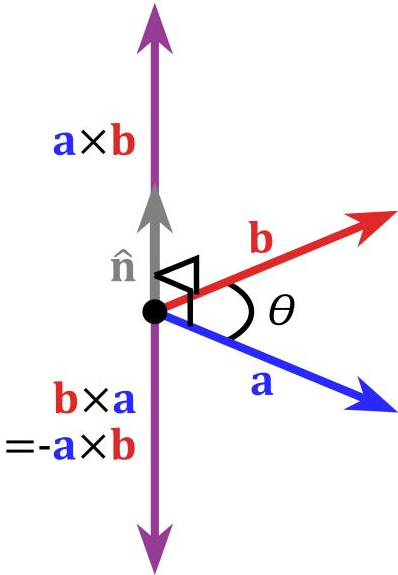
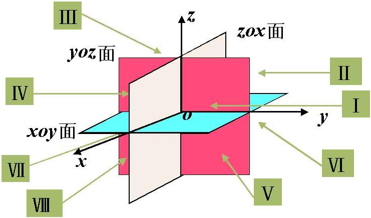

### 导数

&emsp;&emsp;导数是函数$y = f(x)$在$x = x_0$处的瞬时变化率。$\lim\limits_{\triangle x \to 0} \cfrac{f(x_{0} + \triangle x) - f(x_{0})}{\triangle x} = \lim\limits_{\triangle x \to 0} \cfrac{\triangle y}{\triangle x}$为函数$y = f(x)$在$x = x_{0}$处的导数，记作$f'(x_{0})$、$y'|_{x = x_{0}}$、$\left. \cfrac{\mathrm{d} y}{\mathrm{d} x} \right|_{x = x_0}$或$\left. \cfrac{\mathrm{d} f(x)}{\mathrm{d} x} \right|_{x=0}$。 <!--more-->
&emsp;&emsp;函数$f(x)$的`左导数`为$f'_{-}(x) = \lim\limits_{h \to 0^-} \cfrac{f(x_0 + h) - f(x_0)}{h}$，`右导数`为$f'_{+}(x) = \lim\limits_{h \to 0^+} \cfrac{f(x_0 + h) - f(x_0)}{h}$。左导数与右导数统称为`单侧导数`。
&emsp;&emsp;如果函数$f(x)$在开区间$(a, \; b)$内可导，且$f'_{+}(a)$和$f'_{-}(b)$都存在，那么就说函数$f(x)$在区间$[a, \; b]$。 
&emsp;&emsp;函数$y = f(x)$在$x_0$点的导数$f'(x_0)$的几何意义：表示函数曲线在点$(x_0, \; f(x_0))$处的切线的斜率。相应的切线方程为$y - f(x_0) = f'(x_0)(x - x_0)$。 
&emsp;&emsp;导数的运算法则：若$y = f(x)$、$y = g(x)$的导数存在，则：

1. $[f(x) \pm g(x)]' = f'(x) \pm g'(x)$
2. $[f(x) \cdot g(x)]' = f'(x)g(x) + f(x)g'(x)$
3. $[C f(x)]' = C f'(x)$
4. $\left [\cfrac{f(x)}{g(x)} \right]' = \cfrac{f'(x)g(x) - f(x)g'(x)}{\left[g(x) \right]^2} \; (g(x) \neq 0)$

&emsp;&emsp;反函数的求导法则：设$x = f(y)$在区间$I_y$内单调、可导，且$f'(y) \neq 0$，则它的反函数$y = f^{-1}(x)$在$I_x = f(I_y)$内也可导，且$[f^{-1}(x)]' = \cfrac{1}{f'(y)}$或$\cfrac{\mathrm{d} y}{\mathrm{d} x} = \cfrac{1}{\cfrac{\mathrm{d} x}{\mathrm{d} y}}$。 
&emsp;&emsp;设$y = f(u)$，而$u = g(x)$且$f(u)$及$g(x)$都可导，则复合函数$y = f[g(x)]$的导数为$\cfrac{\mathrm{d} y}{\mathrm{d} x} = \cfrac{\mathrm{d} y}{\mathrm{d} u} \cdot \cfrac{\mathrm{d} u}{\mathrm{d} x}$或$y'(x) = f'(u) \cdot g'(x)$。 
&emsp;&emsp;我们把$y' = f'(x)$的导数叫做函数$y = f(x)$的`二阶导数`，记作$y''$或$\cfrac{\mathrm{d}^2 y}{\mathrm{d} x^2}$，即$y'' = (y')'$或$\cfrac{\mathrm{d}^2 y}{\mathrm{d} x^2} = \cfrac{\mathrm{d}}{\mathrm{d} x}\left (\cfrac{\mathrm{d} y}{\mathrm{d} x}\right)$。$(n - 1)$阶的导数叫做`n阶导数`，记作$y^{(n)}$或$\cfrac{\mathrm{d}^n y}{\mathrm{d} x^n}$。 
&emsp;&emsp;函数$y = f(x)$具有$n$阶导数，也常说成函数$f(x)$为`n阶可导`。二阶以及二阶以上的导数统称`高阶导数`。
&emsp;&emsp;如果函数$u = u(x)$与函数$v = v(x)$在点$x$处都具有$n$阶导数，那么此时有$(uv)^{(n)} = \sum\limits_{k = 0}^n C_n^k u^{(n - k)} v^{(k)}$，其中$C_n^k = \cfrac{n!}{k!(n - k)!}$为组合数，$u^{(0)} = u$，$v^{(0)} = v$。 
&emsp;&emsp;`显函数`：一个函数如果能用形如$y = f(x)$的解析式表示，其中$x$和$y$分别是函数的自变量与因变量，则此函数称为显函数。 
&emsp;&emsp;`隐函数`：如果由方程$F(x, \; y) = 0$可确定$y$是$x$的函数，即$x$和$y$在某个范围内存在函数$y = g(x)$，使$F(x, \; g(x)) = 0$，由这种方式表示的函数是隐函数。 
&emsp;&emsp;函数的导数与单调性的关系：若函数$y = f(x)$在某个区间内可导：

1. 若$f'(x) > 0$，则$f(x)$在这个区间内单调递增。
2. 若$f'(x) < 0$，则$f(x)$在这个区间内单调递减。
3. 若$f'(x) = 0$，则$f(x)$在这个区间内是个常数。

&emsp;&emsp;函数$f(x)$在$[a, \; b]$上有最值的条件：如果在区间$[a, \; b]$上函数$y = f(x)$的图像是一条连续不断的曲线，那么它必有最大值和最小值。 
&emsp;&emsp;若函数$y = f(x)$在某区间内处处可导(即对区间内的任何$x$，其导数$f'(x)$都存在)，若区间内存在某些$x_i$能使$f'(x_i) = 0$(即在这些点处函数曲线的斜率为零)，这样的点被称为`驻点`。
&emsp;&emsp;设函数$f(x)$在$x_0$的某个邻域内恒有$f(x) \le f(x_0)$(或$f(x) \ge f(x_0)$)成立，则称$f(x_0)$是函数$f(x)$的一个`极大值`(或`极小值`)。
&emsp;&emsp;函数的极大值与极小值统称为函数的`极值`，使函数取得极值的点称为`极值点`。
&emsp;&emsp;设函数$f(x)$在$x_0$处可导，且在$x_0$处取得极值，则$f'(x_0) = 0$。 
&emsp;&emsp;设函数$f(x)$在$x_0$处连续，且在$x_0$的某去心邻域$\mathring{U}(x_0, \; \delta)$内可导：

1. 若$x \in (x_0 - \delta, \; x_0)$时，$f'(x) > 0$，而$x \in (x_0, \; x_0 + \delta)$时，$f'(x) < 0$，则$f(x)$在$x_0$处取得极大值。
2. 若$x \in (x_0 - \delta, \; x_0)$时，$f'(x) < 0$，而$x \in (x_0, \; x_0 + \delta)$时，$f'(x) > 0$，则$f(x)$在$x_0$处取得极小值。
3. 若$x \in \mathring{U}(x_0, \; \delta)$时，$f'(x)$的符号保持不变，则$f(x)$在$x_0$处没有极值。

&emsp;&emsp;设函数$f(x)$在$x_0$处有二阶导数，且$f'(x) = 0$，$f''(x) \neq 0$，则：

- 当$f''(x) < 0$时，函数$f(x)$在$x_0$处取得极大值。
- 当$f''(x) > 0$时，函数$f(x)$在$x_0$处取得极小值。

&emsp;&emsp;求函数$y = f(x)$在$[a, \; b]$上的最值的步骤：

1. 求函数$y = f(x)$在$(a, \; b)$上的极值。
2. 将函数$y = f(x)$在各个极值，以及端点处的函数值$f(a)$和$f(b)$比较，其中最大的一个则称为`最大值`，最小的一个则称为`最小值`。

&emsp;&emsp;设函数$y = f(x)$在$x_0$的邻域内有定义，$x_0$及$x_0 + \Delta x$在此区间内，如果函数的增量$\Delta y = f(x_0 + \Delta x) - f(x_0)$可表示为$\Delta y = A \Delta x + o(\Delta x)$，其中$A$是不随$\Delta x$改变的常量，那么称函数$y = f(x)$在点$x_0$是`可微`的，且$A \Delta x$称作函数$y = f(x)$在点$x_0$相应于自变量增量$\Delta x$的`微分`，记作$\mathrm{d} y$，即$\mathrm{d} y = A \Delta x$。 
&emsp;&emsp;函数$f(x)$在点$x_0$可微的充分必要条件是函数$f(x)$在点$x_0$可导，且当$f(x)$在点$x_0$可微时，其微分一定是$\mathrm{d} y = f'(x_0) \Delta x$。 
&emsp;&emsp;通常把自变量$x$的增量$\Delta x$称为`自变量的微分`，记作$\mathrm{d} x$，即$\mathrm{d} x = \Delta x$。于是函数$y = f(x)$的微分又可记作$\mathrm{d} y = f'(x) \mathrm{d} x$，从而有$\cfrac{\mathrm{d} y}{\mathrm{d} x} = f'(x)$。函数因变量的微分$\mathrm{d} y$与自变量的微分$\mathrm{d} x$之商等于该函数的导数，因此导数也叫做`微商`。
&emsp;&emsp;微分的运算法则：

1. $\mathrm{d}(u \pm v) = \mathrm{d} u \pm \mathrm{d} v$
2. $\mathrm{d}(Cu) = C \mathrm{d} u$
3. $\mathrm{d}(uv) = v \mathrm{d} u + u \mathrm{d} v$
4. $d \left( \cfrac{u}{v} \right) = \cfrac{v \mathrm{d} u - u \mathrm{d} v}{v^2}$

&emsp;&emsp;设$y = f(u)$以及$u = g(x)$都可导，则复合函数$y = f[g(x)]$的微分为$\mathrm{d} y = f'(u)g'(x) \mathrm{d} x$或$\mathrm{d} y = f'(u) \mathrm{d} u$。 
&emsp;&emsp;如果某个量的精确值为$A$，它的近似值为$a$，那么$|A - a|$叫做$a$的`绝对误差`，而绝对误差与$|a|$的比值$\cfrac{|A - a|}{|a|}$叫做$a$的`相对误差`。
&emsp;&emsp;`费马引理`：函数$f(x)$在点$x_0$的某邻域$U(x_0)$内有定义，并且在$x_0$处可导，如果对于任意的$x \in U(x_0)$，有$f(x) \le f(x_0)$(或$f(x) \ge f(x_0)$)，那么$f'(x_0) = 0$。 
&emsp;&emsp;导数为`0`的点通常称为函数的`驻点`。
&emsp;&emsp;`罗尔定理`：如果函数$f(x)$满足以下条件：

1. 在闭区间$[a, \; b]$上连续。
2. 在开区间$(a, \; b)$内可导。
3. $f(a) = f(b)$

则至少存在一个$\xi \in (a, \;b)$，使得$f'(\xi) = 0$。 
&emsp;&emsp;`拉格朗日中值定理`、`微分中值定理`或`有限增量定理`：如果函数$f(x)$满足以下条件：

1. 在闭区间$[a, \; b]$上连续。
2. 在开区间$(a, \; b)$内可导。

那么在开区间$(a, \; b)$内至少有一点$\xi \; (a < \xi < b)$，使得等式$f(b) - f(a) = f'(\xi)(b - a)$成立。 
&emsp;&emsp;如果函数$f(x)$在区间$I$上连续，$I$内可导且导数恒为`0`，那么$f(x)$在区间$I$上是一个常数。 
&emsp;&emsp;`柯西中值定理`：设函数$f(x)$、$g(x)$满足以下条件：

1. 在闭区间$[a, \; b]$上连续。
2. 在开区间$(a, \; b)$内可导。
3. 对任意$x \in (a, \; b)$，$g'(x) \neq 0$。

那么在$(a, \; b)$内至少有一点$\xi$，使得等式$\cfrac{f(b) - f(a)}{g(b) - g(a)} = \cfrac{f'(\xi)}{g'(\xi)}$成立。 
&emsp;&emsp;洛必达法则`1`：若函数$f(x)$和$g(x)$满足下列条件：

1. 当$x \longrightarrow a$时，函数$f(x)$和$g(x)$都趋于`0`。
2. 在点`a`的某去心邻域内，两者都可导，且$g'(x) \neq 0$。
3. $\lim\limits_{x \to a} \cfrac{f'(x)}{g'(x)}$存在(或为$\infty$)。

则$\lim\limits_{x \to a} \cfrac{f(x)}{g(x)} = \lim\limits_{x \to a} \cfrac{f'(x)}{g'(x)}$。 
&emsp;&emsp;洛必达法则`2`：若函数$f(x)$和$g(x)$满足下列条件：

1. 当$x \longrightarrow a$时，函数$f(x)$和$g(x)$都趋于`0`。
2. 当$|x| > N$时，两者都可导，且$g'(x) \neq 0$。
3. $\lim\limits_{x \to a} \cfrac{f'(x)}{g'(x)}$存在(或为$\infty$)。

则$\lim\limits_{x \to \infty} \cfrac{f(x)}{g(x)} = \lim\limits_{x \to \infty} \cfrac{f'(x)}{g'(x)}$。 
&emsp;&emsp;泰勒公式中值定理`1`：如果函数$f(x)$在$x_0$处有$n$阶导数，那么存在$x_0$的一个邻域，对于该邻域内的任一$x$，有$f(x) = f(x_0) + f'(x_0)(x - x_0) + \cfrac{f''(x_0)}{2!} (x - x_0)^2 + \cdots + \cfrac{f^{(n)}(x_0)}{n!} (x - x_0)^n + R_n(x)$，其中$R_n(x) = o((x - x_0)^n)$。 
&emsp;&emsp;泰勒公式中值定理`2`：如果函数$f(x)$在$x_0$处有$n + 1$阶导数，那么对于任一$x \in U(x_0)$，有$f(x) = f(x_0) + f'(x_0)(x - x_0) + \cfrac{f''(x_0)}{2!} (x - x_0)^2 + \cdots + \cfrac{f^{(n)}(x_0)}{n!} (x - x_0)^n + R_n(x)$，其中$R_n(x) = \cfrac{f^{(n + 1)}(\xi)}{(n + 1)!} (x - x_0)^{n + 1}$，这里$\xi$是$x_0$与$x$之间的某个值。 
&emsp;&emsp;麦克劳林公式：$f(x) = f(0) + f'(0) x + \cdots + \cfrac{f^{(n)}(0)}{n!} x^n + o(x^n)$。 
&emsp;&emsp;若已知函数为递增函数，则导数大于等于零；若已知函数为递减函数，则导数小于等于零。
&emsp;&emsp;设$f(x)$在区间$I$上连续，如果对$I$上的任意两点$x_1$、$x_2$，恒有$f(\cfrac{x_1 + x_2}{2}) < \cfrac{f(x_1) + f(x_2)}{2}$，那么称$f(x)$在$I$上的图形是(向上)凸的(或`凸弧`)。
&emsp;&emsp;设$f(x)$在区间$I$上连续，如果对$I$上的任意两点$x_1$、$x_2$，恒有$f(\cfrac{x_1 + x_2}{2}) > \cfrac{f(x_1) + f(x_2)}{2}$，那么称$f(x)$在$I$上的图形是(向下)凹的(或`凹弧`)。
&emsp;&emsp;设函数$f(x)$在区间$[a, \; b]$上连续，在$(a, \; b)$内具有二阶导数，则：

- 如果$x \in (a, \; b)$时，恒有$f''(x) > 0$，则曲线$y = f(x)$在$[a, \; b]$内是凹的。
- 如果$x \in (a, \; b)$时，恒有$f''(x) < 0$，则曲线$y = f(x)$在$[a, \; b]$内是凸的。

### 映射

&emsp;&emsp;两个非空集合`A`与`B`之间存在着对应关系`f`，而且对于`A`中的每一个元素`a`，在`B`中总有唯一的元素`b`与它对应。这种对应关系称为从`A`到`B`的`映射`，记作$f : A \longrightarrow B$。其中，`b`称为元素`a`在映射`f`下的`像`，记作$b = f(a)$。`a`称为`b`关于映射`f`的`原像`。
&emsp;&emsp;设`f`是由集合`A`到集合`B`的映射，如果任意的$x_1, \; x_2 \in A$且$x_1 \neq x_2$，都有$f(x_1) \neq f(x_2)$，则称`f`为由`A`到`B`的`单射`。
&emsp;&emsp;设`f`是由集合`A`到集合`B`的映射，如果集合`B`中的任意一个元素`y`都是集合`A`中的像，则称`f`为`A`到`B`的`满射`。
&emsp;&emsp;若映射`f`既是`单射`，又是`满射`，则称`f`为`一一映射`或`双射`。
&emsp;&emsp;设$f : A \longrightarrow B$是集合`A`到集合`B`上的一一映射，如果对于`B`中每一个元素`b`，使`b`在`A`中的原像`a`和它对应，这样得到的映射称为$f : A \longrightarrow B$的`逆映射`，记作$f^{-1} : B \longrightarrow A$。 
&emsp;&emsp;当映射$f$满足以下两个条件时，就可以说映射$f$是从$X$到$Y$的`线性映射`：

1. $f(x_i) + f(x_j) = f(x_i + x_j)$
2. $cf(x_i) = f(cx_i)$

&emsp;&emsp;设有`2`个映射$g : X \longrightarrow Y_1$和$f : Y_2 \longrightarrow Z$，其中$Y_1 \subset Y_2$，则由映射`g`和`f`可以定出一个从`X`到`Z`的对应法则，它将每个$x \in X$映成$f[g(x)] \in Z$。显然，这个对应法则确定了一个从`X`到`Z`的映射，这个映射称为映射`g`和`f`构成的`复合映射`，记作$f \circ g$。 
&emsp;&emsp;映射`f`和`g`构成复合映射的条件是：`g`的值域必须包含在`f`的定义域内，否则不能构成复合映射。
&emsp;&emsp;设函数$f(x)$在数集$A$上有定义，如果存在常数$K_1$，使得对任意$x \in A$，有$f(x) \le K_1$，则称函数$f(x)$在数集$A$上有`上界`，并称$K_1$为在$A$上的`上界`。
&emsp;&emsp;设函数$f(x)$在数集$A$上有定义，如果存在常数$K_2$，使得对任意$x \in A$，有$f(x) \ge K_2$，则称函数$f(x)$在数集$A$上有`下界`，并称$K_2$为在$A$上的`下界`。
&emsp;&emsp;设函数$f(x)$在数集$A$上有定义，如果存在常数$M > 0$，使得对任意$x \in A$，有$|f(x)| \le M$，则称函数$f(x)$在数集$A$上`有界`，否则称为`无界`。
&emsp;&emsp;设`y`是`u`的函数$y = f(u)$，`u`是`x`的函数$u = \varphi(x)$，如果$\varphi(x)$的值全部或部分在$f(u)$的定义域内，则`y`通过中间变量`u`成为`x`的函数，记作$y = f[g(x)]$，称为由函数$y = f(u)$与$u = \varphi(x)$复合而成的`复合函数`。
&emsp;&emsp;设函数$f(x)$的定义域为$D_f$，$g(x)$的定义域为$D_g$，$D = D_f \cap D_g \neq \varnothing$，则：

- $(f + g)(x) = f(x) + g(x), \; x \in D$
- $(f - g)(x) = f(x) - g(x), \; x \in D$
- $(f \cdot g)(x) = f(x) \cdot g(x), \; x \in D$
- $\left ( \cfrac{f}{g} \right )(x) = \cfrac{f(x)}{g(x)}, \; x \in D且g(x) \neq 0$

&emsp;&emsp;`基本初等函数`分为如下`5`类：

1. 幂函数，如$y = x^{\mu}$。
2. 指数函数，如$y = a^x$。
3. 对数函数，如$y = log_{a}x$。
4. 三角函数，如$y = sin \; x$。
5. 反三角函数，如$y = arcsin \; x$。

&emsp;&emsp;`初等函数`是由基本初等函数经过有限次的四则运算和复合运算所得到的函数。

### 极限

&emsp;&emsp;设${x_n}$为一个无穷实数数列的集合，如果存在实数$a$，对于任意给定的正数$\varepsilon$(不论其多么小)，总存在正整数$N$，使得当$n > N$时，不等式$|x_n - a| < \varepsilon$都成立，那么就称常数$a$是数列$\{x_n\}$的`极限`，或者数列$\{x_n\}$收敛于$a$，记作$\lim\limits_{n \to \infty} x_n = a$或$x_n \longrightarrow a \; (n \longrightarrow \infty)$。 
&emsp;&emsp;对于数列$\{x_n\}$，如果存在正数$M$，使得对于一切$x_n$都满足不等式$|x_n| \le M$，则称数列$\{x_n\}$是有界的，否则为无界的。 
&emsp;&emsp;`子数列`是从一个数列中抽取几个数，按照它们在原数列中的顺序所组成的新的数列。
&emsp;&emsp;收敛数列的性质：

1. 极限的唯一性：如果数列$\{x_n\}$收敛，那么它的极限唯一。
2. 收敛数列的有界性：如果数列$\{x_n\}$收敛，那么数列$\{x_n\}$一定有界。
3. 收敛数列的保号性：如果$\lim\limits_{n \to \infty} x_n = a$，且$a > 0$(或$a < 0$)，那么存在正整数$N$，当$n > N$时，都有$x_n > 0$(或$x_n < 0$)。
4. 如果数列$\{x_n\}$从某项起有$x_n \ge 0$(或$x_n \le 0$)，且$\lim\limits_{n \to \infty} x_n = a$，那么$a \ge 0$(或$a \le 0$)。
5. 收敛数列与其子数列间的关系：如果数列$\{x_n\}$收敛于$a$，那么它的任一子数列也收敛，且极限也是$a$。

&emsp;&emsp;以$x_0$为中心的任何开区间称为点$x_0$的`邻域`，记作$U(x_0)$。在$U(x_0)$中去掉中心$x_0$后，称为点$x_0$的`去心邻域`，记作$\mathring{U}(x_0)$。 
&emsp;&emsp;设$\delta > 0$，则开区间$(x_0 - \delta, \; x_0 + \delta)$称为点$x_0$的$\delta$邻域，记作$U(x_0, \; \delta)$，点$x_0$的去心$\delta$邻域记作$\mathring{U}(x_0, \; \delta)$，$\delta$称为`邻域半径`。
&emsp;&emsp;设函数$f(x)$在点$x_0$的某一去心邻域内有定义，如果存在常数$A$，对于任意给定的正数$\varepsilon$(无论它多么小)，总存在正数$\delta$，使得当$x$满足不等式$0 < |x - x_0| < \delta$时，对应的函数值$f(x)$都满足不等式$|f(x) - A| < \varepsilon$，那么称常数$A$为函数$f(x)$当$x \longrightarrow x_0$时的`极限`，记作$\lim\limits_{x \to x_0} f(x) = A$。 
&emsp;&emsp;在$\lim\limits_{x \to x_0} f(x) = A$的定义中，把$0 < |x - x_0| < \delta$改为$x_0 - \delta < x < x_0$，那么$A$就叫函数$f(x)$当$x \longrightarrow x_0$时的`左极限`，记作$\lim\limits_{x \to x_0^-} f(x) = A$。 
&emsp;&emsp;在$\lim\limits_{x \to x_0} f(x) = A$的定义中，把$0 < |x - x_0| < \delta$改为$x_0 < x < x_0 + \delta$，那么$A$就叫函数$f(x)$当$x \longrightarrow x_0$时的`右极限`，记作$\lim\limits_{x \to x_0^+} f(x) = A$。 
&emsp;&emsp;左极限与右极限统称`单侧极限`。函数$f(x)$当$x \longrightarrow x_0$时极限存在的充要条件是，左极限和右极限各自存在，且两者相等。 
&emsp;&emsp;设$f(x)$当$|x|$大于某一正数时有定义，如果存在常数$A$，对于任意给定的正数$\varepsilon$(无论它多么小)，总存在正数$|X|$，使得当$x$满足不等式$|x| > X$时，对应的函数值$f(x)$都满足不等式$|f(x) - A| < \varepsilon$，那么称常数$A$为函数$f(x)$当$x \longrightarrow \infty$时的`极限`，记作$\lim\limits_{x \to \infty} f(x) = A$。 
&emsp;&emsp;函数极限的性质：

1. 函数极限的唯一性：如果$\lim\limits_{x \to x_0} f(x) = A$存在，那么这个极限唯一。
2. 函数极限的局部有界性：如果$\lim\limits_{x \to x_0} f(x) = A$，那么存在常数$M > 0$和$\delta$，使得当$0 < |x - x_0| < \delta$时，有$|f(x)| \le M$。
3. 函数极限的局部保号性：如果$\lim\limits_{x \to x_0} f(x) = A$，且$A > 0$(或$A < 0$)，那么存在常数$\delta > 0$，使得当$0 < |x - x_0| < \delta$时，都有$f(x) > 0$(或$f(x) < 0$)。
4. 如果$\lim\limits_{x \to x_0} f(x) = A \; (A \neq 0)$，那么就存在着$x_0$的去心邻域$\mathring{U}(x_0, \; \delta)$，当$x \in \mathring{U}(x_0, \; \delta)$时，就有$f(x) > \cfrac{|A|}{2}$。
5. 如果在$x_0$的去心邻域$\mathring{U}(x_0, \; \delta)$内$f(x) \ge 0$(或$f(x) \ge 0$)，而且$\lim\limits_{x \to x_0} f(x) = A$，那么$A \ge 0$(或$A \le 0$)。
6. 函数极限与数列极限的关系：如果极限$\lim\limits_{x \to x_0} f(x)$存在，$\{x_n\}$为函数$f(x)$的定义域内任一收敛于$x_0$的数列，且满足$x_n \neq x_0 \; (n \in N_+)$，那么相应的函数值数列$\{f(x_n)\}$必收敛，且$\lim\limits_{n \to \infty} f(x_n) = \lim\limits_{x \to x_0} f(x)$。

&emsp;&emsp;当自变量$x$无限接近$x_0$(或$x$的绝对值无限增大)时，函数值$f(x)$与$0$无限接近，即$f(x) \longrightarrow 0$(或$f(x) = 0$)，则称$f(x)$为当$x \longrightarrow x_0$(或$x \longrightarrow \infty$)时的无穷小量。 
&emsp;&emsp;在自变量的同一变化过程$x \longrightarrow x_0$(或$x \longrightarrow \infty$)中，函数$f(x)$具有极限`A`的充分必要条件是$f(x) = A + \alpha$，其中$\alpha$是无穷小。 
&emsp;&emsp;设函数$f(x)$在$x_0$的某一去心邻域内有定义(或$|x|$大于某一正数时有定义)。如果对于任意给定的正数$M$(无论它多么大)，总存在正数$\delta$(或正数$X$)，只要$x$适合不等式$0 < |x - x_0| < \delta$(或$|x| > X$)，对应的函数值$f(x)$总满足不等式$|f(x)| > M$，则称函数$f(x)$为当$x \longrightarrow x0$(或$x \longrightarrow \infty$)时的无穷大。 
&emsp;&emsp;在自变量的同一变化过程中，如果$f(x)$为无穷大，那么$\cfrac{1}{f(x)}$为无穷小；反之，如果$f(x)$为无穷小，且$f(x) \neq 0$，则$\cfrac{1}{f(x)}$为无穷大。 
&emsp;&emsp;无穷小的性质如下：

1. 有限个无穷小量之和仍是无穷小量。
2. 有限个无穷小量之积仍是无穷小量。
3. 有界函数与无穷小量之积为无穷小量。
4. 常数和无穷小量的乘积也为无穷小量。

&emsp;&emsp;函数极限四则运算法则：若$\lim \; f(x) = A$，$\lim \; g(x) = B$，则：

1. $\lim [f(x) \pm g(x)]= \lim f(x) \pm \lim g(x) = A \pm B$
2. $\lim [f(x) \cdot g(x)]= \lim f(x) \cdot \lim g(x) = A \cdot B$
3. $\lim \cfrac{f(x)}{g(x)} = \cfrac{\lim f(x)}{\lim g(x)} = \cfrac{A}{B} (B\neq 0)$

&emsp;&emsp;如果$lim \; f(x)$存在，而$c$为常数，那么$lim [cf(x)] = c \; lim \; f(x)$。 
&emsp;&emsp;如果$lim \; f(x)$存在，而$n$为正整数，那么$lim [f(x)]^n = [lim \; f(x)]^n$。 
&emsp;&emsp;收敛数列极限的四则运算法则：设数列$\{x_n\}$和$\{y_n\}$，如果$\lim\limits_{n \to \infty} x_n = A$，$\lim\limits_{n \to \infty} y_n = B$，那么：

1. $\lim\limits_{n \to \infty} (x_n \pm y_n) = A \pm B$
2. $\lim\limits_{n \to \infty} (x_n \cdot y_n) = A \cdot B$
3. 当$y_n \neq 0 \; (n = 1, \; 2, \; \cdots)$且$B \neq 0$时，$\lim\limits_{n \to \infty} \cfrac{x_n}{y_n} = \cfrac{A}{B}$

&emsp;&emsp;如果$\varphi (x) \ge \psi (x)$，而$lim \varphi(x) = A$，$lim \psi(x) = B$，那么$A \ge B$。 
&emsp;&emsp;复合函数的极限运算法则：设函数$y = f[g(x)]$是由函数$u = g(x)$和函数$y = f(u)$复合而成，$f[g(x)]$在点$x_0$的去心邻域内有定义，若$\lim\limits_{x \to x_0} g(x) = u_0$，$\lim\limits_{u \to u_0} f(u) = A$，且存在$\delta_0 > 0$，当$x \in \mathring{U}(x_0, \; \delta_0)$时，有$g(x) \neq u_0$，则$\lim\limits_{x \to x_0} f[g(x)] = \lim\limits_{u \to u_0} f(u) = A$。 
&emsp;&emsp;`夹逼准则`有如下`2`种：
&emsp;&emsp;1. 如果数列$\{x_n\}$、$\{y_n\}$和$\{z_n\}$满足下列条件：

- 从某项起，即$\exists n_0 \in N_+$，当$n > n_0$时，有$y_n \le x_n \le z_n$。
- $\lim\limits_{n \to \infty} y_n = a$且$\lim\limits_{n \to \infty} z_n = a$。

那么数列$\{x_n\}$的极限存在，且$\lim\limits_{n \to \infty} x_n = a$。 
&emsp;&emsp;2. 如果函数$f(x)$、$g(x)$和$h(x)$满足下列条件：

- 当$x \in \mathring{U}(x_0, \; r)$(或$|x| > M$)时，$g(x) \le f(x) \le h(x)$。
- $\lim\limits_{x \to x_0} g(x) = A$且$\lim\limits_{x \to x_0} h(x) = A$(或$\lim\limits_{x \to \infty} g(x) = A$且$\lim\limits_{x \to \infty} h(x) = A$)。

那么$\lim\limits_{x \to x_0} f(x)$(或$\lim\limits_{x \to \infty} f(x)$)存在，且等于$A$。 
&emsp;&emsp;两个重要的极限：

- $\lim\limits_{x \to 0} \cfrac{sin x}{x} = 1$
- $\lim\limits_{x \to \infty}\left (1 + \cfrac{1}{x} \right)^{x} = e$

&emsp;&emsp;`单调数列`指各项的值总是依次增加(或不减小)，或总是依次减小(或不增加)的数列。
&emsp;&emsp;设函数$f(x)$在点$x_0$的某个左邻域内单调并且有界，则$f(x)$在点$x_0$处的左极限$f(x_0^-)$必定存在。 
&emsp;&emsp;`柯西极限存在准则`或`柯西审敛原理`：数列$\{x_n\}$收敛的充分必要条件是，对于任意给定的正数$\varepsilon$，存在正整数$N$，使得当$m > N$，$n > N$时，有$|x_n - x_m| < \varepsilon$。 
&emsp;&emsp;如果$\lim \cfrac{\beta}{\alpha} = 0$，那么就说$\beta$是比$\alpha$高阶的无穷小，记作$\beta = o(\alpha)$。 
&emsp;&emsp;如果$\lim \cfrac{\beta}{\alpha} = \infty$，那么就说$\beta$是比$\alpha$低阶的无穷小。 
&emsp;&emsp;如果$\lim \cfrac{\beta}{\alpha} = C(C \neq 0)$，那么就说$\beta$与$\alpha$是同阶的无穷小。 
&emsp;&emsp;如果$\lim \cfrac{\beta}{\alpha^{k}} = C(C \neq 0, \; k > 0)$，那么就说$\beta$是关于$\alpha$的$k$阶的无穷小。 
&emsp;&emsp;如果$\lim \cfrac{\beta}{\alpha} = 1$，那么就说$\beta$与$\alpha$是等价的无穷小，记为$\alpha \sim \beta$。 
&emsp;&emsp;$\beta$与$\alpha$是等价无穷小的充分必要条件是$\beta = \alpha + o(\alpha)$。 
&emsp;&emsp;设$\alpha \sim \widetilde{\alpha}$，$\beta \sim \widetilde{\beta}$，且$lim \cfrac{\widetilde{\beta}}{\widetilde{\alpha}}$存在，则$lim \cfrac{\beta}{\alpha} = lim \cfrac{\widetilde{\beta}}{\widetilde{\alpha}}$。 

### 连续

&emsp;&emsp;设变量$u$从它的一个初值$u_1$变到终值$u_2$，终值与初值的差$u_2 - u_1$叫做变量$u$的`增量`，记作$\Delta u$，即$\Delta u = u_2 - u_1$。 
&emsp;&emsp;设函数$f(x)$在点$x_0$的某一邻域内有定义，如果$\lim\limits_{\Delta x \to 0} \Delta y = \lim\limits_{\Delta x \to 0} [f(x_0 + \Delta x) - f(x_0)] = 0$，那么就称函数$f(x)$在点$x_0$处`连续`。
&emsp;&emsp;设函数$f(x)$在点$x_0$的某一邻域内有定义，如果$\lim\limits_{x \to x_0} f(x) = f(x_0)$，那么就称函数$f(x)$在点$x_0$处`连续`。
&emsp;&emsp;如果$\lim\limits_{x \to x_0^-} f(x) = f(x_0^-)$存在且等于$f(x_0)$，即$f(x_0^-) = f(x_0)$，那么就说函数在点$x_0$处`左连续`。
&emsp;&emsp;如果$\lim\limits_{x \to x_0^+} f(x) = f(x_0^+)$存在且等于$f(x_0)$，即$f(x_0^+) = f(x_0)$，那么就说函数在点$x_0$处`右连续`。
&emsp;&emsp;函数$f(x)$在点$x_0$连续的充分必要条件是：函数$f(x)$在点$x_0$既左连续又右连续。 
&emsp;&emsp;设函数$f(x)$在点$x_0$的某去心邻域内有定义，如果函数$f(x)$有下列情形之一：

1. 函数$f(x)$在点$x_0$的左右极限都存在但不相等，即$f(x_0^+) \neq f(x_0^-)$。
2. 函数$f(x)$在点$x_0$的左右极限中至少有一个不存在。
3. 函数$f(x)$在点$x_0$的左右极限都存在且相等，但不等于$f(x_0)$。
4. 函数$f(x)$在点$x_0$无定义。

则函数$f(x)$在点$x_0$为不连续，而点$x_0$称为函数$f(x)$的`间断点`或`不连续点`。
&emsp;&emsp;间断点的常见类型如下：

- `可去间断点`：函数在该点的左极限、右极限存在且相等，但不等于该点函数值，或函数在该点无定义。
- `跳跃间断点`：函数在该点的左极限、右极限存在，但不相等。
- `无穷间断点`：函数在该点可以无定义，且左极限、右极限至少有一个不存在，且函数在该点极限为$\infty$。
- `振荡间断点`：函数在该点可以无定义，当自变量趋于该点时，函数值在两个常数间变动无限多次。

可去间断点和跳跃间断点称为`第一类间断点`，也叫`有限型间断点`，其它间断点称为`第二类间断点`。
&emsp;&emsp;设函数$f(x)$和$g(x)$在点$x_0$连续，而它们的和(差)$f(x) \pm g(x)$、积$f(x) \cdot g(x)$以及商$\cfrac{f(x)}{g(x)}$(当$g(x_0) \neq 0$时)都在点$x_0$处连续。 
&emsp;&emsp;如果函数$y = f(x)$在区间$I_x$上单调增加(或单调减少)且连续，那么它的反函数$x = f^{-1}(y)$也在对应的区间$I_y = \{y \; | \; y = f(x), \; x \in I_x\}$上单调增加(或单调减少)且连续。 
&emsp;&emsp;设函数$y = f[g(x)]$是由函数$u = g(x)$和函数$y = f(u)$复合而成，$\mathring{U}(x_0) \subset D_{f \circ g}$，若$\lim\limits_{x \to x_0} g(x) = u_0$，而函数$y = f(u)$在$u = u_0$连续，则$\lim\limits_{x \to x_0} f[g(x)] = \lim\limits_{u \to u_0} f(u) = f(u_0)$。 
&emsp;&emsp;设函数$y = f[g(x)]$是由函数$u = g(x)$和函数$y = f(u)$复合而成，$\mathring{U}(x_0) \subset D_{f \circ g}$，函数$u = g(x)$在$x = x_0$处连续，且$g(x_0) = u_0$，而函数$y = f(u)$在$u = u_0$处连续，则复合函数$y = f[g(x)]$在$x = x_0$也连续。 
&emsp;&emsp;基本初等函数在它们的定义域内都是连续的。
&emsp;&emsp;一切初等函数在其定义区间内都是连续的。所谓`定义区间`，就是包含在定义域内的区间。
&emsp;&emsp;`有界性与最大值最小值定理`：在闭区间上连续的函数在该区间上有界，且一定能取得它的最大值和最小值。
&emsp;&emsp;`零点定理`：设函数$f(x)$在闭区间$[a, \; b]$上连续，且$f(a)$与$f(b)$异号(即$f(a) \cdot f(b) < 0$)，则在开区间$(a, \; b)$内至少有一点$\xi$，使$f(\xi) = 0$。 
&emsp;&emsp;`介值定理`：设函数$f(x)$在闭区间$[a, \; b]$上连续，且在这区间的端点取不同的函数值：$f(a) = A$及$f(b) = B$，则对于`A`与`B`之间任意一个数`C`，则在开区间$(a, \; b)$内至少有一点$\xi$，使$f(\xi) = C$。 
&emsp;&emsp;在闭区间$[a, \; b]$上连续的函数$f(x)$的值域为闭区间$[m, \; M]$，其中`m`与`M`依次为$f(x)$在$[a, \; b]$上的最小值与最大值。 
&emsp;&emsp;设函数$f(x)$在区间`I`上有定义，如果对于任意给定的正数$\varepsilon$，总存在正数$\delta$，使得对于区间`I`上的任意两点$x_1$和$x_2$，当$|x_1 - x_2| < \delta$时，有$|f(x_1) - f(x_2)| < \varepsilon$，那么称函数$f(x)$在区间`I`上`一致连续`。
&emsp;&emsp;`一致连续性定理`：如果函数$f(x)$在闭区间$[a, \; b]$上连续，那么它在该区间上一致连续。

### 不定积分

&emsp;&emsp;`原函数`：对于一个定义在区间$I$上，可导函数$F(x)$的导函数为$f(x)$，即对于任一$x \in I$，都有$F'(x) = f(x)$或$dF(x) = f(x) dx$，那么函数$F(x)$(或$f(x)dx$)就称为函数$f(x)$在区间$I$上的一个原函数。 
&emsp;&emsp;`原函数存在定理`：若$f(x)$在$[a, \; b]$上连续，则必存在原函数。 
&emsp;&emsp;在区间$I$上，函数$f(x)$的带有任意常数项的原函数称为$f(x)$(或$f(x)dx$)在区间$I$上的`不定积分`，记作$\displaystyle{\int f(x)dx}$，其中记号$\displaystyle{\int}$称为`积分号`，$f(x)$称为`被积函数`，$f(x) dx$称为`被积表达式`，$x$称为`积分变量`。
&emsp;&emsp;如果$F(x)$是$f(x)$在区间$I$上的一个原函数，那么$F(x) + C$就是$f(x)$的不定积分，即$\displaystyle{\int f(x) dx = F(x) + C}$。 
&emsp;&emsp;由于$\displaystyle{\int f(x) dx}$是$f(x)$的原函数，所以$\displaystyle{\frac{d}{dx} \left [ \int f(x) dx \right ] = f(x)}$或$\displaystyle{d \left [ \int f(x) dx \right ] = f(x) dx}$。 
&emsp;&emsp;不定积分的性质：

1. 设函数$f(x)$以及$g(x)$的原函数存在，则$\displaystyle{\int [f(x) + g(x)] dx = \int f(x) dx + \int g(x) dx}$。
2. 设函数$f(x)$以及$g(x)$的原函数存在，`k`为非零常数，则$\displaystyle{\int kf(x) dx = k \int f(x) dx}$。

&emsp;&emsp;`第一类换元积分`：设$f(u)$具有原函数，$u = \varphi (x)$可导，则具有换元公式$\displaystyle{\int f[\varphi (x)] \varphi'(x) dx = \left [ \int f(u) du \right ]_{u = \varphi (x)}}$。 
&emsp;&emsp;`第二类换元积分`：设$x = \psi (t)$是单调的可导函数，并且$\psi (t) \neq 0$。又设$f[\psi (t)]\psi'(t)$具有原函数，则有换元公式$\displaystyle{\int f(x) dx = \left [ \int f[\psi (t)]\psi'(t)dt \right ]_{t = \psi^{-1}(x)}}$，其中$\psi^{-1}(x)$是$x = \psi (t)$的反函数。 
&emsp;&emsp;设函数$u = u(x)$和$v = v(x)$具有连续导数，则`分部积分公式`为$\displaystyle{\int u v' dx = u v - \int u' v dx}$。

### 定积分

&emsp;&emsp;设函数$f(x)$在区间$[a, \; b]$上连续，将区间$[a, \; b]$分成$n$个子区间：$[x_0, \; x_1], \; (x_1, \; x_2], \; \cdots, \; (x_{n - 1}, \; x_n]$，其中$x_0 = a$，$x_n = b$，可知各区间的长度依次是$\Delta x_1 = x_1 - x_0$、$\Delta x_2 = x_2 - x_1$、$\cdots$、$\Delta x_n = x_n - x_{n - 1}$。在每个子区间$(x_{i-1}, \; x_i]$中任取一点$\xi_i$($x_{i-1} \le \xi_i \le x_i$)，作函数值$f(\xi_i)$与小区间长度$\Delta x_i$的乘积$f(\xi_i) \Delta x_i$，并作出和$S = \sum\limits_{i = 1}^{n} f(\xi_i) \Delta x_i$，该和式叫做`积分和`。
&emsp;&emsp;设$\lambda = max \{\Delta x_1, \; \Delta x_2, \; \cdots, \; \Delta x_n \}$，如果当$\lambda \rightarrow 0$时，积分和的极限存在，则这个极限叫做函数$f(x)$在区间$[a, \; b]$的`定积分`，记为$\displaystyle{\int_{a}^{b} f(x) dx}$，并称函数$f(x)$在区间$[a, \; b]$上`可积`。其中$a$叫做`积分下限`，$b$叫做`积分上限`，区间$[a, \; b]$叫做`积分区间`，函数$f(x)$叫做`被积函数`，$x$叫做`积分变量`，$f(x) dx$叫做`被积表达式`。
&emsp;&emsp;设$f(x)$在区间$[a, \; b]$上连续，则$f(x)$在$[a, \; b]$上可积。设$f(x)$在区间$[a, \; b]$上有界，且只有有限个间断点，则$f(x)$在$[a, \; b]$上可积。 
&emsp;&emsp;关于定积分性质的补充：

1. 当$b = a$时，$\displaystyle{\int_{a}^{b} f(x) dx = 0}$。
2. 当$a > b$时，$\displaystyle{\int_{a}^{b} f(x) dx = - \int_{b}^{a} f(x) dx}$。

&emsp;&emsp;设$\alpha$和$\beta$均为常数，则$\displaystyle{\int_{a}^{b} [\alpha f(x) + \beta g(x)] dx = \alpha \int_{a}^{b} f(x) dx + \beta \int_{a}^{b} g(x) dx}$。 
&emsp;&emsp;设$a < c < b$，则$\displaystyle{\int_{a}^{b} f(x) dx = \int_{a}^{c} f(x) dx + \int_{c}^{b} f(x) dx}$。 
&emsp;&emsp;如果在区间$[a, \; b]$上$f(x) \equiv 1$，那么$\displaystyle{\int_{a}^{b} 1 dx = \int_{a}^{b} dx = b - a}$。 
&emsp;&emsp;如果在区间$[a, \; b]$上$f(x) \ge 0$，那么$\displaystyle{\int_{a}^{b} f(x) dx \ge 0}$。 
&emsp;&emsp;如果在区间$[a, \; b]$上$f(x) \le g(x)$，那么$\displaystyle{\int_{a}^{b} f(x) dx \le \int_{a}^{b} g(x) dx}$。 
&emsp;&emsp;在区间$[a, \; b]$上，$\displaystyle{\left | \int_{a}^{b} f(x) dx \right | \le \int_{a}^{b} | f(x) | dx}$。 
&emsp;&emsp;设$M$和$m$分别是函数$f(x)$在区间$[a, \; b]$上的最大值和最小值，则$\displaystyle{m(b - a) \le \int_{a}^{b} f(x) dx \le M(b - a)}$。 
&emsp;&emsp;`定积分中值定理`或`积分中值公式`：如果函数$f(x)$在积分区间$[a, \; b]$上连续，那么在$[a, \; b]$上至少存在一个点$\xi$，使$\displaystyle{\int_{a}^{b} f(x) dx} = f(\xi)(b - a)$成立。 
&emsp;&emsp;如果$f(x)$在区间$[a, \; b]$上连续，那么积分上限的函数$\displaystyle{\Phi (x) = \int_{a}^{x} f(t) dt}$在$[a, \; b]$上可导，并且它的导数$\displaystyle{\Phi'(x) = \frac{d}{dx} \int_{a}^{x} f(t) dt = f(x) \; (a \le x \le b)}$。 
&emsp;&emsp;如果$f(x)$在区间$[a, \; b]$上连续，那么函数$\displaystyle{\Phi (x) = \int_{a}^{x} f(t) dt}$就是$f(x)$在$[a, \; b]$上的原函数。 
&emsp;&emsp;`牛顿-莱布尼兹公式`或`微积分基本公式`：如果函数$F(x)$是连续函数$f(x)$在区间$[a, \; b]$上的一个原函数，那么$\displaystyle{\int_{a}^{b} f(x) dx = F(b) - F(a)}$。 
&emsp;&emsp;定积分的`换元公式`：假设函数$f(x)$在区间$[a, \; b]$上连续，函数$x = \varphi (t)$满足条件：

1. $\varphi (\alpha) a$，$\varphi (\beta) = b$。
2. $\varphi (t)$在$[\alpha, \; \beta]$(或$[\beta, \; \alpha]$)上具有连续导数，且其阈值$R_{\varphi} = [a, \; b]$。

则有$\displaystyle{\int_{a}^{b} f(x)dx = \int_{\alpha}^{\beta} f[\varphi(t)] \varphi'(t) dt}$。 
&emsp;&emsp;定积分的`分步积分公式`：$\displaystyle{\int_{a}^{b} u(x)v'(x) dx = [u(x)v(x)]_a^b - \int_{a}^{b} v(x)u'(x) dx}$。 
&emsp;&emsp;设函数$f(x)$在区间$[a, \; +\infty)$上连续，任取$t > a$，作定积分$\displaystyle{\int_{a}^{b} f(x) dx}$，再求极限$\displaystyle{\lim\limits_{t \to +\infty}\int_{a}^{t} f(x) dx}$，这个算式称为函数$f(x)$在无穷区间$[a, \; +\infty)$上的`反常积分`，记为$\displaystyle{\int_{a}^{+\infty} f(x) dx}$，即$\displaystyle{\int_{a}^{+\infty} f(x) dx = \lim\limits_{t \to +\infty} \int_{a}^{t} f(x) dx}$。 
&emsp;&emsp;设函数$f(x)$在区间$[a, \; +\infty)$上连续，如果极限$\displaystyle{\lim\limits_{t \to +\infty}\int_{a}^{t} f(x) dx}$存在，那么称反常积分$\displaystyle{\int_{a}^{+\infty} f(x) dx}$收敛，并称此极限为该反常积分的值；如果极限$\displaystyle{\lim\limits_{t \to +\infty}\int_{a}^{t} f(x) dx}$不存在，那么称反常积分$\displaystyle{\int_{a}^{+\infty} f(x) dx}$发散。 
&emsp;&emsp;设函数$f(x)$在区间$(-\infty, \; b]$上连续，任取$t < b$，算式$\displaystyle{\lim\limits_{t \to -\infty}\int_{t}^{b} f(x) dx}$称为函数$f(x)$在无穷区间$(-\infty, \; b]$上的`反常积分`，记为$\displaystyle{\int_{-\infty}^{b} f(x) dx}$，即$\displaystyle{\int_{-\infty}^{b} f(x) dx = \lim\limits_{t \to -\infty} \int_{t}^{b} f(x) dx}$。 
&emsp;&emsp;设函数$f(x)$在区间$(-\infty, \; b]$上连续，如果极限$\displaystyle{\lim\limits_{t \to -\infty}\int_{t}^{b} f(x) dx}$存在，那么称反常积分$\displaystyle{\int_{-\infty}^{b} f(x) dx}$收敛，并称此极限为该反常积分的值；如果极限$\displaystyle{\lim\limits_{t \to -\infty}\int_{t}^{b} f(x) dx}$不存在，那么称反常积分$\displaystyle{\int_{-\infty}^{b} f(x) dx}$发散。 
&emsp;&emsp;设函数$f(x)$在区间$(-\infty, \; +\infty)$上连续，反常积分$\displaystyle{\int_{-\infty}^{0} f(x) dx}$与反常积分$\displaystyle{\int_{0}^{+\infty} f(x) dx}$之和称为函数$f(x)$在无穷区间$(-\infty, \; +\infty)$上的`反常积分`，记为$\displaystyle{\int_{-\infty}^{+\infty} f(x) dx}$，即$\displaystyle{\int_{-\infty}^{+\infty} f(x) dx = \int_{-\infty}^{0} f(x) dx + \int_{0}^{+\infty} f(x) dx}$。 
&emsp;&emsp;设函数$f(x)$在区间$(-\infty, \; +\infty)$上连续，如果反常积分$\displaystyle{\int_{-\infty}^{0} f(x) dx}$与反常积分$\displaystyle{\int_{0}^{+\infty} f(x) dx}$收敛，那么称反常积分$\displaystyle{\int_{-\infty}^{+\infty} f(x) dx}$收敛，并称反常积分$\displaystyle{\int_{-\infty}^{0} f(x) dx}$的值与反常积分$\displaystyle{\int_{0}^{+\infty} f(x) dx}$的值之和为反常积分$\displaystyle{\int_{-\infty}^{+\infty} f(x) dx}$的值；否则就称反常积分$\displaystyle{\int_{-\infty}^{+\infty} f(x) dx}$发散。 
&emsp;&emsp;如果函数$f(x)$在点$a$的任一邻域内都无界，那么点$a$称为函数$f(x)$的`瑕点`或`无界间断点`。无界函数的反常积分又称为`瑕积分`。
&emsp;&emsp;设函数$f(x)$在区间$(a, \; b]$上连续，点$a$为$f(x)$的瑕点。任取$t > a$，作定积分$\displaystyle{\int_{t}^{b} f(x) dx}$，再求极限$\displaystyle{\lim\limits_{t \to a^{+}} \int_{t}^{b} f(x) dx}$，该算式称为函数$f(x)$在区间$(a, \; b]$上的反常积分，仍然记为$\displaystyle{\int_{a}^{b} f(x) dx}$，即$\displaystyle{\int_{a}^{b} f(x) dx = \lim\limits_{t \to a^{+}} \int_{t}^{b} f(x) dx}$。 
&emsp;&emsp;设函数$f(x)$在区间$(a, \; b]$上连续，如果点$a$为$f(x)$的瑕点，如果极限$\displaystyle{\lim\limits_{t \to a^{+}} \int_{t}^{b} f(x) dx}$存在，那么称反常积分$\displaystyle{\int_{a}^{b} f(x) dx}$收敛，并称此极限为该反常积分的值；如果极限$\displaystyle{\lim\limits_{t \to a^{+}} \int_{t}^{b} f(x) dx}$不存在，那么称反常积分$\displaystyle{\int_{a}^{b} f(x) dx}$发散。 
&emsp;&emsp;设函数$f(x)$在区间$[a, \; b)$上连续，点$b$为$f(x)$的瑕点。任取$t < b$，该算式$\displaystyle{\lim\limits_{t \to b^{-}} \int_{a}^{t} f(x) dx}$称为函数$f(x)$在区间$[a, \; b)$上的反常积分，仍然记为$\displaystyle{\int_{a}^{b} f(x) dx}$，即$\displaystyle{\int_{a}^{b} f(x) dx = \lim\limits_{t \to b^{-}} \int_{a}^{t} f(x) dx}$。 
&emsp;&emsp;设函数$f(x)$在区间$[a, \; b)$上连续，如果点$b$为$f(x)$的瑕点，如果极限$\displaystyle{\lim\limits_{t \to b^{-}} \int_{a}^{t} f(x) dx}$存在，那么称反常积分$\displaystyle{\int_{a}^{b} f(x) dx}$收敛，并称此极限为该反常积分的值；如果极限$\displaystyle{\lim\limits_{t \to b^{-}} \int_{a}^{t} f(x) dx}$不存在，那么称反常积分$\displaystyle{\int_{a}^{b} f(x) dx}$发散。 
&emsp;&emsp;设函数$f(x)$在区间$[a, \; c)$以及区间$(c, \; b]$上连续，点$c$为$f(x)$的瑕点。反常积分$\displaystyle{\int_{a}^{c} f(x) dx}$与$\displaystyle{\int_{c}^{b} f(x) dx}$之和称为函数$f(x)$在区间$[a, \; b]$上的反常积分，仍然记为$\displaystyle{\int_{a}^{b} f(x) dx}$，即$\displaystyle{\int_{a}^{b} f(x) dx = \int_{a}^{c} f(x) dx + \int_{c}^{b} f(x) dx}$。 
&emsp;&emsp;设函数$f(x)$在区间$[a, \; c)$以及区间$(c, \; b]$上连续，点$c$为$f(x)$的瑕点。如果反常积分$\displaystyle{\int_{a}^{c} f(x) dx}$与反常积分$\displaystyle{\int_{c}^{b} f(x) dx}$均收敛，那么称反常积分$\displaystyle{\int_{a}^{b} f(x) dx}$收敛，并称反常积分$\displaystyle{\int_{a}^{c} f(x) dx}$与$\displaystyle{\int_{c}^{b} f(x) dx}$的值之和为反常积分$\displaystyle{\int_{a}^{b} f(x) dx}$的值；否则，就称反常积分$\displaystyle{\int_{a}^{b} f(x) dx}$发散。 
&emsp;&emsp;设函数$f(x)$在区间$[a, \; +\infty)$上连续，且$f(x) \ge 0$。若函数$\displaystyle{F(x) = \int_{a}^{x} f(t) dt}$在$[a, \; +\infty)$上有上界，则反常积分$\displaystyle{\int_{a}^{+\infty} f(x) dx}$收敛。 
&emsp;&emsp;`比较审敛原理`：设函数$f(x)$与$g(x)$在区间$[a, \; +\infty)$上连续，如果$0 \le f(x) \le g(x) \; (a \le x < +\infty)$，并且$\displaystyle{\int_{a}^{+\infty} g(x) dx}$收敛，那么$\displaystyle{\int_{a}^{+\infty} f(x) dx}$也收敛；如果$0 \le g(x) \le f(x) \; (a \le x < +\infty)$，并且$\displaystyle{\int_{a}^{+\infty} g(x) dx}$发散，那么$\displaystyle{\int_{a}^{+\infty} f(x) dx}$也发散。 
&emsp;&emsp;`比较审敛法1`：设函数$f(x)$在区间$[a, \; +\infty) \; (a > 0)$上连续，且$f(x) \ge 0$。如果存在常数$M > 0$以及$p > 1$，使得$\displaystyle{f(x) \le \frac{M}{x^p} \; (a \le x < +\infty)}$，那么反常积分$\displaystyle{\int_{a}^{+\infty} f(x) dx}$收敛；如果存在常数$N > 0$，使得$\displaystyle{f(x) \ge \frac{N}{x} \; (a \le x < +\infty)}$，那么反常积分$\displaystyle{\int_{a}^{+\infty} f(x) dx}$发散。 
&emsp;&emsp;`极限审敛法1`：设函数$f(x)$在区间$[a, \; +\infty) \; (a > 0)$上连续，且$f(x) \ge 0$。如果存在常数$p > 1$，使得$\displaystyle{\lim_{x \to +\infty} x^p f(x) = c < +\infty}$，那么反常积分$\displaystyle{\int_{a}^{+\infty} f(x) dx}$收敛；如果$\displaystyle{\lim_{x \to +\infty} x f(x) = d > 0}$(或$\displaystyle{\lim_{x \to +\infty} x f(x) = +\infty}$)，那么反常积分$\displaystyle{\int_{a}^{+\infty} f(x) dx}$发散。 
&emsp;&emsp;设函数$f(x)$在区间$[a, \; +\infty) \; (a > 0)$上连续，如果反常积分$\displaystyle{\int_{a}^{+\infty} |f(x)| dx}$收敛，那么反常积分$\displaystyle{\int_{a}^{+\infty} f(x) dx}$也收敛。通常称满足以上条件的反常积分$\displaystyle{\int_{a}^{+\infty} f(x) dx}$`绝对收敛`，即绝对收敛的反常积分$\displaystyle{\int_{a}^{+\infty} f(x) dx}$必定收敛。 
&emsp;&emsp;`比较审敛法2`：设函数$f(x)$在区间$(a, \; b]$上连续，且$f(x) \ge 0$，$x = a$为$f(x)$的瑕点。如果存在常数$M > 0$以及$q < 1$，使得$\displaystyle{f(x) \le \frac{M}{(x - a)^q} \; (a < x \le b)}$，那么反常积分$\displaystyle{\int_{a}^{b} f(x) dx}$收敛；如果存在常数$N > 0$，使得$\displaystyle{f(x) \le \frac{M}{x - a}} \; (a < x \le b)$，那么反常积分$\displaystyle{\int_{a}^{b} f(x) dx}$发散。 
&emsp;&emsp;`极限审敛法2`：设函数$f(x)$在区间$(a, \; b]$上连续，且$f(x) \ge 0$，$x = a$为$f(x)$的瑕点。如果存在常数$0 < q < 1$，使得$\displaystyle{\lim_{x \to a^{+}} (x - a)^q f(x)}$存在，那么反常积分$\displaystyle{\int_{a}^{b} f(x) dx}$收敛；如果$\displaystyle{\lim_{x \to a^{+}} (x - a) f(x) = d > 0}$(或$\displaystyle{\lim_{x \to a^{+}} (x - a) f(x) = +\infty}$)，那么称反常积分$\displaystyle{\int_{a}^{b} f(x) dx}$发散。 
&emsp;&emsp;$\Gamma$函数的定义：$\displaystyle{\Gamma (s) = \int_{0}^{+\infty} e^{-x} x^{s - 1}dx \; (s > 0)}$。其具有如下性质：

- $\Gamma$函数的递推公式：$\Gamma (s + 1) = s \Gamma (s) \; (s > 0)$。
- 当$s \rightarrow 0^{+}$时，$\Gamma (s) \rightarrow +\infty$。
- 余元公式：$\displaystyle{\Gamma(s) \Gamma(1 - s) = \frac{\pi}{sin \; \pi s}} \; (0 < s < 1)$。

### 微分方程

&emsp;&emsp;一般地，凡表示未知函数、未知函数的导数与自变量之间的关系的方程叫做`微分方程`。微分方程所出现的未知函数的最高阶导数的阶数叫做`微分方程的阶`，例如$\displaystyle{\frac{dy}{dx} = 5x + 3}$是一阶微分方程。 
&emsp;&emsp;一般地，`n`阶微分方程的形式为$F(x, \; y, \; y', \; \cdots, \; y^{(n)}) = 0$，如果能从该方程中解出最高阶导数，则可得微分方程$y^{(n)} = f(x, \; y, \; y', \; \cdots, \; y^{(n - 1)})$。 
&emsp;&emsp;设函数$y = \varphi (x)$在区间`I`上有`n`阶连续函数，如果在区间`I`上，$F(x, \; \varphi(x), \; \varphi'(x), \; \cdots, \; \varphi^{(n)}(x)) \equiv 0$，那么函数$y = \varphi (x)$就叫做微分方程$F(x, \; y, \; y', \; \cdots, \; y^{(n)}) = 0$在区间`I`上的解。
&emsp;&emsp;如果微分方程的解中含有任意常数，且任意常数的个数与微分方程的阶数相同，这样的解叫做微分方程的`通解`。例如函数$s = -0.2t^2 + C_{1}t + C_2$是方程$\displaystyle{\frac{d^2s}{dt^2} = -0.4}$的解，它含有`2`个任意常数，而方程$\displaystyle{\frac{d^2s}{dt^2} = -0.4}$是二阶的，所以函数$s = -0.2t^2 + C_{1}t + C_2$是方程$\displaystyle{\frac{d^2s}{dt^2} = -0.4}$的通解。 
&emsp;&emsp;设微分方程的未知函数为$y = \varphi (x)$，如果微分方程是一阶的，通常用来确定任意常数的条件是$x = x_0$时，$y = y_0$，或写成$y|_{x = x_0} = y_0$，其中$x_0$、$y_0$都是给定的值；如果微分方程是二阶的，通常用来确定任意常数的条件是$x = x_0$时，$y = y_0$，$y' = y'_{0}$，或写成$y|_{x = x_0} = y_0$，$y'|_{x = x_0} = y'_0$，其中$x_0$、$y_0$、$y'_0$都是给定的值。上述这种条件称为`初值条件`。
&emsp;&emsp;确定了通解中的任意常数以后，就得到微分方程的`特解`。例如$y = x^2 + 1$是方程$\displaystyle{\frac{dy}{dx} = 2x}$满足条件$x = 1$时，$y = 2$的特解。 
&emsp;&emsp;求微分方程$y' = f(x, \; y)$满足初始条件$y|_{x = x_0} = y_0$的特解这样一个问题，叫做一阶微分方程的`初值问题`，记作$\left\{\begin{matrix} y' = f(x, \; y) \\ y|_{x = x_0} = y_0 \end{matrix}\right.$。 
&emsp;&emsp;微分方程的解的图形是一条直线，叫做微分方程的`积分曲线`。初值问题$\left\{\begin{matrix} y' = f(x, \; y) \\ y|_{x = x_0} = y_0 \end{matrix}\right.$的几何意义，就是求微分方程的通过点$(x_0, \; y_0)$的那条积分曲线。二阶微分方程的初值问题$\left\{\begin{matrix} y'' = f(x, \; y, \; y') \\ y|_{x = x_0} = y_0, \; y'|_{x = x_0} = y'_0 \end{matrix}\right.$的几何意义，是求微分方程的通过点$(x_0, \; y_0)$且在该点处的切线斜率为$y'_{0}$的那条积分曲线。 
&emsp;&emsp;一般地，如果一个一阶微分方程能写成$g(y) dy = f(x) dx$的形式，就是说，能把微分方程写成一端只含$y$的函数和$dy$，另一端只含$x$的函数和$dx$，那么原方程就可称为`可分离变量的微分方程`。
&emsp;&emsp;假定方程$g(y) dy = f(x) dx$中的函数$g(y)$和$f(x)$是连续的，设$y = \varphi (x)$是方程$g(y) dy = f(x) dx$的解，将它代入$g(y) dy = f(x) dx$中得到恒等式$g[\varphi(x)] \varphi'(x) dx = f(x) dx$。将$g[\varphi(x)] \varphi'(x) dx = f(x) dx$两端积分，并由$y = \varphi (x)$引进变量$y$，得$\displaystyle{\int g(y) dy = \int f(x) dx}$。设$G(y)$及$F(x)$依次为$g(y)$和$f(x)$的原函数，于是有$G(y) = F(x) + C$。$G(y) = F(x) + C$叫做微分方程$g(y) dy = f(x) dx$的`隐式解`，也叫做微分方程$g(y) dy = f(x) dx$的`隐式通解`。
&emsp;&emsp;如果一阶微分方程可化成$\displaystyle{\frac{dy}{dx} = \varphi \left ( \frac{y}{x} \right)}$的形式，那么就称这个方程为`齐次方程`。例如$(xy - y^2)dx - (x^2 - 2xy)dy = 0$是齐次方程，因为它可化成$\displaystyle{\frac{dy}{dx} = \frac{xy - y^2}{x^2 - 2xy}}$，即$\displaystyle{\frac{dy}{dx} = \frac{\cfrac{y}{x} - \left (\cfrac{y}{x} \right)^2}{1 - 2\left ( \cfrac{y}{x} \right )}}$。 
&emsp;&emsp;方程$\displaystyle{\frac{dy}{dx} + P(x)y = Q(x)}$叫做`一阶线性微分方程`，因为它对于未知函数$y$及其导数是一次方程。如果$Q(x) \equiv 0$，那么方程$\displaystyle{\frac{dy}{dx} + P(x)y = Q(x)}$称为`齐次`的；如果$Q(x) \not \equiv 0$，那么方程$\displaystyle{\frac{dy}{dx} + P(x)y = Q(x)}$称为`非齐次`的。
&emsp;&emsp;齐次线性方程$\displaystyle{\frac{dy}{dx} + P(x)y = 0}$的通解为$\displaystyle{y = Ce^{-\int P(x) dx} \; (C = \pm e^{C_1})}$，其中$\displaystyle{\int P(x) dx}$表示$P(x)$的某个确定的原函数。 
&emsp;&emsp;非齐次线性方程$\displaystyle{\frac{dy}{dx} + P(x)y = Q(x)}$的通解为$\displaystyle{y = e^{-\int P(x) dx} \left ( \int Q(x) e^{\int P(x) dx} dx + C \right)}$或$y = Ce^{-\int P(x) dx} + e^{-\int P(x) dx} \int Q(x) e^{\int P(x) dx} dx$。 
&emsp;&emsp;方程$\displaystyle{\frac{dy}{dx} + P(x)y = Q(x)y^{n} \; (n \neq 0, \; 1)}$叫做`伯努利方程`。当$n = 0$或$n = 1$时，这是线性微分方程；当$n \neq 0$且$n \neq 1$时，这是非线性微分方程。 
&emsp;&emsp;方程$\displaystyle{\frac{d^2y}{dx^2} + P(x) \frac{dy}{dx} + Q(x)y = f(x)}$叫做`二阶线性微分方程`，当方程右端$f(x) \equiv 0$时，方程叫做`齐次`的；当$f(x) \not \equiv 0$时，方程叫做`非齐次`的。
&emsp;&emsp;如果函数$y_1(x)$与$y_2(x)$是方程$y'' + P(x)y' + Q(x)y = 0$的两个解，那么$y = C_{1} y_1(x) + C_{2} y_2(x)$也是$y'' + P(x)y' + Q(x)y = 0$的解，其中$C_1$、$C_2$是任意常数。 
&emsp;&emsp;设$y_1(x)$、$y_2(x)$、$\cdots$、$y_n(x)$为定义在区间$I$上的$n$个函数，如果存在$n$个不全为零的常数$k_1$、$k_2$、$\cdots$、$k_n$，使得当$x \in I$时有恒等式$k_1 y_1 + k_2 y_2 + \cdots + k_n y_n \equiv 0$成立，那么称这$n$个函数在区间$I$上`线性相关`，否则称为`线性无关`。
&emsp;&emsp;如果$y_1(x)$与$y_2(x)$是方程$y'' + P(x)y' + Q(x)y = 0$的两个线性无关的特解，那么$y = C_{1} y_1(x) + C_{2} y_2(x)$($C_1$、$C_2$是任意常数)就是方程$y = C_{1} y_1(x) + C_{2} y_2(x)$的通解。 
&emsp;&emsp;如果$y_1(x)$、$y_2(x)$、$\cdots$、$y_n(x)$是$n$阶齐次线性方程$y^{(n)} = a_1(x) y^{(n - 1)} + \cdots + a_{n - 1}(x)y' + a_n(x)y = 0$的$n$个线性无关的解，那么此方程的通解为$y = C_{1} y_1(x) + C_{2} y_2(x) + \cdots + C_{n} y_n(x)$，其中$C_1$、$C_2$、$\cdots$、$C_n$为任意常数。 
&emsp;&emsp;设$y^{\*}(x)$是二阶非齐次线性方程$y'' + P(x) y' + Q(x)y = f(x)$的一个特解，$Y(x)$是与$y'' + P(x) y' + Q(x)y = f(x)$对应的齐次方程$y'' + P(x)y' + Q(x)y = 0$的通解，则$y = Y(x) + y^{\*}(x)$是二阶非齐次线性微分方程$y'' + P(x) y' + Q(x)y = f(x)$的通解。 
&emsp;&emsp;线性微分方程的解的`叠加原理`：设非齐次线性方程$y'' + P(x) y' + Q(x)y = f(x)$的右端$f(x)$是两个函数之和，即$y'' + P(x) y' + Q(x)y = f_1(x) + f_2(x)$，而$y_1^{\*}(x)$和$y_2^{\*}(x)$分别是方程$y'' + P(x)y' + Q(x)y = f_1(x)$与$y'' + P(x)y' + Q(x)y = f_2(x)$的特解，则$y_1^{\*}(x) + y_2^{\*}(x)$就是原方程的特解。 
&emsp;&emsp;在二阶齐次线性微分方程$y'' + P(x)y' + Q(x)y = 0$中，如果$y'$、$y$的系数$P(x)$、$Q(x)$均为常数，即$y'' + P(x)y' + Q(x)y = 0$成为$y'' + py' + qy = 0$，其中$p$、$q$是常数，那么称$y'' + py' + qy = 0$为`二阶常系数齐次线性微分方程`。如果$p$、$q$不全为常数，那么称$y'' + P(x)y' + Q(x)y = 0$为`二阶变系数齐次线性微分方程`。
&emsp;&emsp;求二阶常系数齐次线性微分方程$y'' + py' + q = 0$的通解的步骤如下：

1. 写出微分方程$y'' + py' + q = 0$的特征方程$r^2 + pr + q = 0$。
2. 写出特征方程$r^2 + pr + q = 0$的两个根$r_1$、$r_2$。
3. 根据特征方程$r^2 + pr + q = 0$的两个根的不同情形，按照下列表格写出微分方程$y'' + py' + q = 0$的通解：

特征方程$r^2 + pr + q = 0$的两个根$r_1$、$r_2$ | 微分方程$y'' + py' + q = 0$的通解
----------------------------------------------|--------------------------------
两个不相等的实根$r_1$、$r_2$                   | $y = C_1 e^{r_1 x} + C_2 e^{r_2 x}$
两个相等的实根$r_1 = r_2$                     | $y = (C_1 + C_2 x)e^{r_1 x}$
一对共轭复根$r_{1,2} = \alpha \pm \beta i$    | $y = e^{\alpha x}(C_1 cos \; \beta x + C_2 sin \; \beta x)$

&emsp;&emsp;$n$阶常系数齐次线性微分方程的一般形式是$y^{(n)} + p_1 y^{(n - 1)} + p_2 y^{(n - 2)} + \cdots + p_{n - 1} y' + p_{n}y = 0$，其中$p_1$、$p_2$、$\cdots$、$p_{n - 1}$、$p_{n}$都是常数。 
&emsp;&emsp;有时我们用记号$D$(叫做`微分算子`)表示对$x$求导的运算$\displaystyle{\frac{d}{dx}}$，把$\displaystyle{\frac{dy}{dx}}$记作$Dy$，把$\displaystyle{\frac{d^{n}y}{dx^{n}}}$记作$D^{n}y$，并把方程$y^{(n)} + p_1 y^{(n - 1)} + p_2 y^{(n - 2)} + \cdots + p_{n - 1} y' + p_{n}y = 0$记作$(D^{n} + p_1 D^{n - 1} + \cdots + p_{n - 1} D + p_n)y = 0$。 
&emsp;&emsp;记$L(D) = D^{n} + p_1 D^{n - 1} + \cdots + p_{n - 1} D + p_n$，$L(D)$叫做微分算子$D$的$n$次多项式，于是方程$(D^{n} + p_1 D^{n - 1} + \cdots + p_{n - 1} D + p_n)y = 0$可记作$L(D)y = 0$。 
&emsp;&emsp;方程$(D^{n} + p_1 D^{n - 1} + \cdots + p_{n - 1} D + p_n)y = 0$的特征方程是$r^{n} + p_1 r^{n - 1} + p_2 r^{n - 2} + \cdots + p_{n - 1} r + p_n = 0$。根据特征方程的根，可以写出其对应的微分方程的解如下：

特征方程的根                                  | 微分方程通解中的对应项
---------------------------------------------|---------------------
单实根$r$                                     | 给出一项：$Ce^{rx}$
一对单复根$r_{1,2} = \alpha \pm \beta i$    | 给出两项：$e^{\alpha x}(C_1 cos \; \beta x + C_2 sin \; \beta x)$
$k$重实根$r$                                  | 给出$k$项：$e^{rx}(C_1 + C_2 x + \cdots + C_k x^{k - 1})$
一对$k$重复根$r_{1,2} = \alpha \pm \beta i$ | 给出$2k$项：$e^{\alpha x}[(C_1 + C_2 x + \cdots + C_k x^{k - 1}) cos \; \beta x + (D_1 + D_2 x + \cdots + D_k x^{k - 1}) sin \; \beta x]$

从代数学知道，$n$次代数方程有$n$个根(重根按重数计算)，而特征方程的每一个根都对应着通解中的一项，且每项各含一个任意实数，这样就得到$n$阶常系数齐次线性微分方程的通解$y = C_1 y_1 + C_2 y_2 + \cdots + C_n y_n$。 
&emsp;&emsp;形如$x^{n}y^{(n)} + p_1 x^{n - 1}y^{(n - 1)} + \cdots + p_{n - 1}xy' + p_n y = f(x)$的方程(其中$p_1$、$p_2$、$\cdots$、$p_n$为常数)，叫做`欧拉方程`。

### 向量代数

&emsp;&emsp;`自由向量`：一个向量只要不改变它的大小和方向，它的起点和终点可以任意平行移动的向量。
&emsp;&emsp;两个向量平行又称作两个向量`共线`。
&emsp;&emsp;设有$k$($k \ge 3$)个向量，当把它们的起点放在同一点时，如果$k$个终点和公共起点在一个平面上，就称这$k$个向量`共面`。
&emsp;&emsp;设$\vec{a}$为一个向量，与$\vec{a}$的模相同而方向相反的向量叫做$\vec{a}$的`负向量`。
&emsp;&emsp;两个向量之和的性质如下，其中等号在$\vec{a}$与$\vec{b}$同向或反向时成立：

1. $|\vec{a} + \vec{b}| \le |\vec{a}| + |\vec{b}|$
2. $|\vec{a} - \vec{b}| \le |\vec{a}| + |\vec{b}|$

&emsp;&emsp;设向量$\vec{c}$由两个向量$\vec{a}$和$\vec{b}$按下列方式定出：$\vec{c}$的模$|\vec{c}| = |\vec{a}| |\vec{b}| sin \; \theta$，其中$\theta$为$\vec{a}$和$\vec{b}$间的夹角，$\vec{c}$的方向垂直于$\vec{a}$和$\vec{b}$所决定的平面，$\vec{c}$的指向按右手规则从$\vec{a}$转向$\vec{b}$来确定，向量$\vec{c}$叫做向量$\vec{a}$和$\vec{b}$的`向量积`，记作$\vec{c} = \vec{a} \times \vec{b}$。 

&emsp;&emsp;向量积具有如下性质：

1. $\vec{a} \times \vec{a} = 0$。
2. 对于两个非零向量$\vec{a}$、$\vec{b}$，如果$\vec{a} \times \vec{b} = 0$，那么$\vec{a} \parallel \vec{b}$；反之，如果$\vec{a} \parallel \vec{b}$，那么$\vec{a} \times \vec{b} = 0$。
3. $\vec{b} \times \vec{a} = - \vec{a} \times \vec{b}$。
4. $(\vec{a} + \vec{b}) \times \vec{c} = \vec{a} \times \vec{c} + \vec{b} \times \vec{c}$。
5. $(\lambda \vec{a}) \times \vec{b} = \vec{a} \times (\lambda \vec{b}) = \lambda (\vec{a} \times \vec{b})$($\lambda$是一个数)。

&emsp;&emsp;设$\vec{a} = a_x \vec{i} + a_y \vec{j} + a_z \vec{k}$，$\vec{b} = b_x \vec{i} + b_y \vec{j} + b_z \vec{k}$，所以$\vec{a} \times \vec{b} = (a_y b_z - a_z b_y) \vec{i} + (a_z b_x - a_x b_z) \vec{j} + (a_x b_y - a_y b_x) \vec{k}$。

### 空间直角坐标系

&emsp;&emsp;三条坐标轴中的任意两条可以确定一个平面，这样定出的三个平面统称为`坐标面`。$x$轴与$y$轴所确定的坐标面叫做$xOy$面，另两个由$y$轴及$z$轴，和由$z$轴及$x$轴所确定的坐标面，分别叫做$yOz$面及$zOx$面。 
&emsp;&emsp;三个坐标面把空间分成八个部分，每一个部分叫做一个`卦限`：

&emsp;&emsp;`向径`又称作`位置矢量`，是在某一时刻，以坐标原点为起点，以运动质点所在位置为终点的有向线段。
&emsp;&emsp;非零向量$\vec{r}$与三条坐标轴的夹角$\alpha$、$\beta$、$\gamma$称为向量$\vec{r}$的`方向角`。设$\vec{r} = (x, \; y, \; z)$，所以$\displaystyle{cos \alpha = \frac{x}{|\vec{r}|}}$、$\displaystyle{cos \beta = \frac{y}{|\vec{r}|}}$、$\displaystyle{cos \gamma = \frac{z}{|\vec{r}|}}$。以$\vec{r}$同方向的单位向量为$\displaystyle{(cos \alpha, \; cos \beta, \; cos \gamma) = \frac{1}{|\vec{r}|}(x, \; y, \; z) = \frac{\vec{r}}{|\vec{r}|} = \vec{e_r}}$。由此可得$cos^2 \alpha + cos^2 \beta + cos^2 \gamma = 1$。 
&emsp;&emsp;向量$\vec{r}$在$u$轴上的投影，记作$Prj_{u} \vec{r}$。按此定义，向量$\vec{a}$在直角坐标系$Oxyz$中的坐标$a_x$、$a_y$和$a_z$就是$\vec{a}$在三条坐标轴上的投影，即$a_x = Prj_{x} \vec{a}$、$a_y = Prj_{y} \vec{a}$、$a_z = Prj_{z} \vec{a}$，或记作$a_x = (\vec{a})_x$、$a_y = (\vec{a})_y$、$a_z = (\vec{a})_z$。投影具有如下性质：

1. $Prj_{u} \vec{a} = |\vec{a}| cos \; \varphi$，其中$\varphi$为向量$\vec{a}$与$u$轴的夹角。
2. $Prj_{u} (\vec{a} + \vec{b}) = Prj_{u} \vec{a} + Prj_{u} \vec{b}$。
3. $Prj_{u} (\lambda \vec{a}) = \lambda Prj_{u} \vec{a}$。

### 空间解析几何

&emsp;&emsp;如果曲面`S`与三元方程$F(x, \; y, \; z) = 0$有下述关系：

1. 曲面`S`上任一点的坐标都满足方程$F(x, \; y, \; z) = 0$。
2. 不在曲面`S`上的点的坐标都不满足方程$F(x, \; y, \; z) = 0$。

那么，方程$F(x, \; y, \; z) = 0$就叫做曲面`S`的方程，而曲面`S`就叫做方程$F(x, \; y, \; z) = 0$的图形。 
&emsp;&emsp;空间曲线可以看作两个曲面的交线，因此可以将两个曲面以联立方程组的形式来表示曲线：$\left\{\begin{matrix} F(x, \; y, \; z) = 0 \\ G(x, \; y, \; z) = 0 \end{matrix}\right.$，该方程组叫做空间曲线的`一般方程`。空间曲线的`参数方程`是$\left\{\begin{matrix} x = x(t) \\ y = y(t) \\ z = z(t) \end{matrix}\right.$。 
&emsp;&emsp;设$M_0 (x_0, \; y_0, \; z_0)$和$M (x, \; y, \; z)$是平面上的两个点，$\vec{n} = (A, \; B, \; C)$是垂直于该平面的向量，那么该平面的`点法式方程`为$A(x - x_0) + B(y - y_0) + C(z - z_0) = 0$。平面上的任意一点都满足该方程。 
&emsp;&emsp;$A(x - x_0) + B(y - y_0) + C(z - z_0) = 0$变成$Ax + By + Cz + D = 0$，即是平面的`一般方程`。
&emsp;&emsp;平面的`截距式方程`为$\displaystyle{\frac{x}{a} + \frac{y}{b} + \frac{z}{c} = 0}$，其中$a$、$b$和$c$分别是平面在$x$轴、$y$轴和$z$轴上的截距。 
&emsp;&emsp;点$P_0 \; (x_0, \; y_0, \; z_0)$到平面$Ax + By + Cz + D = 0$之间的距离为$\displaystyle{d = \frac{|Ax_0 + By_0 + Cz_0 + D|}{\sqrt{A^2 + B^2 + C^2}}}$。 
&emsp;&emsp;空间直线$L$可以看作是两个平面$A_1 x + B_1 y + C_1 z + D_1 = 0$和$A_2 x + B_2 y + C_2 z + D_2 = 0$的交线，故空间直线$L$上的任一点的坐标应同时满足这两个平面的方程$\left\{\begin{matrix} A_1 x + B_1 y + C_1 z + D_1 = 0 \\ A_2 x + B_2 y + C_2 z + D_2 = 0 \end{matrix}\right.$。反过来，如果点$M$不在直线$L$上，那么它的坐标不满足该方程组。因此，直线$L$可以用该方程组来表示，该方程组叫做空间直线的`一般方程`。
&emsp;&emsp;如果直线过空间上一点$M_0 \; (x_0, \; y_0, \; z_0)$，且方向向量为$\vec{s} = (m, \; n, \; p)$，则该直线的`对称式方程`(或`点向式方程`)为$\displaystyle{\frac{x - x_0}{m} = \frac{y - y_0}{n} = \frac{z - z_0}{p}}$，直线的`参数方程`为$\left\{\begin{matrix} x = x_0+ mt \\ y = y_0+ nt \\ z = z_0+ pt \end{matrix}\right.$。 
&emsp;&emsp;直线的任意方向向量$\vec{s}$的坐标$m$、$n$和$p$叫做这条直线的一组`方向数`，而向量$\vec{s}$的方向余弦叫做该直线的`方向余弦`。
&emsp;&emsp;设直线$L_1$和$L_2$的方向向量分别为$\vec{s}_1 = (m_1, \; n_1, \; p_1)$、$\vec{s}_2 = (m_2, \; n_2, \; p_2)$，那么：

1. 两条直线之间的夹角为$\displaystyle{cos \; \varphi = \frac{|m_1 m_2 + n_1 n_2 + p_1 p_2|}{\sqrt{m_1^2 + n_1^2 + p_1^2} \sqrt{m_2^2 + n_2^2 + p_2^2}}}$。
2. 两条直线垂直相当于$m_1 m_2 + n_1 n_2 + p_1 p_2 = 0$。
3. 两条直线平行或重合相当于$\displaystyle{\frac{m_1}{m_2} = \frac{n_1}{n_2} = \frac{p_1}{p_2}}$。

&emsp;&emsp;设直线的方向向量为$\vec{s} = (m, \; n, \; p)$，平面的法线向量为$\vec{n} = (A, \; B, \; C)$，那么：

1. 直线与平面的夹角为$\displaystyle{sin \; \varphi = \frac{Am + Bn + Cp}{\sqrt{A^2 + B^2 + C^2} \sqrt{m^2 + n^2 + p^2}}}$。
2. 直线和平面垂直相当于$\displaystyle{\frac{A}{m} = \frac{B}{n} = \frac{C}{p}}$。
3. 直线和平面平行或在平面上相当于$Am + Bn + Cp = 0$。

&emsp;&emsp;直线$L$的平面束方程为$A_1 x + B_1 y + C_1 z + D_1 + \lambda(A_2 x + B_2 y + C_2 z + D_2) = 0$。 

### 多元函数

&emsp;&emsp;二元有序实数组$(x, \; y)$的全体，即$\mathbf{R}^2 = \mathbf{R} \times \mathbf{R} = \{(x, \; y) \; | \; x, \;y \in \mathbf{R}\}$就表示`坐标平面`。
&emsp;&emsp;坐标平面上具有某种性质$\mathbf{P}$的点的集合，称为`平面点集`，记作$E = \{(x, \; y) \; | \; (x, \; y)具有性质P \}$。例如，平面上以原点为中心，$r$为半径的圆内所有点的集合是$E = \{(x, \; y) \; | \; x^2 + y^2 < r^2 \}$。 
&emsp;&emsp;设$P_0 \; (x_0, \; y_0)$是平面上的一个点，$\delta$是某一正数，与点$P_0 \; (x_0, \; y_0)$距离小于$\delta$的点的全体$P \; (x, \; y)$，称为点$P_0$的$\delta$邻域，记为$U(P_0, \; \delta)$，即$U(P_0, \; \delta) = \{P \; | \; |PP_0| < \delta\}$，也就是$U(P_0, \; \delta) = \{ (x, \; y) \; | \; \sqrt{(x - x_0)^2 + (y - y_0)^2} < \delta \}$。 
&emsp;&emsp;设$E$是平面上的一个点集，$P$是平面上的一个点，如果存在点$P$的某一邻域$U(P) \subset E$，那么则称$P$为$E$的`内点`。
&emsp;&emsp;如果存在点$P$的某个邻域$U(P)$，使得$U(P) \cap E = \varnothing$，那么称$P$为$E$的`外点`。
&emsp;&emsp;如果点$P$的任一个邻域内既有属于$E$的点，也有不属于$E$的点(点$P$本身可以属于$E$，也可以不属于$E$)，则称点$P$为$E$的`边界点`。
&emsp;&emsp;$E$的边界点的全体，称为$E$的`边界`，记作$\partial E$。 
&emsp;&emsp;如果对于任意给定的$\delta > 0$，点$P$的去心邻域$\mathring{U}(P, \; \delta)$内总有$E$中的点，那么称$P$为$E$的`聚点`。
&emsp;&emsp;如果点集$E$的点都是内点，则称$E$为`开集`。如果点集$E$的边界$\partial E \subset E$，那么称$E$为`闭集`。例如，集合$\{(x, \; y) \; | \; 1 < x^2 + y^2 < 2 \}$是开集，集合$\{(x, \; y) \; | \; 1 \le x^2 + y^2 \le 2 \}$是闭集，集合$\{(x, \; y) \; | \; 1 < x^2 + y^2 \le 2 \}$既不是开集，也不是闭集。 
&emsp;&emsp;设$D$是开集，如果对于$D$任何两点，都可用折线连结起来，且该折线上的点都属于$D$，则称开集$D$是`连通`的。
&emsp;&emsp;连通的开集称为`区域`或`开区域`，开区域连同它的边界一起称为`闭区域`。
&emsp;&emsp;对于平面点集$E$，如果存在某一正数$r$，使得$E \subset U(O, \; r)$，其中$O$是坐标原点，那么称$E$为`有界集`，否则称为`无界集`。
&emsp;&emsp;设$D$是二维空间$\mathbf{R}^2$的一个非空子集，称映射$f : D \rightarrow \mathbf{R}$为定义在$D$上的二元函数，通常记为$z = f(x, \; y), \; (x, \; y) \in D$或$z = f(P), \; P \in D$，其中点集$D$称为该函数的`定义域`，$x$、$y$称为`自变量`，$z$称为`因变量`。
&emsp;&emsp;在上述定义中，与自变量$x$、$y$的一对值$(x, \; y)$相对应的因变量$z$的值，也称为$f$在点$(x, \; y)$处的`函数值`，记作$f(x, \; y)$，即$z = f(x, \; y)$。函数值$f(x, \; y)$的全体所构成的集合称为函数$f$的`值域`，记作$f(D)$，即$f(D) = \{z \; | \; z = f(x, \; y), \; (x, \; y) \in D \}$。 
&emsp;&emsp;设$D$为一个非空的$n$元有序数组的集合，$f$为某一确定的对应规则。若对于每一个有序数组$(x_1, \; x_2, \; \cdots, \; x_n) \in D$，通过对应规则$f$，都有唯一确定的实数$y$与之对应，则称对应规则$f$为定义在$D$上的`n元函数`，记为$y = f(x_1, \; x_2, \; \cdots, \; x_n)$，其中$(x_1, \; x_2, \; \cdots, \; x_n) \in D$。变量$x_1$、$x_2$、$\cdots$、$x_n$称为`自变量`，$y$称为`因变量`。
&emsp;&emsp;设二元函数$f(P) = f(x, \; y)$的定义域为$D$，$P_0 \; (x_0, \; y_0)$是$D$的聚点。如果存在常数$A$，对于任意给定的正数$\varepsilon$，总存在正数$\delta$，使得当$P(x, \; y) \in D \; \cap \; \mathring{U}(P_0, \; \delta)$时，都有$|f(P) - A| = |f(x, \; y) - A| < \varepsilon$成立，那么就称常数$A$为函数$f(x, \; y)$当$(x, \; y) \rightarrow (x_0, \; y_0)$时的`极限`，记作$\displaystyle{\lim_{(x, \; y) \to (x_0, \; y_0)} f(x, \; y) = A}$或$f(x, \; y) \rightarrow A((x, \; y) \rightarrow (x_0, \; y_0))$，也记作$\displaystyle{\lim_{P \to P_0} f(P) = A}$或$f(P) \rightarrow A(P \rightarrow P_0)$。为了区别于一元函数的极限，我们把二元函数的极限叫做`二重极限`。
&emsp;&emsp;设二元函数$f(P) = f(x, \; y)$的定义域为$D$，$P_0 \; (x_0, \; y_0)$是$D$的聚点，且$P_0 \in D$。如果$\displaystyle{\lim_{(x, \; y) \to (x_0, \; y_0)} f(x, \; y) = f(x_0, \; y_0)}$，那么称函数$f(x, \; y)$在$P_0 \; (x_0, \; y_0)$处连续。如果函数$f(x, \; y)$在区域$D$内的每一点都连续，则称函数$f(x, \; y)$在$D$内连续。 
&emsp;&emsp;设函数$f(x, \; y)$的定义域为$D$，$P_0 \; (x_0, \; y_0)$是$D$的聚点，如果函数$f(x, \; y)$在点$P_0 \; (x_0, \; y_0)$处不连续，那么称$P_0 \; (x_0, \; y_0)$为函数$f(x, \; y)$的`间断点`。
&emsp;&emsp;`有界性与最大值最小值定理`：在有界闭区域$D$上的多元连续函数，必定在$D$上有界，且能取得它的最大值和最小值。 
&emsp;&emsp;`介值定理`：在有界闭区域$D$上的多元连续函数必取得介于最大值与最小值之间的任何值。 
&emsp;&emsp;`一致连续性定理`：在有界闭区域$D$上的多元连续函数必定在$D$上一致连续。 
&emsp;&emsp;设有二元函数$z = f(x, \; y)$，点$(x_0, \; y_0)$是其定义域$D$内一点。把$y$固定在$y_0$而让$x$在$x_0$有增量$\Delta x$，相应的函数$z = f(x, \; y)$有增量$\Delta z = f(x_0 + \Delta x, \; y_0) - f(x_0, \; y_0)$，如果$\displaystyle{\lim_{\Delta x \to 0} \frac{f(x_0 + \Delta x, \; y_0) - f(x_0, \; y_0)}{\Delta x}}$存在，那么称此函数$z = f(x, \; y)$在$(x_0, \; y_0)$处对$x$的`偏导数`，记作$\displaystyle{\left . \frac{\partial z}{\partial x} \right |_{\begin{aligned} x = x_0 \\ y = y_0 \end{aligned}}}$、$\displaystyle{\left . \frac{\partial f}{\partial x} \right |_{\begin{aligned} x = x_0 \\ y = y_0 \end{aligned}}}$、$\displaystyle{\left . z_x \right |_{\begin{aligned} x = x_0 \\ y = y_0 \end{aligned}}}$或$f_x(x_0, \; y_0)$。 
&emsp;&emsp;函数$z = f(x, \; y)$在$(x_0, \; y_0)$处对$y$的偏导数定义为$\displaystyle{\lim_{\Delta y \to 0} \frac{f(x_0, \; y_0 + \Delta y) - f(x_0, \; y_0)}{\Delta y}}$，记作$\displaystyle{\left . \frac{\partial z}{\partial y} \right |_{\begin{aligned} x = x_0 \\ y = y_0 \end{aligned}}}$、$\displaystyle{\left . \frac{\partial f}{\partial y} \right |_{\begin{aligned} x = x_0 \\ y = y_0 \end{aligned}}}$、$\displaystyle{\left . z_y \right |_{\begin{aligned} x = x_0 \\ y = y_0 \end{aligned}}}$或$f_y(x_0, \; y_0)$。 
&emsp;&emsp;如果函数$z = f(x, \; y)$在区域$D$内每一点$(x, \; y)$处对$x$的偏导数都存在，那么这个偏导数就是$x$、$y$的函数，它就称为函数$z = f(x, \; y)$对自变量$x$的`偏导函数`，记作$\displaystyle{\frac{\partial z}{\partial x}}$、$\displaystyle{\frac{\partial f}{\partial x}}$、$z_x$或$f_x(x, \; y)$。 
&emsp;&emsp;如果函数$z = f(x, \; y)$在区域$D$内每一点$(x, \; y)$处对$y$的偏导数都存在，那么这个偏导数就是$x$、$y$的函数，它就称为函数$z = f(x, \; y)$对自变量$y$的`偏导函数`，记作$\displaystyle{\frac{\partial z}{\partial y}}$、$\displaystyle{\frac{\partial f}{\partial y}}$、$z_y$或$f_y(x, \; y)$。 
&emsp;&emsp;设函数$z = f(x, \; y)$在区域$D$内具有偏导数$\displaystyle{\frac{\partial z}{\partial x} = f_x(x, \; y)}$、$\displaystyle{\frac{\partial z}{\partial y} = f_y(x, \; y)}$，那么在$D$内$f_x(x, \; y)$、$f_y(x, \; y)$都是$x$、$y$的函数。如果这两个函数的偏导数也存在，则称它们是函数$z = f(x, \; y)$的`二阶偏导数`。按照对变量求导次序的不同，有下列四个二阶偏导数：

$$
\frac{\partial }{\partial x} \left ( \frac{\partial z}{\partial x} \right ) = \frac{\partial^2 z}{\partial x^2} = f_{xx} (x, \; y) \qquad \frac{\partial }{\partial y} \left ( \frac{\partial z}{\partial x} \right ) = \frac{\partial^2 z}{\partial x \partial y} = f_{xy} (x, \; y)
$$

$$
\frac{\partial }{\partial x} \left ( \frac{\partial z}{\partial y} \right ) = \frac{\partial^2 z}{\partial y \partial x} = f_{yx} (x, \; y) \qquad \frac{\partial }{\partial y} \left ( \frac{\partial z}{\partial y} \right ) = \frac{\partial^2 z}{\partial y^2} = f_{yy} (x, \; y)
$$

其中第二、三个偏导数称为`混合偏导数`，同样可得三阶、四阶、$\cdots \cdots$以及$n$阶偏导数。二阶及二阶以上的偏导数统称为`高阶偏导数`。
&emsp;&emsp;如果函数$z = f(x, \; y)$的两个二阶混合偏导数$\displaystyle{\frac{\partial^2 z}{\partial y \partial x}}$及$\displaystyle{\frac{\partial^2 z}{\partial x \partial y}}$在区域$D$内连续，那么在该区域内这两个二阶混合偏导数必相等。

### 全微分

&emsp;&emsp;由偏导数定义可知，二元函数对某个自变量的偏导数表示当另一个自变量固定时，因变量相对于该自变量的变化率。根据一元函数微分学中增量与微分的关系，可得：

$$f(x + \Delta x, \; y) - f(x, \; y) \approx f_x(x, \; y) \Delta x$$

$$ f(x, \; y + \Delta y) - f(x, \; y) \approx f_y(x, \; y) \Delta y$$

上面两式的左端分别叫做二元函数对`x`和对`y`的`偏增量`，而右端分别叫做二元函数对`x`和`y`的`偏微分`。
&emsp;&emsp;设函数$z = f (x, \; y)$在点$P(x, \; y )$的某邻域内有定义，$P'(x + \Delta x, \; y + \Delta y)$为这邻域内的任意一点，则称这两点的函数值之差$f(x + \Delta x, \; y + \Delta y) - f(x, \; y)$为函数在点`P`对应于自变量增量$\Delta x$和$\Delta y$的`全增量`，记作$\Delta z$，即$\Delta z = f(x + \Delta x, \; y + \Delta y) - f(x, \; y)$。 
&emsp;&emsp;设函数$z = f(x, \; y)$在点$(x, \; y)$的某邻域内有定义，如果函数在点$(x, \; y)$的全增量$\Delta z = f(x + \Delta x, \; y + \Delta y) - f(x, \; y)$可表示为$\Delta z = A \Delta x + B \Delta y + o(\rho)$，其中`A`和`B`不依赖于$\Delta x$和$\Delta y$而仅与`x`和`y`有关，$\rho = \sqrt{(\Delta x)^2 + (\Delta y)^2}$，​那么称函数$z = f(x, \; y)$在点$(x, \; y)$`可微分`，而$A \Delta x + B \Delta$称为函数$z = f(x, \; y)$在点$(x, \; y)$的`全微分`，记作$dz$，即$dz = A \Delta x + B \Delta y$。如果函数在区域`D`内各点处都可微分，那么称这函数`在D内可微分`。
&emsp;&emsp;如果函数$z = f(x, \; y)$在点$(x, \; y)$可微分，那么该函数在点$(x, \; y)$的偏导数$\displaystyle{\frac{\partial z}{\partial x}}$​与$\displaystyle{\frac{\partial z}{\partial y}}$​必定存在，且函数$z = f(x, \; y)$在点$(x, \; y)$的全微分为$\displaystyle{dz = \frac{\partial z}{\partial x}\Delta x + \frac{\partial z}{\partial y}\Delta y}$。 
&emsp;&emsp;如果函数$z = f(x, \; y)$的偏导数$\displaystyle{\frac{\partial z}{\partial x}}​$、$\displaystyle{\frac{\partial z}{\partial y}}$​在点$(x, \; y)$连续，那么函数在该点可微分。 
&emsp;&emsp;习惯上，我们将自变量的增量$\Delta x$与$\Delta y$分别记作$dx$与$dy$，并分别称为自变量`x`与`y`的微分。这样，函数$z = f(x, \; y)$的全微分就可写为$\displaystyle{dz = \frac{\partial z}{\partial x} dx + \frac{\partial z}{\partial y} dy}$。 
&emsp;&emsp;通常把二元函数的全微分等于它的两个偏微分之和这件事称为二元函数的微分符合`叠加原理`。
&emsp;&emsp;叠加原理也适用于二元以上的函数。例如，如果三元函数$u = f(x, \; y, \; z)$可微分，那么它的全微分就等于它的三个偏微分之和，即$\displaystyle{du = \frac{\partial u}{\partial x} dx + \frac{\partial u}{\partial y} dy + \frac{\partial u}{\partial z} dz}$。 
&emsp;&emsp;如果函数$u = \varphi(t)$及$v = \psi(t)$都在点`t`可导，函数$z = f(u, \; v)$在对应点$(u, \; v)$具有连续偏导数，那么复合函数$z = f[\varphi(t), \; \psi(t)]$在点`t`可导，且有$\displaystyle{\frac{dz}{dt} = \frac{\partial z}{\partial u} \frac{du}{dt} + \frac{\partial z}{\partial v} \frac{dv}{dt}}$。其中，导数$\displaystyle{\frac{dz}{dt}}$​称为`全导数`。
&emsp;&emsp;如果函数$u = \varphi(x, \; y)$及$v = \psi(x, \; y)$都在点$(x, \; y)$具有对`x`及对`y`的偏导数，函数$z = f(u, \; v)$在对应点$(u, \; v)$具有连续偏导数，那么复合函数$z = f[\varphi(x, \; y), \; \psi(x, \; y)]$在点$(x, \; y)$的两个偏导数都存在，且有：

$$\frac{\partial z}{\partial x} = \frac{\partial z}{\partial u} \frac{\partial u}{\partial x} + \frac{\partial z}{\partial v} \frac{\partial v}{\partial x}$$

$$\frac{\partial z}{\partial y} = \frac{\partial z}{\partial u} \frac{\partial u}{\partial y} + \frac{\partial z}{\partial v} \frac{\partial v}{\partial y}$$

&emsp;&emsp;如果函数$u = \varphi(x, \; y)$在点$(x, \; y)$具有对`x`及对`y`的偏导数，函数$v = \psi(y)$在点`y`可导，函数$z = f(u, \; v)$在对应点$(u, \; v)$具有连续偏导数，那么复合函数$z = f[\varphi(x, \; y), \; \psi(y)]$在点$(x, \; y)$的两个偏导数都存在，且有：

$$\frac{\partial z}{\partial x} = \frac{\partial z}{\partial u} \frac{\partial u}{\partial x}$$

$$\frac{\partial z}{\partial y} = \frac{\partial z}{\partial u} \frac{\partial u}{\partial y} + \frac{\partial z}{\partial v} \frac{dv}{dy}$$

&emsp;&emsp;隐函数存在定理`1`：设函数$F(x, \; y)$在点$P(x_0, \; y_0)$的某一邻域内具有连续偏导数，且$F(x_0, \; y_0) = 0$，$F_y(x_0, \; y_0) \neq 0$，则方程$F(x, \; y) = 0$在点$(x_0, \; y_0)$的某一邻域内有恒定能唯一确定一个连续且具有连续导数的函数$y = f(x)$，它满足条件$y_0 = f(x_0)$，并有$\displaystyle{\frac{dy}{dx} = -\frac{F_x}{F_y}}$，这就是隐函数的求导公式。 
&emsp;&emsp;隐函数存在定理`2`：设函数$F(x, \; y, \; z)$在点$P(x_0, \; y_0, \; z_0)$的某一邻域内具有连续偏导数，且$F(x_0, \; y_0, \; z_0) = 0$，$F_z(x_0, \; y_0, \; z_0) \neq 0$，则方程$F(x, \; y, \; z) = 0$在点$(x_0, \; y_0, \; z_0)$的某一邻域内恒能唯一确定一个连续且具有连续偏导数的函数$z = f(x, \; y)$，它满足条件$z_0 = f(x_0, \; y_0)$，并有$\displaystyle{\frac{\partial z}{\partial x} = -\frac{F_x}{F_z}}$，$\displaystyle{\frac{\partial z}{\partial y} = -\frac{F_y}{F_z}}$。 
&emsp;&emsp;设数集$D \subset \mathbf{R}$，则称映射$\boldsymbol{f} : D \to \mathbf{R}^n$为`一元向量值函数`，通常记为$\boldsymbol{r} = \boldsymbol{f}(t), \; t \in D$，其中，数集`D`为函数的定义域，`t`为自变量，$\boldsymbol{r}$为因变量。 
&emsp;&emsp;在$\mathbf{R}^3$中，若向量值函数$\boldsymbol{f}(t), \; t \in D$的三个分量函数依次为$f_1(t)$、$f_2(t)$、$f_3(t)$，且$t \in D$，则向量值函数$\boldsymbol{f}(t)$可表示为$\boldsymbol{f}(t) = f_1(t) \mathbf{i} + f_2(t) \mathbf{j} + f_3(t) \mathbf{k}, \; t \in D$或$\boldsymbol{f}(t) = (f_1(t), \; f_2(t), \; f_3(t)), \; t \in D$。 
&emsp;&emsp;设向量值函数$\boldsymbol{f}(t)$在点$t_0$的某一去心邻域内有定义，如果存在一个常向量$\boldsymbol{r}_0$，对于任意给定的正数$\varepsilon$，总存在正数$\delta$，使得当$t$满足$0 < |t - t_0| < \delta$时，对应的函数值$\boldsymbol{f}(t)$都满足不等式$|\boldsymbol{f}(t) - \boldsymbol{r}_0| < \varepsilon$。那么，常向量$\boldsymbol{r}_0$就叫做向量值函数$\boldsymbol{f}(t)$当$t \to t_0$时的极限，记作$\displaystyle{\lim_{t \to t_0} \boldsymbol{f}(t) = \boldsymbol{r}_0}$或$\boldsymbol{f}(t) \to \boldsymbol{r}_0, \; t \to t_0$。 
&emsp;&emsp;设向量值函数$\boldsymbol{f}(t)$在点$t_0$的某一去心邻域内有定义，若$\displaystyle{\lim_{t \to t_0} \boldsymbol{f}(t) = \boldsymbol{f}(t_0)}$，则称向量值函数$\boldsymbol{f}(t)$在$t_0$处连续。 
&emsp;&emsp;设向量值函数$\boldsymbol{f}(t)$在点$t_0$的某一邻域内有定义，如果$\displaystyle{\lim_{\Delta t \to 0} \frac{\Delta \boldsymbol{r}}{\Delta t} = \lim_{\Delta t \to 0} \frac{\boldsymbol{f}(t_0 + \Delta t) - \boldsymbol{f}(t_0)}{\Delta t}}$存在，那么就称这个极限向量为向量值函数$\boldsymbol{r} = \boldsymbol{f}(t)$在$t_0$处的`导数`或`导向量`，记作$\boldsymbol{f}'(t)$或$\displaystyle{\left . \frac{d \boldsymbol{r}}{dt} \right |_{t = t_0}}$。