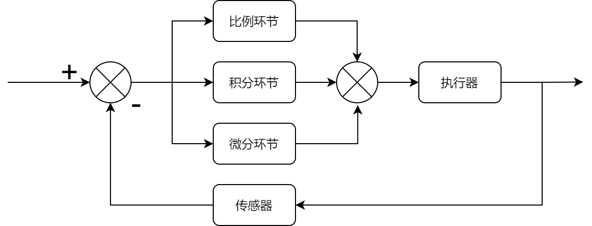

### PID算法原理

&emsp;&emsp;在控制算法当中，`PID`算法是最简单，最能体现反馈思想的控制算法，可谓经典中的经典。先看看`PID`算法的一般形式：<!--more-->



&emsp;&emsp;`PID`的流程简单到了不能再简单的程度，通过误差信号控制被控量，而控制器本身就是`比例`、`积分`、`微分`三个环节的加和。这里我们规定(在`t`时刻)：

- 输入量为`rin(t)`。
- 输出量为`rout(t)`。
- 偏差量为`err(t) = rin(t) - rout(t)`。

&emsp;&emsp;`pid`的控制规律如下：

$$
U(t) = K_{p} \left (err(t) + \frac{1}{T_{I}} \int err(t) dt + T_{D} \frac{derr(t)}{dt} \right )
$$

其中$K_{p}$为比例，$T_{I}$为积分时间，$T_{D}$为微分时间。

### PID算法的离散化

&emsp;&emsp;在这一节中，先继续上一节内容补充说明一下：

1. 通过上一节的框图可以看出，`PID`算法其实是对偏差进行控制。
2. 如果偏差为`0`，则比例环节不起作用。只有存在偏差时，比例环节才起作用。
3. 积分环节主要是用来消除静差。所谓静差，就是系统稳定后输出值和设定值之间的差值。积分环节实际上就是偏差累计的过程，把累计的误差加到原有系统上，以抵消系统造成的静差。
4. 微分信号则反应了偏差信号的变化规律，或者说是变化趋势。根据偏差信号的变化趋势来进行超前调节，从而增加了系统响应的快速性。

&emsp;&emsp;关于`PID`的基本说明就补充到这里，下面将对`PID`连续系统离散化，从而方便在处理器上实现。
&emsp;&emsp;在实现离散前，我们假设系统采样周期为`T`。假设我们检查第`K`个采样周期，很显然系统进行第`K`次采样：

- 偏差为`err(K) = rin(K) - rout(K)`。
- 积分环节用加和的形式表示，即`err(K) + err(K + 1) + ...`。
- 微分环节用斜率的形式表示，即`[err(K) - err(K - 1)]/T`。

从而形成如下`PID`离散表示形式：

$$
U(k) = K_{p} \left (err(k) + \frac{T}{T_{I}} \sum err(k) + \frac{T_{D}}{T}(err(k) - err(k - 1)) \right )
$$

也可以记为：

$$
U(k) = K_{p}err(k) + K_{i} \sum err(k) + K_{d}(err(k) - err(k - 1))
$$

这就是所谓的位置型`PID`算法的离散描述公式。
&emsp;&emsp;我们知道还有一个增量型`PID`算法，那么接下来推导一下增量型`PID`算法的公式。上面的公式描述了第`k`个采样周期的结果，那么前一时刻也就是第`k - 1`个采样周期可以表示为：

$$
U(k - 1) = K_{p} err(k - 1) + K_{i} \sum err(k - 1) + K_{d}(err(k - 1) - err(k - 2))
$$

那么我们再来说第`K`个采样周期的增量，很显然就是`U(k) - U(k - 1)`，于是得到了增量型`PID`算法的表示公式：

$$
\triangle U(k) = K_{p} (err(k) - err(k - 1)) + K_{i} err(k) + K_{d}(err(k) - 2err(k - 1) + err(k - 2))
$$

所以，增量型`PID`的计算公式为$U(k) = U(k - 1) + \triangle U(k)$。

### 位置型PID算法

&emsp;&emsp;这里简单总结一下位置型`PID`实现的伪算法：

``` cpp
previous_error := 0 // 上一次偏差
integral := 0 // 积分和

// 采样周期为dt
loop: // 循环
    // setpoint是设定值
    // measured_value是反馈值
    error := setpoint − measured_value // 计算得到偏差
    integral := integral + error × dt // 计算得到积分累加和
    derivative := (error − previous_error) / dt // 计算得到微分
    output := Kp × error + Ki × integral + Kd × derivative // 计算得到PID输出
    previous_error := error // 保存当前偏差为下一次采样时所需要的历史偏差
    wait(dt) // 等待下一次采样
    goto loop
```

&emsp;&emsp;第一步：定义`PID`变量结构体：

``` cpp
struct _pid {
    float SetSpeed;    // 定义设定值
    float ActualSpeed; // 定义实际值
    float err;         // 定义偏差值
    float err_last;    // 定义上一个偏差值
    float Kp, Ki, Kd;  // 定义比例、积分、微分系数
    float voltage;     // 定义电压值，即控制执行器的变量
    float integral;    // 定义积分值
} pid;
```

&emsp;&emsp;第二步：初始化变量：

``` cpp
void PID_init() {
    printf ( "PID_init begin \n" );
    pid.SetSpeed = 0.0;
    pid.ActualSpeed = 0.0;
    pid.err = 0.0;
    pid.err_last = 0.0;
    pid.voltage = 0.0;
    pid.integral = 0.0;
    pid.Kp = 0.2;
    pid.Ki = 0.015;
    pid.Kd = 0.2;
    printf ( "PID_init end \n" );
}
```

&emsp;&emsp;第三步：编写控制算法：

``` cpp
float PID_realize ( float speed ) {
    pid.SetSpeed = speed;
    pid.err = pid.SetSpeed - pid.ActualSpeed;
    pid.integral += pid.err;
    pid.voltage = pid.Kp * pid.err + pid.Ki * pid.integral + pid.Kd * ( pid.err - pid.err_last );
    pid.err_last = pid.err;
    pid.ActualSpeed = pid.voltage * 1.0;
    return pid.ActualSpeed;
}
```

&emsp;&emsp;下面是测试代码：

``` cpp
int main() {
    printf ( "System begin \n" );
    PID_init();
    int count = 0;

    while ( count < 1000 ) {
        float speed = PID_realize ( 200.0 );
        printf ( "%f\n", speed );
        count++;
    }

    return 0;
}
```

### 增量型PID算法

&emsp;&emsp;代码如下：

``` cpp
#include <stdio.h>
#include <stdlib.h>

struct _pid {
    float SetSpeed;    // 定义设定值
    float ActualSpeed; // 定义实际值
    float err;         // 定义偏差值
    float err_next;    // 定义上一个偏差值
    float err_last;    // 定义最上前的偏差值
    float Kp, Ki, Kd;  // 定义比例、积分、微分系数
} pid;

void PID_init() {
    pid.SetSpeed = 0.0;
    pid.ActualSpeed = 0.0;
    pid.err = 0.0;
    pid.err_last = 0.0;
    pid.err_next = 0.0;
    pid.Kp = 0.2;
    pid.Ki = 0.015;
    pid.Kd = 0.2;
}

float PID_realize ( float speed ) {
    pid.SetSpeed = speed;
    pid.err = pid.SetSpeed - pid.ActualSpeed;
    float incrementSpeed = pid.Kp * ( pid.err - pid.err_next ) + \
                           pid.Ki * pid.err +                    \
                           pid.Kd * ( pid.err - 2 * pid.err_next + pid.err_last );
    pid.ActualSpeed += incrementSpeed;
    pid.err_last = pid.err_next;
    pid.err_next = pid.err;
    return pid.ActualSpeed;
}

int main() {
    PID_init();
    int count = 0;

    while ( count < 1000 ) {
        float speed = PID_realize ( 200.0 );
        printf ( "%f\n", speed );
        count++;
    }

    return 0;
}
```