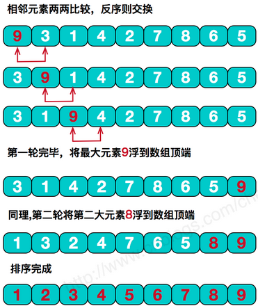

&emsp;&emsp;冒泡排序的原理如下：<!--more-->



``` cpp
void bubble_sort ( int a[], int n ) {
    int i, j, temp;

    for ( j = 0; j < n - 1; j++ ) {
        for ( i = 0; i < n - 1 - j; i++ ) {
            if ( a[i] > a[i + 1] ) {
                temp = a[i];
                a[i] = a[i + 1];
                a[i + 1] = temp;
            }
        }
    }
}
```