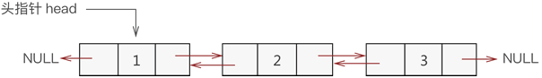
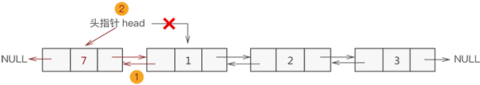
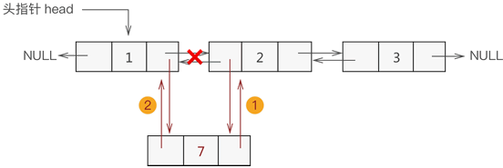
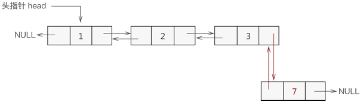
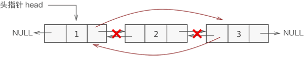

### 基本概念

&emsp;&emsp;`双向链表`的结构如下图所示：<!--more-->



&emsp;&emsp;双向链表的各节点包含以下`3`部分信息：

- **指针域**：用于指向当前节点的直接前驱节点。
- **数据域**：用于存储数据元素。
- **指针域**：用于指向当前节点的直接后继节点。


&emsp;&emsp;双向链表的节点结构如下：

``` cpp
typedef struct line {
    struct line * prior; /* 指向直接前驱 */
    int data;
    struct line * next; /* 指向直接后继 */
} line;
```

### 创建双向链表

&emsp;&emsp;在双向链表中，每创建一个新节点，都要与其前驱节点建立`2`次联系：

- 将新节点的`prior`指针指向直接前驱节点。
- 将直接前驱节点的`next`指针指向新节点。

``` cpp
line * initLine ( line * head ) {
    /* 创建双向链表的第一个结点，即首元节点 */
    head = ( line* ) malloc ( sizeof ( line ) );
    head->prior = NULL;
    head->next = NULL;
    head->data = 1;
    line * list = head;

    for ( int i = 2; i <= 3; i++ ) {
        /* 创建并初始化一个新结点 */
        line * body = ( line* ) malloc ( sizeof ( line ) );
        body->prior = NULL;
        body->next = NULL;
        body->data = i;

        list->next = body; /* 直接前驱结点的next指针指向新结点 */
        body->prior = list; /* 新结点指向直接前驱结点 */
        list = list->next;
    }

    return head;
}
```

### 输出双向链表

&emsp;&emsp;代码如下：

``` cpp
#include <stdio.h>
#include <stdlib.h>

typedef struct line {
    struct line * prior;
    int data;
    struct line * next;
} line;

line * initLine ( line * head );
void display ( line * head );

int main() {
    line * head = NULL;
    head = initLine ( head );
    display ( head );
    printf ( "链表中第4个节点的直接前驱是：%d\r\n", head->next->next->next->prior->data );
    return 0;
}

line * initLine ( line * head ) {
    /* 创建一个首元节点，链表的头指针为head */
    head = ( line* ) malloc ( sizeof ( line ) );
    /* 对节点进行初始化 */
    head->prior = NULL;
    head->next = NULL;
    head->data = 1;
    line * list = head; /* 声明一个指向首元节点的指针，方便后期向链表中添加新创建的节点 */

    for ( int i = 2; i <= 5; i++ ) {
        /* 创建新的节点并初始化 */
        line * body = ( line* ) malloc ( sizeof ( line ) );
        body->prior = NULL;
        body->next = NULL;
        body->data = i;
        /* 新节点与链表最后一个节点建立关系 */
        list->next = body;
        body->prior = list;
        /* list永远指向链表中最后一个节点 */
        list = list->next;
    }

    return head; /* 返回新创建的链表 */
}

void display ( line * head ) {
    line * temp = head;

    while ( temp ) {
        /* 如果该节点无后继节点，说明此节点是链表的最后一个节点 */
        if ( temp->next == NULL ) {
            printf ( "%d\n", temp->data );
        } else {
            printf ( "%d <-> ", temp->data );
        }

        temp = temp->next;
    }
}
```

执行结果：

``` cpp
1 <-> 2 <-> 3 <-> 4 <-> 5
链表中第4个节点的直接前驱是：3
```

### 添加节点

&emsp;&emsp;根据数据添加到双向链表中的位置，可以分为以下`3`种情况：

#### 添加至表头

&emsp;&emsp;假设新元素节点为`temp`，表头节点为`head`，则需要做以下`2`步操作即可：

1. `temp->next = head; head->prior = temp;`。
2. 将`head`移至`temp`，重新指向表头元素。



#### 添加至内部位置

&emsp;&emsp;添加数据到双向链表的内部位置需要经过以下`2`个步骤：

1. 新节点先与其直接后继节点建立联系。
2. 新节点的直接前驱节点与之建立联系。



#### 添加至表尾

&emsp;&emsp;与数据添加到表头的过程类似：

1. 找到双向链表中最后一个节点。
2. 让新节点与最后一个节点建立联系。



&emsp;&emsp;代码如下：

``` cpp
line * insertLine ( line * head, int data, int add ) {
    /* 新建数据域为data的结点 */
    line * temp = ( line* ) malloc ( sizeof ( line ) );
    temp->data = data;
    temp->prior = NULL;
    temp->next = NULL;

    if ( add == 1 ) { /* 插入到链表头，要特殊考虑 */
        temp->next = head;
        head->prior = temp;
        head = temp;
    } else {
        line * body = head;

        /* 找到要插入位置的前一个结点 */
        for ( int i = 1; i < add - 1; i++ ) {
            body = body->next;
        }

        /* 判断条件为真，说明插入位置为链表尾 */
        if ( body->next == NULL ) {
            body->next = temp;
            temp->prior = body;
        } else {
            body->next->prior = temp;
            temp->next = body->next;
            body->next = temp;
            temp->prior = body;
        }
    }

    return head;
}
```

### 删除节点

&emsp;&emsp;遍历双向链表，找到要删除的结点，然后将该节点从链表中删除：



&emsp;&emsp;代码如下：

``` cpp
line * delLine ( line * head, int data ) {
    line * temp = head;

    while ( temp ) { /* 遍历链表 */
        /* 判断当前结点中数据域和data是否相等，若相等，则删除该结点 */
        if ( temp->data == data ) {
            temp->prior->next = temp->next;
            temp->next->prior = temp->prior;
            free ( temp );
            return head;
        }

        temp = temp->next;
    }

    printf ( "链表中无该数据元素\n" );
    return head;
}
```

### 更改节点

&emsp;&emsp;遍历双向链表，找到存储该数据元素的结点，然后更改其数据域：

``` cpp
/* add表示结点在双向链表中的位置，newElem为该节点的新值 */
line * amendElem ( line * p, int add, int newElem ) {
    line * temp = p;

    for ( int i = 1; i < add; i++ ) {
        temp = temp->next;
    }

    temp->data = newElem;
    return p;
}
```