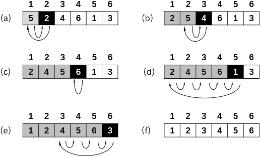

&emsp;&emsp;插入排序的基本原理：将一个数据插入到已经排好序的有序数组中，从而得到一个新的有序数组：<!--more-->



``` cpp
void insert_sort ( int a[], int n ) {
    int i, j;
    int temp;

    for ( i = 1; i < n; i++ ) { /* i表示插入次数，一共进行“n - 1”次插入 */
        temp = a[i]; /* 把待排序元素赋给temp */
        j = i - 1;

        /* while循环的作用是将比当前元素大的元素都往后移动一个位置 */
        while ( ( j >= 0 ) && ( temp < a[j] ) ) {
            a[j + 1] = a[j];
            j--;
        }

        a[j + 1] = temp;
    }
}
```