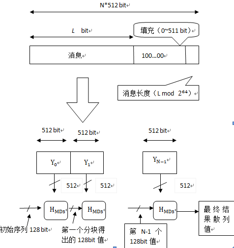

&emsp;&emsp;`Message Digest Algorithm 5`(中文名为消息摘要算法第五版)为计算机安全领域广泛使用的一种散列函数，用以提供消息的完整性保护。该算法的文件号为`RFC 1321`(`R.Rivest，MIT Laboratory for Computer Science and RSA Data Security Inc. April 1992`)。<!--more-->
&emsp;&emsp;`MD5`用于确保信息传输完整一致，是计算机广泛使用的杂凑算法之一(又译摘要算法、哈希算法)，主流编程语言普遍已有`MD5`实现。将数据(如汉字)运算为另一固定长度值，是杂凑算法的基础原理，`MD5`的前身有`MD2`、`MD3`和`MD4`。`MD5`算法具有以下特点：

- 压缩性：任意长度的数据，算出的`MD5`值长度都是固定的。
- 容易计算：从原数据计算出`MD5`值很容易。
- 抗修改性：对原数据进行任何改动，哪怕只修改`1`个字节，所得到的`MD5`值都有很大区别。
- 强抗碰撞：已知原数据和其`MD5`值，想找到一个具有相同`MD5`值的数据(即伪造数据)是非常困难的。

&emsp;&emsp;`MD5`的作用是让大容量信息在用数字签名软件签署私人密钥前被`压缩`成一种保密的格式(就是把一个任意长度的字节串变换成一定长的十六进制数字串)。除了`MD5`以外，其中比较有名的还有`sha-1`、`RIPEMD`以及`Haval`等。

### 发展历史

#### MD2

&emsp;&emsp;`Rivest`在`1989`年开发出`MD2`算法。在这个算法中，首先对信息进行数据补位，使信息的字节长度是`16`的倍数。然后以一个`16`位的检验和追加到信息末尾，并且根据这个新产生的信息计算出散列值。后来`Rogier`和`Chauvaud`发现，如果忽略了检验将和`MD2`产生冲突。`MD2`算法加密后结果是唯一的(即不同信息加密后的结果不同)。

#### MD4

&emsp;&emsp;为了加强算法的安全性，`Rivest`在`1990`年又开发出`MD4`算法。`MD4`算法同样需要填补信息以确保信息的比特位长度减去`448`后能被`512`整除(`信息比特位长度mod 512 = 448`)。然后，一个以`64`位二进制表示的信息的最初长度被添加进来。信息被处理成`512`位迭代结构的区块，而且每个区块要通过三个不同步骤的处理。`Den boer`和`Bosselaers`以及其他人很快的发现了攻击`MD4`版本中第一步和第三步的漏洞。`Dobbertin`向大家演示了如何利用一部普通的个人电脑在几分钟内找到`MD4`完整版本中的冲突(这个冲突实际上是一种漏洞，它将导致对不同的内容进行加密却可能得到相同的加密后结果)。毫无疑问，`MD4`就此被淘汰掉了。
&emsp;&emsp;尽管`MD4`算法在安全上有很大的漏洞，但它对在其后才被开发出来的好几种信息安全加密算法的出现却有着不可忽视的引导作用。

#### MD5

&emsp;&emsp;`1991`年，`Rivest`开发出技术上更为趋近成熟的`MD5`算法。它在`MD4`的基础上增加了`安全-带子`(`safety-belts`)的概念。虽然`MD5`比`MD4`复杂度大一些，但却更为安全。这个算法很明显的由四个和`MD4`设计有少许不同的步骤组成。在`MD5`算法中，`信息-摘要`的大小和填充的必要条件与`MD4`完全相同。`Den boer`和`Bosselaers`曾发现`MD5`算法中的假冲突(`pseudo-collisions`)，但除此之外就没有其他被发现的加密后结果了。

### MD5应用

#### 一致性验证

&emsp;&emsp;`MD5`的典型应用是对一段信息(`Message`)产生信息摘要(`Message-Digest`)，以防止被篡改。比如在`Unix`下有很多软件在下载的时候都有一个文件名相同，文件扩展名为`.md5`的文件，在这个文件中通常只有一行文本，大致结构如`MD5(tanajiya.tar.gz) = 38b8c2c1093dd0fec383a9d9ac940515`。这就是`tanajiya.tar.gz`文件的数字签名。`MD5`将整个文件当作一个大文本信息，通过其不可逆的字符串变换算法，产生了这个唯一的`MD5`信息摘要。为了让读者朋友对`MD5`的应用有个直观的认识，笔者以一个比方和一个实例来简要描述一下其工作过程。
&emsp;&emsp;大家都知道，地球上任何人都有自己独一无二的指纹，这常常成为司法机关鉴别罪犯身份最值得信赖的方法；与之类似，`MD5`就可以为任何文件(不管其大小、格式、数量)产生一个同样独一无二的`数字指纹`，如果任何人对文件做了任何改动，其`MD5`值也就是对应的`数字指纹`都会发生变化。
&emsp;&emsp;我们常常在某些软件下载站点的某软件信息中看到其`MD5`值，它的作用就在于我们可以在下载该软件后，对下载回来的文件用专门的软件(如`Windows MD5 Check`等)做一次`MD5`校验，以确保我们获得的文件与该站点提供的文件为同一文件。具体来说，文件的`MD5`值就像是这个文件的`数字指纹`。每个文件的`MD5`值是不同的，如果任何人对文件做了任何改动，其`MD5`值也就是对应的`数字指纹`就会发生变化。比如下载服务器针对一个文件预先提供一个`MD5`值，用户下载完该文件后，用这个算法重新计算下载文件的`MD5`值，通过比较这两个值是否相同，就能判断下载的文件是否出错，或者说下载的文件是否被篡改了。利用`MD5`算法来进行文件校验的方案被大量应用到软件下载站、论坛数据库、系统文件安全等方面。

#### 数字签名

&emsp;&emsp;`MD5`的典型应用是对一段`Message`(字节串)产生`fingerprint`(指纹)，以防止被`篡改`。举个例子，你将一段话写在一个叫`readme.txt`文件中，并对这个`readme.txt`产生一个`MD5`的值并记录在案，然后你可以传播这个文件给别人。别人如果修改了文件中的任何内容，你对这个文件重新计算`MD5`时就会发现(两个`MD5`值不相同)。如果再有一个第三方的认证机构，用`MD5`还可以防止文件作者的`抵赖`，这就是所谓的数字签名应用。

#### 安全访问认证

&emsp;&emsp;`MD5`还广泛用于操作系统的登陆认证上，如`Unix`、各类`BSD`系统登录密码、数字签名等诸多方面。如在`Unix`系统中用户的密码是以`MD5`(或其它类似的算法)经`Hash`运算后存储在文件系统中。当用户登录的时候，系统把用户输入的密码进行`MD5 Hash`运算，然后再去和保存在文件系统中的`MD5`值进行比较，进而确定输入的密码是否正确。通过这样的步骤，系统在并不知道用户密码的明码的情况下就可以确定用户登录系统的合法性。这可以避免用户的密码被具有系统管理员权限的用户知道。`MD5`将任意长度的`字节串`映射为一个`128 bit`的大整数，并且是通过该`128 bit`反推原始字符串是困难的。换句话说就是，即使你看到源程序和算法描述，也无法将一个`MD5`的值变换回原始的字符串。从数学原理上说，是因为原始的字符串有无穷多个，这有点像不存在反函数的数学函数。所以，要遇到了`md5`密码的问题，比较好的办法是：你可以用这个系统中的`md5`函数重新设一个密码，如`admin`，把生成的一串密码的`Hash`值覆盖原来的`Hash`值就行了。
&emsp;&emsp;正是因为这个原因，现在被黑客使用最多的一种破译密码的方法就是一种被称为`跑字典`的方法。有两种方法得到字典，一种是日常搜集的用做密码的字符串表，另一种是用排列组合方法生成的。先用`MD5`程序计算出这些字典项的`MD5`值，然后再用目标的`MD5`值在这个字典中检索。我们假设密码的最大长度为`8`位字节，同时密码只能是字母和数字，共`26 + 26 + 10 = 62`个字节，排列组合出的字典的项数则是`P(62, 1) + P(62, 2) ... + P(62, 8)`，那也已经是一个很天文的数字了，存储这个字典就需要`TB`级的磁盘阵列，而且这种方法还有一个前提，就是能获得目标账户的密码`MD5`值的情况下才可以。这种加密技术被广泛的应用于`Unix`系统中，这也是为什么`Unix`系统比一般操作系统更为坚固一个重要原因。

### 算法原理

#### 原理

&emsp;&emsp;对`MD5`算法简要的叙述可以为：`MD5`以`512`位分组来处理输入的信息，且每一分组又被划分为`16`个`32`位子分组，经过了一系列的处理后，算法的输出由四个`32`位分组组成，将这四个`32`位分组级联后将生成一个`128`位散列值。总体流程如下图所示，`Yi`表示第`i`个分组，每次的运算都由前一轮的`128`位结果值和第`i`块`512 bit`值进行运算。



#### 填充

&emsp;&emsp;在`MD5`算法中，首先需要对信息进行填充，使其位长对`512`求余的结果等于`448`，并且填充必须进行，即使其位长对`512`求余的结果等于`448`。因此，信息的位长(`Bits Length`)将被扩展至`N * 512 + 448`，`N`为一个非负整数，可以是零。填充的方法如下：

1. 在信息的后面填充一个`1`和无数个`0`，直到满足上面的条件时才停止用`0`对信息的填充。
2. 在这个结果后面附加一个以`64`位二进制表示的填充前信息长度(单位为`Bit`)，如果二进制表示的填充前信息长度超过`64`位，则取低`64`位。

&emsp;&emsp;经过这两步的处理，信息的位长等于`N * 512 + 448 + 64 = (N + 1) * 512`，即长度恰好是`512`的整数倍。这样做的原因是为满足后面处理中对信息长度的要求。

#### 初始化变量

&emsp;&emsp;初始的`128`位值为初试链接变量，这些参数用于第一轮的运算，以大端字节序来表示，它们分别为：

``` cpp
A = 0x01234567，
B = 0x89ABCDEF，
C = 0xFEDCBA98，
D = 0x76543210
```

每一个变量给出的数值是高字节存于内存低地址，低字节存于内存高地址，即大端字节序。在程序中变量`A`、`B`、`C`、`D`的值分别为`0x67452301`、`0xEFCDAB89`、`0x98BADCFE`和`0x10325476`。

#### 处理分组数据

&emsp;&emsp;每一分组的算法流程如下：第一分组需要将上面四个链接变量复制到另外四个变量中：`A`到`a`，`B`到`b`，`C`到`c`，`D`到`d`。从第二分组开始的变量为上一分组的运算结果，即`A = a`、`B = b`、`C = c`和`D = d`。主循环有四轮(`MD4`只有三轮)，每轮循环都很相似。第一轮进行`16`次操作。每次操作对`a`、`b`、`c`和`d`中的其中三个作一次非线性函数运算，然后将所得结果加上第四个变量，文本的一个子分组和一个常数。再将所得结果向左环移一个不定的数，并加上`a`、`b`、`c`或`d`中之一。最后用该结果取代`a`、`b`、`c`或`d`中之一。以下是每次操作中用到的四个非线性函数(每轮一个)。

``` cpp
F ( X, Y, Z ) = ( X & Y ) | ( ( ~X ) & Z );
G ( X, Y, Z ) = ( X & Z ) | ( Y & ( ~Z ) );
H ( X, Y, Z ) = X ^ Y ^ Z;
I ( X, Y, Z ) = Y ^ ( X | ( ~Z ) );
```

其中，`&`是`And`，`|`是`Or`，`~`是`Not`，`^`是`Xor`。这四个函数的说明：如果`X`、`Y`和`Z`的对应位是独立和均匀的，那么结果的每一位也应是独立和均匀的。`F`是一个逐位运算的函数，即如果`X`，那么`Y`，否则`Z`。函数`H`是逐位奇偶操作符。
&emsp;&emsp;假设`Mj`表示消息的第`j`个子分组(从`0`到`15`)，常数`ti`是`4294967296 * abs(sin(i))`的整数部分，`i`取值从`1`到`64`，单位是弧度(`4294967296 = 232`)。现在定义：

- `FF ( a, b, c, d, Mj, s, ti )`操作为`a = b + ( ( a + F ( b, c, d ) + Mj + ti ) << s );`。
- `GG ( a, b, c, d, Mj, s, ti )`操作为`a = b + ( ( a + G ( b, c, d ) + Mj + ti ) << s );`。
- `HH ( a, b, c, d, Mj, s, ti )`操作为`a = b + ( ( a + H ( b, c, d ) + Mj + ti ) << s );`。
- `II ( a, b, c, d, Mj, s, ti )`操作为`a = b + ( ( a + I ( b, c, d ) + Mj + ti ) << s );`。

注意，`<<`表示循环左移位，不是左移位。这四轮(共`64`步)是：
&emsp;&emsp;第一轮：

``` cpp
FF ( a, b, c, d, M0,  7,  0xd76aa478 )
FF ( d, a, b, c, M1,  12, 0xe8c7b756 )
FF ( c, d, a, b, M2,  17, 0x242070db )
FF ( b, c, d, a, M3,  22, 0xc1bdceee )
FF ( a, b, c, d, M4,  7,  0xf57c0faf )
FF ( d, a, b, c, M5,  12, 0x4787c62a )
FF ( c, d, a, b, M6,  17, 0xa8304613 )
FF ( b, c, d, a, M7,  22, 0xfd469501 )
FF ( a, b, c, d, M8,  7,  0x698098d8 )
FF ( d, a, b, c, M9,  12, 0x8b44f7af )
FF ( c, d, a, b, M10, 17, 0xffff5bb1 )
FF ( b, c, d, a, M11, 22, 0x895cd7be )
FF ( a, b, c, d, M12, 7,  0x6b901122 )
FF ( d, a, b, c, M13, 12, 0xfd987193 )
FF ( c, d, a, b, M14, 17, 0xa679438e )
FF ( b, c, d, a, M15, 22, 0x49b40821 )
```

&emsp;&emsp;第二轮：

``` cpp
GG ( a, b, c, d, M1,  5,  0xf61e2562 )
GG ( d, a, b, c, M6,  9,  0xc040b340 )
GG ( c, d, a, b, M11, 14, 0x265e5a51 )
GG ( b, c, d, a, M0,  20, 0xe9b6c7aa )
GG ( a, b, c, d, M5,  5,  0xd62f105d )
GG ( d, a, b, c, M10, 9,  0x02441453 )
GG ( c, d, a, b, M15, 14, 0xd8a1e681 )
GG ( b, c, d, a, M4,  20, 0xe7d3fbc8 )
GG ( a, b, c, d, M9,  5,  0x21e1cde6 )
GG ( d, a, b, c, M14, 9,  0xc33707d6 )
GG ( c, d, a, b, M3,  14, 0xf4d50d87 )
GG ( b, c, d, a, M8,  20, 0x455a14ed )
GG ( a, b, c, d, M13, 5,  0xa9e3e905 )
GG ( d, a, b, c, M2,  9,  0xfcefa3f8 )
GG ( c, d, a, b, M7,  14, 0x676f02d9 )
GG ( b, c, d, a, M12, 20, 0x8d2a4c8a )
```

&emsp;&emsp;第三轮：

``` cpp
HH ( a, b, c, d, M5,  4,  0xfffa3942 )
HH ( d, a, b, c, M8,  11, 0x8771f681 )
HH ( c, d, a, b, M11, 16, 0x6d9d6122 )
HH ( b, c, d, a, M14, 23, 0xfde5380c )
HH ( a, b, c, d, M1,  4,  0xa4beea44 )
HH ( d, a, b, c, M4,  11, 0x4bdecfa9 )
HH ( c, d, a, b, M7,  16, 0xf6bb4b60 )
HH ( b, c, d, a, M10, 23, 0xbebfbc70 )
HH ( a, b, c, d, M13, 4,  0x289b7ec6 )
HH ( d, a, b, c, M0,  11, 0xeaa127fa )
HH ( c, d, a, b, M3,  16, 0xd4ef3085 )
HH ( b, c, d, a, M6,  23, 0x04881d05 )
HH ( a, b, c, d, M9,  4,  0xd9d4d039 )
HH ( d, a, b, c, M12, 11, 0xe6db99e5 )
HH ( c, d, a, b, M15, 16, 0x1fa27cf8 )
HH ( b, c, d, a, M2,  23, 0xc4ac5665 )
```

&emsp;&emsp;第四轮：

``` cpp
II ( a, b, c, d, M0,  6,  0xf4292244 )
II ( d, a, b, c, M7,  10, 0x432aff97 )
II ( c, d, a, b, M14, 15, 0xab9423a7 )
II ( b, c, d, a, M5,  21, 0xfc93a039 )
II ( a, b, c, d, M12, 6,  0x655b59c3 )
II ( d, a, b, c, M3,  10, 0x8f0ccc92 )
II ( c, d, a, b, M10, 15, 0xffeff47d )
II ( b, c, d, a, M1,  21, 0x85845dd1 )
II ( a, b, c, d, M8,  6,  0x6fa87e4f )
II ( d, a, b, c, M15, 10, 0xfe2ce6e0 )
II ( c, d, a, b, M6,  15, 0xa3014314 )
II ( b, c, d, a, M13, 21, 0x4e0811a1 )
II ( a, b, c, d, M4,  6,  0xf7537e82 )
II ( d, a, b, c, M11, 10, 0xbd3af235 )
II ( c, d, a, b, M2,  15, 0x2ad7d2bb )
II ( b, c, d, a, M9,  21, 0xeb86d391 )
```

所有这些完成之后，将`a`、`b`、`c`、`d`分别在原来基础上再加上`A`、`B`、`C`、`D`：

``` cpp
a = a + A
b = b + B
c = c + C
d = d + D
```

然后用下一分组数据继续运行以上算法。

#### 输出

&emsp;&emsp;最后的输出是`a`、`b`、`c`和`d`的级联。当按照上面所说的方法实现`MD5`算法以后，你可以用以下几个信息对你做出来的程序作一个简单的测试，看看程序有没有错误。

- `MD5 ( "" ) = d41d8cd98f00b204e9800998ecf8427e`
- `MD5 ( "a" ) = 0cc175b9c0f1b6a831c399e269772661`
- `MD5 ( "abc" ) = 900150983cd24fb0d6963f7d28e17f72`
- `MD5 ( "message digest" ) = f96b697d7cb7938d525a2f31aaf161d0`
- `MD5 ( "abcdefghijklmnopqrstuvwxyz" ) = c3fcd3d76192e4007dfb496cca67e13b`
- `MD5 ( "ABCDEFGHIJKLMNOPQRSTUVWXYZabcdefghijklmnopqrstuvwxyz" ) = f29939a25efabaef3b87e2cbfe641315`
- `MD5 ( "8a683566bcc7801226b3d8b0cf35fd97" ) = cf2cb5c89c5e5eeebef4a76becddfcfd`

### MD5加密字符串实例

&emsp;&emsp;现以字符串`jklmn`为例。该字符串在内存中表示为`6A 6B 6C 6D 6E`(从左到右为低地址到高地址，后同)，信息长度为`40 bits`，即`0x28`。
&emsp;&emsp;对其填充，填充至`448`位，即`56`字节。结果为：

``` cpp
6A 6B 6C 6D 6E 80 00 00
00 00 00 00 00 00 00 00
00 00 00 00 00 00 00 00
00 00 00 00 00 00 00 00
00 00 00 00 00 00 00 00
00 00 00 00 00 00 00 00
00 00 00 00 00 00 00 00
```

剩下`64`位，即`8`字节填充填充前信息位长，按小端字节序填充剩下的`8`字节，结果为(`64`字节，`512 bits`)：

``` cpp
6A 6B 6C 6D 6E 80 00 00
00 00 00 00 00 00 00 00
00 00 00 00 00 00 00 00
00 00 00 00 00 00 00 00
00 00 00 00 00 00 00 00
00 00 00 00 00 00 00 00
00 00 00 00 00 00 00 00
28 00 00 00 00 00 00 00
```

&emsp;&emsp;初始化`A`、`B`、`C`、`D`四个变量。将这`64`字节填充后数据分成`16`个小组(程序中对应为`16`个数组)，即：

``` cpp
M0：6A 6B 6C 6D(这是内存中的顺序，按照小端字节序原则，对应数组M(0)的值为0x6D6C6B6A，下同)
M1：6E 80 00 00
M2：00 00 00 00
.....
M14：28 00 00 00
M15：00 00 00 00
```

经过`分组数据处理`后，`a`、`b`、`c`、`d`值分别为`0xD8523F60`、`0x837E0144`、`0x517726CA`、`0x1BB6E5FE`。在内存中为：

``` cpp
a：60 3F 52 D8
b：44 01 7E 83
c：CA 26 77 51
d：FE E5 B6 1B
```

`a`、`b`、`c`、`d`按内存顺序输出即为最终结果：`603F52D844017E83CA267751FEE5B61B`。这就是字符串`jklmn`的`MD5`值。

### MD5加密代码的C语言实现

&emsp;&emsp;`md5.h`如下：

``` cpp
#ifndef MD5_H
#define MD5_H
​
typedef struct {
    unsigned int count[2];
    unsigned int state[4];
    unsigned char buffer[64];
} MD5_CTX;
​
#define F(x,y,z) ((x & y) | (~x & z))
#define G(x,y,z) ((x & z) | (y & ~z))
#define H(x,y,z) (x^y^z)
#define I(x,y,z) (y ^ (x | ~z))
#define ROTATE_LEFT(x,n) ((x << n) | (x >> (32-n)))
​
#define FF(a,b,c,d,x,s,ac) \
    { \
        a += F(b,c,d) + x + ac; \
        a = ROTATE_LEFT(a,s); \
        a += b; \
    }
​
#define GG(a,b,c,d,x,s,ac) \
    { \
        a += G(b,c,d) + x + ac; \
        a = ROTATE_LEFT(a,s); \
        a += b; \
    }
​
#define HH(a,b,c,d,x,s,ac) \
    { \
        a += H(b,c,d) + x + ac; \
        a = ROTATE_LEFT(a,s); \
        a += b; \
    }
​
#define II(a,b,c,d,x,s,ac) \
    { \
        a += I(b,c,d) + x + ac; \
        a = ROTATE_LEFT(a,s); \
        a += b; \
    }
​
void MD5Init ( MD5_CTX *context );
void MD5Update ( MD5_CTX *context, unsigned char *input, unsigned int inputlen );
void MD5Final ( MD5_CTX *context, unsigned char digest[16] );
void MD5Transform ( unsigned int state[4], unsigned char block[64] );
void MD5Encode ( unsigned char *output, unsigned int *input, unsigned int len );
void MD5Decode ( unsigned int *output, unsigned char *input, unsigned int len );
​
#endif
```

&emsp;&emsp;`md5.c`如下：

``` cpp
#include <memory.h>
#include "md5.h"
​
unsigned char PADDING[] = {
    0x80, 0, 0, 0, 0, 0, 0, 0, 0, 0, 0, 0, 0, 0, 0, 0,
       0, 0, 0, 0, 0, 0, 0, 0, 0, 0, 0, 0, 0, 0, 0, 0,
       0, 0, 0, 0, 0, 0, 0, 0, 0, 0, 0, 0, 0, 0, 0, 0,
       0, 0, 0, 0, 0, 0, 0, 0, 0, 0, 0, 0, 0, 0, 0, 0};
​
void MD5Init ( MD5_CTX *context ) {
    context->count[0] = 0;
    context->count[1] = 0;
    context->state[0] = 0x67452301;
    context->state[1] = 0xEFCDAB89;
    context->state[2] = 0x98BADCFE;
    context->state[3] = 0x10325476;
}
​
void MD5Update ( MD5_CTX *context, unsigned char *input, unsigned int inputlen ) {
    unsigned int i = 0, index = 0, partlen = 0;
    index = ( context->count[0] >> 3 ) & 0x3F;
    partlen = 64 - index;
    context->count[0] += inputlen << 3;
​
    if ( context->count[0] < ( inputlen << 3 ) ) {
        context->count[1]++;
    }
​
    context->count[1] += inputlen >> 29;
​
    if ( inputlen >= partlen ) {
        memcpy ( &context->buffer[index], input, partlen );
        MD5Transform ( context->state, context->buffer );
​
        for ( i = partlen; i + 64 <= inputlen; i += 64 ) {
            MD5Transform ( context->state, &input[i] );
        }
​
        index = 0;
    } else {
        i = 0;
    }
​
    memcpy ( &context->buffer[index], &input[i], inputlen - i );
}
​
void MD5Final ( MD5_CTX *context, unsigned char digest[16] ) {
    unsigned int index = 0, padlen = 0;
    unsigned char bits[8];
    index = ( context->count[0] >> 3 ) & 0x3F;
    padlen = ( index < 56 ) ? ( 56 - index ) : ( 120 - index );
    MD5Encode ( bits, context->count, 8 );
    MD5Update ( context, PADDING, padlen );
    MD5Update ( context, bits, 8 );
    MD5Encode ( digest, context->state, 16 );
}
​
void MD5Encode ( unsigned char *output, unsigned int *input, unsigned int len ) {
    unsigned int i = 0, j = 0;
​
    while ( j < len ) {
        output[j] = input[i] & 0xFF;
        output[j + 1] = ( input[i] >> 8 ) & 0xFF;
        output[j + 2] = ( input[i] >> 16 ) & 0xFF;
        output[j + 3] = ( input[i] >> 24 ) & 0xFF;
        i++;
        j += 4;
    }
}
​
void MD5Decode ( unsigned int *output, unsigned char *input, unsigned int len ) {
    unsigned int i = 0, j = 0;
​
    while ( j < len ) {
        output[i] = ( input[j] ) | ( input[j + 1] << 8 ) | ( input[j + 2] << 16 ) | ( input[j + 3] << 24 );
        i++;
        j += 4;
    }
}
​
void MD5Transform ( unsigned int state[4], unsigned char block[64] ) {
    unsigned int a = state[0];
    unsigned int b = state[1];
    unsigned int c = state[2];
    unsigned int d = state[3];
    unsigned int x[64];
    MD5Decode ( x, block, 64 );
    FF ( a, b, c, d, x[ 0], 7, 0xd76aa478 );  /* 1  */
    FF ( d, a, b, c, x[ 1], 12, 0xe8c7b756 ); /* 2  */
    FF ( c, d, a, b, x[ 2], 17, 0x242070db ); /* 3  */
    FF ( b, c, d, a, x[ 3], 22, 0xc1bdceee ); /* 4  */
    FF ( a, b, c, d, x[ 4], 7, 0xf57c0faf );  /* 5  */
    FF ( d, a, b, c, x[ 5], 12, 0x4787c62a ); /* 6  */
    FF ( c, d, a, b, x[ 6], 17, 0xa8304613 ); /* 7  */
    FF ( b, c, d, a, x[ 7], 22, 0xfd469501 ); /* 8  */
    FF ( a, b, c, d, x[ 8], 7, 0x698098d8 );  /* 9  */
    FF ( d, a, b, c, x[ 9], 12, 0x8b44f7af ); /* 10 */
    FF ( c, d, a, b, x[10], 17, 0xffff5bb1 ); /* 11 */
    FF ( b, c, d, a, x[11], 22, 0x895cd7be ); /* 12 */
    FF ( a, b, c, d, x[12], 7, 0x6b901122 );  /* 13 */
    FF ( d, a, b, c, x[13], 12, 0xfd987193 ); /* 14 */
    FF ( c, d, a, b, x[14], 17, 0xa679438e ); /* 15 */
    FF ( b, c, d, a, x[15], 22, 0x49b40821 ); /* 16 */
    /* Round 2 */
    GG ( a, b, c, d, x[ 1], 5, 0xf61e2562 );  /* 17 */
    GG ( d, a, b, c, x[ 6], 9, 0xc040b340 );  /* 18 */
    GG ( c, d, a, b, x[11], 14, 0x265e5a51 ); /* 19 */
    GG ( b, c, d, a, x[ 0], 20, 0xe9b6c7aa ); /* 20 */
    GG ( a, b, c, d, x[ 5], 5, 0xd62f105d );  /* 21 */
    GG ( d, a, b, c, x[10], 9,  0x2441453 );  /* 22 */
    GG ( c, d, a, b, x[15], 14, 0xd8a1e681 ); /* 23 */
    GG ( b, c, d, a, x[ 4], 20, 0xe7d3fbc8 ); /* 24 */
    GG ( a, b, c, d, x[ 9], 5, 0x21e1cde6 );  /* 25 */
    GG ( d, a, b, c, x[14], 9, 0xc33707d6 );  /* 26 */
    GG ( c, d, a, b, x[ 3], 14, 0xf4d50d87 ); /* 27 */
    GG ( b, c, d, a, x[ 8], 20, 0x455a14ed ); /* 28 */
    GG ( a, b, c, d, x[13], 5, 0xa9e3e905 );  /* 29 */
    GG ( d, a, b, c, x[ 2], 9, 0xfcefa3f8 );  /* 30 */
    GG ( c, d, a, b, x[ 7], 14, 0x676f02d9 ); /* 31 */
    GG ( b, c, d, a, x[12], 20, 0x8d2a4c8a ); /* 32 */
    /* Round 3 */
    HH ( a, b, c, d, x[ 5], 4, 0xfffa3942 );  /* 33 */
    HH ( d, a, b, c, x[ 8], 11, 0x8771f681 ); /* 34 */
    HH ( c, d, a, b, x[11], 16, 0x6d9d6122 ); /* 35 */
    HH ( b, c, d, a, x[14], 23, 0xfde5380c ); /* 36 */
    HH ( a, b, c, d, x[ 1], 4, 0xa4beea44 );  /* 37 */
    HH ( d, a, b, c, x[ 4], 11, 0x4bdecfa9 ); /* 38 */
    HH ( c, d, a, b, x[ 7], 16, 0xf6bb4b60 ); /* 39 */
    HH ( b, c, d, a, x[10], 23, 0xbebfbc70 ); /* 40 */
    HH ( a, b, c, d, x[13], 4, 0x289b7ec6 );  /* 41 */
    HH ( d, a, b, c, x[ 0], 11, 0xeaa127fa ); /* 42 */
    HH ( c, d, a, b, x[ 3], 16, 0xd4ef3085 ); /* 43 */
    HH ( b, c, d, a, x[ 6], 23,  0x4881d05 ); /* 44 */
    HH ( a, b, c, d, x[ 9], 4, 0xd9d4d039 );  /* 45 */
    HH ( d, a, b, c, x[12], 11, 0xe6db99e5 ); /* 46 */
    HH ( c, d, a, b, x[15], 16, 0x1fa27cf8 ); /* 47 */
    HH ( b, c, d, a, x[ 2], 23, 0xc4ac5665 ); /* 48 */
    /* Round 4 */
    II ( a, b, c, d, x[ 0], 6, 0xf4292244 );  /* 49 */
    II ( d, a, b, c, x[ 7], 10, 0x432aff97 ); /* 50 */
    II ( c, d, a, b, x[14], 15, 0xab9423a7 ); /* 51 */
    II ( b, c, d, a, x[ 5], 21, 0xfc93a039 ); /* 52 */
    II ( a, b, c, d, x[12], 6, 0x655b59c3 );  /* 53 */
    II ( d, a, b, c, x[ 3], 10, 0x8f0ccc92 ); /* 54 */
    II ( c, d, a, b, x[10], 15, 0xffeff47d ); /* 55 */
    II ( b, c, d, a, x[ 1], 21, 0x85845dd1 ); /* 56 */
    II ( a, b, c, d, x[ 8], 6, 0x6fa87e4f );  /* 57 */
    II ( d, a, b, c, x[15], 10, 0xfe2ce6e0 ); /* 58 */
    II ( c, d, a, b, x[ 6], 15, 0xa3014314 ); /* 59 */
    II ( b, c, d, a, x[13], 21, 0x4e0811a1 ); /* 60 */
    II ( a, b, c, d, x[ 4], 6, 0xf7537e82 );  /* 61 */
    II ( d, a, b, c, x[11], 10, 0xbd3af235 ); /* 62 */
    II ( c, d, a, b, x[ 2], 15, 0x2ad7d2bb ); /* 63 */
    II ( b, c, d, a, x[ 9], 21, 0xeb86d391 ); /* 64 */
    state[0] += a;
    state[1] += b;
    state[2] += c;
    state[3] += d;
}
```

&emsp;&emsp;`main.c`如下：

``` cpp
#include <stdio.h>
#include <stdlib.h>
#include <string.h>
#include "md5.h"
​
int main ( int argc, char *argv[] ) {
    MD5_CTX md5;
    MD5Init ( &md5 );
    int i;
    unsigned char encrypt[] = "admin"; /* 21232f297a57a5a743894a0e4a801fc3 */
    unsigned char decrypt[16];
    MD5Update ( &md5, encrypt, strlen ( ( char * ) encrypt ) );
    MD5Final ( &md5, decrypt );
    printf ( "加密前: %s\n加密后: ", encrypt );
​
    for ( i = 0; i < 16; i++ ) {
        printf ( "%02x", decrypt[i] );
    }
​
    getchar();
    return 0;
}
```

### MD5加密常用字符

- `7a57a5a743894a0e`：`admin`(`16`位`MD5`小写加密)
- `972130B75066C825`：`ADMIN`(`16`位`MD5`大写加密)
- `21232f297a57a5a743894a0e4a801fc3`：`admin`(`32`位`MD5`小写加密)
- `73ACD9A5972130B75066C82595A1FAE3`：`ADMIN`(`32`位`MD5`大写加密)
- `49ba59abbe56e057`：`123456`(`16`位`MD5`小写加密)
- `e10adc3949ba59abbe56e057f20f883e`：`123456`(`32`位`MD5`小写加密)
- `469e80d32c0559f8`：`admin888`(`16`位`MD5`小写加密)
- `2299413865C28A35`：`ADMIN888`(`16`位`MD5`大写加密)
- `7fef6171469e80d32c0559f88b377245`：`admin888`(`32`位`MD5`小写加密)
- `A1F63A962299413865C28A3593D359B0`：`ADMIN888`(`32`位`MD5`大写加密)

&emsp;&emsp;**补充说明**：

1. `MD5`加密算法是不可逆的算法，即没有解密算法，因此非常安全。
2. `MD5`加密算法存在碰撞冲突的风险，这是被山东大学王小云教授发现的。