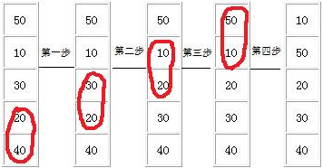

&emsp;&emsp;冒泡排序(`Bubble Sort`)是一种计算机科学领域的较简单的排序算法。它重复地走访过要排序的数列，一次比较两个元素，如果他们的顺序错误就把他们交换过来。走访数列的工作是重复地进行，直到没有再需要交换，也就是说该数列已经排序完成。这个算法的名字由来是因为越大的元素会经由交换慢慢`浮`到数列的顶端。当排序对象基本有序时，冒泡排序的效率较高。
&emsp;&emsp;冒泡排序算法的运作如下(从后往前)：

1. 比较相邻的元素，如果第一个比第二个大，就交换他们两个。
2. 对每一对相邻元素作同样的工作，从开始第一对到结尾的最后一对。在这一点，最后的元素应该会是最大的数。
3. 针对所有的元素重复以上的步骤，除了最后一个。
4. 持续每次对越来越少的元素重复上面的步骤，直到没有任何一对数字需要比较。



``` cpp
#include <stdio.h>
​
#define SIZE 8
​
void bubble_sort ( int a[], int n );
​
void bubble_sort ( int a[], int n ) {
    int i, j, temp;
​
    for ( j = 0; j < n - 1; j++ )
        for ( i = 0; i < n - 1 - j; i++ ) {
            if ( a[i] > a[i + 1] ) {
                temp = a[i];
                a[i] = a[i + 1];
                a[i + 1] = temp;
            }
        }
}
​
int main() {
    int number[SIZE] = {95, 45, 15, 78, 84, 51, 24, 12};
    int i;
    bubble_sort ( number, SIZE );
​
    for ( i = 0; i < SIZE; i++ ) {
        printf ( "%d ", number[i] );
    }
​
    return 0;
}
```

&emsp;&emsp;`python`代码如下：

``` python
def bubbleSort(myList):
    length = len(myList)
​
    for i in range(0, length - 1):
        for j in range(0, length - 1 - i):
            if myList[j] > myList[j + 1]:
                tmp = myList[j]
                myList[j] = myList[j + 1]
                myList[j + 1] = tmp
​
        for item in myList:  # 打印每一轮交换后的列表
            print(item, end=" ")
        print(end="\n")  # 换行
​
print("Bubble Sort:")
myList = [1, 4, 5, 0, 6]
bubbleSort(myList)
```