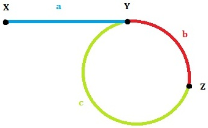

&emsp;&emsp;使用快慢指针判断的好处是：可以防止链表出现类似于`6`的形状。也就是说尾指针不是直接连到头指针，而是它之后的指针，那么这种情况下传统的以头指针作为基准判断是否有循环的方法就可能陷入死循环。



&emsp;&emsp;让快指针每次移动两次，而慢指针每次移动一次。如果快指针追赶上慢指针，则为循环链表，否则不是循环链表；如果快指针或者慢指针指向`NULL`，则不是循环链表：

``` cpp
让快慢两个指针从链表的头元素出发开始遍历
无限循环
    如果快指针遇到了NULL指针
        返回，该链表以NULL结束，是一个非循环链表
    如果快指针追上或者超过了慢指针
        返回，该链表是一个循环链表
    让慢指针前进一个结点
    让快指针前进两个结点
```

代码如下：

``` cpp
int determineTermination ( node *head ) {
    node *fast, *slow;
    fast = slow = head;
​
    while ( 1 ) {
        if ( !fast || !fast->next ) {
            return 0;
        } else if ( fast == slow || fast->next == slow ) {
            return 1;
        } else {
            slow = slow->next;
            fast = fast->next->next;
        }
    }
}
```