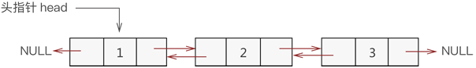
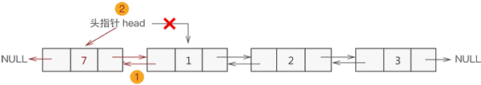
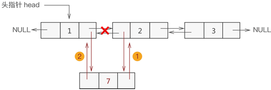
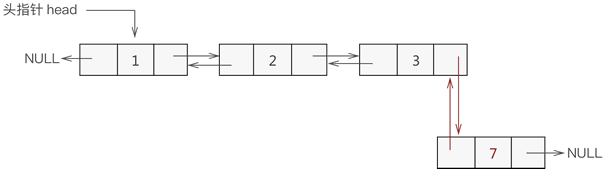
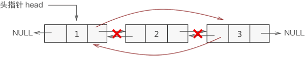

### 双向链表的概念

&emsp;&emsp;如果算法中需要大量地找某指定结点的前趋结点，使用单链表无疑是灾难性的，因为单链表更适合`从前往后`找，而`从后往前`找并不是它的强项。<!--more-->
&emsp;&emsp;为了能够高效率解决类似的问题，我们需要使用`双向链表`，如下图所示：



&emsp;&emsp;双向链表中各节点包含以下`3`部分信息：

- **指针域**：用于指向当前节点的直接前驱节点。
- **数据域**：用于存储数据元素。
- **指针域**：用于指向当前节点的直接后继节点。


因此，双向链表的节点结构用`C`语言实现为：

``` cpp
typedef struct line {
    struct line * prior; /* 指向直接前趋 */
    int data;
    struct line * next; /* 指向直接后继 */
} line;
```

### 双向链表的创建

&emsp;&emsp;同单链表相比，双向链表仅是各节点多了一个用于指向直接前驱的指针域。因此，我们可以在单链表的基础上轻松实现对双向链表的创建。
&emsp;&emsp;需要注意的是，与单链表不同，双向链表创建过程中，每创建一个新节点，都要与其前驱节点建立两次联系，分别是：

- 将新节点的`prior`指针指向直接前驱节点。
- 将直接前驱节点的`next`指针指向新节点。

这里给出创建双向链表的`C`语言实现代码：

``` cpp
line * initLine ( line * head ) {
    /* 创建链表第一个结点(首元结点) */
    head = ( line* ) malloc ( sizeof ( line ) );
    head->prior = NULL;
    head->next = NULL;
    head->data = 1;
    line * list = head;

    for ( int i = 2; i <= 3; i++ ) {
        /* 创建并初始化一个新结点 */
        line * body = ( line* ) malloc ( sizeof ( line ) );
        body->prior = NULL;
        body->next = NULL;
        body->data = i;

        list->next = body; /* 直接前趋结点的next指针指向新结点 */
        body->prior = list; /* 新结点指向直接前趋结点 */
        list = list->next;
    }

    return head;
}
```

我们可以尝试着在`main`函数中输出创建的双向链表，`C`语言代码如下：

``` cpp
#include <stdio.h>
#include <stdlib.h>

typedef struct line { /* 节点结构 */
    struct line * prior;
    int data;
    struct line * next;
} line;

line * initLine ( line * head ); /* 双向链表的创建函数 */
void display ( line * head ); /* 输出双向链表的函数 */

int main() {
    line * head = NULL; /* 创建一个头指针 */
    head = initLine ( head ); /* 调用链表创建函数 */
    display ( head ); /* 输出创建好的链表 */
    printf ( "链表中第4个节点的直接前驱是：%d\r\n", head->next->next->next->prior->data );
    return 0;
}

line * initLine ( line * head ) {
    /* 创建一个首元节点，链表的头指针为head */
    head = ( line* ) malloc ( sizeof ( line ) );
    /* 对节点进行初始化 */
    head->prior = NULL;
    head->next = NULL;
    head->data = 1;
    /* 声明一个指向首元节点的指针，方便后期向链表中添加新创建的节点 */
    line * list = head;

    for ( int i = 2; i <= 5; i++ ) {
        /* 创建新的节点并初始化 */
        line * body = ( line* ) malloc ( sizeof ( line ) );
        body->prior = NULL;
        body->next = NULL;
        body->data = i;
        /* 新节点与链表最后一个节点建立关系 */
        list->next = body;
        body->prior = list;
        /* list永远指向链表中最后一个节点 */
        list = list->next;
    }

    return head; /* 返回新创建的链表 */
}

void display ( line * head ) {
    line * temp = head;

    while ( temp ) {
        /* 如果该节点无后继节点，说明此节点是链表的最后一个节点 */
        if ( temp->next == NULL ) {
            printf ( "%d\n", temp->data );
        } else {
            printf ( "%d <-> ", temp->data );
        }

        temp = temp->next;
    }
}
```

执行结果：

``` cpp
1 <-> 2 <-> 3 <-> 4 <-> 5
链表中第4个节点的直接前驱是：3
```

### 双向链表添加节点

&emsp;&emsp;根据数据添加到双向链表中的位置不同，可细分为以下`3`种情况：

#### 添加至表头

&emsp;&emsp;将新数据元素添加到表头，只需要将该元素与表头元素建立双层逻辑关系即可。
&emsp;&emsp;换句话说，假设新元素节点为`temp`，表头节点为`head`，则需要做以下`2`步操作即可：

1. `temp->next = head; head->prior = temp;`。
2. 将`head`移至`temp`，重新指向新的表头。

例如，将新元素`7`添加至双向链表的表头，实现过程如下图所示：



#### 添加至表的中间位置

&emsp;&emsp;同单链表添加数据类似，双向链表中间位置添加数据需要经过以下`2`个步骤，如下图所示：

1. 新节点先与其直接后继节点建立双层逻辑关系。
2. 新节点的直接前驱节点与之建立双层逻辑关系。



#### 添加至表尾

&emsp;&emsp;与添加到表头的过程类似，实现过程如下图所示：

1. 找到双向链表中最后一个节点。
2. 让新节点与最后一个节点进行双层逻辑关系。



因此，我们可以试着编写双向链表添加数据的`C`语言代码：

``` cpp
line * insertLine ( line * head, int data, int add ) {
    /* 新建数据域为data的结点 */
    line * temp = ( line* ) malloc ( sizeof ( line ) );
    temp->data = data;
    temp->prior = NULL;
    temp->next = NULL;

    if ( add == 1 ) { /* 插入到链表头，要特殊考虑 */
        temp->next = head;
        head->prior = temp;
        head = temp;
    } else {
        line * body = head;

        /* 找到要插入位置的前一个结点 */
        for ( int i = 1; i < add - 1; i++ ) {
            body = body->next;
        }

        /* 判断条件为真，说明插入位置为链表尾 */
        if ( body->next == NULL ) {
            body->next = temp;
            temp->prior = body;
        } else {
            body->next->prior = temp;
            temp->next = body->next;
            body->next = temp;
            temp->prior = body;
        }
    }

    return head;
}
```

### 双向链表删除节点

&emsp;&emsp;双向链表删除结点时，只需遍历链表找到要删除的结点，然后将该节点从表中摘除即可。
&emsp;&emsp;例如，删除元素`2`的操作过程如下图所示：



&emsp;&emsp;双向链表删除节点的`C`语言实现代码如下：

``` cpp
/* 删除结点的函数，data为要删除结点的数据域的值 */
line * delLine ( line * head, int data ) {
    line * temp = head;

    while ( temp ) { /* 遍历链表 */
        /* 判断当前结点中数据域和data是否相等，若相等，则摘除该结点 */
        if ( temp->data == data ) {
            temp->prior->next = temp->next;
            temp->next->prior = temp->prior;
            free ( temp );
            return head;
        }

        temp = temp->next;
    }

    printf ( "链表中无该数据元素\n" );
    return head;
}
```

### 双向链表更改节点

&emsp;&emsp;更改双向链表中指定结点数据域的操作是在查找的基础上完成的。实现过程是：通过遍历找到存储有该数据元素的结点，直接更改其数据域即可。
&emsp;&emsp;实现此操作的`C`语言实现代码如下：

``` cpp
/* 更新函数，add表示更改结点在双向链表中的位置，newElem为新数据的值 */
line * amendElem ( line * p, int add, int newElem ) {
    line * temp = p;

    for ( int i = 1; i < add; i++ ) { /* 遍历到被删除结点 */
        temp = temp->next;
    }

    temp->data = newElem;
    return p;
}
```

### 总结

&emsp;&emsp;这里给出双向链表中对数据进行`增删查改`操作的完整实现代码：

``` cpp
#include <stdio.h>
#include <stdlib.h>

typedef struct line {
    struct line * prior;
    int data;
    struct line * next;
} line;

line* initLine ( line * head ); /* 双向链表的创建 */
line * insertLine ( line * head, int data, int add ); /* 插入元素，add表示插入位置 */
line * delLine ( line * head, int data ); /* 删除指定元素 */
int selectElem ( line * head, int elem ); /* 查找指定元素 */
line *amendElem ( line * p, int add, int newElem ); /* 更改指定位置节点中存储的数据，add表示更改位置 */
void display ( line * head ); /* 输出双向链表的数据 */

int main() {
    line * head = NULL;
    head = initLine ( head ); /* 创建双向链表 */
    display ( head );
    head = insertLine ( head, 7, 3 ); /* 在第3个位置插入元素7 */
    display ( head );
    head = delLine ( head, 2 ); /* 删除元素2 */
    display ( head );
    printf ( "元素3的位置是：%d\n", selectElem ( head, 3 ) );
    head = amendElem ( head, 3, 6 ); /* 将第3个节点中的数据改为存储6 */
    display ( head );
    return 0;
}

line * initLine ( line * head ) {
    head = ( line* ) malloc ( sizeof ( line ) );
    head->prior = NULL;
    head->next = NULL;
    head->data = 1;
    line * list = head;

    for ( int i = 2; i <= 5; i++ ) {
        line * body = ( line* ) malloc ( sizeof ( line ) );
        body->prior = NULL;
        body->next = NULL;
        body->data = i;

        list->next = body;
        body->prior = list;
        list = list->next;
    }

    return head;
}

line * insertLine ( line * head, int data, int add ) {
    /* 新建数据域为data的结点 */
    line * temp = ( line* ) malloc ( sizeof ( line ) );
    temp->data = data;
    temp->prior = NULL;
    temp->next = NULL;

    if ( add == 1 ) { /* 插入到链表头，要特殊考虑 */
        temp->next = head;
        head->prior = temp;
        head = temp;
    } else {
        line * body = head;

        for ( int i = 1; i < add - 1; i++ ) { /* 找到要插入位置的前一个结点 */
            body = body->next;
        }

        if ( body->next == NULL ) { /* 判断条件为真，说明插入位置为链表尾 */
            body->next = temp;
            temp->prior = body;
        } else {
            body->next->prior = temp;
            temp->next = body->next;
            body->next = temp;
            temp->prior = body;
        }
    }

    return head;
}

line * delLine ( line * head, int data ) {
    line * temp = head;

    while ( temp ) { /* 遍历链表 */
        /* 判断当前结点中数据域和data是否相等，若相等，则摘除该结点 */
        if ( temp->data == data ) {
            temp->prior->next = temp->next;
            temp->next->prior = temp->prior;
            free ( temp );
            return head;
        }

        temp = temp->next;
    }

    printf ( "链表中无该数据元素\n" );
    return head;
}

int selectElem ( line * head, int elem ) {
    line * t = head; /* 新建一个指针t，初始化为头指针head */
    int i = 1;

    while ( t ) {
        if ( t->data == elem ) {
            return i;
        }

        i++;
        t = t->next;
    }

    return -1; /* 程序执行至此处，表示查找失败 */
}

line *amendElem ( line * p, int add, int newElem ) {
    line * temp = p;

    for ( int i = 1; i < add; i++ ) { /* 遍历到被删除结点 */
        temp = temp->next;
    }

    temp->data = newElem;
    return p;
}

void display ( line * head ) {
    line * temp = head;

    while ( temp ) {
        if ( temp->next == NULL ) {
            printf ( "%d\n", temp->data );
        } else {
            printf ( "%d->", temp->data );
        }

        temp = temp->next;
    }
}
```

执行结果：

``` bash
1->2->3->4->5
1->2->7->3->4->5
1->7->3->4->5
元素3的位置是：3
1->7->6->4->5
```