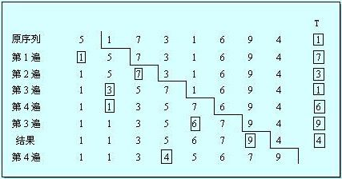

&emsp;&emsp;插入排序是先确定排序的对象，然后为这个待排序的对象寻找合适的插入位置。当数据元素的规模比较大时(多字节数据或者多数据成语结构体)，这种操作比较耗时。<!--more-->
&emsp;&emsp;插入排序的基本操作就是将一个数据插入到已经排好序的有序数据中，从而得到一个新的、个数加一的有序数据。



``` cpp
void insert_sort ( int a[], int n ) { /* 待排序元素用一个数组a表示，数组有n个元素 */
    int i, j;
    int temp;

    for ( i = 1; i < n; i++ ) { /* i表示插入次数，共进行“n - 1”次插入 */
        temp = a[i]; /* 把待排序元素赋给temp，temp在while循环中并不改变，这样方便比较，并且它是要插入的元素 */
        j = i - 1;

        /* while循环的作用是将比当前元素大的元素都往后移动一个位置 */
        while ( ( j >= 0 ) && ( temp < a[j] ) ) {
            a[j + 1] = a[j];
            j--; /* 顺序比较和移动，依次将元素后移动一个位置 */
        }

        a[j + 1] = temp; /* 元素后移后要插入的位置就空出了，找到该位置插入 */
    }
}
```