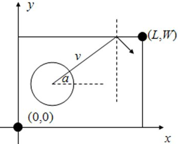

&emsp;&emsp;在平面直角坐标系下，台球桌是一个左下角在`(0, 0)`，右上角在`(L, W)`的矩形。有一个球心在`(x, y)`，半径为`R`的圆形母球放在台球桌上(整个球都在台球桌内)。受撞击后，球沿极角为`a`的射线(即`x`正半轴逆时针旋转到此射线的角度为`a`)飞出，每次碰到球桌时均发生完全弹性碰撞(球的速率不变，反射角等于入射角)。如果球的速率为`v`，则`s`个时间单位之后球心在什么地方？<!--more-->



&emsp;&emsp;输入文件最多包含`25`组测试数据，每个数据仅一行，包含`8`个正整数`L、W、x、y、R、a、v、s`(`100 <= L`，`W <= 10^5`，`1 <= R <= 5`，`R <= x <= L - R`，`R <= y <= W - R`，`0 <= a < 360`，`1 <= v`，`s <= 10^5`)。`L = W = x = y = R = a = v = s = 0`表示输入结束，你的程序不应当处理这一行。
&emsp;&emsp;对于每组数据，输出仅一行，包含两个实数`x`和`y`，表明球心坐标为`(x, y)`。`x`和`y`应四舍五入保留两位小数。样例输入如下：

``` cpp
100 100 80 10 5 90 2 23
110 100 70 10 5 180 1 9999
0 0 0 0 0 0 0 0
```

样例输出如下：

``` cpp
80.00 56.00
71.00 10.00
```

由于球是沿斜方向运动的，因此我们可以将速度分解为`X`轴和`Y`轴上的速度`vx`、`vy`。球是一个半径为`r`的实体，我们可以将题目转化为球心在距大矩形四边为`r`的小矩形中运动。

``` cpp
#include <stdio.h>
#include <iostream>
#include <cmath>
​
using namespace std;
​
int main() {
    int t;
    int l, w, r, a, v, s;
    double x, y;
    double pi = acos ( -1 );
    double vx, vy;
​
    while ( cin >> l >> w >> x >> y >> r >> a >> v >> s ) {
        if ( l == 0 ) {
            break;
        }
​
        /* 计算速度的分量 */
        vy = sin ( a * pi / 180 ) * v;
        vx = cos ( a * pi / 180 ) * v;
        t = 0;
        /* 将球看成点，在内框里运动。计算内边框的坐标 */
        int left = r;
        int right = l - r;
        int bottom = r;
        int top = w - r;
​
        /* 计算每个时间后球心的位置 */
        while ( t != s ) {
            x += vx;
            y += vy;
​
            while ( ( x < left ) || ( x > right ) || ( y < bottom ) || ( y > top ) ) {
                if ( x < left ) {
                    x = 2 * r - x, vx = -vx;
                }
​
                if ( x > right ) {
                    x = 2 * l - 2 * r - x, vx = -vx;
                }
​
                if ( y < bottom ) {
                    y = 2 * r - y, vy = -vy;
                }
​
                if ( y > top ) {
                    y = 2 * w - 2 * r - y, vy = -vy;
                }
            }
​
            t++;
        }
​
        printf ( "%.2f %.2f\n", x, y );
    }
​
    return 0;
}
```