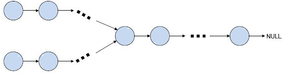
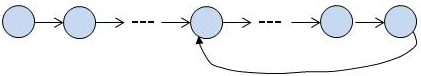
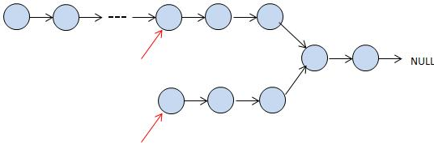
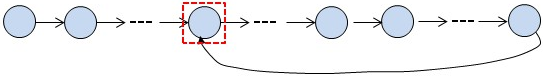

&emsp;&emsp;1. 给出两个单向链表的头指针`pHead1`和`pHead2`，判断这两个链表是否相交，假设两个链表均不带环：



&emsp;&emsp;如果两个链表相交于某一节点，那么在这个相交节点之后的所有节点都是两个链表所共有的。也就是说，如果两个链表相交，那么最后一个节点肯定是共有的。先遍历第一个链表，记住最后一个节点，然后遍历第二个链表，到最后一个节点时和第一个链表的最后一个节点做比较，如果相同，则相交，否则不相交。
&emsp;&emsp;2. 给出一个单向链表的头指针`pHead`，判断链表中是否有环：



&emsp;&emsp;链表中有环，其实也就是自相交。我们用两个指针`pslow`和`pfast`从头开始遍历链表，`pslow`每次前进一个节点，`pfast`每次前进两个结点。若存在环，则`pslow`和`pfast`肯定会在环中相遇；若不存在，则`pslow`和`pfast`能正常到达最后一个节点(实际上是到达`NULL`)。

``` cpp
bool IsExitLoop ( LinkList *head ) { /* 判断链表中是否有环 */
    LinkList *pslow = head;
    LinkList *pfast = head;
​
    while ( pfast != NULL && pfast->next != NULL ) {
        pslow = pslow->next; /* 每次前进一步 */
        pfast = pfast->next->next; /* 每次前进二步 */
​
        if ( pslow == pfast ) { /* 两个指针相遇，说明存在环 */
            return true;
        }
    }
​
    return false; /* 没有环 */
}
```

&emsp;&emsp;3. 给出两个单向链表的头指针`pHead1`和`pHead2`，判断这两个链表是否相交，若相交返回第一个相交的节点，假设两个链表均不带环。
&emsp;&emsp;方法一：判断两个链表中是否存在地址一致的节点，就可以知道是否相交了。可以对第一个链表的节点地址进行`hash`排序，建立`hash`表，然后针对第二个链表的每个节点的地址查询`hash`表，如果它在`hash`表中出现，则说明两个链表有共同的结点。以链表节点地址为值，遍历第一个链表，使用`Hash`保存所有节点地址值，结束条件为到最后一个节点(无环)或`Hash`中该地址值已经存在(有环)。
&emsp;&emsp;方法二：对第一个链表遍历，计算长度`len1`，同时保存最后一个节点的地址；对第二个链表遍历，计算长度`len2`，同时检查最后一个节点是否和第一个链表的最后一个节点相同，若不相同，则不相交，程序结束。若相交，两个链表均从头节点开始，假设`len1`大于`len2`，那么将第一个链表先遍历`len1 - len2`个节点，此时两个链表当前节点到第一个相交节点的距离就相等了，比较下一个节点是不是相同。如果相同，就返回该节点(即相交节点)；若不相同，两个链表都同步向后走一步，继续比较。



&emsp;&emsp;方法三：由于两个链表都没有环，我们可以把第二个链表接在第一个链表的后面，如果得到的链表有环，则说明这两个链表相交。，否则这两个链表不相交。这样我们就把问题转化为判断一个链表是否有环了。最后，当然可别忘记恢复原来的状态，去掉从第一个链表到第二个链表表头的指向。
&emsp;&emsp;4. 给出一个单向链表的头指针`pHead`，判断链表中是否有环，若存在，则求出进入环中的第一个节点。



红色虚线框中的节点为待求节点。首先使用第`2`个题目中的快、慢指针来判断链表是否存在环，若不存在结束。若链表中存在环，我们从链表头、与两个指针的相遇点分别设一个指针，每次各走一步，两个指针必定相遇，且相遇的第一个点为环的入口点。

``` cpp
LinkList *FindLoopPort ( LinkList *head ) { /* 找到环的第一个入口点 */
    LinkList *pslow = head;
    LinkList *pfast = head;
​
    while ( pfast != NULL && pfast->next != NULL ) {
        pslow = pslow->next; /* 每次前进一步 */
        pfast = pfast->next->next; /* 每次前进二步 */
​
        if ( pslow == pfast ) { /* 两个指针相遇，说明存在环 */
            break;
        }
    }
​
    if ( pfast == NULL || pfast->next == NULL ) { /* 不存在环 */
        return NULL;
    }
​
    pslow = head;
​
    while ( pslow != pfast ) {
        pslow = pslow->next; /* 每次前进一步 */
        pfast = pfast->next; /* 每次前进一步 */
    }
​
    return pslow; /* 返回环的入口点 */
}
```

&emsp;&emsp;单链表的归并排序同样需要找到链表的中间节点，可以使用前面的这个快、慢指针的方法：

``` cpp
typedef struct LNode {
    int data;
    struct LNode *next;
} LNode , *LinkList;
​
/* 对两个有序的链表进行递归的归并 */
LinkList MergeList_recursive ( LinkList head1, LinkList head2 ) {
    LinkList result;
​
    if ( head1 == NULL ) {
        return head2;
    }
​
    if ( head2 == NULL ) {
        return head1;
    }
​
    if ( head1->data < head2->data ) {
        result = head1;
        result->next = MergeList_recursive ( head1->next , head2 );
    } else {
        result = head2;
        result->next = MergeList_recursive ( head1 , head2->next );
    }
​
    return result;
}
​
/* 对两个有序的链表进行非递归的归并 */
LinkList MergeList ( LinkList head1, LinkList head2 ) {
    LinkList head , result = NULL;
​
    if ( head1 == NULL ) {
        return head2;
    }
​
    if ( head2 == NULL ) {
        return head1;
    }
​
    while ( head1 && head2 ) {
        if ( head1->data < head2->data ) {
            if ( result == NULL ) {
                head = result = head1;
                head1 = head1->next;
            } else {
                result->next = head1;
                result = head1;
                head1 = head1->next;
            }
        } else {
            if ( result == NULL ) {
                head = result = head2;
                head2 = head2->next;
            } else {
                result->next = head2;
                result = head2;
                head2 = head2->next;
            }
        }
    }
​
    if ( head1 ) {
        result->next = head1;
    }
​
    if ( head2 ) {
        result->next = head2;
    }
​
    return head;
}
​
/* 归并排序，参数为要排序的链表的头结点，函数返回值为排序后的链表的头结点 */
LinkList MergeSort ( LinkList head ) {
    if ( head == NULL ) {
        return NULL;
    }
​
    LinkList r_head , slow , fast;
    r_head = slow = fast = head;
​
    /* 找链表中间节点的两种方法 */
    /*----------------------------
    while ( fast->next != NULL ) {
        if ( fast->next->next != NULL ) {
            slow = slow->next;
            fast = fast->next->next;
        } else {
            fast = fast->next;
        }
    }
    ---------------------------*/
​
    while ( fast->next != NULL && fast->next->next != NULL ) {
        slow = slow->next;
        fast = fast->next->next;
    }
​
    if ( slow->next == NULL ) { /* 链表中只有一个节点 */
        return r_head;
    }
​
    fast = slow->next;
    slow->next = NULL;
    slow = head;
    /* 函数MergeList是对两个有序链表进行归并，返回值是归并后的链表的头结点 */
    // r_head = MergeList_recursive ( MergeSort ( slow ) , MergeSort ( fast ) );
    r_head = MergeList ( MergeSort ( slow ) , MergeSort ( fast ) );
    return r_head;
}
```