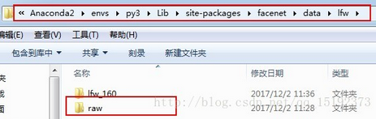
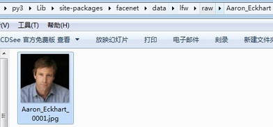
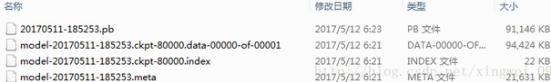
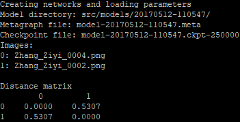

### 安装和配置Facenet

&emsp;&emsp;在cmd命令行，定位到自己想要下载的文件夹，用git下载FaceNet源代码工程：

``` python
git clone --recursive https://github.com/davidsandberg/facenet.git
```

&emsp;&emsp;下载数据集`LFW`，`LFW`数据集是由美国马萨诸塞大学阿姆斯特分校计算机视觉实验室整理的，下载地址为`http://vis-www.cs.umass.edu/lfw/lfw.tgz`。下载完成后，把数据解压到目录`facenet/data/lfw/raw`下面，新建一个命名为`lfw_160`的空文件夹。





&emsp;&emsp;设置环境变量，新建`PYTHONPATH`，其值为`D:\Anaconda2\envs\py3.6\Lib\site-packages\facenet\src`。

### 对图像数据进行预处理

&emsp;&emsp;我们需要将待检测的数据集校准为和预训练模型所使用的数据集大小一致。使用`facenet/src/align/align_dataset_mtcnn.py`进行校准，校准后的图片存在`facenet/data/lfw/lfw_160`下面。将`cmd`定位到`facenet`所在位置，输入如下代码：

``` bash
python src\align\align_dataset_mtcnn.py \
       data\lfw\raw data\lfw\lfw_160 \
       --image_size 160 \
       --margin 32 \
       --random_order \
       --gpu_memory_fraction 0.25
```

校准后发现图像变为`160 * 160`。

### 下载训练好的网络模型

&emsp;&emsp;`facenet`提供了两个预训练模型，分别是基于`CASIA-WebFace`和`MS-Celeb-1M`人脸库训练的。第一个模型`20170511-185253`下载地址为`https://drive.google.com/file/d/0B5MzpY9kBtDVOTVnU3NIaUdySFE/edit`；第二个模型`20170512-110547`下载地址为`https://drive.google.com/file/d/0B5MzpY9kBtDVZ2RpVDYwWmxoSUk/edit`。把下载的文件解压到`src/models`目录下面：



### 人脸对比

&emsp;&emsp;`Facenet`可以直接对比`2`个人脸经过它的网络映射之后的欧式距离，运行程序为`facenet/src/compare.py`。在`facenet`目录下放入要对比的人脸图像，然后输入如下代码：

``` bash
python src/compare.py src/models/20170512-110547/ Zhang_Ziyi_0004.png Zhang_Ziyi_0002.png
```

