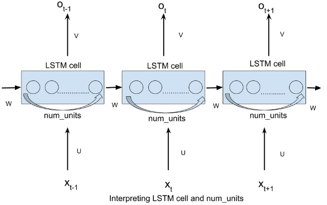
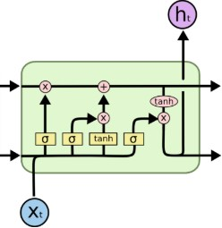

### 在TensorFlow上实现基础LSTM网络

&emsp;&emsp;此笔记的主要目的就是使读者熟悉在`TensorFlow`上实现基础`LSTM`网络的详细过程。我们将选用`MNIST`作为数据集，它包括手写数字的图像和对应的标签，我们可以根据以下内置功能从`TensorFlow`上下载并读取数据：

``` python
from tensorflow.examples.tutorials.mnist import input_data
mnist = input_data.read_data_sets("./data/", one_hot=True)
```

数据被分成`3`个部分：训练数据(`mnist.train`)有`55000`张图像，测试数据(`mnist.test`)有`10000`张图像，验证数据(`mnist.validation`)有`5000`张图像。

### 数据的形态

&emsp;&emsp;训练数据集包括`55000`张`28 * 28`像素的图像，这些`784`(`28 * 28`)像素值被展开成一个维度为`784`的单一向量，所有`55000`个像素向量被储存为形态为`(55000, 784)`的`numpy`数组，并命名为`mnist.train.images`。所有这`55000`张图像都关联了一个类别标签(表示其所属类别)，一共有`10`个类别(`0`至`9`)，类别标签使用独热编码的形式表示。因此标签将作为形态为`(55000, 10)`的数组保存，并命名为`mnist.train.labels`。

### 为什么要选择MNIST？

&emsp;&emsp;`LSTM`通常用来解决复杂的序列处理问题，比如包含了`NLP`概念(词嵌入、编码器等)的语言建模问题。这些问题本身需要大量理解，那么将问题简化并集中于在`TensorFlow`上实现`LSTM`的细节(比如输入格式化、`LSTM`单元格以及网络结构设计)，会是个不错的选择。`MNIST`就正好提供了这样的机会，其中的输入数据是一个像素值的集合。我们可以轻易地将其格式化，将注意力集中在`LSTM`实现细节上。

### VANILLA RNN

&emsp;&emsp;循环神经网络按时间轴展开的时候，如下图所示：


其中，`xt`代表时间步t的输入；`st`代表时间步`t`的隐藏状态，可看作该网络的`记忆`；`ot`作为时间步`t`时刻的输出；`U`、`V`、`W`是所有时间步共享的参数，共享的重要性在于我们的模型在每一时间步以不同的输入执行相同的任务。当把`RNN`展开的时候，网络可被看作每一个时间步都受上一时间步输出影响(时间步之间存在连接)的前馈网络。

### LSTM单元格的解释

&emsp;&emsp;在`TensorFlow`中，基础的`LSTM`单元格声明为：

``` python
lstm_layer = rnn.BasicLSTMCell(num_units, forget_bias=1)
```

这里的`num_units`指一个`LSTM`单元格中的单元数。`num_units`可以比作前馈神经网络中的隐藏层，前馈神经网络的隐藏层的节点数量等于每一个时间步中一个`LSTM`单元格内`LSTM`单元的`num_units`数量：



每一个`num_units`的`LSTM`单元都可以看作一个标准的`LSTM`单元：



&emsp;&emsp;在`TensorFlow`中，最简单的`RNN`形式是`static_rnn`：

``` python
outputs, _ = rnn.static_rnn(lstm_layer, input, dtype="float32")
```

`input`接受形态为`[batch_size, input_size]`的张量列表，列表的长度为将网络展开后的时间步数，即列表中每一个元素都分别对应网络展开的时间步。比如在`MNIST`数据集中，我们有`28 * 28`像素的图像，每一张都可以看成拥有`28`行`28`个像素的图像。我们将网络按`28`个时间步展开，以使在每一个时间步中，可以输入一行`28`个像素(`input_size`)，从而经过`28`个时间步输入整张图像。给定图像的`batch_size`值，则每一个时间步将分别收到`batch_size`个图像：


由`static_rnn`生成的输出是一个形态为`[batch_size, n_hidden]`的张量列表。列表的长度为将网络展开后的时间步数，即每一个时间步输出一个张量。在这个实现中我们只需关心最后一个时间步的输出，因为一张图像的所有行都输入到`RNN`，预测即将在最后一个时间步生成。
&emsp;&emsp;在开始的时候，先导入一些必要的依赖关系、数据集，并声明一些常量。设定`batch_size`为`128`，`num_units`为`128`：

``` python
import tensorflow as tf
from tensorflow.contrib import rnn
from tensorflow.examples.tutorials.mnist import input_data
​
mnist = input_data.read_data_sets("./data/", one_hot=True)
​
time_steps = 28  # unrolled through 28 time steps
num_units = 128  # hidden LSTM units
n_input = 28  # rows of 28 pixels
learning_rate = 0.001  # learning rate for adam
n_classes = 10  # mnist is meant to be classified in 10 classes(0 - 9)
batch_size = 128  # size of batch
```

现在设置占位、权重以及偏置变量(用于将输出的形态从`[batch_size, num_units]`转换为`[batch_size, n_classes]`)，从而可以预测正确的类别：

``` python
# weights and biases of appropriate shape to accomplish above task
out_weights = tf.Variable(tf.random_normal([num_units, n_classes]))
out_bias = tf.Variable(tf.random_normal([n_classes]))
​
x = tf.placeholder("float", [None, time_steps, n_input])  # input image placeholder
y = tf.placeholder("float", [None, n_classes])  # input label placeholder
```

现在我们得到了形态为`[batch_size, time_steps, n_input]`的输入，我们需要将其转换成形态为`[batch_size, n_inputs]`，长度为`time_steps`的张量列表，从而可以将其输入`static_rnn`：

``` python
# processing the input tensor from [batch_size, time_steps, n_input] to
# "time_steps" number of [batch_size, n_input] tensors
input = tf.unstack(x, time_steps, 1)
```

现在我们可以定义网络了，利用`BasicLSTMCell`的一个层，将`static_rnn`从中提取出来：

``` python
# defining the network
lstm_layer = rnn.BasicLSTMCell(num_units, forget_bias=1)
outputs, _ = rnn.static_rnn(lstm_layer, input, dtype="float32")
```

我们只考虑最后一个时间步的输入，从中生成预测：

``` python
# converting last output of dimension [batch_size, num_units] to
# [batch_size, n_classes] by out_weight multiplication
prediction = tf.matmul(outputs[-1], out_weights) + out_bias
```

定义损失函数、优化器和准确率：

``` python
# loss_function
loss = tf.reduce_mean(tf.nn.softmax_cross_entropy_with_logits(logits=prediction, labels=y))
opt = tf.train.AdamOptimizer(learning_rate=learning_rate).minimize(loss)  # optimization
​
# model evaluation
correct_prediction = tf.equal(tf.argmax(prediction, 1), tf.argmax(y, 1))
accuracy = tf.reduce_mean(tf.cast(correct_prediction, tf.float32))
```

&emsp;&emsp;现在我们已经完成定义，可以开始运行了。需要注意的是，我们的每一张图像在开始时被平坦化为`784`维的单一向量，函数`next_batch(batch_size)`必须返回这些`784`维向量的`batch_size`批次数。因此它们的形态要被改造成`[batch_size, time_steps, n_input]`，从而可以被占位符接受：

``` python
init = tf.global_variables_initializer()  # initialize variables
​
with tf.Session() as sess:
    sess.run(init)
    iter = 1

    while iter < 800:
        batch_x, batch_y = mnist.train.next_batch(batch_size=batch_size)
        batch_x = batch_x.reshape((batch_size, time_steps, n_input))
        sess.run(opt, feed_dict={x: batch_x, y: batch_y})

        if iter % 10 == 0:
            acc = sess.run(accuracy, feed_dict={x: batch_x, y: batch_y})
            los = sess.run(loss, feed_dict={x: batch_x, y: batch_y})
            print("For iter ", iter)
            print("Accuracy ", acc)
            print("Loss ", los)
            print("-------------------")

        iter = iter + 1
​
    # calculating test accuracy
    test_data = mnist.test.images[:128].reshape((-1, time_steps, n_input))
    test_label = mnist.test.labels[:128]
    print("Testing Accuracy:", sess.run(accuracy, feed_dict={x: test_data, y: test_label}))
```

---

### 设置RNN的参数

&emsp;&emsp;这次我们使用`RNN`来进行分类的训练，继续使用手写数字`MNIST`数据集。让`RNN`从每张图片的第一行像素读到最后一行，然后再进行分类判断。接下来导入`MNIST`数据并确定`RNN`的各种参数：

``` python
import tensorflow as tf
from tensorflow.examples.tutorials.mnist import input_data
​
mnist = input_data.read_data_sets('./MNIST_data', one_hot=True)
​
lr = 0.001  # learning rate
training_iters = 100000  # train step(上限)
batch_size = 128
n_inputs = 28  # 每一步输入的序列长度为28(img shape: 28*28)
n_steps = 28  # 输入的步数是28步
n_hidden_units = 128  # 隐藏层的神经元个数
n_classes = 10  # 分类的类别
```

接着定义`x`、`y`的`placeholder`以及`weights`、`biases`的初始状况：

``` python
# 输入数据占位符
x = tf.placeholder(tf.float32, [None, n_steps, n_inputs])
y = tf.placeholder(tf.float32, [None, n_classes])
​
weights = {  # 定义权重
    'in': tf.Variable(tf.random_normal([n_inputs, n_hidden_units])),  # shape (28, 128)
    'out': tf.Variable(tf.random_normal([n_hidden_units, n_classes]))  # shape (128, 10)
}
​
biases = {
    'in': tf.Variable(tf.constant(0.1, shape=[n_hidden_units, ])),  # shape (128, )
    'out': tf.Variable(tf.constant(0.1, shape=[n_classes, ]))  # shape (10, )
}
```

### 定义RNN的主体结构

&emsp;&emsp;接着开始定义`RNN`主体结构，这个`RNN`总共有`3`个组成部分(`input_layer`、`cell`、`output_layer`)。首先我们先定义`input_layer`：

``` python
def RNN(X, weights, biases):
    # 原始的X是3维数据，我们需要把它变成2维数据，才能使用weights的矩阵乘法
    X = tf.reshape(X, [-1, n_inputs])  # X ==> (128 batches * 28 steps, 28 inputs)
​
    # 进入隐藏层
    # X_in = W * X + b
    # X_in = (128 batches, 28 steps, 128 hidden)
    X_in = tf.matmul(X, weights['in']) + biases['in']
    # X_in ==> (128 batches, 28 steps, 128 hidden) 换回3维
    X_in = tf.reshape(X_in, [-1, n_steps, n_hidden_units])
```

接着是`cell`中的计算，这里使用`tf.nn.dynamic_rnn(cell, inputs)`。因`TensorFlow`版本升级原因，`state_is_tuple = True`将在之后的版本中变为默认。对于`lstm`来说，`state`可被分为`(c_state, h_state)`：

``` python
# 这里采用基本的LSTM循环网络单元(basic LSTM Cell)
lstm_cell = tf.contrib.rnn.BasicLSTMCell(n_hidden_units, forget_bias=1.0, state_is_tuple=True)
# 初始化为零值，lstm单元由两个部分组成，即(c_state, h_state)
init_state = lstm_cell.zero_state(batch_size, dtype=tf.float32)
```

如果使用`tf.nn.dynamic_rnn(cell, inputs)`，我们要确定`inputs`的格式。`tf.nn.dynamic_rnn`中的`time_major`参数会针对不同`inputs`格式有不同的值：

- 如果`inputs`为`(batches, steps, inputs)`，`time_major`为`False`。
- 如果`inputs`为`(steps, batches, inputs)`，`time_major`为`True`。

``` python
# dynamic_rnn接收张量(batch, steps, inputs)或者(steps, batch, inputs)作为X_in
outputs, final_state = tf.nn.dynamic_rnn(lstm_cell, X_in, initial_state=init_state, time_major=False)
```

`return`值的求解如下，直接调用`final_state`中的`h_state(final_state[1])`来进行运算：

``` python
results = tf.matmul(final_state[1], weights['out']) + biases['out']
```

在`RNN`函数的最后输出`result`：

``` python
return results
```

定义好了`RNN`主体结构后，我们就可以来计算`cost`和`train_op`：

``` python
pred = RNN(x, weights, biases)
cost = tf.reduce_mean(tf.nn.softmax_cross_entropy_with_logits(logits=pred, labels=y))
train_op = tf.train.AdamOptimizer(lr).minimize(cost)
```

### 训练RNN

&emsp;&emsp;训练过程如下：

``` python
correct_pred = tf.equal(tf.argmax(pred, 1), tf.argmax(y, 1))
accuracy = tf.reduce_mean(tf.cast(correct_pred, tf.float32))
​
init = tf.global_variables_initializer()
​
with tf.Session() as sess:
    sess.run(init)
    step = 0

    while step * batch_size < training_iters:
        batch_xs, batch_ys = mnist.train.next_batch(batch_size)
        batch_xs = batch_xs.reshape([batch_size, n_steps, n_inputs])
        sess.run([train_op], feed_dict={x: batch_xs, y: batch_ys, })

        if step % 20 == 0:
            print(sess.run(accuracy, feed_dict={x: batch_xs, y: batch_ys, }))

        step += 1
```