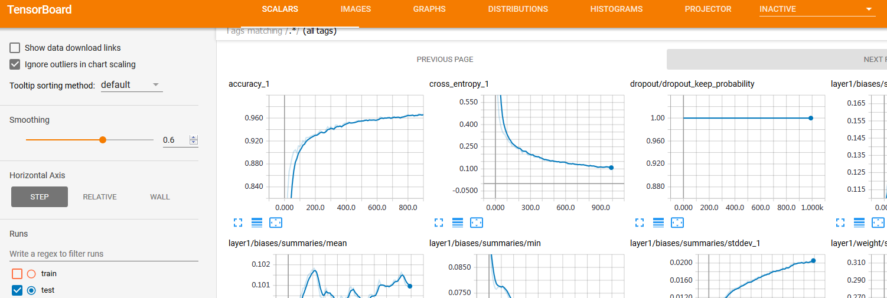
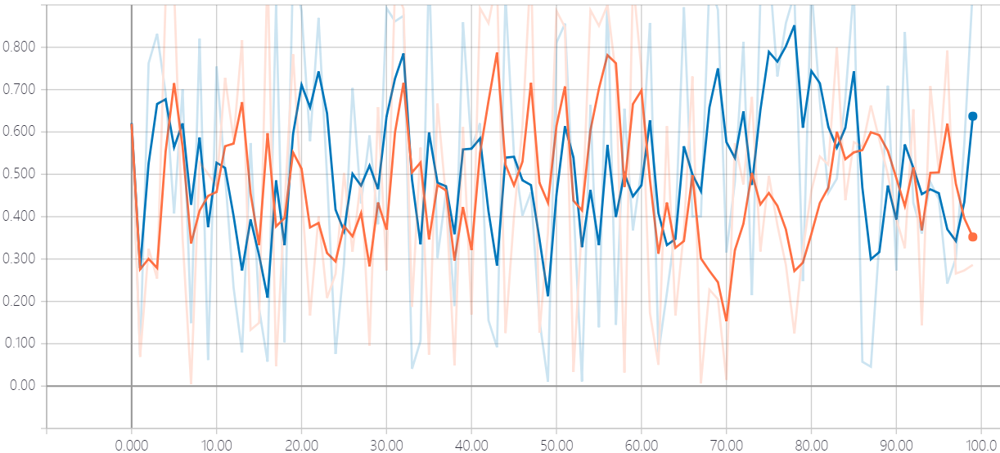

&emsp;&emsp;`TensorBoard`可以将训练过程中的各种绘制数据展示出来，包括标量(`scalars`)、图片(`images`)、音频(`Audio`)、计算图(`graph`)、数据分布、直方图(`histograms`)和嵌入式向量。使用`TensorBoard`展示数据，需要在执行`TensorFlow`计算图的过程中，将各种类型的数据汇总并记录到日志文件中。然后使用`TensorBoard`读取这些日志文件，解析数据并生产数据可视化的`Web`页面，让我们可以在浏览器中观察各种汇总数据。
&emsp;&emsp;`summary_op`包括了`summary.scalar`、`summary.histogram`、`summary.image`等操作，这些操作输出的是各种`summary protobuf`，最后通过`summary.writer`写入到`event`文件中。`TensorFlow`包含生成`summary`数据的`API`接口，这些函数将汇总信息存放在`protobuf`中，以字符串形式表达。
&emsp;&emsp;对标量数据汇总和记录使用`tf.summary.scalar`：

``` python
tf.summary.scalar(tags, values, collections=None, name=None)
```

一般在画`loss`、`accuary`曲线时会用到这个函数。
&emsp;&emsp;使用`tf.summary.histogram`直接记录变量`var`的直方图，输出带直方图的汇总的`protobuf`：

``` python
tf.summary.histogram(tag, values, collections=None, name=None)
```

&emsp;&emsp;使用`tf.summary.image`输出带图像的`protobuf`，汇总数据的图像的的形式如`tag /image/0`、`tag /image/1`：

``` python
tf.summary.image(tag, tensor, max_images=3, collections=None, name=None)
```

&emsp;&emsp;将上面几种类型的汇总再进行一次合并，具体合并哪些由`inputs`指定：

``` python
tf.summary.merge(inputs, collections=None, name=None)
```

&emsp;&emsp;合并默认图形中的所有汇总：

``` python
tf.summaries.merge_all(key='summaries')
```

&emsp;&emsp;将汇总的`protobuf`写入到`event`文件中去的相关的类：`SummaryWriter`是一个类，它可以调用以下成员函数向`event`文件中添加相关的数据：`add_summary`、`add_sessionlog`、`add_event`或`add_graph`：

``` python
tf.summary.FileWriter
```

这里注意，计算图形的信息通过`add_graph`写入到`event`文件中。

``` python
import tensorflow as tf
from tensorflow.examples.tutorials.mnist import input_data
​
"""
设置MNIST数据下载地址data_dir和汇总数据的日志存放路径log_dir，
这里的日志路径log_dir非常重要，会存放所有汇总数据供Tensorflow展示
"""
max_step = 1000
learning_rate = 0.001
dropout = 0.9
data_dir = 'input_data'
log_dir = 'mnist_with_summaries'
​
# 使用input_data.read_data_sets下载MNIST数据
mnist = input_data.read_data_sets(data_dir, one_hot=True)
sess = tf.InteractiveSession()  # 创建Tensorflow的默认Session
​
"""
为了在TensorBoard中展示节点名称，设计网络时会常使用tf.name_scope限制命名空间，
在这个with下所有的节点都会自动命名为“input/xxx”这样的格式。
定义输入x和y的placeholder，并将输入的一维数据变形为“28*28”的图片存储到另一个tensor，
这样就可以使用tf.summary.image将图片数据汇总给TensorBoard展示
"""
with tf.name_scope('input'):
    x = tf.placeholder(tf.float32, [None, 784], name='x_input')
    y = tf.placeholder(tf.float32, [None, 10], name='y_input')

with tf.name_scope('input_reshape'):
    image_shaped_input = tf.reshape(x, [-1, 28, 28, 1])
    tf.summary.image('input', image_shaped_input, 10)
​
# 定义神经网络模型参数的初始化方法，权重使用常用的truncated_normal进行初始化，偏置则赋值为0.1
def weight_variable(shape):
    initial = tf.truncated_normal(shape, stddev=0.1)
    return tf.Variable(initial)
​
def bias_variable(shape):
    initial = tf.constant(0.1, shape=shape)
    return tf.Variable(initial)
​
"""
定义对Variable变量的数据汇总函数。计算出Variable的mean、stddev、max和min，对这些标量数据使用
tf.summary.scalar进行记录和汇总。同时使用tf.summary.histogram直接记录变量var的直方图
"""
def variable_summaries(var):
    with tf.name_scope('summaries'):
        mean = tf.reduce_mean(var)
        tf.summary.scalar('mean', mean)

        with tf.name_scope('stddev'):
            stddev = tf.sqrt(tf.reduce_mean(tf.square(var - mean)))

        tf.summary.scalar('stddev', stddev)
        tf.summary.scalar('max', tf.reduce_max(var))
        tf.summary.scalar('min', tf.reduce_min(var))
        tf.summary.histogram('histogram', var)
​
"""
设计一个MLP多层神经网络来训练数据，在每一层中都会对模型参数进行数据汇总。定义一个创建一层神经网络
并进行数据汇总的函数nn_layer，这个函数的输入参数有输入数据input_tensor，输入的维度input_dim，
输出的维度output_dim和层名称layer_name，激活函数act则默认使用Relu。在函数内，显示初始化这层
神经网络的权重和偏置，并使用前面定义的variable_summaries对variable进行数据汇总。
然后对输入做矩阵乘法并加上偏置，再将未进行激活的结果使用tf.summary.histogram统计直方图。
同时，在使用激活函数后，再使用tf.summary.histogram统计一次
"""
def nn_layer(input_tensor, input_dim, output_dim, layer_name, act=tf.nn.relu):
    with tf.name_scope(layer_name):
        with tf.name_scope('weight'):
            weights = weight_variable([input_dim, output_dim])
            variable_summaries(weights)
        with tf.name_scope('biases'):
            biases = bias_variable([output_dim])
            variable_summaries(biases)
        with tf.name_scope('Wx_plus_b'):
            preactivate = tf.matmul(input_tensor, weights) + biases
            tf.summary.histogram('pre_activations', preactivate)

        activations = act(preactivate, name='actvations')
        tf.summary.histogram('activations', activations)
        return activations
​
"""
使用nn_layer创建一层神经网络，输入维度是图片的尺寸(784 = 28 * 28)，输出的维度是隐藏节点数500。
再创建一个Droput层，并使用tf.summary.scalar记录keep_prob。然后再使用nn_layer定义神经网络的输出层，
激活函数为全等映射，此层暂时不使用softmax，在后面会处理
"""
hidden1 = nn_layer(x, 784, 500, 'layer1')

with tf.name_scope('dropout'):
    keep_prob = tf.placeholder(tf.float32)
    tf.summary.scalar('dropout_keep_probability', keep_prob)
    dropped = tf.nn.dropout(hidden1, keep_prob)
​
y1 = nn_layer(dropped, 500, 10, 'layer2', act=tf.identity)
​
"""
这里使用tf.nn.softmax_cross_entropy_with_logits对前面输出层的结果进行softmax处理
并计算交叉熵损失cross_entropy。计算平均损失，并使用tf.summary.saclar进行统计汇总
"""
with tf.name_scope('cross_entropy'):
    diff = tf.nn.softmax_cross_entropy_with_logits(logits=y1, labels=y)

    with tf.name_scope('total'):
        cross_entropy = tf.reduce_mean(diff)
​
tf.summary.scalar('cross_entropy', cross_entropy)
​
"""
使用Adma优化器对损失进行优化，同时统计预测正确的样本数并
计算正确率accuray，再使用tf.summary.scalar对accuracy进行统计汇总
"""
with tf.name_scope('train'):
    train_step = tf.train.AdamOptimizer(learning_rate).minimize(cross_entropy)

with tf.name_scope('accuracy'):
    with tf.name_scope('correct_prediction'):
        correct_prediction = tf.equal(tf.argmax(y1, 1), tf.arg_max(y, 1))
    with tf.name_scope('accuracy'):
        accuracy = tf.reduce_mean(tf.cast(correct_prediction, tf.float32))
​
tf.summary.scalar('accuracy', accuracy)
​
"""
由于之前定义了非常多的tf.summary的汇总操作，一一执行这些操作态麻烦，所以这里使用
tf.summary.merger_all直接获取所有汇总操作，以便后面执行。然后定义两个
tf.summary.FileWrite(文件记录器)在不同的子目录，分别用来存放训练和测试的日志数据。
同时，将Session的计算图sess.graph加入训练过程的记录器，这样在TensorBoard的GRAPHS窗口中就能
展示整个计算图的可视化效果。最后使用tf.global_variables_initializer().run初始化全部变量
"""
merged = tf.summary.merge_all()
train_writer = tf.summary.FileWriter(log_dir + '/train', sess.graph)
test_writer = tf.summary.FileWriter(log_dir + '/test')
tf.global_variables_initializer().run()
​
"""
定义feed_dict的损失函数。该函数先判断训练标记，如果训练标记为true，则从mnist.train中获取一个batch的样本，
并设置dropout值；如果训练标记为False，则获取测试数据，并设置keep_prob为1，即等于没有dropout效果
"""
def feed_dict(train):
    if train:
        xs, ys = mnist.train.next_batch(100)
        k = dropout
    else:
        xs, ys = mnist.test.images, mnist.test.labels
        k = 1.0

    return {x: xs, y: ys, keep_prob: k}
​
"""
首先使用tf.train.Saver创建模型的保存器，然后进入训练的循环中，每隔10步执行一次merged(数据汇总)
和accuracy(求测试集上的预测准确率)操作，并使用test_write.add_summary将汇总结果summary和循环步数i写入日志文件；
同时每隔100步，使用tf.RunOption定义Tensorflow运行选项，其中设置trace_level为FULL_TRACE，
并使用tf.RunMetadata定义Tensorflow运行的元信息，这样可以记录训练是运算时间和内存占用等方面的信息。
再执行merged数据汇总操作和train_step训练操作，将汇总summary和训练元信息run_metadata添加到train_writer。
平时，则执行merged操作和train_step操作，并添加summary到trian_writer。所有训练全部结束后，关闭train_writer和test_writer
"""
saver = tf.train.Saver()

for i in range(max_step):
    if i % 10 == 0:
        summary, acc = sess.run([merged, accuracy], feed_dict=feed_dict(False))
        test_writer.add_summary(summary, i)
        print('Accuracy at step %s: %s' % (i, acc))
    else:
        if i % 100 == 99:
            run_options = tf.RunOptions(trace_level=tf.RunOptions.FULL_TRACE)
            run_metadata = tf.RunMetadata()
            summary, _ = sess.run(
                            [merged, train_step], feed_dict=feed_dict(True),
                            options=run_options, run_metadata=run_metadata)
            train_writer.add_run_metadata(run_metadata, 'step%03d' % i)
            train_writer.add_summary(summary, i)
            saver.save(sess, log_dir + "/model.ckpt", i)
            print('Adding run metadata for', i)
        else:
            summary, _ = sess.run([merged, train_step], feed_dict=feed_dict(True))
            train_writer.add_summary(summary, i)
​
train_writer.close()
test_writer.close()
```

之后切换到终端下，执行`TensorBoard`程序，并通过`--logdir`指定`TensorFlow`日志路径，然后`TensorBoard`就可以自动生成所有汇总数据的可视化结果：

``` python
tensorboard --logdir=./  # 我是在mnist_with_summaries目录下执行该命令
```

执行结果：

``` bash
$ tensorboard --logdir=./
TensorBoard 0.4.0 at http://fuxinzi-PC:6006 (Press CTRL+C to quit)
```

将`http://fuxinzi-PC:6006`复制到浏览器的地址栏，就可以看到数据可视化的界面：



---

&emsp;&emsp;简易用法如下：

``` python
import tensorflow as tf
import numpy as np
​
def add_layer(inputs, in_size, out_size, n_layer, activation_function=None):
    # add one more layer and return the output of this layer
    layer_name = 'layer%s' % n_layer

    with tf.name_scope(layer_name):
        with tf.name_scope('weights'):
            Weights = tf.Variable(tf.random_normal([in_size, out_size]), name='W')
            tf.summary.histogram(layer_name + '/weights', Weights)
        with tf.name_scope('biases'):
            biases = tf.Variable(tf.zeros([1, out_size]) + 0.1, name='b')
            tf.summary.histogram(layer_name + '/biases', biases)
        with tf.name_scope('Wx_plus_b'):
            Wx_plus_b = tf.add(tf.matmul(inputs, Weights), biases)

        if activation_function is None:
            outputs = Wx_plus_b
        else:
            outputs = activation_function(Wx_plus_b, )

        tf.summary.histogram(layer_name + '/outputs', outputs)

    return outputs
​
# Make up some real data
x_data = np.linspace(-1, 1, 300)[:, np.newaxis]
noise = np.random.normal(0, 0.05, x_data.shape)
y_data = np.square(x_data) - 0.5 + noise
​
with tf.name_scope('inputs'):  # define placeholder for inputs to network
    xs = tf.placeholder(tf.float32, [None, 1], name='x_input')
    ys = tf.placeholder(tf.float32, [None, 1], name='y_input')
​
l1 = add_layer(xs, 1, 10, n_layer=1, activation_function=tf.nn.relu)  # add hidden layer
prediction = add_layer(l1, 10, 1, n_layer=2, activation_function=None)  # add output layer
​
with tf.name_scope('loss'):  # the error between prediciton and real data
    loss = tf.reduce_mean(tf.reduce_sum(tf.square(ys - prediction), reduction_indices=[1]))
    tf.summary.scalar('loss', loss)
​
with tf.name_scope('train'):
    train_step = tf.train.GradientDescentOptimizer(0.1).minimize(loss)
​
sess = tf.Session()
merged = tf.summary.merge_all()
writer = tf.summary.FileWriter("logs/", sess.graph)
​
init = tf.global_variables_initializer()
sess.run(init)
​
for i in range(1000):
    sess.run(train_step, feed_dict={xs: x_data, ys: y_data})

    if i % 50 == 0:
        result = sess.run(merged, feed_dict={xs: x_data, ys: y_data})
        writer.add_summary(result, i)
```

---

### keras和TensorBoard训练可视化

&emsp;&emsp;代码如下：

``` python
import numpy as np
from keras.datasets import mnist
from keras.models import Sequential
from keras.layers.core import Dense, Dropout, Activation
from keras.optimizers import SGD
from keras.utils import np_utils
import keras.callbacks
import keras.backend.tensorflow_backend as KTF
import tensorflow as tf
​
batch_size = 128
nb_classes = 10
nb_epoch = 20
nb_data = 28 * 28
log_filepath = './log_test'
​
(X_train, y_train), (X_test, y_test) = mnist.load_data()  # load data
​
# reshape
X_train = X_train.reshape(X_train.shape[0], X_train.shape[1] * X_train.shape[2])
X_test = X_test.reshape(X_test.shape[0], X_test.shape[1] * X_test.shape[2])
​
# rescale
X_train = X_train.astype(np.float32)
X_test = X_test.astype(np.float32)
X_train /= 255
X_test /= 255
​
# convert class vectors to binary class matrices (one hot vectors)
Y_train = np_utils.to_categorical(y_train, nb_classes)
Y_test = np_utils.to_categorical(y_test, nb_classes)
​
old_session = KTF.get_session()
​
with tf.Graph().as_default():
    session = tf.Session('')
    KTF.set_session(session)
    KTF.set_learning_phase(1)
    # build model
    model = Sequential()
    model.add(Dense(512, input_shape=(nb_data,), init='normal', name='dense1'))
    model.add(Activation('relu', name='relu1'))
    model.add(Dropout(0.2, name='dropout1'))
    model.add(Dense(512, init='normal', name='dense2'))
    model.add(Activation('relu', name='relu2'))
    model.add(Dropout(0.2, name='dropout2'))
    model.add(Dense(10, init='normal', name='dense3'))
    model.add(Activation('softmax', name='softmax1'))
    model.summary()
​
    model.compile(loss='categorical_crossentropy', optimizer=SGD(lr=0.01), metrics=['accuracy'])
​
    tb_cb = keras.callbacks.TensorBoard(log_dir=log_filepath, histogram_freq=1)
    cbks = [tb_cb]
​
    history = model.fit(
                X_train, Y_train, batch_size=batch_size, nb_epoch=nb_epoch,
                verbose=1, callbacks=cbks, validation_data=(X_test, Y_test))
​
    score = model.evaluate(X_test, Y_test, verbose=0)
    print('Test score:', score[0])
    print('Test accuracy;', score[1])
​
KTF.set_session(old_session)
```

在终端使用如下命令：

``` python
tensorboard --logdir ./log_test
```

---

&emsp;&emsp;`pytorch`使用`tensorboardX`添加数据的方法：

``` python
import torch
import torchvision.utils as vutils
import numpy as np
import torchvision.models as models
from torchvision import datasets
from tensorboardX import SummaryWriter
​
resnet18 = models.resnet18(False)
writer = SummaryWriter()
sample_rate = 44100
freqs = [262, 294, 330, 349, 392, 440, 440, 440, 440, 440, 440]
​
for n_iter in range(100):
    dummy_s1 = torch.rand(1)
    dummy_s2 = torch.rand(1)
    # data grouping by slash
    writer.add_scalar('data/scalar1', dummy_s1[0], n_iter)
    writer.add_scalar('data/scalar2', dummy_s2[0], n_iter)
    writer.add_scalars(
        'data/scalar_group',
        {
            'xsinx': n_iter * np.sin(n_iter),
            'xcosx': n_iter * np.cos(n_iter),
            'arctanx': np.arctan(n_iter)
        },
        n_iter)
​
    dummy_img = torch.rand(32, 3, 64, 64)  # output from network
​
    if n_iter % 10 == 0:
        x = vutils.make_grid(dummy_img, normalize=True, scale_each=True)
        writer.add_image('Image', x, n_iter)
​
        dummy_audio = torch.zeros(sample_rate * 2)

        for i in range(x.size(0)):
            # amplitude of sound should in [-1, 1]
            dummy_audio[i] = np.cos(freqs[n_iter // 10] * np.pi * float(i) / float(sample_rate))
​
        writer.add_audio('myAudio', dummy_audio, n_iter, sample_rate=sample_rate)
        writer.add_text('Text', 'text logged at step:' + str(n_iter), n_iter)
​
        for name, param in resnet18.named_parameters():
            writer.add_histogram(name, param.clone().cpu().data.numpy(), n_iter)
​
        # needs tensorboard 0.4RC or later
        writer.add_pr_curve('xoxo', np.random.randint(2, size=100), np.random.rand(100), n_iter)
​
dataset = datasets.MNIST('mnist', train=False, download=True)
images = dataset.test_data[:100].float()
label = dataset.test_labels[:100]
​
features = images.view(100, 784)
writer.add_embedding(features, metadata=label, label_img=images.unsqueeze(1))
# export scalar data to JSON for external processing
writer.export_scalars_to_json("./all_scalars.json")
writer.close()
```

执行完成之后，在终端输入`tensorboard.exe --logdir runs`，注意当前`python`文件和执行`tensorboard`的当前路径。画出神经网络结构的方法如下所示(注意`add_graph`的第二个参数应该是个`Tensor`)：

``` python
import torch
import torch.nn as nn
import torch.nn.functional as F
import torchvision
from torch.autograd import Variable
from tensorboardX import SummaryWriter
​
dummy_input = (torch.zeros(1, 3),)
​
class LinearLanpa(nn.Module):
    def __init__(self):
        super(LinearLanpa, self).__init__()
        self.l = nn.Linear(3, 5)
​
    def forward(self, x):
        return self.l(x)
​
with SummaryWriter(comment='LinearModel') as w:
    w.add_graph(LinearLanpa(), dummy_input, True)
# -----------------------------
class SimpleModel(nn.Module):
    def __init__(self):
        super(SimpleModel, self).__init__()
​
    def forward(self, x):
        return x * 2
​
model = SimpleModel()
dummy_input = (torch.zeros(1, 2, 3),)
​
with SummaryWriter(comment='constantModel') as w:
    w.add_graph(model, dummy_input, True)
# -----------------------------
def conv3x3(in_planes, out_planes, stride=1):
    # 3x3 convolution with padding
    return nn.Conv2d(in_planes, out_planes, kernel_size=3, stride=stride, padding=1, bias=False)
​
class BasicBlock(nn.Module):
    def __init__(self, inplanes, planes, stride=1, downsample=None):
        super(BasicBlock, self).__init__()
        self.conv1 = conv3x3(inplanes, planes, stride)
        self.bn1 = nn.BatchNorm2d(planes)
        self.conv2 = conv3x3(planes, planes)
        self.bn2 = nn.BatchNorm2d(planes)
        self.stride = stride
​
    def forward(self, x):
        residual = x
        out = self.conv1(x)
        out = self.bn1(out)
        out = F.relu(out)
        out = self.conv2(out)
        out = self.bn2(out)
        out += residual
        out = F.relu(out)
        return out
​
dummy_input = torch.rand(1, 3, 224, 224)
​
with SummaryWriter(comment='basicblock') as w:
    model = BasicBlock(3, 3)
    w.add_graph(model, (dummy_input,), verbose=True)
# -----------------------------
class Net1(nn.Module):
    def __init__(self):
        super(Net1, self).__init__()
        self.conv1 = nn.Conv2d(1, 10, kernel_size=5)
        self.conv2 = nn.Conv2d(10, 20, kernel_size=5)
        self.conv2_drop = nn.Dropout2d()
        self.fc1 = nn.Linear(320, 50)
        self.fc2 = nn.Linear(50, 10)
        self.bn = nn.BatchNorm2d(20)
​
    def forward(self, x):
        x = F.max_pool2d(self.conv1(x), 2)
        x = F.relu(x) + F.relu(-x)
        x = F.relu(F.max_pool2d(self.conv2_drop(self.conv2(x)), 2))
        x = self.bn(x)
        x = x.view(-1, 320)
        x = F.relu(self.fc1(x))
        x = F.dropout(x, training=self.training)
        x = self.fc2(x)
        x = F.softmax(x, dim=1)
        return x
​
class Net2(nn.Module):
    def __init__(self):
        super(Net2, self).__init__()
        self.conv1 = nn.Conv2d(1, 10, kernel_size=5)
        self.conv2 = nn.Conv2d(10, 20, kernel_size=5)
        self.conv2_drop = nn.Dropout2d()
        self.fc1 = nn.Linear(320, 50)
        self.fc2 = nn.Linear(50, 10)
​
    def forward(self, x):
        x = F.relu(F.max_pool2d(self.conv1(x), 2))
        x = F.relu(F.max_pool2d(self.conv2_drop(self.conv2(x)), 2))
        x = x.view(-1, 320)
        x = F.relu(self.fc1(x))
        x = F.dropout(x, training=self.training)
        x = self.fc2(x)
        x = F.log_softmax(x, dim=1)
        return x
​
dummy_input = Variable(torch.rand(13, 1, 28, 28))
​
model = Net1()
with SummaryWriter(comment='Net1') as w:
    w.add_graph(model, (dummy_input,))
​
model = Net2()
with SummaryWriter(comment='Net2') as w:
    w.add_graph(model, (dummy_input,))
​
dummy_input = torch.Tensor(1, 3, 224, 224)
​
with SummaryWriter(comment='alexnet') as w:
    model = torchvision.models.alexnet()
    w.add_graph(model, (dummy_input,))
​
with SummaryWriter(comment='vgg19') as w:
    model = torchvision.models.vgg19()
    w.add_graph(model, (dummy_input,))
​
with SummaryWriter(comment='densenet121') as w:
    model = torchvision.models.densenet121()
    w.add_graph(model, (dummy_input,))
​
with SummaryWriter(comment='resnet18') as w:
    model = torchvision.models.resnet18()
    w.add_graph(model, (dummy_input,))
# -----------------------------
class RNN(nn.Module):
    def __init__(self, input_size, hidden_size, output_size):
        super(RNN, self).__init__()
        self.hidden_size = hidden_size
        self.i2h = nn.Linear(n_categories + input_size + hidden_size, hidden_size)
        self.i2o = nn.Linear(n_categories + input_size + hidden_size, output_size)
        self.o2o = nn.Linear(hidden_size + output_size, output_size)
        self.dropout = nn.Dropout(0.1)
        self.softmax = nn.LogSoftmax(dim=1)
​
    def forward(self, category, input, hidden):
        input_combined = torch.cat((category, input, hidden), 1)
        hidden = self.i2h(input_combined)
        output = self.i2o(input_combined)
        output_combined = torch.cat((hidden, output), 1)
        output = self.o2o(output_combined)
        output = self.dropout(output)
        output = self.softmax(output)
        return output, hidden
​
    def initHidden(self):
        return torch.zeros(1, self.hidden_size)
​
n_letters = 100
n_hidden = 128
n_categories = 10
rnn = RNN(n_letters, n_hidden, n_categories)
cat = torch.Tensor(1, n_categories)
dummy_input = torch.Tensor(1, n_letters)
hidden = torch.Tensor(1, n_hidden)
​
out, hidden = rnn(cat, dummy_input, hidden)
with SummaryWriter(comment='RNN') as w:
    w.add_graph(rnn, (cat, dummy_input, hidden), verbose=False)
```

---

### TensorBoard一幅图中显示多条曲线

&emsp;&emsp;代码如下：

``` python
import tensorflow as tf
from numpy import random
​
writer_1 = tf.summary.FileWriter("./logs/plot_1")
writer_2 = tf.summary.FileWriter("./logs/plot_2")
​
log_var = tf.Variable(0.0)
tf.summary.scalar("loss", log_var)
​
write_op = tf.summary.merge_all()
​
session = tf.InteractiveSession()
session.run(tf.global_variables_initializer())
​
for i in range(100):
    # for writer 1
    summary = session.run(write_op, {log_var: random.rand()})
    writer_1.add_summary(summary, i)
    writer_1.flush()
    # for writer 2
    summary = session.run(write_op, {log_var: random.rand()})
    writer_2.add_summary(summary, i)
    writer_2.flush()
```

使用`tensorboard.exe --logdir=./logs`来加载`tensorboard`运行环境：

