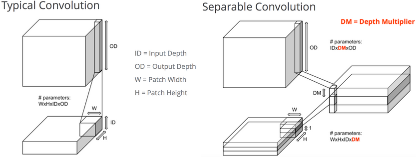

### 激活函数

&emsp;&emsp;在神经网络中，我们有很多的非线性函数来作为激活函数，比如连续的平滑非线性函数(`sigmoid`、`tanh`和`softplus`)，连续但不平滑的非线性函数(`relu`、`relu6`和`relu_x`)和随机正则化函数(`dropout`)。所有的激活函数都是单独应用在每个元素上面的，并且输出张量的维度和输入张量的维度一样。<!--more-->
&emsp;&emsp;`relu`函数原型为：

``` python
tf.nn.relu(features, name = None)
```

这个函数的作用是计算激活函数`relu`，即`max(features, 0)`。

``` python
import tensorflow as tf

a = tf.constant([-1.0, 2.0])

with tf.Session() as sess:
    b = tf.nn.relu(a)
    print(sess.run(b))  # 结果为[0. 2.]
```

- `features`：一个`Tensor`，数据类型必须是`float32`、`float64`、`int32`、`int64`、`uint8`、`int16`和`int8`。
- `name`：可选项，为这个操作取一个名字。

输出一个`Tensor`，数据类型和`features`相同。
&emsp;&emsp;`relu6`函数原型为：

``` python
tf.nn.relu6(features, name = None)
```

这个函数的作用是计算激活函数`relu6`，即`min(max(features, 0), 6)`。

``` python
import tensorflow as tf

a = tf.constant([-1.0, 12.0])

with tf.Session() as sess:
    b = tf.nn.relu6(a)
    print(sess.run(b))  # 结果为[0. 6.]
```

- `features`：一个`Tensor`，数据类型必须是`float`、`double`、`int32`、`int64`、`uint8`、`int16`或者`int8`。
- `name`：可选项，为这个操作取一个名字。

输出一个`Tensor`，数据类型和`features`相同。
&emsp;&emsp;`softplus`函数原型为：

``` python
tf.nn.softplus(features, name = None)
```

这个函数的作用是计算激活函数`softplus`，即`log(exp(features) + 1)`。

``` python
import tensorflow as tf

a = tf.constant([-1.0, 12.0])

with tf.Session() as sess:
    b = tf.nn.softplus(a)
    print(sess.run(b))  # 结果为[ 0.31326166 12.000006 ]
```

- `features`：一个`Tensor`，数据类型必须是`float32`、`float64`、`int32`、`int64`、`uint8`、`int16`或者`int8`。
- `name`：可选项，为这个操作取一个名字。

输出一个`Tensor`，数据类型和`features`相同。
&emsp;&emsp;`dropout`函数原型如下：

``` python
tf.nn.dropout(x, keep_prob, noise_shape = None, seed = None, name = None)
```

这个函数的作用是计算神经网络层的`dropout`。
&emsp;&emsp;一个神经元将以概率`keep_prob`决定是否放电，如果不放电，那么该神经元的输出将是`0`，如果该神经元放电，那么该神经元的输出值将被放大到原来的`1 / keep_prob`倍。这里的放大操作是为了保持神经元输出总个数不变。比如，神经元的值为`[1, 2]`，`keep_prob`的值是`0.5`，并且是第一个神经元是放电的，第二个神经元不放电，那么神经元输出的结果是`[2, 0]`，也就是相当于，第一个神经元被当做了`1 / keep_prob`个输出，即`2`个。这样保证了总和`2`个神经元保持不变。
&emsp;&emsp;默认情况下，每个神经元是否放电是相互独立的。但是，如果`noise_shape`被修改了，那么它对于变量`x`就是一个广播形式，而且当且仅当`noise_shape[i] == shape(x)[i]`，`x`中的元素是相互独立的。比如，如果`shape(x) = [k, l, m, n], noise_shape = [k, 1, 1, n]`，那么每个批和通道都是相互独立的，但是每行和每列的数据都是关联的，即要不都为`0`，要不都还是原来的值。

``` python
import tensorflow as tf

a = tf.constant([[-1.0, 2.0, 3.0, 4.0]])

with tf.Session() as sess:
    b = tf.nn.dropout(a, 0.5, noise_shape=[1, 4])
    print(sess.run(b))  # 结果为[[-2.  0.  6.  0.]]
    b = tf.nn.dropout(a, 0.5, noise_shape=[1, 1])
    print(sess.run(b))  # 结果为[[-2.  4.  6.  8.]]
```

- `x`：一个`Tensor`。
- `keep_prob`：一个`Python`的`float`类型，表示元素是否放电的概率。
- `noise_shape`：一个一维的`Tensor`，数据类型是`int32`，代表元素是否独立的标志。
- `seed`：一个`Python`的整数类型，设置随机种子。
- `name`：可选项，为这个操作取一个名字。

输出一个`Tensor`，数据维度和`x`相同。
&emsp;&emsp;`bias_add`函数原型为：

``` python
tf.nn.bias_add(value, bias, name = None)
```

这个函数的作用是将偏差项`bias`加到`value`上面。这个操作你可以看做是`tf.add`的一个特例，其中`bias`必须是一维的。该`API`支持广播形式，因此`value`可以有任何维度。但是，该`API`又不像`tf.add`，可以让`bias`的维度和`value`的最后一维不同。

``` python
import tensorflow as tf

a = tf.constant([[1.0, 2.0], [1.0, 2.0], [1.0, 2.0]])
b = tf.constant([2.0, 1.0])
c = tf.constant([1.0])
sess = tf.Session()
print(sess.run(tf.nn.bias_add(a, b)))
print("----------")
# 因为a最后一维的维度是2，但是c的维度是1，所以以下语句将发生错误
# print(sess.run(tf.nn.bias_add(a, c)))
print(sess.run(tf.add(a, c)))  # 但是tf.add可以正确运行
```

- `value`：一个`Tensor`，数据类型必须是`float`、`double`、`int64`、`int32`、`uint8`、`int16`、`int8`或者`complex64`。
- `bias`：一个一维的`Tensor`，数据维度和`value`的最后一维相同，数据类型必须和`value`相同。
- `name`：可选项，为这个操作取一个名字。

输出一个`Tensor`，数据类型和`value`相同。
&emsp;&emsp;`sigmoid`的函数原型为：

``` python
tf.sigmoid(x, name = None)
```

这个函数的作用是计算`x`的`sigmoid`函数，具体计算公式为`y = 1 / (1 + exp(-x))`。

``` python
import tensorflow as tf

a = tf.constant([[1.0, 2.0], [1.0, 2.0], [1.0, 2.0]])
sess = tf.Session()
print(sess.run(tf.sigmoid(a)))
```

执行结果：

``` python
[[0.7310586 0.880797 ]
 [0.7310586 0.880797 ]
 [0.7310586 0.880797 ]]
```

- `x`：一个`Tensor`，数据类型必须是`float`、`double`、`int32`、`complex64`、`int64`或者`qint32`。
- `name`：可选项，为这个操作取一个名字。

输出一个`Tensor`，如果`x.dtype != qint32`，那么返回的数据类型和`x`相同，否则返回的数据类型是`quint8`。
&emsp;&emsp;`tanh`的函数原型为：

``` python
tf.tanh(x, name = None)
```

这个函数的作用是计算`x`的`tanh`函数。具体计算公式为`(exp(x) - exp(-x))/(exp(x) + exp(-x))`。

``` python
import tensorflow as tf

a = tf.constant([[1.0, 2.0], [1.0, 2.0], [1.0, 2.0]])
sess = tf.Session()
print(sess.run(tf.tanh(a)))
```

执行结果：

``` python
[[0.7615942 0.9640276]
 [0.7615942 0.9640276]
 [0.7615942 0.9640276]]
```

- `x`：一个`Tensor`，数据类型必须是`float`、`double`、`int32`、`complex64`、`int64`或者`qint32`。
- `name`：可选项，为这个操作取一个名字。

输出一个`Tensor`，如果`x.dtype != qint32`，那么返回的数据类型和`x`相同，否则返回的数据类型是`quint8`。

### 卷积层

&emsp;&emsp;卷积操作是使用一个二维的卷积核在一个批处理的图片上进行不断扫描。具体操作是将一个卷积核在每张图片上按照一个合适的尺寸在每个通道上面进行扫描。为了达到好的卷积效率，需要在不同的通道和不同的卷积核之间进行权衡。

- `conv2d`：任意的卷积核，能同时在不同的通道上面进行卷积操作。
- `depthwise_conv2d`：卷积核能相互独立的在自己的通道上面进行卷积操作。
- `separable_conv2d`：在纵深卷积(`depthwise filter`)之后进行逐点卷积(`separable filter`)。

注意，虽然这些操作被称之为`卷积`，但是严格的说，他们只是互相关，因为卷积核没有做一个逆向的卷积过程。
&emsp;&emsp;卷积核的卷积过程是按照`strides`参数来确定的，比如`strides = [1, 1, 1, 1]`表示卷积核对每个像素点进行卷积，即在二维屏幕上面，两个轴方向的步长都是`1`。`strides = [1, 2, 2, 1]`表示卷积核对每隔一个像素点进行卷积，即在二维屏幕上面，两个轴方向的步长都是`2`。
&emsp;&emsp;`conv2d`函数原型为：

``` python
tf.nn.conv2d(input, filter, strides, padding, use_cudnn_on_gpu=None, name=None)
```

这个函数的作用是对一个四维的输入数据`input`和四维的卷积核`filter`进行操作，然后对输入数据进行一个二维的卷积操作，最后得到卷积之后的结果。
&emsp;&emsp;给定的输入张量的维度是`[batch, in_height, in_width, in_channels]`，卷积核张量的维度是`[filter_height, filter_width, in_channels, out_channels]`，具体卷积操作如下：

1. 将卷积核的维度转换成一个二维的矩阵形状`[filter_height * filter_width * in_channels, output_channels]`。
2. 对于每个批处理的图片，我们将输入张量转换成一个临时的数据维度`[batch, out_height, out_width, filter_height * filter_width * in_channels]`。
3. 对于每个批处理的图片，我们右乘以卷积核，得到最后的输出结果。

注意，必须有`strides[0] = strides[3] = 1`。在大部分处理过程中，卷积核的水平移动步数和垂直移动步数是相同的，即`strides = [1, stride, stride, 1]`。

``` python
import numpy as np
import tensorflow as tf

input_data = tf.Variable(np.random.rand(10, 6, 6, 3), dtype=np.float32)
filter_data = tf.Variable(np.random.rand(2, 2, 3, 1), dtype=np.float32)
y = tf.nn.conv2d(input_data, filter_data, strides=[1, 1, 1, 1], padding='SAME')

with tf.Session() as sess:
    init = tf.global_variables_initializer()
    sess.run(init)
    print(sess.run(y))
    print(sess.run(tf.shape(y)))
```

- `input`：一个`Tensor`，数据类型必须是`float32`或者`float64`。
- `filter`：一个`Tensor`，数据类型必须是`input`相同。
- `strides`：一个长度是`4`的一维整数类型数组，每一维度对应的是`input`中每一维的对应移动步数，比如`strides[1]`对应`input[1]`的移动步数。
- `padding`：一个字符串，取值为`SAME`或者`VALID`。
- `use_cudnn_on_gpu`：一个可选布尔值，默认情况下是`True`。
- `name`：可选项，为这个操作取一个名字。

输出一个`Tensor`，数据类型是`input`相同。
&emsp;&emsp;`depthwise_conv2d`函数原型为：

``` python
tf.nn.depthwise_conv2d(input, filter, strides, padding, name=None)
```

这个函数也是一个卷积操作。给定一个输入张量，数据维度是`[batch, in_height, in_width, in_channels]`，一个卷积核的维度是`[filter_height, filter_width, in_channels, channel_multiplier]`，在通道`in_channels`上面的卷积深度是`1`(我的理解是在每个通道上单独进行卷积)，`depthwise_conv2d`函数将不同的卷积核独立的应用在`in_channels`的每个通道上(从通道`1`到通道`channel_multiplier`)，然后把所以的结果进行汇总。最后输出通道的总数是`in_channels * channel_multiplier`。
&emsp;&emsp;注意，必须有`strides[0] = strides[3] = 1`。在大部分处理过程中，卷积核的水平移动步数和垂直移动步数是相同的，即`strides = [1, stride, stride, 1]`。

``` python
import numpy as np
import tensorflow as tf

input_data = tf.Variable(np.random.rand(10, 6, 6, 3), dtype=np.float32)
filter_data = tf.Variable(np.random.rand(2, 2, 3, 5), dtype=np.float32)
y = tf.nn.depthwise_conv2d(input_data, filter_data, strides=[1, 1, 1, 1], padding='SAME')

with tf.Session() as sess:
    init = tf.global_variables_initializer()
    sess.run(init)
    print(sess.run(y))
    print(sess.run(tf.shape(y)))
```

- `input`：一个`Tensor`，数据维度是四维`[batch, in_height, in_width, in_channels]`。
- `filter`：一个`Tensor`，数据维度是四维`[filter_height, filter_width, in_channels, channel_multiplier]`。
- `strides`：一个长度是`4`的一维整数类型数组，每一维度对应的是`input`中每一维的对应移动步数，比如，`strides[1]`对应`input[1]`的移动步数。
- `padding`：一个字符串，取值为`SAME`或者`VALID`。
- `use_cudnn_on_gpu`：一个可选布尔值，默认情况下是`True`。
- `name`：可选项，为这个操作取一个名字。

输出一个四维的`Tensor`，数据维度为`[batch, out_height, out_width, in_channels * channel_multiplier]`。
&emsp;&emsp;`separable_conv2d`函数原型为：

``` python
tf.nn.separable_conv2d(input, depthwise_filter, pointwise_filter, strides, padding, name=None)
```

这个函数的作用是利用几个分离的卷积核去做卷积，下图是常规卷积和分离卷积的区别：



这个卷积是为了避免卷积核在全通道的情况下进行卷积，这样非常浪费时间。使用这个`API`，你将应用一个二维的卷积核，在每个通道上，以深度`channel_multiplier`进行卷积。其实如上图`Separable Convolution`中，就是先利用`depthwise_filter`，将`ID`的通道数映射到`ID * DM`的通道数上面，之后从`ID * DM`的通道数映射到`OD`的通道数上面，这也就是上面说的深度`channel_multiplier`对应于`DM`。
&emsp;&emsp;`strides`只是仅仅控制`depthwise convolution`的卷积步长，因为`pointwise convolution`的卷积步长是确定的`[1, 1, 1, 1]`。注意，必须有`strides[0] = strides[3] = 1`。在大部分处理过程中，卷积核的水平移动步数和垂直移动步数是相同的，即`strides = [1, stride, stride, 1]`。

``` python
import numpy as np
import tensorflow as tf

input_data = tf.Variable(np.random.rand(10, 6, 6, 3), dtype=np.float32)
depthwise_filter = tf.Variable(np.random.rand(2, 2, 3, 5), dtype=np.float32)
pointwise_filter = tf.Variable(np.random.rand(1, 1, 15, 20), dtype=np.float32)
# out_channels >= channel_multiplier * in_channels
y = tf.nn.separable_conv2d(input_data, depthwise_filter, \
        pointwise_filter, strides=[1, 1, 1, 1], padding='SAME')

with tf.Session() as sess:
    init = tf.global_variables_initializer()
    sess.run(init)
    print(sess.run(y))
    print(sess.run(tf.shape(y)))
```

- `input`：一个`Tensor`，数据维度是四维`[batch, in_height, in_width, in_channels]`。
- `depthwise_filter`：一个`Tensor`，数据维度是四维`[filter_height, filter_width, in_channels, channel_multiplier]`。其中，`in_channels`的卷积深度是`1`。
- `pointwise_filter`：一个`Tensor`，数据维度是四维`[1, 1, channel_multiplier * in_channels, out_channels]`。其中，`pointwise_filter`是在`depthwise_filter`卷积之后的混合卷积。
- `strides`：一个长度是`4`的一维整数类型数组，每一维度对应的是`input`中每一维的对应移动步数，比如，`strides[1]`对应`input[1]`的移动步数。
- `padding`：一个字符串，取值为`SAME`或者`VALID`。
- `name`：可选项，为这个操作取一个名字。

输出一个四维的`Tensor`，数据维度为`[batch, out_height, out_width, out_channels]`。

### 池化层

&emsp;&emsp;池化操作是利用一个矩阵窗口在输入张量上进行扫描，并且将每个矩阵窗口中的值通过取最大值，平均值或者`XXXX`来减少元素个数。每个池化操作的矩阵窗口大小是由`ksize`来指定的，并且根据步长参数`strides`来决定移动步长。比如，如果`strides`中的值都是`1`，那么每个矩阵窗口都将被使用。如果`strides`中的值都是`2`，那么每一维度上的矩阵窗口都是每隔一个被使用。以此类推。更具体的输出结果是：

``` python
output[i] = reduce(value[strides * i: strides * i + ksize])
```

输出数据维度是：

``` python
shape(output) = (shape(value) - ksize + 1) / strides
```

其中，取舍方向取决于参数`padding`：

- `padding = 'SAME'`：向下取舍，仅适用于全尺寸操作，即输入数据维度和输出数据维度相同。
- `padding = 'VALID`：向上取舍，适用于部分窗口，即输入数据维度和输出数据维度不同。

&emsp;&emsp;`avg_pool`函数原型为：

``` python
tf.nn.avg_pool(value, ksize, strides, padding, name=None)
```

这个函数的作用是计算池化区域中元素的平均值。

``` python
import numpy as np
import tensorflow as tf

input_data = tf.Variable(np.random.rand(10, 6, 6, 3), dtype=np.float32)
filter_data = tf.Variable(np.random.rand(2, 2, 3, 10), dtype=np.float32)
y = tf.nn.conv2d(input_data, filter_data, strides=[1, 1, 1, 1], padding='SAME')
output = tf.nn.avg_pool(value=y, ksize=[1, 2, 2, 1], strides=[1, 1, 1, 1], padding='SAME')

with tf.Session() as sess:
    init = tf.global_variables_initializer()
    sess.run(init)
    print(sess.run(output))
    print(sess.run(tf.shape(output)))
```

- `value`：一个四维的`Tensor`，数据维度是`[batch, height, width, channels]`，数据类型是`float32`、`float64`、`qint8`、`quint8`和`qint32`。
- `ksize`：一个长度不小于`4`的整型数组。每一位上面的值对应于输入数据张量中每一维的窗口对应值。
- `strides`：一个长度不小于`4`的整型数组。该参数指定滑动窗口在输入数据张量每一维上面的步长。
- `padding`：一个字符串，取值为`SAME`或者`VALID`。
- `name`：可选项，为这个操作取一个名字。

输出一个`Tensor`，数据类型和`value`相同。
&emsp;&emsp;`max_pool`函数原型为：

``` python
tf.nn.max_pool(value, ksize, strides, padding, name=None)
```

这个函数的作用是计算池化区域中元素的最大值。

``` python
import numpy as np
import tensorflow as tf

input_data = tf.Variable(np.random.rand(10, 6, 6, 3), dtype=np.float32)
filter_data = tf.Variable(np.random.rand(2, 2, 3, 10), dtype=np.float32)
y = tf.nn.conv2d(input_data, filter_data, strides=[1, 1, 1, 1], padding='SAME')
output = tf.nn.max_pool(value=y, ksize=[1, 2, 2, 1], strides=[1, 1, 1, 1], padding='SAME')

with tf.Session() as sess:
    init = tf.global_variables_initializer()
    sess.run(init)
    print(sess.run(output))
    print(sess.run(tf.shape(output)))
```

- `value`：一个四维的`Tensor`，数据维度是`[batch, height, width, channels]`，数据类型是`float32`、`float64`、`qint8`、`quint8`或`qint32`。
- `ksize`：一个长度不小于`4`的整型数组。每一位上面的值对应于输入数据张量中每一维的窗口对应值。
- `strides`：一个长度不小于`4`的整型数组。该参数指定滑动窗口在输入数据张量每一维上面的步长。
- `padding`：一个字符串，取值为`SAME`或者`VALID`。
- `name`：可选项，为这个操作取一个名字。

输出一个`Tensor`，数据类型和`value`相同。
&emsp;&emsp;`max_pool_with_argmax`函数原型为：

``` python
tf.nn.max_pool_with_argmax(input, ksize, strides, padding, Targmax = None, name=None)
```

这个函数的作用是计算池化区域中元素的最大值和该最大值所在的位置。因为在计算位置`argmax`的时候，我们将`input`铺平了进行计算，所以如果`input = [b, y, x, c]`，那么索引位置是`((b * height + y) * width + x) * channels + c`。
&emsp;&emsp;使用示例如下：

``` python
import numpy as np
import tensorflow as tf

input_data = tf.Variable(np.random.rand(10, 6, 6, 3), dtype=tf.float32)
filter_data = tf.Variable(np.random.rand(2, 2, 3, 10), dtype=np.float32)
y = tf.nn.conv2d(input_data, filter_data, strides=[1, 1, 1, 1], padding='SAME')
output, argmax = tf.nn.max_pool_with_argmax(input=y, ksize=[1, 2, 2, 1], strides=[1, 1, 1, 1], padding='SAME')

with tf.Session() as sess:
    init = tf.global_variables_initializer()
    sess.run(init)
    print(sess.run(output))
    print(sess.run(tf.shape(output)))
```

- `input`：一个四维的`Tensor`，数据维度是`[batch, height, width, channels]`，数据类型是`float32`。
- `ksize`：一个长度不小于`4`的整型数组。每一位上面的值对应于输入数据张量中每一维的窗口对应值。
- `strides`：一个长度不小于`4`的整型数组。该参数指定滑动窗口在输入数据张量每一维上面的步长。
- `padding`：一个字符串，取值为`SAME`或者`VALID`。
- `Targmax`：一个可选的数据类型，即`tf.int32`或者`tf.int64`。默认情况下是`tf.int64`。
- `name`：可选项，为这个操作取一个名字。

输出一个元祖张量`(output, argmax)`：

- `output`：一个`Tensor`，数据类型是`float32`，表示池化区域的最大值。
- `argmax`：一个`Tensor`，数据类型是`Targmax`，数据维度是四维的。

### 标准化

&emsp;&emsp;标准化是能防止模型过拟合的好方法，特别是在大数据的情况下。
&emsp;&emsp;`l2_normalize`的函数原型为：

``` python
tf.nn.l2_normalize(x, dim, epsilon=1e-12, name=None)
```

这个函数的作用是利用`L2`范数对指定维度`dim`进行标准化。比如，对于一个一维的张量，指定维度`dim = 0`，那么计算结果为：

``` python
output = x / sqrt(max(sum(x ** 2), epsilon))
```

假设`x`是多维度的，那么标准化只会独立的对维度`dim`进行，不会影响到别的维度。

``` python
import numpy as np
import tensorflow as tf

input_data = tf.Variable(np.random.rand(2, 3), dtype=tf.float32)
output = tf.nn.l2_normalize(input_data, dim=0)

with tf.Session() as sess:
    init = tf.global_variables_initializer()
    sess.run(init)
    print(sess.run(output))
    print(sess.run(tf.shape(output)))
```

- `x`：一个`Tensor`。
- `dim`：需要标准化的维度。
- `epsilon`：一个很小的值，确定标准化的下边界。如果`norm < sqrt(epsilon)`，那么我们将使用`sqrt(epsilon)`进行标准化。
- `name`：可选项，为这个操作取一个名字。

输出一个`Tensor`，数据维度和`x`相同。
&emsp;&emsp;`local_response_normalization`函数原型为：

``` python
tf.nn.local_response_normalization(input, depth_radius=None, bias=None, alpha=None, beta=None, name=None)
```

这个函数的作用是计算局部数据标准化。输入的数据`input`是一个四维的张量，但该张量被看做是一个一维的向量(`input`的最后一维作为向量)，向量中的每一个元素都是一个三维的数组(对应`input`的前三维)。向量的每一个元素都是独立的被标准化的。

``` python
import numpy as np
import tensorflow as tf

input_data = tf.Variable(np.random.rand(1, 2, 3, 4), dtype=tf.float32)
output = tf.nn.local_response_normalization(input_data)

with tf.Session() as sess:
    init = tf.global_variables_initializer()
    sess.run(init)
    print(sess.run(input_data))
    print(sess.run(output))
    print(sess.run(tf.shape(output)))
```

- `input`：一个`Tensor`，数据维度是四维的，数据类型是`float32`。
- `depth_radius`：可选项，一个整型，默认情况下是`5`。
- `bias`：可选项，一个浮点型，默认情况下是`1`。一个偏移项，为了避免除`0`，一般情况下取正值。
- `alpha`：可选项，一个浮点型，默认情况下是`1`。一个比例因子，一般情况下取正值。
- `beta`：可选项，一个浮点型，默认情况下是`0.5`。一个指数。
- `name`：可选项，为这个操作取一个名字。

输出一个`Tensor`，数据类型是`float32`。
&emsp;&emsp;`moments`函数原型为：

``` python
tf.nn.moments(x, axes, name=None)
```

这个函数的作用是计算`x`的均值和方差。沿着`axes`维度，计算`x`的均值和方差。如果`x`是一维的，并且`axes = [0]`，那么就是计算整个向量的均值和方差。如果我们取`axes = [0, 1, 2]`(`batch, height, width`)，那么我们就是计算卷积的全局标准化。如果只是计算批处理的标准化，那么我们取`axes = [0]`(`batch`)。

``` python
import numpy as np
import tensorflow as tf

input_data = tf.Variable(np.random.rand(2, 3), dtype=tf.float32)
mean, variance = tf.nn.moments(input_data, [0])

with tf.Session() as sess:
    init = tf.global_variables_initializer()
    sess.run(init)
    print(sess.run(input_data))
    print(sess.run(mean))
    print(sess.run(tf.shape(mean)))
```

- `x`：一个`Tensor`。
- `axes`：一个整型的数组，确定计算均值和方差的维度。
- `name`：为这个操作取个名字。

输出两个`Tensor`，分别是均值`mean`和方差`variance`。

### 误差值

&emsp;&emsp;度量两个张量或者一个张量和零之间的损失误差，这个可用于在一个回归任务或者用于正则的目的(权重衰减)。
&emsp;&emsp;`l2_loss`函数原型为：

``` python
tf.nn.l2_loss(t, name=None)
```

这个函数的作用是利用`L2`范数来计算张量的误差值，但是没有开方并且只取`L2`范数的值的一半：

``` python
output = sum(t ** 2) / 2
```

使用示例如下：

``` python
import numpy as np
import tensorflow as tf

input_data = tf.Variable(np.random.rand(2, 3), dtype=tf.float32)
output = tf.nn.l2_loss(input_data)

with tf.Session() as sess:
    init = tf.global_variables_initializer()
    sess.run(init)
    print(sess.run(input_data))
    print(sess.run(output))
    print(sess.run(tf.shape(output)))
```

执行结果：

``` python
[[0.03965811 0.9202959  0.83564   ]
 [0.23268144 0.77983814 0.8602118 ]]
1.474532
[]
```

- `t`：一个`Tensor`。数据类型必须是以下之一：`float32`、`float64`、`int64`、`int32`、`uint8`、`int16`、`int8`、`complex64`、`qint8`、`quint8`或`qint32`。虽然一般情况下，数据维度是二维的。但是，数据维度可以取任意维度。
- `name`：为这个操作取个名字。

输出一个`Tensor`，数据类型和`t`相同，是一个标量。

### 分类操作

&emsp;&emsp;`sigmoid_cross_entropy_with_logits`函数原型为：

``` python
tf.nn.sigmoid_cross_entropy_with_logits(logits, targets, name=None)
```

这个函数的作用是计算`logits`经`sigmoid`函数激活之后的交叉熵。对于一个不相互独立的离散分类任务，这个函数作用是去度量概率误差。比如在一张图片中，同时包含多个分类目标(大象和狗)，那么就可以使用这个函数。
&emsp;&emsp;为了描述简洁，我们规定`x = logits`，`z = targets`，那么`Logistic`损失值为：

``` python
x - x * z + log(1 + exp(-x))
```

为了确保计算稳定，避免溢出，真实的计算实现如下：

``` python
max(x, 0) - x * z + log(1 + exp(-abs(x)))
```

`logits`和`targets`必须有相同的数据类型和数据维度。

``` python
import numpy as np
import tensorflow as tf

# np.random.rand传入一个shape，返回一个在[0,1)区间符合均匀分布的array
input_data = tf.Variable(np.random.rand(1, 3), dtype=tf.float32)
output = tf.nn.sigmoid_cross_entropy_with_logits(logits=input_data, labels=[[1.0, 0.0, 0.0]])

with tf.Session() as sess:
    init = tf.global_variables_initializer()
    sess.run(init)
    print(sess.run(output))  # 结果为[[0.3589966 1.1557628 0.9552358]]
```

- `logits`：一个`Tensor`，数据类型是`float32`或者`float64`之一。
- `targets`：一个`Tensor`，数据类型和数据维度都和`logits`相同。
- `name`：为这个操作取个名字。

输出一个`Tensor`，数据维度和`logits`相同。
&emsp;&emsp;`softmax`函数原型为：

``` python
tf.nn.softmax(logits, name=None)
```

这个函数的作用是计算`softmax`激活函数。对于每个批`i`和分类`j`，我们可以得到：

``` python
softmax[i, j] = exp(logits[i, j]) / sum(exp(logits[i]))
```

使用示例如下：

``` python
import numpy as np
import tensorflow as tf

input_data = tf.Variable([[0.2, 0.1, 0.9]], dtype=tf.float32)
output = tf.nn.softmax(input_data)

with tf.Session() as sess:
    init = tf.global_variables_initializer()
    sess.run(init)
    print(sess.run(input_data))
    print(sess.run(output))
    print(sess.run(tf.shape(output)))
```

执行结果：

``` python
[[0.2 0.1 0.9]]
[[0.25519383 0.23090893 0.51389724]]
[1 3]
```

- `logits`：一个`Tensor`。数据类型是`float32`或者`float64`之一。数据维度是二维`[batch_size, num_classes]`。
- `name`：为这个操作取个名字。

输出一个`Tensor`，数据维度和数据类型都和`logits`相同。
&emsp;&emsp;`softmax_cross_entropy_with_logits`函数原型为：

``` python
tf.nn.softmax_cross_entropy_with_logits(logits, labels, name=None)
```

这个函数的作用是计算`logits`经`softmax`函数激活之后的交叉熵。对于每个独立的分类任务，这个函数是去度量概率误差。比如，在`CIFAR-10`数据集上面，每张图片只有唯一一个分类标签：一张图可能是一只狗或者一辆卡车，但绝对不可能两者都在一张图中(这也是和`tf.nn.sigmoid_cross_entropy_with_logits(logits, targets, name=None)`这个`API`的区别)。
&emsp;&emsp;输入`API`的数据`logits`不能进行缩放，因为在这个`API`的执行中会进行`softmax`计算，如果`logits`进行了缩放，那么会影响计算正确率。不要调用这个`API`去计算`softmax`的值，因为这个`API`最终输出的结果并不是经过`softmax`函数的值。
&emsp;&emsp;`logits`和`labels`必须有相同的数据维度`[batch_size, num_classes]`，和相同的数据类型(`float32`或者`float64`)。

``` python
import tensorflow as tf

input_data = tf.Variable([[0.2, 0.1, 0.9]], dtype=tf.float32)
output = tf.nn.softmax_cross_entropy_with_logits(logits=input_data, labels=[[1, 0, 0]])

with tf.Session() as sess:
    init = tf.global_variables_initializer()
    sess.run(init)
    print(sess.run(input_data))
    print(sess.run(output))
    print(sess.run(tf.shape(output)))
```

执行结果：

``` python
[[0.2 0.1 0.9]]
[1.365732]
[1]
```

- `logits`：一个没有缩放的对数张量。
- `labels`：每一行`labels[i]`必须是一个有效的概率分布值。
- `name`：为这个操作取个名字。

输出一个`Tensor`，数据维度是一维的，长度是`batch_size`，数据类型都和`logits`相同。

### 嵌入层

&emsp;&emsp;`Tensorflow`提供了从张量中嵌入查找的库。
&emsp;&emsp;`embedding_lookup函数原型为：

``` python
tf.nn.embedding_lookup(params, ids, name=None)
```

这个函数的作用是查询`params`中索引是`ids`的值。这个操作是`tf.gather`的一个泛化，但它可以被并行计算处理，其中`params`被认为是一个大型的张量库，`ids`中的值对应于各个分区。如果`len(params) > 1`，`ids`中每个元素`id`对应于`params`中每个分区`p`，即`p = id % len(params)`。那么，我们得到的每个切片是`params[p][id // len(params), ...]`。最后得到的切片结果被重新连接成一个稠密张量，最后返回的张量维度是`shape(ids) + shape(params)[1:]`。

``` python
import tensorflow as tf
import numpy as np

params = tf.constant(np.random.rand(3, 4))
ids = tf.constant([0, 2])
output = tf.nn.embedding_lookup(params, ids)

with tf.Session() as sess:
    print('params:', sess.run(params))
    print('-------------------------------')
    print('输出第0行和第2行:', sess.run(output))
```

执行结果：

``` python
params: [[0.59815351 0.65806083 0.1297678  0.8921319 ]
 [0.29017073 0.32162826 0.12856839 0.14271805]
 [0.3123268  0.8437347  0.49344986 0.29818202]]
-------------------------------
输出第0行和第2行: [[0.59815351 0.65806083 0.1297678  0.8921319 ]
 [0.3123268  0.8437347  0.49344986 0.29818202]]
```

- `params`：一个拥有相同数据维度和数据类型的张量。
- `ids`：一个张量，数据类型是`int32`。
- `name`：为这个操作取个名字。

输出一个`Tensor`，数据类型和`params`相同。

### 评估操作

&emsp;&emsp;评估操作对于测量网络的性能是有用的。由于它们是不可微分的，所以它们通常只是被用在评估阶段。
&emsp;&emsp;`top_k`函数原型为：

``` python
tf.nn.top_k(input, k, name=None)
```

这个函数的作用是返回`input`中每行最大的k个数，并且返回它们所在位置的索引。`value(i, j)`表示输入数据`input(i)`的第`j`大的元素。`indices(i, j)`给出对应元素的列索引，即`input(i, indices(i, j)) = values(i, j)`。如果遇到两个相等的元素，那么我们先取索引小的值。

``` python
import tensorflow as tf
import numpy as np

input = tf.constant(np.random.rand(3, 4))
k = 2
output = tf.nn.top_k(input, k)

with tf.Session() as sess:
    print(sess.run(input))
    print('--------------------')
    print(sess.run(output))
```

执行结果：

``` python
[[0.9522081  0.59109382 0.44528462 0.34926363]
 [0.46024959 0.59693116 0.36231259 0.55662777]
 [0.37875119 0.4205928  0.43581744 0.489631  ]]
--------------------
TopKV2(values=array([[0.9522081 , 0.59109382],
       [0.59693116, 0.55662777],
       [0.489631  , 0.43581744]]), indices=array([[0, 1],
       [1, 3],
       [3, 2]]))
```

- `input`：一个张量，数据类型必须是以下之一：`float32`、`float64`、`int32`、`int64`、`uint8`、`int16`、`int8`。数据维度是`batch_size`乘上`x`个类别。
- `k`：一个整型，必须大于等于`1`。在每行中，查找最大的`k`个值。
- `name`：为这个操作取个名字。

输出一个元组`Tensor`，数据元素是`(values, indices)`：

- `values`：一个张量，数据类型和`input`相同。数据维度是`batch_size`乘上`k`个最大值。
- `indices`：一个张量，数据类型是`int32`。每个最大值在`input`中的索引位置。

&emsp;&emsp;`in_top_k`函数原型为：

``` python
tf.nn.in_top_k(predictions, targets, k, name=None)
```

这个函数的作用是返回一个布尔向量，说明目标值是否存在于预测值之中。输出数据是一个`batch_size`长度的布尔向量，如果目标值存在于预测值之中，那么`out[i] = true`。注意，`targets`是`predictions`中的索引位，并不是`predictions`中具体的值。

``` python
import tensorflow as tf
import numpy as np

input = tf.constant(np.random.rand(3, 4), tf.float32)
k = 2
output = tf.nn.in_top_k(input, [3, 3, 3], k)

with tf.Session() as sess:
    print(sess.run(input))
    print('--------------------')
    print(sess.run(output))
```

执行结果：

``` python
[[0.34494555 0.9111343  0.93085057 0.419403  ]
 [0.14929643 0.46961188 0.72727567 0.04639981]
 [0.13701458 0.83330005 0.33437857 0.1281736 ]]
--------------------
[False False False]
```

- `predictions`：一个张量，数据类型是`float32`。数据维度是`batch_size`乘上`x`个类别。
- `targets`：一个张量，数据类型是`int32`。一个长度是`batch_size`的向量，里面的元素是目标`class ID`。
- `k`：一个整型。在每行中，查找最大的`k`个值。
- `name`：为这个操作取个名字。

输出一个张量，数据类型是`bool`，判断是否预测正确。