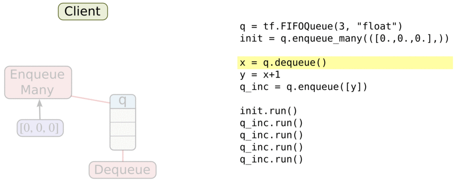
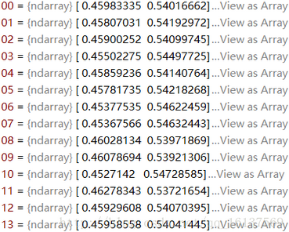

### 猫狗大战数据集

&emsp;&emsp;`Cats vs. Dogs`(猫狗大战)是`Kaggle`大数据竞赛某一年的一道赛题，利用给定的数据集，用算法实现猫和狗的识别。数据集可以从`Kaggle`官网上下载，即`https://www.kaggle.com/c/dogs-vs-cats`。数据集由训练数据和测试数据组成，训练数据包含猫和狗各`12500`张图片，测试数据包含`12500`张猫和狗的图片。<!--more-->
&emsp;&emsp;首先在`Pycharm`上新建`Cats_vs_Dogs`工程，工程目录结构为：

- `data`文件夹下包含`test`和`train`两个子文件夹，分别用于存放测试数据和训练数据。
- `logs`文件夹用于存放我们训练时的模型结构以及训练参数。
- `input_data.py`负责实现读取数据，生成批次(`batch`)。
- `model.py`负责实现我们的神经网络模型。
- `training.py`负责实现模型的训练以及评估。

接下来分成数据读取、模型构造、模型训练、测试模型四个部分来讲。

### 训练数据的读取(input_data.py)

&emsp;&emsp;首先需要引入如下模块：

``` python
import tensorflow as tf
import numpy as np
import os
```

因为我们需要获取`test`目录下的文件，所以要导入`os`模块。

``` python
# 获取文件路径和标签，file_dir是文件夹路径，该函数返回乱序后的图片和标签
def get_files(file_dir):
    cats = []
    label_cats = []
    dogs = []
    label_dogs = []

    for file in os.listdir(file_dir):  # 载入数据路径并写入标签值
        name = file.split(sep='.')

        if name[0] == 'cat':
            cats.append(file_dir + file)
            label_cats.append(0)
        else:
            dogs.append(file_dir + file)
            label_dogs.append(1)

    print("There are %d cats\nThere are %d dogs" % (len(cats), len(dogs)))
​
    # 打乱文件顺序
    image_list = np.hstack((cats, dogs))
    label_list = np.hstack((label_cats, label_dogs))
    temp = np.array([image_list, label_list])
    temp = temp.transpose()  # 转置
    np.random.shuffle(temp)
​
    image_list = list(temp[:, 0])
    label_list = list(temp[:, 1])
    label_list = [int(i) for i in label_list]
​
    return image_list, label_list
```

&emsp;&emsp;函数`get_files`的功能是获取给定路径`file_dir`下的所有的训练数据(包括图片和标签)，以`list`的形式返回。由于训练数据前`12500`张是猫，后`12500`张是狗，如果直接按这个顺序训练，训练效果可能会受影响(猜测的)，所以需要将顺序打乱。因为图片和标签是一一对应的，所以要整合到一起乱序。
&emsp;&emsp;这里先用`np.hstack`方法将猫和狗图片和标签整合到一起，得到`image_list`和`label_list`，`hstack((a,b))`的功能是将`a`和`b`以水平的方式连接，比如原来`cats`和`dogs`是长度为`12500`的向量，执行了`hstack(cats, dogs)`后，`image_list`的长度为`25000`，同理`label_list`的长度也为`25000`。接着将一一对应的`image_list`和`label_list`再合并一次。`temp`的大小是`2 * 25000`，经过转置(变成`25000 * 2`)，然后使用`np.random.shuffle`方法进行乱序。
&emsp;&emsp;最后从`temp`中分别取出乱序后的`image_list`和`label_list`列向量，作为函数的返回值。这里要注意，因为`label_list`里面的数据类型是字符串类型，所以加上`label_list = [int(i) for i in label_list]`这么一行将其转为`int`类型。

``` python
# 生成相同大小的批次，参数capacity队列容量，返回值是图像和标签的batch
def get_batch(image, label, image_W, image_H, batch_size, capacity):
    # 将python.list类型转换成tf能够识别的格式
    image = tf.cast(image, tf.string)
    label = tf.cast(label, tf.int32)

    input_queue = tf.train.slice_input_producer([image, label])  # 生成队列
    image_contents = tf.read_file(input_queue[0])
    label = input_queue[1]
    image = tf.image.decode_jpeg(image_contents, channels=3)
    # 统一图片大小
    image = tf.image.resize_images(image, [image_H, image_W], \
                                   method=tf.image.ResizeMethod.NEAREST_NEIGHBOR)
    image = tf.cast(image, tf.float32)
    image_batch, label_batch = tf.train.batch([image, label], batch_size=batch_size, \
                                              num_threads=64, capacity=capacity)
​
    # label_batch = tf.reshape(label_batch, [batch_size])
    return image_batch, label_batch
```

&emsp;&emsp;函数`get_batch`用于将图片分批次，因为一次性将所有`25000`张图片载入内存不现实也不必要，所以将图片分成不同批次进行训练。对于把训练数据集设置成一个个`batch`，其解释为：如果损失函数是非凸的话，整个训练样本尽管算的动，可能会卡在局部最优解上；分批训练表示全样本的抽样实现，也就是相当于人为地引入了修正梯度上的采样噪声，使得`一路不同，找别路`的方法，更有可能搜索到全局最优解。这里传入的`image`和`label`参数就是函数`get_files`返回的`image_list`和`label_list`，是`python`中的`list`类型，所以需要将其转为`TensorFlow`可以识别的`tensor`格式。
&emsp;&emsp;这里使用队列来获取数据，因为队列操作牵扯到线程，这里引用了一张图解释：



&emsp;&emsp;我认为大体上可以这么理解：每次训练时，从队列中取一个`batch`送到网络进行训练，然后又有新的图片从训练库中注入队列，这样循环往复。队列相当于起到了训练库到网络模型间数据管道的作用，训练数据通过队列送入网络。
&emsp;&emsp;我们使用`slice_input_producer`来建立一个队列，将`image`和`label`放入一个`list`中当做参数传给该函数，然后从队列中取得`image`和`label`。要注意，用`read_file`读取图片之后，要按照图片格式进行解码。本例程中训练数据是`jpg`格式的，所以使用`decode_jpeg`解码器，如果是其他格式，就要用其他解码器。注意`decode`出来的数据类型是`uint8`，之后模型卷积层里面`conv2d`要求输入数据为`float32`类型，所以需要进行类型转换。
&emsp;&emsp;因为训练库中图片大小是不一样的，所以还需要将图片裁剪成相同大小(`img_W`和`img_H`)。有些程序员使用`resize_image_with_crop_or_pad`方法来裁剪图片，这种方法是从图像中心向四周裁剪，如果图片超过规定尺寸，最后只会剩中间区域的一部分，可能一只狗只剩下躯干，头都不见了，用这样的图片训练结果肯定会受到影响。所以这里稍微改动了一下，使用`resize_images`对图像进行缩放，而不是裁剪，采用`NEAREST_NEIGHBOR`插值方法。
&emsp;&emsp;然后用`tf.train.batch`方法获取`batch`，还有一种方法是`tf.train.shuffle_batch`，因为之前已经乱序过了，这里用普通的`batch`函数。
&emsp;&emsp;最后将得到的`image_batch`和`label_batch`返回，`image_batch`是一个`4D`的`tensor`，即`[batch, width, height, channels]`，`label_batch`是一个`1D`的`tensor`，即`[batch]`。
&emsp;&emsp;可以用下面的代码测试获取图片是否成功，因为之前将图片转为`float32`了，因此这里`imshow`出来的图片色彩会有点奇怪，因为本来`imshow`是显示`uint8`类型的数据(灰度值在`uint8`类型下是`0`至`255`，转为`float32`后会超出这个范围，所以色彩有点奇怪)，不过这不影响后面模型的训练：

``` python
import matplotlib.pyplot as plt
​
BATCH_SIZE = 2
CAPACITY = 256
IMG_W = 208
IMG_H = 208
​
train_dir = "data\\train\\"
image_list, label_list = get_files(train_dir)
image_batch, label_batch = get_batch(image_list, label_list, IMG_W, IMG_H, BATCH_SIZE, CAPACITY)
​
with tf.Session() as sess:
    i = 0
    coord = tf.train.Coordinator()
    threads = tf.train.start_queue_runners(coord=coord)

    try:
        while not coord.should_stop() and i < 1:
            img, label = sess.run([image_batch, label_batch])
​
            for j in np.arange(BATCH_SIZE):
                print("label: %d" % label[j])
                plt.imshow(img[j, :, :, :])
                plt.show()

            i += 1
    except tf.errors.OutOfRangeError:
        print("done!")
    finally:
        coord.request_stop()

    coord.join(threads)
```

### 卷积神经网络模型的构造(model.py)

&emsp;&emsp;以下仿照`TensorFlow`的官方例程`cifar-10`的网络结构来编写的，就是两个卷积层(每个卷积层后加一个池化层)，两个全连接层，最后使用`softmax`输出分类结果：

``` python
import tensorflow as tf
​
def inference(images, batch_size, n_classes):
    # conv1, shape = [kernel_size, kernel_size, channels, kernel_numbers]
    with tf.variable_scope("conv1") as scope:
        weights = tf.get_variable("weights", shape=[3, 3, 3, 16], dtype=tf.float32, \
                                  initializer=tf.truncated_normal_initializer(stddev=0.1, dtype=tf.float32))
        biases = tf.get_variable("biases", shape=[16], dtype=tf.float32, initializer=tf.constant_initializer(0.1))
        conv = tf.nn.conv2d(images, weights, strides=[1, 1, 1, 1], padding="SAME")
        pre_activation = tf.nn.bias_add(conv, biases)
        conv1 = tf.nn.relu(pre_activation, name="conv1")

    with tf.variable_scope("pooling1_lrn") as scope:  # pool1 && norm1
        pool1 = tf.nn.max_pool(conv1, ksize=[1, 3, 3, 1], strides=[1, 2, 2, 1], padding="SAME", name="pooling1")
        norm1 = tf.nn.lrn(pool1, depth_radius=4, bias=1.0, alpha=0.001 / 9.0, beta=0.75, name='norm1')

    with tf.variable_scope("conv2") as scope:  # conv2
        weights = tf.get_variable("weights", shape=[3, 3, 16, 16], dtype=tf.float32, \
                                  initializer=tf.truncated_normal_initializer(stddev=0.1, dtype=tf.float32))
        biases = tf.get_variable("biases", shape=[16], dtype=tf.float32, initializer=tf.constant_initializer(0.1))
        conv = tf.nn.conv2d(norm1, weights, strides=[1, 1, 1, 1], padding="SAME")
        pre_activation = tf.nn.bias_add(conv, biases)
        conv2 = tf.nn.relu(pre_activation, name="conv2")

    with tf.variable_scope("pooling2_lrn") as scope:  # pool2 && norm2
        pool2 = tf.nn.max_pool(conv2, ksize=[1, 3, 3, 1], strides=[1, 2, 2, 1], padding="SAME", name="pooling2")
        norm2 = tf.nn.lrn(pool2, depth_radius=4, bias=1.0, alpha=0.001 / 9.0, beta=0.75, name='norm2')

    with tf.variable_scope("fc1") as scope:  # full-connect1
        reshape = tf.reshape(norm2, shape=[batch_size, -1])
        dim = reshape.get_shape()[1].value
        weights = tf.get_variable("weights", shape=[dim, 128], dtype=tf.float32, \
                                  initializer=tf.truncated_normal_initializer(stddev=0.005, dtype=tf.float32))
        biases = tf.get_variable("biases", shape=[128], dtype=tf.float32, initializer=tf.constant_initializer(0.1))
        fc1 = tf.nn.relu(tf.matmul(reshape, weights) + biases, name="fc1")

    with tf.variable_scope("fc2") as scope:  # full_connect2
        weights = tf.get_variable("weights", shape=[128, 128], dtype=tf.float32, \
                                  initializer=tf.truncated_normal_initializer(stddev=0.005, dtype=tf.float32))
        biases = tf.get_variable("biases", shape=[128], dtype=tf.float32, initializer=tf.constant_initializer(0.1))
        fc2 = tf.nn.relu(tf.matmul(fc1, weights) + biases, name="fc2")

    with tf.variable_scope("softmax_linear") as scope:  # softmax
        weights = tf.get_variable("weights", shape=[128, n_classes], dtype=tf.float32, \
                                  initializer=tf.truncated_normal_initializer(stddev=0.005, dtype=tf.float32))
        biases = tf.get_variable("biases", shape=[n_classes], dtype=tf.float32, initializer=tf.constant_initializer(0.1))
        softmax_linear = tf.add(tf.matmul(fc2, weights), biases, name="softmax_linear")

    return softmax_linear
```

发现程序里面有很多`with tf.variable_scope("name")`的语句，这其实是`TensorFlow`中的变量作用域机制，目的是有效便捷地管理需要的变量。变量作用域机制在`TensorFlow`中主要由两部分组成：

- `tf.get_variable(<name>, <shape>, <initializer>)`：创建一个变量。
- `tf.variable_scope(<scope_name>)`：指定命名空间。

如果需要共享变量，需要通过`reuse_variables`方法来指定。

``` python
def losses(logits, labels):
    with tf.variable_scope("loss") as scope:
        cross_entropy = tf.nn.sparse_softmax_cross_entropy_with_logits(
                            logits=logits, labels=labels, name="xentropy_per_example")
        loss = tf.reduce_mean(cross_entropy, name="loss")
        tf.summary.scalar(scope.name + "loss", loss)

    return loss
​
def trainning(loss, learning_rate):
    with tf.name_scope("optimizer"):
        optimizer = tf.train.AdamOptimizer(learning_rate=learning_rate)
        global_step = tf.Variable(0, name="global_step", trainable=False)
        train_op = optimizer.minimize(loss, global_step=global_step)

    return train_op
​
def evaluation(logits, labels):
    with tf.variable_scope("accuracy") as scope:
        correct = tf.nn.in_top_k(logits, labels, 1)
        correct = tf.cast(correct, tf.float16)
        accuracy = tf.reduce_mean(correct)
        tf.summary.scalar(scope.name + "accuracy", accuracy)

    return accuracy
```

函数`losses`用于计算训练过程中的`loss`，这里输入参数`logtis`是函数`inference`的输出，代表图片对猫和狗的预测概率，`labels`则是图片对应的标签。
&emsp;&emsp;通过在程序中设置断点，查看`logtis`的值，结果如下图所示，一个数值代表属于猫的概率，一个数值代表属于狗的概率，两者的和为`1`：



&emsp;&emsp;函数`tf.nn.sparse_sotfmax_cross_entropy_with_logtis`是将稀疏表示的`label`与输出层计算出来结果做对比。然后因为训练的时候是`16`张图片一个`batch`，所以再用`tf.reduce_mean`求一下平均值，就得到了这个`batch`的平均`loss`。对于`training(loss, learning_rate)`，`loss`是训练的`loss`，`learning_rate`是学习率，使用`AdamOptimizer`优化器来使`loss`朝着变小的方向优化。`evaluation(logits, labels)`的功能是在训练过程中实时监测验证数据的准确率，达到反映训练效果的作用。