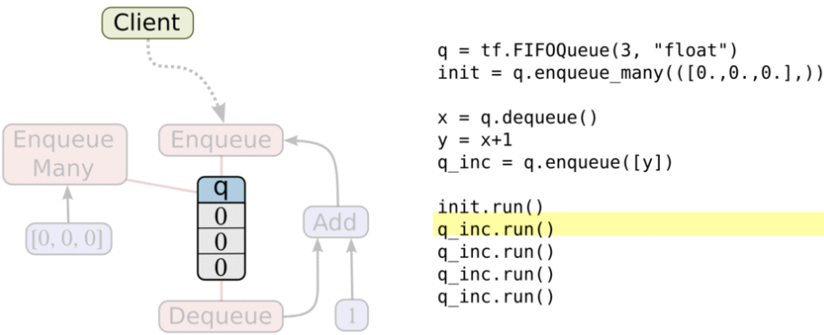

&emsp;&emsp;在使用`TensorFlow`进行异步计算时，队列是一种强大的机制。正如`TensorFlow`中的其他组件一样，队列就是`TensorFlow`图中的节点。这是一种有状态的节点，就像变量一样：其他节点可以修改它的内容。具体来说，其他节点可以把新元素插入到队列后端(`rear`)，也可以把队列前端(`front`)的元素删除。<!--more-->
&emsp;&emsp;为了感受一下队列，来看一个简单的例子。我们先创建一个`先入先出`的队列(`FIFOQueue`)，并将其内部所有元素初始化为零。然后构建一个`TensorFlow`图，它从队列前端取走一个元素，加上`1`之后，放回队列的后端。慢慢地，队列的元素的值就会增加。



&emsp;&emsp;`Enqueue`、`EnqueueMany`和`Dequeue`都是特殊的节点。它们需要获取队列指针，而非普通的值，这样才能修改队列内容。我们建议您将它们看作队列的方法，事实上在`Python`的`API`中，它们就是队列对象的方法(例如`q.enqueue(...)`)。

### 队列使用概述

&emsp;&emsp;队列(如`FIFOQueue`和`RandomShuffleQueue`)在`TensorFlow`的张量异步计算时都非常重要。例如，一个典型的输入结构使用一个`RandomShuffleQueue`来作为模型训练的输入：

- 多个线程准备训练样本，并且把这些样本推入队列。
- 一个训练线程执行一个训练操作，此操作会从队列中移除最小批次的样本(`mini-batches`)。

&emsp;&emsp;`TensorFlow`的`Session`对象是可以支持多线程的，因此多个线程可以很方便地使用同一个会话(`Session`)，并且并行地执行操作。然而，在`Python`程序实现这样的并行运算却并不容易。所有线程都必须能被同步终止，异常必须能被正确捕获并报告，会话终止的时候，队列必须能被正确地关闭。
&emsp;&emsp;所幸`TensorFlow`提供了两个类来帮助多线程的实现：`tf.Coordinator`和`tf.QueueRunner`，从设计上这两个类必须被一起使用。`Coordinator`类可以用来同时停止多个工作线程，并且向那个在等待所有工作线程终止的程序报告异常。`QueueRunner`类用来协调多个工作线程同时将多个张量推入同一个队列中。

### Coordinator

&emsp;&emsp;`Coordinator`类用来帮助多个线程协同工作，多个线程同步终止。其主要方法有：

- `should_stop()`：如果线程应该停止，则返回`True`。
- `request_stop(<exception>)`：请求该线程停止。
- `join(<list of threads>)`：等待被指定的线程终止。

首先创建一个`Coordinator`对象，然后建立一些使用`Coordinator`对象的线程。这些线程通常一直循环运行，一直到`should_stop`返回`True`时停止。任何线程都可以决定计算什么时候应该停止。它只需要调用`request_stop`，同时其他线程的`should_stop`将会返回`True`，然后都停下来。

``` python
def MyLoop(coord):  # 循环执行，直到Coordinator收到了停止请求
    while not coord.should_stop():
        do something

        if some condition:  # 如果某些条件为真，请求Coordinator去停止其他线程
            coord.request_stop()

coord = Coordinator()  # Main code: create a coordinator
# Create 10 threads that run 'MyLoop()'
threads = [threading.Thread(target=MyLoop, args=(coord)) for i in range(10)]

for t in threads:  # Start the threads and wait for all of them to stop
    t.start()

coord.join(threads)
```

显然，`Coordinator`可以管理线程去做不同的事情。上面的代码只是一个简单的例子，在设计实现的时候不必完全照搬。`Coordinator`还支持捕捉和报告异常，具体可以参考`Coordinator class`的文档。

### QueueRunner

&emsp;&emsp;`QueueRunner`类会创建一组线程，这些线程可以重复的执行`Enquene`操作，它们使用同一个`Coordinator`来处理线程同步终止。此外，一个`QueueRunner`会运行一个`closer thread`，当`Coordinator`收到异常报告时，这个`closer thread`会自动关闭队列。您可以使用一个`queue runner`来实现上述结构。首先建立一个`TensorFlow`图表，这个图表使用队列来输入样本。增加处理样本并将样本推入队列中的操作，增加`training`操作来移除队列中的样本。

``` python
example = ...ops to create one example...
# Create a queue, and an op that enqueues examples one at a time in the queue
queue = tf.RandomShuffleQueue(...)
enqueue_op = queue.enqueue(example)
# Create a training graph that starts by dequeuing a batch of examples
inputs = queue.dequeue_many(batch_size)
train_op = ...use 'inputs' to build the training part of the graph...
```

&emsp;&emsp;在`Python`的训练程序中，创建一个`QueueRunner`来运行几个线程，这几个线程处理样本，并且将样本推入队列。创建一个`Coordinator`，让`queue runner`使用`Coordinator`来启动这些线程，创建一个训练的循环，并且使用`Coordinator`来控制`QueueRunner`的线程们的终止。

``` python
# Create a queue runner that will run 4 threads in parallel to enqueue examples
qr = tf.train.QueueRunner(queue, [enqueue_op] * 4)

sess = tf.Session()  # Launch the graph
coord = tf.train.Coordinator()  # Create a coordinator, launch the queue runner threads
enqueue_threads = qr.create_threads(sess, coord=coord, start=True)

for step in xrange(1000000):  # Run the training loop, controlling termination with the coordinator
    if coord.should_stop():
        break

    sess.run(train_op)

coord.request_stop()  # When done, ask the threads to stop
coord.join(threads)  # And wait for them to actually do it
```

### 异常处理

&emsp;&emsp;通过`queue runners`启动的线程不仅仅只处理推送样本到队列，它们还捕捉和处理由队列产生的异常，包括`OutOfRangeError`异常，这个异常用于报告队列被关闭。使用`Coordinator`的训练程序在主循环中必须同时捕捉和报告异常。下面是对上面训练循环的改进版本：

``` python
try:
    for step in xrange(1000000):
        if coord.should_stop():
            break

        sess.run(train_op)
except Exception, e:
    coord.request_stop(e)  # Report exceptions to the coordinator

# Terminate as usual. It is innocuous to request stop twice
coord.request_stop()
coord.join(threads)
```

---

### 理解TensorFlow的Queue

&emsp;&emsp;这篇文章来说明`TensorFlow`里与`Queue`有关的概念和用法，其实概念只有三个：

- `Queue`是`TF`队列和缓存机制的实现。
- `QueueRunner`是`TF`中对操作`Queue`的线程的封装。
- `Coordinator`是`TF`中用来协调线程运行的工具。

虽然它们经常同时出现，但这三样东西在`TensorFlow`中是可以单独使用的。

#### Queue

&emsp;&emsp;根据实现的方式不同，分成具体的几种类型：

- `tf.FIFOQueue`：按入列顺序出列的队列(如果希望读入的训练样本是有序的)。
- `tf.RandomShuffleQueue`：随机顺序出列的队列。
- `tf.PaddingFIFOQueue`：以固定长度批量出列的队列。
- `tf.PriorityQueue`：带优先级出列的队列。

这些类型的`Queue`除了自身的性质不太一样外，创建、使用的方法基本是相同的。
&emsp;&emsp;创建函数的参数：

``` python
tf.FIFOQueue(capacity, dtypes, shapes=None, names=None ...)
```

`Queue`主要包含入列(`enqueue`)和出列(`dequeue`)两个操作。`enqueue`操作返回计算图中的一个`Operation`节点，`dequeue`操作返回一个`Tensor`值。`Tensor`在创建时同样只是一个定义(或称为`声明`)，需要放在`Session`中运行才能获得真正的数值。下面是一个单独使用`Queue`的例子：

``` python
import tensorflow as tf

tf.InteractiveSession()
# 创建一个FIFO队列，初始化队列插入0.1、0.2、0.3这三个数字
q = tf.FIFOQueue(3, "float")
init = q.enqueue_many(([0.1, 0.2, 0.3],))
# 定义出队、“+2”、入队操作
x = q.dequeue()
y = x + 2
q_inc = q.enqueue([y])

with tf.Session() as sess:
    sess.run(init)

    for i in range(2):
        sess.run(q_inc)  # 执行2次操作，队列的值变为0.3、2.1、2.2

    quelen = sess.run(q.size())

    for i in range(quelen):
        print(sess.run(q.dequeue()))
```

执行结果：

``` python
0.3
2.1
2.2
```

注意，如果一次性入列超过`Queue Size`的数据，`enqueue`操作会卡住，直到有数据(被其他线程)从队列取出；对一个已经取空的队列使用`dequeue`操作也会卡住，直到有新的数据(从其他线程)写入。

#### RandomShuffleQueue

&emsp;&emsp;`RandomShuffleQueue`在`TensorFlow`使用异步计算时非常重要，因为`TensorFlow`的会话是支持多线程的，可以在主线程里执行训练操作，使用`RandomShuffleQueue`作为训练输入，开多个线程来准备训练样本，将样本压入队列后，主线程会从队列中每次取出`mini-batch`的样本进行训练。

``` python
import tensorflow as tf

tf.InteractiveSession()
# 最大长度为10，最小长度为2，类型为float的随机队列
q = tf.RandomShuffleQueue(capacity=10, min_after_dequeue=2, dtypes='float')

sess = tf.Session()

for i in range(0, 10):
    sess.run(q.enqueue(i))

for i in range(0, 8):
    print(sess.run(q.dequeue()))
```

执行结果是乱序的：

``` python
4.0
0.0
2.0
3.0
8.0
5.0
1.0
7.0
```

#### QueueRunner

&emsp;&emsp;`Tensorflow`的计算主要在使用`CPU/GPU`和内存，而数据读取涉及磁盘操作，速度远低于前者操作。因此通常会使用多个线程读取数据，然后使用一个线程消费数据。`QueueRunner`就是来管理这些读写队列的线程的。
&emsp;&emsp;`QueueRunner`需要与`Queue`一起使用，但并不一定必须使用`Coordinator`。

``` python
import tensorflow as tf

q = tf.FIFOQueue(10, "float")
counter = tf.Variable(0.0)  # 计数器
increment_op = tf.assign_add(counter, 1.0)  # 给计数器加一
enqueue_op = q.enqueue(counter)  # 将计数器加入队列
# 创建QueueRunner，用多个线程向队列添加数据。这里实际创建了4个线程，两个增加计数，两个执行入队
qr = tf.train.QueueRunner(q, enqueue_ops=[increment_op, enqueue_op] * 2)
sess = tf.InteractiveSession()  # 主线程
tf.global_variables_initializer().run()
qr.create_threads(sess, start=True)  # 启动入队线程

for i in range(20):
    print(sess.run(q.dequeue()))
```

执行结果：

``` python
3.0
6.0
11.0
13.0
18.0
21.0
25.0
26.0
28.0
31.0
```

增加计数的进程会不停的后台运行，执行入队的进程会先执行`10`次(因为队列长度只有`10`)，然后主线程开始消费数据。当一部分数据消费被后，入队的进程又会开始执行。最终主线程消费完`20`个数据后停止，但其他线程继续运行，程序不会结束。

#### Coordinator

&emsp;&emsp;`Coordinator`是个用来保存线程组运行状态的协调器对象，它和`TensorFlow`的`Queue`没有必然关系，可以单独和`Python`线程使用。

``` python
import tensorflow as tf

q = tf.FIFOQueue(1000, 'float')
counter = tf.Variable(0.0)  # 计数器
increment_op = tf.assign_add(counter, tf.constant(1.0))  # 计数器加一
enqueue_op = q.enqueue(counter)  # 入队
# 线程面向队列q，启动2个线程，每个线程中是[in, en]两个操作
qr = tf.train.QueueRunner(q, enqueue_ops=[increment_op, enqueue_op] * 2)

sess = tf.Session()
sess.run(tf.global_variables_initializer())

coord = tf.train.Coordinator()
# 线程管理器启动线程，接收协调器管理
enqueue_thread = qr.create_threads(sess, coord=coord, start=True)

for i in range(0, 10):
    print(sess.run(q.dequeue()))

coord.request_stop()  # 向各个线程发终止信号
coord.join(enqueue_thread)  # 等待各个线程成功结束
```

执行结果：

``` python
5.0
8.0
11.0
17.0
21.0
38.0
42.0
45.0
48.0
54.0
```