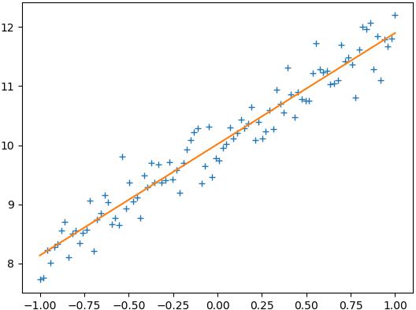

&emsp;&emsp;深度学习常见的是对于梯度的优化，优化器最后其实就是各种对于梯度下降算法的优化。`TensorFLow`提供了很多优化器的支持。

### tf.train.GradientDescentOptimizer

&emsp;&emsp;这个类是实现梯度下降算法的优化器。

### tf.train.AdadeltaOptimizer

&emsp;&emsp;实现了`Adadelta`算法的优化器，该算法不需要手动调优学习速率，抗噪声能力强，可以选择不同的模型结构。`Adadelta`是对`Adagrad`的扩展。`Adadelta`只累加固定大小的项，并且也不直接存储这些项，仅仅是计算对应的平均值。

### tf.train.AdagradOptimizer

&emsp;&emsp;实现了`AdagradOptimizer`算法的优化器，`Adagrad`会累加之前所有的梯度平方。它用于处理大的稀疏矩阵，`Adagrad`可以自动变更学习速率，只是需要设定一个全局的学习速率，但这并非是实际学习速率，实际的速率是与以往参数的模之和的开方成反比的。这样使得每个参数都有一个自己的学习率。

### tf.train.MomentumOptimizer

&emsp;&emsp;实现了`MomentumOptimizer`算法的优化器，如果梯度长时间保持一个方向，则增大参数更新幅度；反之，如果频繁发生符号翻转，则说明这是要减小参数更新幅度。可以把这一过程理解成从山顶放下一个球，会滑的越来越快。

### tf.train.RMSPropOptimizer

&emsp;&emsp;实现了`RMSPropOptimizer`算法的优化器，它与`Adam`类似，只是使用了不同的滑动均值。

### tf.train.AdamOptimizer

&emsp;&emsp;实现了`AdamOptimizer`算法的优化器，它综合了`Momentum`和`RMSProp`方法，对每个参数保留一个学习率与一个根据过去梯度信息求得的指数衰减均值。

### 如何选用optimizer

&emsp;&emsp;对于稀疏数据，使用学习率可自适应的优化方法，不用手动调节，而且最好采用默认值。`SGD`通常训练时间更长，容易陷入鞍点，但是在好的初始化和学习率调度方案的情况下，结果更可靠。
&emsp;&emsp;如果在意更快的收敛，并且需要训练较深较复杂的网络时，推荐使用学习率自适应的优化方法。`Adadelta`、`RMSprop`和`Adam`是比较相近的算法，在相似的情况下表现差不多。

``` python
import tensorflow as tf
import numpy as np
import matplotlib.pyplot as plt
​
train_X = np.linspace(-1, 1, 100)
train_Y = 2 * train_X + np.random.randn(*train_X.shape) * 0.33 + 10
​
# Define the model
X = tf.placeholder("float")
Y = tf.placeholder("float")
w = tf.Variable(0.0, name="weight")
b = tf.Variable(0.0, name="bias")
loss = tf.square(Y - X * w - b)
train_op = tf.train.GradientDescentOptimizer(0.01).minimize(loss)
​
with tf.Session() as sess:
    sess.run(tf.global_variables_initializer())
    epoch = 1

    for i in range(10):
        for (x, y) in zip(train_X, train_Y):
            _, w_value, b_value = sess.run([train_op, w, b], feed_dict={X: x, Y: y})

        print("Epoch: {}, w: {}, b: {}".format(epoch, w_value, b_value))
        epoch += 1
​
plt.plot(train_X, train_Y, "+")
plt.plot(train_X, train_X.dot(w_value) + b_value)
plt.show()
```

执行结果：

``` python
Epoch: 1, w: -0.9016109108924866, b: 9.692331314086914
Epoch: 2, w: 0.23304520547389984, b: 10.46933364868164
Epoch: 3, w: 1.0166758298873901, b: 10.325897216796875
Epoch: 4, w: 1.4419575929641724, b: 10.183098793029785
Epoch: 5, w: 1.6616896390914917, b: 10.101426124572754
Epoch: 6, w: 1.7738741636276245, b: 10.058719635009766
Epoch: 7, w: 1.8309777975082397, b: 10.036850929260254
Epoch: 8, w: 1.860023021697998, b: 10.025708198547363
Epoch: 9, w: 1.8747929334640503, b: 10.020042419433594
Epoch: 10, w: 1.8823031187057495, b: 10.017163276672363
```



---

&emsp;&emsp;这里使用`tensorflow`的优化器解决最优化问题。定义目标函数`loss = (x - 3)^2`：

``` python
import tensorflow as tf
​
x = tf.Variable(tf.truncated_normal([1]), name="x")
goal = tf.pow(x - 3, 2, name="goal")
​
with tf.Session() as sess:
    x.initializer.run()
    print(x.eval())
    print(goal.eval())
```

执行结果：

``` python
[0.20199603]
[7.828826]
```

求`goal`最小时的`x`值，使用梯度下降优化器可以解决问题：

``` python
import tensorflow as tf
​
x = tf.Variable(tf.truncated_normal([1]), name="x")
goal = tf.pow(x - 3, 2, name="goal")
​
optimizer = tf.train.GradientDescentOptimizer(learning_rate=0.1)
train_step = optimizer.minimize(goal)
​
def train():
    with tf.Session() as sess:
        x.initializer.run()

        for i in range(5):
            print("x:", x.eval())
            train_step.run()
            print("goal:", goal.eval())
​
train()
```

执行结果：

``` python
x: [-0.83802974]
goal: [9.427503]
x: [-0.07042378]
goal: [6.033601]
x: [0.543661]
goal: [3.8615048]
x: [1.0349288]
goal: [2.4713633]
x: [1.427943]
goal: [1.5816724]
```

&emsp;&emsp;`minimize`实际上是`compute_gradients`与`apply_gradients`的和，即拆分成计算梯度和应用梯度两个步骤：

``` python
import tensorflow as tf
​
x = tf.Variable(tf.truncated_normal([1]), name="x")
goal = tf.pow(x - 3, 2, name="goal")
​
optimizer = tf.train.GradientDescentOptimizer(learning_rate=0.1)
# compute_gradients返回的是“A list of (gradient, variable) pairs”
gra_and_var = optimizer.compute_gradients(goal)
train_step = optimizer.apply_gradients(gra_and_var)
​
def train():
    with tf.Session() as sess:
        x.initializer.run()
        for i in range(5):
            print("x: ", x.eval())
            train_step.run()
            print("goal:", goal.eval())
​
train()
```

执行结果：

``` python
x: [-0.10070122]
goal: [6.153183]
x: [0.51943904]
goal: [3.938037]
x: [1.0155512]
goal: [2.5203435]
x: [1.412441]
goal: [1.6130198]
x: [1.7299528]
goal: [1.0323327]
```