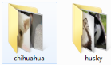
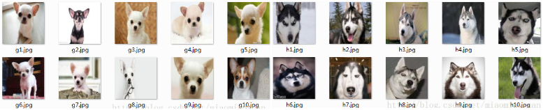

&emsp;&emsp;关于`TensorFlow`读取数据，官网给出了三种方法：

- 供给数据：在`TensorFlow`程序运行的每一步，让`Python`代码来供给数据。
- 从文件读取数据：在`TensorFlow`图的起始，让一个输入管线从文件中读取数据。
- 预加载数据：在`TensorFlow`图中定义常量或变量来保存所有数据(仅适用于数据量比较小的情况)。

&emsp;&emsp;对于数据量较小而言，可能一般选择直接将数据加载进内存，然后再分`batch`输入网络进行训练(使用这种方法时，结合`yield`使用更为简洁)。如果数据量较大，这样的方法就不适用了，因为太耗内存，所以这时最好使用`TensorFlow`提供的队列`queue`，也就是第二种方法从文件读取数据。这里介绍一种比较通用且高效的读取方法，就是使用`TensorFlow`内定标准格式，即`TFRecords`。

### TFRecords

&emsp;&emsp;`TFRecords`其实是一种二进制文件，虽然它不如其他格式容易理解，但是它能更好的利用内存，更方便地复制和移动，并且不需要单独的标签文件。
&emsp;&emsp;`TFRecords`文件包含了`tf.train.Example`协议内存块(`protocol buffer`)，协议内存块包含了字段`Features`。我们可以写一段代码获取数据，将数据填入到`Example`协议内存块，并且将协议内存块序列化为一个字符串，通过`tf.python_io.TFRecordWriter`写入到`TFRecords`文件。
&emsp;&emsp;从`TFRecords`文件中读取数据，可以使用`tf.TFRecordReader`的`tf.parse_single_example`解析器，这个操作可以将`Example`协议内存块解析为张量。

### 生成TFRecords文件

&emsp;&emsp;笔者找了`2`类狗的图片，即哈士奇和吉娃娃，全部`resize`成`128 * 128`大小，如下图所示，保存地址为`/home/data/dog`：



每类中有`10`张图片：



现在利用这`2`类`20`张图片制作`TFRecord`文件。
&emsp;&emsp;`tfrecord`会根据你选择输入文件的类，自动给每一类打上同样的标签，例如在本例中只有`0`和`1`两类。制作`TFRecord`文件的代码如下：

``` python
import os
import tensorflow as tf
from PIL import Image
​
cwd = '/home/data/'
classes = {'husky', 'chihuahua'}  # 人为设定为2类
writer = tf.python_io.TFRecordWriter("dog_train.tfrecords")  # 要生成的文件
​
for index, name in enumerate(classes):
    class_path = cwd + name + '/'

    for img_name in os.listdir(class_path):
        img_path = class_path + img_name  # 每一个图片的地址
        img = Image.open(img_path)
        img = img.resize((128, 128))
        img_raw = img.tobytes()  # 将图片转化为二进制格式
        # example对象对label和image数据进行封装
        example = tf.train.Example(features=tf.train.Features(feature={
            "label": tf.train.Feature(int64_list=tf.train.Int64List(value=[index])),
            'img_raw': tf.train.Feature(bytes_list=tf.train.BytesList(value=[img_raw]))
        }))
        writer.write(example.SerializeToString())  # 序列转化为字符串
​
writer.close()
```

运行完这段代码后，会生成`dog_train.tfrecords`文件。

### 读取TFRecord文件

&emsp;&emsp;在制作完`tfrecord`文件后，将该文件读入到数据流中：

``` python
def read_and_decode(filename):  # 读入dog_train.tfrecords
    filename_queue = tf.train.string_input_producer([filename])  # 生成一个queue队列
    reader = tf.TFRecordReader()
    _, serialized_example = reader.read(filename_queue)  # 返回文件名和文件
    features = tf.parse_single_example(
     serialized_example,
     features={
         'label': tf.FixedLenFeature([], tf.int64),
         'img_raw': tf.FixedLenFeature([], tf.string),})  # 将image数据和label取出来
​
    img = tf.decode_raw(features['img_raw'], tf.uint8)
    img = tf.reshape(img, [128, 128, 3])  # reshape为“128 * 128”的3通道图片
    img = tf.cast(img, tf.float32) * (1. / 255) - 0.5  # 在流中抛出img张量
    label = tf.cast(features['label'], tf.int32)  # 在流中抛出label张量
    return img, label
```

注意，`feature`的属性`label`和`img_raw`名称要和制作时统一，返回的`img`数据和`label`数据一一对应，它们是`2`个`tf`张量。

### 显示tfrecord格式的图片

&emsp;&emsp;有时我们希望检查分类是否有误，或者在之后的网络训练过程中可以监视、输出图片，来观察分类等操作的结果，那么就可以在`session`回话中，将`tfrecord`的图片从流中读取出来，再保存：

``` python
filename_queue = tf.train.string_input_producer(["dog_train.tfrecords"])  # 读入流中
reader = tf.TFRecordReader()
_, serialized_example = reader.read(filename_queue)  # 返回文件名和文件
features = tf.parse_single_example(
    serialized_example,
    features={
        'label': tf.FixedLenFeature([], tf.int64),
        'img_raw': tf.FixedLenFeature([], tf.string),})  # 取出包含image和label的feature对象
​
image = tf.decode_raw(features['img_raw'], tf.uint8)
image = tf.reshape(image, [128, 128, 3])
label = tf.cast(features['label'], tf.int32)
​
with tf.Session() as sess:  # 开始一个会话
    init_op = tf.initialize_all_variables()
    sess.run(init_op)
    coord = tf.train.Coordinator()
    threads = tf.train.start_queue_runners(coord=coord)

    for i in range(20):
        example, l = sess.run([image, label])  # 在会话中取出image和label
        img = Image.fromarray(example, 'RGB')  # 这里Image是之前提到的
        img.save(cwd + str(i) + '_''Label_' + str(l) + '.jpg')  # 保存图片
        print(example, l)

    coord.request_stop()
    coord.join(threads)
```

代码运行完后，从`tfrecord`中取出的文件被保存了：


可以看到，图片文件名的第一个数字表示在流中的顺序，第二个数字则是每个图片的`label`，吉娃娃都为`0`，哈士奇都为`1`。由此可见，我们一开始制作`tfrecord`文件时，图片分类正确。