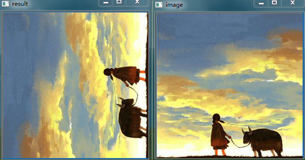
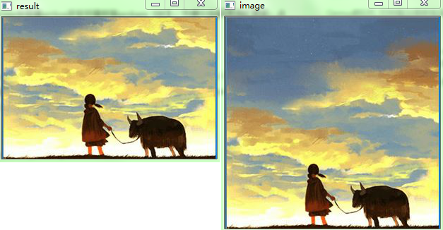
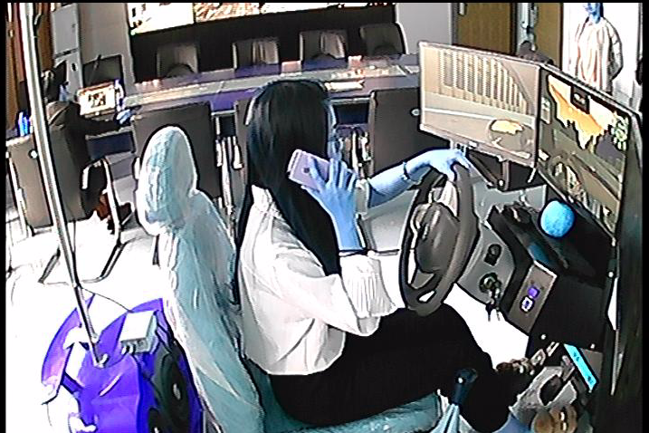
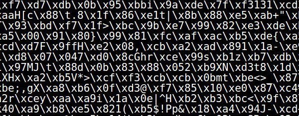

### TensorFlow与OpenCV

&emsp;&emsp;`OpenCV`读入图片，使用`tf.Variable`初始化为`tensor`，加载到`tensorflow`对图片进行转置操作，然后`opencv`显示转置后的结果：

``` python
import tensorflow as tf
import cv2
​
filename = "index.jpg"
image = cv2.imread(filename, 1)
cv2.imshow('image', image)
​
x = tf.Variable(image, name='x')
​
model = tf.global_variables_initializer()
​
with tf.Session() as session:
    x = tf.transpose(x, perm=[1, 0, 2])
    session.run(model)
    result = session.run(x)
​
cv2.imshow('result', result)
cv2.waitKey(0)
```



&emsp;&emsp;`OpenCV`读入图片，使用`tf.placeholder`符号变量加载到`tensorflow`里，然后`tensorflow`对图片进行剪切操作，最后`opencv`显示处理后的结果：

``` python
import tensorflow as tf
import cv2
​
filename = "index.jpg"
raw_image_data = cv2.imread(filename)
cv2.imshow('image', raw_image_data)
image = tf.placeholder("uint8", [None, None, 3])
slice = tf.slice(image, [100, 0, 0], [200, -1, -1])
​
with tf.Session() as session:
    result = session.run(slice, feed_dict={image: raw_image_data})
    print(result.shape)
​
cv2.imshow('result', result)
cv2.waitKey(0)
```



&emsp;&emsp;`TensorFlow`解码`png`格式文件：

``` python
import tensorflow as tf
import cv2
​
file_name = "call.1.png"
file_contents = tf.read_file(file_name)
​
image = tf.image.decode_png(file_contents)  # 解码png格式
​
with tf.Session() as sess:
    sess.run(tf.global_variables_initializer())
    img = sess.run(image)
    print(img.shape)
    cv2.imshow("show", img)
    cv2.waitKey(0)
```



---

### image类图像操作Ops之编码

&emsp;&emsp;在源码路径`tensorflow/tensorflow/python/ops`下存在很多使用`python`实现的`ops`，其中`tensorflow`的`image`类操作就是在该目录下定义实现的，对应的文件是`image_ops_impl.py`。

#### 编码(decode_*)

&emsp;&emsp;我们读进一张图片后，往往得到的是字符串张量，如下图所示，并非是常见的张量形式。我们是没办法直接使用图片来训练的，于是`decode_*`的作用就是要把字符串张量转为特定格式的张量。



#### 解码(encode_*)

&emsp;&emsp;解码操作可以把一个张量编码成为某种图片格式，得到的是一个字符串张量，它是某种图片格式数据。

#### tf.image.decode_gif

&emsp;&emsp;函数原型如下：

``` python
tf.image.decode_gif(contents, name=None)
```

- `contents`：`gif`图片字符串`0-D`张量。
- `name`：指定的`OP`操作名字(可选项)。

该函数返回`dtype`为`uint8`的`4-D`张量，其`shape`为`[num_frames, height, width, 3]`。

#### tf.image.decode_jpeg

&emsp;&emsp;`tf.image.decode_jpeg`函数原型如下：

``` python
tf.image.decode_jpeg(
    contents, channels=0, ratio=1, fancy_upscaling=True,
    try_recover_truncated=False, acceptable_fraction=1,
    dct_method="", name=None)
```

- `contents`：`jpeg`图片字符串`0-D`张量。
- `channels`：图片通道数，指定`decode`生成张量的`RGB`通道数。
- `ratio`：缩放系数，默认设定为`1`，即不做缩放，只能为`int`。
- `name`：指定的`OP`操作名字(可选项)。

该函数返回`dtype`为`uint8`的`3-D`张量，其`shape`为`[height, width, channels]`。

#### tf.image.encode_jpeg

&emsp;&emsp;函数原型如下：

``` python
tf.image.encode_jpeg(
    image, format="", quality=95, progressive=False, optimize_size=False, chroma_downsampling=True,
    density_unit="in", x_density=300, y_density=300, xmp_metadata="", name=None)
```

- `image`：`dtype`为`uint8`的`3-D`张量，其`shape`为`[height, width, channels]`。
- `format`：编码格式，可选择`grayscale`和`rgb`，默认为空(根据传入`image`的格式来决定输出格式)。
- `quality`：压缩品质，范围为`0`至`100`，值越高其压缩得到的图片品质越好。
- `chroma_downsampling`：色度抽样，这里默认压缩色度。

该函数返回`dtype`为`string`的`0-D`张量，且其格式为`jpeg`。
&emsp;&emsp;下面是一个`encode_jpeg`设定`format`为`grayscale`，且缩放系数为`2`，然后再用`opencv`来`show`出的图像：

``` python
import tensorflow as tf
import cv2
​
img_name = "girl.jpg"
image_jpg = tf.read_file(img_name)
imgage_decode_jpeg = tf.image.decode_jpeg(image_jpg, channels=1, ratio=2, name="decode_jpeg_1")
print(imgage_decode_jpeg.shape)
print(imgage_decode_jpeg.dtype)
​
sess = tf.Session()
imgage_encode_jpeg = tf.image.encode_jpeg(sess.run(imgage_decode_jpeg), format='grayscale', name="encode_jpeg")
print(imgage_encode_jpeg.shape)
print(imgage_encode_jpeg.dtype)
img = tf.image.decode_jpeg(sess.run(imgage_encode_jpeg), ratio=2, name="decode_jpeg_2")
​
img = cv2.imshow("img", sess.run(img))
cv2.waitKey(0)
```

#### tf.image.decode_png

&emsp;&emsp;函数原型如下：

``` python
tf.image.decode_png(contents, channels=0, dtype=_dtypes.uint8, name=None)
```

- `contents`：`dtype`为`string`的`0-D`张量，图像为`png`格式。
- `channels`：`decode`的输出通道数，可选`0`至`4`，默认根据所传图像来决定。

该函数返回所传参数`dtype`的`3-D`张量，其`shape`为`[height, width, channels]`。

#### tf.image.encode_png

&emsp;&emsp;函数原型如下：

``` python
tf.image.encode_png(image, compression=-1, name=None)
```

- `image`：`dtype`为`uint8`或`uint16`的`3-D`张量，其`shape`为`[height, width, channels]`。
- `compression`：压缩级数，数值越高得到的图像质量越差。

该函数返回`dtype`为`string`的`0-D`张量，且其格式为`png`。
&emsp;&emsp;下面的代码将图片从`jpg`格式转为`png`格式：

``` python
import tensorflow as tf
import cv2
​
img_name = "girl.jpg"
image_jpg = tf.read_file(img_name)
imgage_decode_jpeg = tf.image.decode_jpeg(image_jpg, channels=3, ratio=2, name="decode_jpeg_1")
print(imgage_decode_jpeg.shape)
print(imgage_decode_jpeg.dtype)
​
sess = tf.Session()
imgage_encode_png = tf.image.encode_png(sess.run(imgage_decode_jpeg), name="encode_png")
print(imgage_encode_png.shape)
print(imgage_encode_png.dtype)
​
img = tf.image.decode_png(sess.run(imgage_encode_png), name="decode_png")
​
img = cv2.imshow("img", sess.run(img))
cv2.waitKey(0)
```

#### tf.image.decode_image

&emsp;&emsp;函数原型如下：

``` python
tf.image.decode_image(contents, channels=None, name=None)
```

- `contents`：可传入任何格式的图像，包括`jpeg`、`png`、`gif`及`bmp`，`dtype`为`string`的`0-D`张量。
- `channels`：`decode`的输出通道数，可选`0`至`4`，默认根据所传图像来决定。

如果图片的格式是`BMP`、`JPEG`或`PNG`时，返回`[height, width, num_channels]`，而`gif`返回`[num_frames, height, width, 3]`，且它们的`dtype`都为`uint8`，这会导致`dtype`为`uint16`的`png`格式图像失真。这是一个兼容`gif`、`jpeg`、`png`及`bmp`格式的`decode`接口，它将会根据所传的图像自动返回特定格式的张量。
&emsp;&emsp;以下是传入`jpg`格式图像到`decode_image`，然后再使用`opencv`来显示`jpeg`编解码器生成的图片：

``` python
import tensorflow as tf
import cv2
​
img_name = "apple.jpg"
image_jpg = tf.read_file(img_name)
imgage_decode = tf.image.decode_image(image_jpg, name="decode_image")
print(imgage_decode.shape)
print(imgage_decode.dtype)
​
sess = tf.Session()
imgage_encode_jpeg = tf.image.encode_jpeg(
                        sess.run(imgage_decode), quality=100, progressive=True,
                        chroma_downsampling=False, optimize_size=True, name="encode_jpeg")
print(imgage_encode_jpeg.shape)
print(imgage_encode_jpeg.dtype)
​
img = tf.image.decode_png(sess.run(imgage_encode_jpeg), name="decode_jpeg")
​
img = cv2.imshow("img", sess.run(img))
cv2.waitKey(0)
```

### image类图像操作Ops之大小重调和图像标注框

#### resize_images

&emsp;&emsp;函数原型如下：

``` python
resize_images(images, size, method=ResizeMethod.BILINEAR, align_corners=False)
```

- `images`：`shape`为`[batch, height, width, channels]`的`4-D`图像张量或者`shape`为`[height, width, channels]`的`3-D`图像张量，如果传入图像张量不兼容，所制定规则会报错。
- `size`：一个`dtype`为`int32`拥有两个元素的`1-D`张量，格式为`[new_height, new_width]`。
- `method`：`resize`使用的方法，有四种方式：

1. `ResizeMethod.BILINEAR`：双线性内插，其核心思想是在两个方向分别进行一次线性插值。
2. `ResizeMethod.NEAREST_NEIGHBOR`：最近邻插值法，将变换后的图像中的原像素点最邻近像素的灰度值赋给原像素点的方法，返回图像张量`dtype`与所传入的相同。
3. `ResizeMethod.BICUBIC`：双三次插值，双三次插值是一种更加复杂的插值方式，它能创造出比双线性插值更平滑的图像边缘。
4. `ResizeMethod.AREA`：基于区域的图像插值算法，首先将原始低分辨率图像分割成不同区域，然后将插值点映射到低分辨率图像，判断其所属区域，最后根据插值点的邻域像素设计不同的插值公式，计算插值点的值。

- `align_corners`：精确对准输入输出图像的四个角，默认为`false`，不精确对准。

该函数返回`dtype`为`float`的`3-D`或`4-D`图像张量，其`shape`分别为`[batch, new_height, new_width, channels]`和`[new_height, new_width, channels]`。
&emsp;&emsp;而其余四个接口则是具体的不同实现图像缩放处理的方法，它们的参数都形如：

``` python
(images, size, align_corners=False, name=None)
```

第一个参数要求其`shape`一定是形如`[batch, height, width, channels]`的`4-D`格式，中间两个参数如`resize_image`所解释，后一个`name`是操作的名称(可选项)。
&emsp;&emsp;下面是用`matplotlib`来显示四种不同缩放处理方法后的图像对比：

``` python
import tensorflow as tf
import matplotlib.pyplot as plt
​
img_name = ["apple.jpg"]
filename_queue = tf.train.string_input_producer(img_name)
img_reader = tf.WholeFileReader()
_, image_jpg = img_reader.read(filename_queue)
​
image_decode_jpeg = tf.image.decode_png(image_jpg)
image_decode_jpeg = tf.image.convert_image_dtype(image_decode_jpeg, dtype=tf.float32)
​
sess = tf.Session()
coord = tf.train.Coordinator()
threads = tf.train.start_queue_runners(sess=sess, coord=coord)
​
image_bilinear = tf.image.resize_images(image_decode_jpeg, size=[1200, 1920], method=tf.image.ResizeMethod.BILINEAR)
image_nearest_neighbor = tf.image.resize_images(
                            image_decode_jpeg, size=[728, 1280],
                            method=tf.image.ResizeMethod.NEAREST_NEIGHBOR)
image_bicubic = tf.image.resize_images(image_decode_jpeg, size=[720, 1440], method=tf.image.ResizeMethod.BICUBIC)
image_area = tf.image.resize_images(image_decode_jpeg, size=[1080, 1920], method=tf.image.ResizeMethod.AREA)
​
print(image_bicubic.shape)
print(image_bicubic.dtype)
​
plt.figure()
plt.subplot(221)
plt.imshow(sess.run(image_bilinear))
plt.title("bilinear interpolation")
plt.subplot(222)
plt.imshow(sess.run(image_nearest_neighbor))
plt.title("nearest neighbor interpolation")
plt.subplot(223)
plt.imshow(sess.run(tf.image.convert_image_dtype(image_bicubic, dtype=tf.uint8)))
plt.title("bicubic interpolation")
plt.subplot(224)
plt.imshow(sess.run(tf.image.convert_image_dtype(image_area, dtype=tf.float32)))
plt.title("area interpolation")
plt.show()
```

#### tf.image.resize_bilinear

&emsp;&emsp;该函数使用双线性插值调整`images`为`size`，输入图像可以是不同的类型，但输出图像总是浮点型的：

``` python
tf.image.resize_bilinear(images, size, align_corners=False, name=None)
```

- `images`：一个`Tensor`，必须是下列类型之一：`int8`、`uint8`、`int16`、`uint16`、`int32`、`int64`、`float16`、`float32`和`float64`，`4`维的并且具有形状`[batch, height, width, channels]`。
- `size`：`2`个元素`(new_height, new_width)`的`1`维`int32`张量，用来表示图像的新大小。
- `align_corners`：可选的`bool`。如果为`True`，则输入和输出张量的`4`个角像素的中心对齐，并且保留角落像素处的值。
- `name`：操作的名称(可选项)。