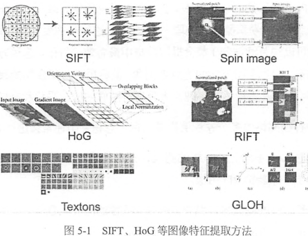
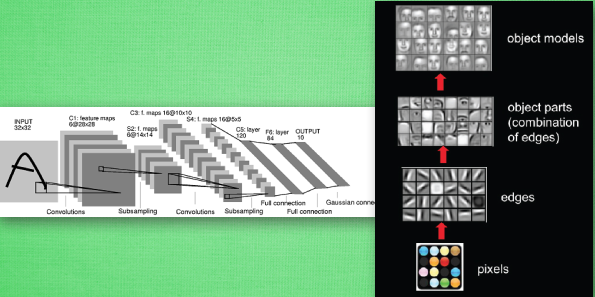
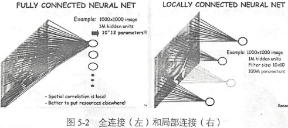
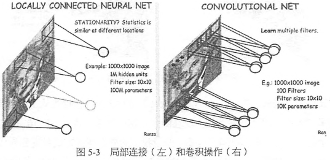

### 卷积神经网络概述

&emsp;&emsp;卷积神经网络(`Convolutional Neural Network`，`CNN`)最初是为解决图像识别等问题设计的，`CNN`现在的应用已经不限于图像和视频，也可用于时间序列信号，比如音频信号和文本数据等。在早期的图像识别研究中，最大的挑战是如何组织特征，因为图像数据不向其他类型的数据那样可以通过人工理解提取特征。在深度学习之前，我们必须借助`SIFT`、`HoG`等算法提取具有良好区分性的特征，再集合`SVM`等机器学习的算法进行图像识别。



&emsp;&emsp;`CNN`作为一个深度学习架构被提出的最初诉求，是降低对图像数据预处理的要求，避免复杂的特征工程。`CNN`可以直接使用图像的原始像素作为输入，而不必先使用`SIFT`等算法提取特征，减轻了使用传统算法如`SVM`时需要做的大量重复、繁琐的数据预处理工作。和`SIFT`算法类似，`CNN`训练的模型同样对缩放、平移、旋转等畸变具有不变性，有很强的泛化性。
&emsp;&emsp;在卷积神经网络中，第一个卷积层会直接接受图像像素级的输入，每一个卷积只操作一小块图像，进行卷积变化后再传到后面的网络。每一层卷积(滤波器)都会提取数据中最有效的特征，这种方法可以提取到图像中最基础的特征，比如不同方向的边或角，而后再进行组合和抽象形成更高阶的特征，因此`CNN`在理论上具有对图像缩放、平移和旋转的不变性。
&emsp;&emsp;卷积的意义就是让神经网络不再是对每个像素的输入信息做处理，而是图片上每一小块像素区域进行处理，这种做法加强了图片信息的连续性，使得神经网络能看到图形，而非一个点。这种做法同时也加深了神经网络对图片的理解，具体来说，卷积神经网络有一个批量过滤器，它会持续不断地在图片上滚动并收集图片里的信息。每一次收集的时候都只是收集一小块像素区，然后把收集来的信息进行整理，这时候整理出来的信息有了一些实际上的呈现，比如这时的神经网络能看到一些边缘的图片信息。然后再以同样的步骤，用类似的批量过滤器扫过产生的这些边缘信息，神经网络从这些边缘信息里面总结出更高层的信息结构，比如说总结的边缘能够画出眼睛、鼻子等。再经过一次过滤，脸部的信息也从这些眼睛鼻子的信息中被总结出来。最后我们再把这些信息套入几层普通的全连接神经层进行分类，这样就能得到输入的图片能被分为哪一类的结果了。



&emsp;&emsp;一般的卷积神经网络由多个卷积层构成，每个卷积层中通常有如下几个操作：

1. 图像通过多个不同的卷积核的滤波，并加偏置(`bias`)，提取局部特征，每一个卷积核会映射出一个新的`2D`图像。
2. 将前面卷积核的滤波输出结果，进行非线性的激活函数处理。
3. 对激活函数的结果再进行池化操作(即降采样，比如将`2 * 2`的图片降为`1 * 1`的图片)，一般是使用最大池化，保留最显著的特征，并提升模型的畸变容忍能力。

&emsp;&emsp;一个卷积层中可以有多个不同的卷积核，而每一个卷积核都对应一个滤波后的映射新图像，同一个新图像中每一个像素都来自完全相同的卷积核，这就是卷积核的权值共享。为什么要共享卷积核的权值参数呢？答案很简单，降低模型复杂度，减轻过拟合并降低计算量。假设输入图像尺寸是`1000 * 1000`，并且假定是灰度图像，即只有一个颜色通道，那么一张图片就有`100`万个像素点，输入维度就是`100`万。如果采用全连接层(`Fully Connected Layer`，`FCL`)的话，隐含层与输入层相同大小(`100`万个隐含层节点)，那么将产生`100万 * 100万 = 1万亿`个连接，仅此就有`1`万亿个参数需要去训练，这是不可想象的。
&emsp;&emsp;考虑到人的视觉感受野的概念，每一个感受野只接受一小块区域的信号，每一个神经元不需要接收全部像素点的信息，只需要接收局部像素点作为输入，而将所有这些神经元接收的局部信息综合起来就可以得到全局的信息。于是将之前的全连接模式修改为局部连接，假设局部感受野大小是`10 * 10`，即每个隐含节点只与`10 * 10`个像素点相连，那么现在只需要`10 * 10 * 100万 = 1亿`个连接了，相比之前的`1`万亿已经缩小了`10000`倍。



&emsp;&emsp;假设我们的局部连接方式是卷积操作，即默认每一个隐含节点的参数都完全一样，那么我们的参数将会是`10 * 10 = 100`个。不论图像尺寸有多大，都是这`100`个参数，即卷积核的尺寸，这就是卷积对减小参数量的贡献。这也就是所谓的权值共享。如果我们只有一个卷积核，就只能提取一种卷积滤波的结果，即只能提取一种图片特征，这不是我们期望的结果。好在图像中最基本的特征很少，我们可以增加卷积核的数量来多提取一些特征。图像中的基本特征无非就是点和边，无论多么复杂的图像都是点和边组合而成。我们采取增加卷积核的数量来多提取一些特征，每一个卷积核滤波得到的图像就是一类特征的映射，即一个`Feature Map`。一般来说，我们使用`100`个卷积核在第一个卷积层就足够了，这样我们有`100 * 100 = 10000`个参数相比之前的`1`亿又缩小了`10000`倍。卷积的好处是，不管图片尺寸如何，需要训练的参数数量只跟卷积核大小和数量有关，我们可以使用非常少的参数量处理任意大小的图片。每一个卷积层提取的特征，在后面的层中都会抽象组合成更高阶的特征，而且多层抽象的卷积网络表达能力更强，效率更高。当然需要注意的是，尽管需要训练的参数数量大大下降了，但是隐含节点的数量并没有下降，隐含节点的数量只跟卷积的步长有关系。如果步长为`1`，那么隐含节点的数量和输入图像像素数量一致；如果步长为`5`，那么每`5 * 5`的像素才需要一个隐含节点，隐含节点的数量就是输入像素数量的`1 / 25`。



&emsp;&emsp;卷积神经网络`CNN`的要点就是局部连接(`Local Connection`)、权值共享(`Weights Sharing`)和池化层(`Pooling`)中的降采样(`Down-Sampling`)。其中，局部连接和权值共享降低了参数量，使训练复杂度大大下降，并减轻了过拟合。同时权值共享还赋予了卷积网络对平移的容忍性，池化层降采样则进一步降低了输出参数量，并赋予模型对轻度形变的容忍性，提高了模型的泛化能力。可以把卷积层卷积操作理解为用少量参数在图像的多个位置上提取相似特征的过程。

### TensorFlow实现简单的卷积网络

&emsp;&emsp;首先载入`MNIST`数据集，采用独热编码，并创建`tf.InteractiveSession`：

``` python
import tensorflow as tf
from tensorflow.examples.tutorials.mnist import input_data
​
mnist = input_data.read_data_sets("MNIST_data/", one_hot=True)
sess = tf.InteractiveSession()
```

为了创建这个模型，我们需要创建大量的权重和偏置项。这个模型中的权重在初始化时应该加入少量的噪声来打破对称性以及避免`0`梯度。由于我们使用的是`ReLU`神经元，因此比较好的做法是用一个较小的正数来初始化偏置项，以避免神经元节点输出恒为`0`的问题(`dead neurons`)。为了不在建立模型的时候反复做初始化操作，我们定义两个函数用于初始化：

``` python
def weight_variable(shape):
    initial = tf.truncated_normal(shape, stddev=0.1)
    return tf.Variable(initial)
​
def bias_variable(shape):
    initial = tf.constant(0.1, shape=shape)
    return tf.Variable(initial)
```

&emsp;&emsp;卷积层、池化层是接下来重复使用的，这里的`tf.nn.conv2d`是`TensorFlow`中的`2`维卷积函数，参数`x`是输入，`W`是卷积的参数，比如`[5, 5, 1, 32]`，前两个数字代表卷积核的尺寸，第三个数字代表有多少个`channel`(这里用灰度图像，所以设为`1`，彩色图像则设为`3`)。最后一个数字代表卷积核的数量，也就是这个卷积层会提取多少类的特征。`Strides`代表卷积模板移动的步长，都是`1`代表会不遗漏地划过图片的每一个点。`Padding`代表边界的处理方式，这里的`SAME`代表给边界加上`Padding`，让卷积的输出和输入保持同样的尺寸。
&emsp;&emsp;`tf.nn.max_pool`是`TensorFlow`中的最大池化函数，我们这里使用`2 * 2`的最大池化，最大池化会保留原始像素块中灰度值最高的那一个像素，即保留最显著的特征。因为希望整体上缩小图片尺寸，因此池化层的`stride`也设为横竖两个方向以`2`为步长。如果步长还是`1`，那么我们会得到一个尺寸不变的图片：

``` python
def conv2d(x, W):
    return tf.nn.conv2d(x, W, strides=[1, 1, 1, 1], padding='SAME')
​
def max_pool_2x2(x):
    return tf.nn.max_pool(x, ksize=[1, 2, 2, 1], strides=[1, 2, 2, 1], padding='SAME')
```

&emsp;&emsp;在正式设计卷积神经网络之前，先定义输入的`placeholder`，其中`x`是特征，`y`是真实的`label`。因为卷积神经网络会利用到空间结构信息，因此需要将`1D`的输入向量转为`2D`的图片结构，即从`1 * 784`的形式转为`28 * 28`的结构。因为只有一个颜色通道，故最终尺寸为`[-1, 28, 28, 1]`，`-1`代表样本数量不固定，第`2`和第`3`维对应图片的宽、高，`1`代表颜色通道数量。这里我们使用`tensor`变形函数是`tf.reshape`：

``` python
n_input  = 784  # “28 * 28”的灰度图，像素个数784
n_output = 10   # 10分类问题
​
x = tf.placeholder(tf.float32, [None, n_input])
y = tf.placeholder(tf.float32, [None, n_output])
x_image = tf.reshape(x, [-1, 28, 28, 1])
```

&emsp;&emsp;接下来定义第一个卷积层，使用前面写好的函数进行参数初始化，包括`weight`和`bias`，这里的`[5, 5, 1, 32]`代表卷积核尺寸为`5 * 5`，`1`个颜色通道，`32`个不同的卷积核。然后使用`conv2d`函数进行卷积操作，并加上偏置，接着再使用`ReLU`函数进行非线性处理。最后使用最大池化函数`max_pool_2x2`对卷积的结果进行池化操作：

``` python
W_conv1 = weight_variable([5, 5, 1, 32])
b_conv1 = bias_variable([32])
h_conv1 = tf.nn.relu(conv2d(x_image, W_conv1) + b_conv1)
h_pool1 = max_pool_2x2(h_conv1)
```

&emsp;&emsp;为了构建一个更深的网络，我们会把几个类似的层堆叠起来。现在定义第二个卷积层，基本上和第一个卷积层一样，唯一不同的是卷积核的数量变成了`64`，也就是说这一层的卷积会提取`64`种特征：

``` python
W_conv2 = weight_variable([5, 5, 32, 64])
b_conv2 = bias_variable([64])
h_conv2 = tf.nn.relu(conv2d(h_pool1, W_conv2) + b_conv2)
h_pool2 = max_pool_2x2(h_conv2)
```

&emsp;&emsp;前面经过两次步长为`2 * 2`的最大池化，所以变长已经只有`1/4`了，图片的尺寸由`28 * 28`变成了`7 * 7`。而第二个卷积层的卷积核数量为`64`，其输出的`tensor`尺寸即为`7 * 7 * 64`。我们使用`tf.reshape`函数对第二个卷积层的输出`tensor`进行变形，将其转成`1D`的向量，然后连接一个全连接层，隐含节点为`1024`，并使用`ReLU`激活函数：

``` python
W_fc1 = weight_variable([7 * 7 * 64, 1024])
b_fc1 = bias_variable([1024])
h_pool2_flat = tf.reshape(h_pool2, [-1, 7 * 7 * 64])
h_fc1 = tf.nn.relu(tf.matmul(h_pool2_flat, W_fc1) + b_fc1)
```

为了减少过拟合，我们在输出层之前加入`dropout`。我们用一个`placeholder`来代表一个神经元的输出在`dropout`中保持不变的概率，这样可以在训练过程中启用`dropout`，在测试过程中关闭`dropout`。`TensorFlow`的`tf.nn.dropout`操作除了可以屏蔽神经元的输出外，还会自动处理神经元输出值的`scale`，所以用`dropout`的时候可以不用考虑`scale`：

``` python
keep_prob = tf.placeholder(tf.float32)
h_fc1_drop = tf.nn.dropout(h_fc1, keep_prob)
```

最后将`Dropout`层的输出连接一个`Softmax`层，得到最后的概率输出：

``` python
W_fc2 = weight_variable([1024, 10])
b_fc2 = bias_variable([10])
pred = tf.nn.softmax(tf.matmul(h_fc1_drop, W_fc2) + b_fc2)
```

损失函数和优化器如下：

``` python
cost = tf.reduce_mean(-tf.reduce_sum(y * tf.log(pred), reduction_indices=[1]))
optm = tf.train.AdamOptimizer(0.001).minimize(cost)
```

再继续定义评测准确率的操作：

``` python
corr = tf.equal(tf.argmax(pred, 1), tf.argmax(y, 1))
accuracy = tf.reduce_mean(tf.cast(corr, tf.float32))
```

为了进行训练和评估，我们使用与之前简单的单层`Softmax`神经网络模型几乎相同的一套代码，只是我们会用更加复杂的`ADAM`优化器来做梯度最速下降。在`feed_dict`中加入额外的参数`keep_prob`来控制`dropout`比例，然后每`10`次迭代输出一次日志：

``` python
tf.global_variables_initializer().run()
training_epochs = 200
batch_size = 100
display_step = 10
​
for i in range(training_epochs):
    batch = mnist.train.next_batch(batch_size)
    optm.run(feed_dict={x: batch[0], y: batch[1], keep_prob: 0.7})

    if i % display_step == 0:
        train_accuracy = accuracy.eval(feed_dict={x: batch[0], y: batch[1], keep_prob: 1.0})
        test_accuracy = accuracy.eval(feed_dict={x: mnist.test.images, y: mnist.test.labels, keep_prob: 1.0})
        print("step: %d TRAIN ACCURACY: %.3f TEST ACCURACY: %.3f" % (i, train_accuracy, test_accuracy))
```

最后，这个`CNN`模型的准确率为`99.2%`，基本上可以满足手写数字识别的要求。