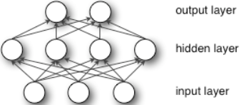
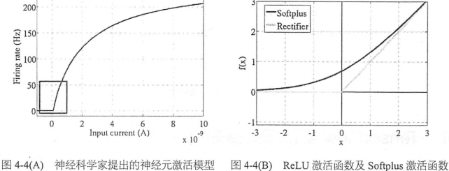

### 多层感知机简介

&emsp;&emsp;多层感知机(`Multilayer Perceptron`，`MLP`)也叫做人工神经网络(`Artificial Neural Network`，`ANN`)，除了输入和输出层，它中间可以有多个隐层。最简单的`MLP`只含一个隐层，即三层的结构，如下图所示。可以看到，多层感知机层与层之间是全连接的(`全连接`是指上一层的任何一个神经元与下一层的所有神经元都有连接)。单层感知器只能学习线性函数，而多层感知器也可以学习非线性函数。



&emsp;&emsp;`Softmax`回归可以算是多分类问题`logistic`回归，它和神经网络的最大区别是没有隐含层。理论上只要隐含节点足够多，即使只有一个隐含层的神经网络也可以拟合任意函数；同时，隐含层数越多，越容易拟合复杂结构。为了拟合复杂函数，需要的隐含节点的数目基本上随着隐含层的数量增多呈指数下降的趋势，也就是说层数越多，神经网络所需要的隐含节点可以越少。层数越深，概念越抽象，需要背诵的知识点就越少。在实际应用中，深层神经网络会遇到许多困难，如过拟合、参数调试、梯度弥散等。
&emsp;&emsp;参数调试问题尤其是`SGD`(`StochasticGradient Descent`)的参数，对`SGD`设置不同的学习率，最后得到的结果可能差异巨大。神经网络的优化通常不是一个简单的凸优化问题，它处处充满了局部最优。有理论表示，神经网络可能有很多个局部最优解都可以达到比较好的分类效果，而全局最优很可能造成过拟合。对于`SGD`，我们希望一开始学习率大一些，加速收敛，在训练的后期又希望学习率小一些，这样可以低速进入一个局部最优解。不同的机器学习问题的学习率设置也需要针对性的调试，像`Adagrad`、`Adam`、`Adadelta`等自适应的方法可以减轻调试参数的负担。对于这些优化算法，通常我们使用其默认的参数设置就可以得到比较好的效果。
&emsp;&emsp;梯度弥散(`Gradient Vanishment`)是另一个影响深层神经网络训练的问题，在`ReLU`激活函数出现之前，神经网络训练是使用`Sigmoid`作为激活函数。非线性的`Sigmoid`函数在信号的特征空间映射上，对中央区的信号增益较大，对两侧区的信号增益小。当神经网络层数较多时，`Sigmoid`函数在反向传播中梯度值会逐渐减小，到达前面几层的梯度值就变得非常小了，在神经网络训练的时候，前面几层的神经网络参数几乎得不到训练更新。直到`ReLU`(`y = max(0, x)`)的出现才比较完美地解决了梯度弥散的问题。信号在超过某个阈值时，神经元才会进入兴奋和激活的状态，否则会处于抑制状态。`ReLU`可以很好地反向传递梯度，经过多层的梯度反向传播，梯度依旧不会大幅减小，因此非常适合深层神经网络的训练。`ReLU`对比于`Sigmoid`的主要特点有以下几点：

- 单侧抑制。
- 相对宽阔的兴奋边界。
- 稀疏激活性。

&emsp;&emsp;目前，`ReLU`及其变种`EIU`、`PReLU`、`RReLU`已经成为最主流的激活函数。实践中大部分情况下(包括`MLP`、`CNN`、`RNN`)将隐含层的激活函数从`Sigmoid`替换为`ReLU`都可以带来训练速度和模型准确率的提升。当然神经网络的输出层一般都是`Sigmoid`函数，因为它最接近概率输出分布。



### TensorFlow实现多层感知机

&emsp;&emsp;在`TensorFlow`上实现的`Softmax`回归模型对`MNIST`数据集取得了`92%`的正确率，现在我们给神经网络加上一层隐含层，并使用减轻过拟合的`Dropout`、自适应学习率的`Adagrad`以及解决梯度弥散问题激活函数`ReLU`。
&emsp;&emsp;首先载入`TensorFlow`并加载`MNIST`数据集，创建一个`TensorFlow`默认的`Interactive Session`：

``` python
import tensorflow as tf
from tensorflow.examples.tutorials.mnist import input_data
​
mnist = input_data.read_data_sets('MNIST_data', one_hot=True)
sess = tf.InteractiveSession()
```

&emsp;&emsp;接下来我们要给隐藏层的参数设置`Variable`并进行初始化，指定输入节点数`in_units`和隐含层节点数`h1_units`。初始化隐含层的权重`W1`和偏置`b1`，我们将偏置全部赋值为`0`，并将权重初始化为截断的正态分布，其标准差为`0.1`，这一步可以通过`tf.truncated_normal`实现。因为模型使用的激活函数是`ReLU`，需要使用正态分布对`W1`进行初始化，给权重参数增加一些噪声来打破完全对称，并且避免`0`梯度。在其它一些模型中，有时还需要给偏置初始化一些非零初始值来避免`dead neuron`(死亡神经元)。对于输出层`Softmax`，直接将权重`W2`和偏置`b2`全部初始化为`0`即可：

``` python
in_units = 784
h1_units = 300
​
# 对于ReLU激活函数，常用截断正态分布，避免0梯度和完全对称。
# 对于Softmax分类(也就是sigmoid激活)，由于对0附近最敏感，所以采用全0初始权重
W1 = tf.Variable(tf.truncated_normal([in_units, h1_units], stddev=0.1))
b1 = tf.Variable(tf.zeros([h1_units], dtype=tf.float32))
W2 = tf.Variable(tf.zeros([h1_units, 10], dtype=tf.float32))
b2 = tf.Variable(tf.zeros([10], dtype=tf.float32))
```

&emsp;&emsp;接下来为输入`x`设置`placeholder`，并为不同的`Dropout`设置一个输入`placeholder`，通常在训练时小于`1`，预测时等于`1`，所以也把`Dropout`的比率作为计算图的输入，并定义成一个`placeholder`：

``` python
x = tf.placeholder(tf.float32, [None, in_units])
keep_prob = tf.placeholder(tf.float32)
```

&emsp;&emsp;下面定义模型结构，首先定义一个隐含层`hidden1`，通过`tf.nn.relu(tf.matmul(x, W1) + b1)`实现一个激活函数为`ReLU`的隐含层，这个隐含层的计算公式就是`y = relu(W1 * x + b1)`。接下来调用`tf.nn.dropout`实现`Dropout`功能，随机将一部分神经元节点置为`0`，这里的`keep_prob`参数是保留的数据比例而不是置为`0`的比例，在训练的时候应该是小于`1`，用以制造随机性，防止过拟合；在预测的时候应该等于`1`，即全部特征用来预测样本的类别。最后是输出层，也就是`softmax`：

``` python
hidden1 = tf.nn.relu(tf.add(tf.matmul(x, W1), b1))
hidden1_drop = tf.nn.dropout(hidden1, keep_prob)
y = tf.nn.softmax(tf.add(tf.matmul(hidden1_drop, W2), b2))
```

&emsp;&emsp;在优化器选择上，我们选择`Adagrad`并把学习率设置为`0.3`，直接使用`tf.train.AdagradOptimizer(0.3)`就可以了：

``` python
y_ = tf.placeholder(tf.float32, [None, 10])
cross_entropy = tf.reduce_mean(-tf.reduce_sum(y_ * tf.log(y), axis=1))
train_step = tf.train.AdagradOptimizer(0.3).minimize(cross_entropy)
```

&emsp;&emsp;训练步骤如下，这里加入`keep_prob`作为计算图的输入，并且在训练时设为`0.75`，即保留`75%`的节点，其余的`25%`置为`0`：

``` python
correct_prediction = tf.equal(tf.argmax(y, axis=1), tf.argmax(y_, axis=1))
accuracy = tf.reduce_mean(tf.cast(correct_prediction, tf.float32))
​
tf.global_variables_initializer().run()

for i in range(3000):
    batch_xs, batch_ys = mnist.train.next_batch(100)
    train_step.run({x: batch_xs, y_: batch_ys, keep_prob: 0.75})

    if i % 100 == 0:
        print('当前迭代次数{0}，当前准确率{1:.3f}'.format(i, accuracy.eval({x: batch_xs, y_: batch_ys, keep_prob: 1.0})))

print(accuracy.eval({x: mnist.test.images, y_: mnist.test.labels, keep_prob: 1.0}))
```

最终在测试集上可以得到`98%`的准确率。
&emsp;&emsp;没有隐含层的`Softmax Regression`只能直接从图像的像素点推断是哪个数字，而没有特征抽象的过程。多层神经网络依靠隐含层，则可以组合出高阶特征，比如横线、竖线、圆圈等，之后可以将这些高阶特征或者说组件再组合成数字，就能实现精准的匹配和分类。隐含层输出的高阶特征经常是可以复用的，所以每一类的判别、概率输出都共享这些高阶特征，而不是各自连接独立的高阶特征。