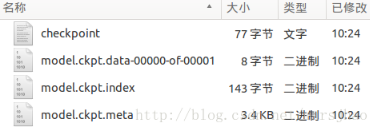

&emsp;&emsp;将训练好的模型参数保存起来，以便以后进行验证或测试，这是我们经常要做的事情。`tf`里面提供模型保存的函数是`tf.train.Saver`模块。模型保存先要创建一个`Saver`对象：

``` python
saver = tf.train.Saver()
```

在创建`Saver`对象的时候，有一个参数经常会用到，就是`max_to_keep`，这个是用来设置保存模型的个数，默认为`5`，保存最近的`5`个模型。如果你想每训练一次(`epoch`)就想保存一次模型，则可以将`max_to_keep`设置为`None`或者`0`：

``` python
saver = tf.train.Saver(max_to_keep=0)
```

但是这样做除了多占用硬盘，并没有实际多大的用处，因此不推荐。当然，如果你只想保存最后一代的模型，则只需要将`max_to_keep`设置为`1`即可：

``` python
saver = tf.train.Saver(max_to_keep=1)
```

创建完saver对象后，就可以保存训练好的模型了：

``` python
saver.save(sess, 'ckpt/mnist.ckpt', global_step=step)
```

第一个参数`sess`，这个就不用说了。第二个参数设定保存的路径和名字，第三个参数将训练的次数作为后缀加入到模型名字中：

``` python
saver.save(sess, 'my-model', global_step=0) == > filename: 'my-model-0'
saver.save(sess, 'my-model', global_step=1000) == > filename: 'my-model-1000'
```

该函数会在目录下生成如下几个文件：



&emsp;&emsp;通过`tf.train.Saver`类实现保存和载入神经网络模型：

``` python
import tensorflow as tf
​
v1 = tf.Variable(tf.constant(1.0, shape=[1]), name="v1")
v2 = tf.Variable(tf.constant(2.0, shape=[1]), name="v2")
result = v1 + v2
​
saver = tf.train.Saver()
​
with tf.Session() as sess:
    sess.run(tf.global_variables_initializer())
    saver.save(sess, "Model/model.ckpt")
```

&emsp;&emsp;加载`TensorFlow`模型的方法：

``` python
import tensorflow as tf
​
v1 = tf.Variable(tf.constant(1.0, shape=[1]), name="v1")
v2 = tf.Variable(tf.constant(2.0, shape=[1]), name="v2")
result = v1 + v2
​
saver = tf.train.Saver()
​
with tf.Session() as sess:
    saver.restore(sess, "./Model/model.ckpt")  # 注意此处路径前添加“./”
    print(sess.run(result))  # 结果为[ 3.]
```

&emsp;&emsp;若不希望重复定义计算图上的运算，可直接加载已经持久化的图：

``` python
import tensorflow as tf
​
saver = tf.train.import_meta_graph("Model/model.ckpt.meta")
​
with tf.Session() as sess:
    saver.restore(sess, "./Model/model.ckpt")  # 注意路径写法
    print(sess.run(tf.get_default_graph().get_tensor_by_name("add:0")))  # 结果为[ 3.]
```

&emsp;&emsp;`tf.train.Saver`类也支持在保存和加载时给变量重命名：

``` python
import tensorflow as tf
​
# 声明的变量名称name与已保存的模型中的变量名称name不一致
u1 = tf.Variable(tf.constant(1.0, shape=[1]), name="other-v1")
u2 = tf.Variable(tf.constant(2.0, shape=[1]), name="other-v2")
result = u1 + u2
​
# 若直接声明Saver类对象，会报错变量找不到。使用一个字典dict
# 重命名变量即可，语法为{"已保存的变量的名称name": 重命名变量名}，
# 原来名称name为v1的变量现在加载到变量u1(名称name为other-v1)中
saver = tf.train.Saver({"v1": u1, "v2": u2})
​
with tf.Session() as sess:
    saver.restore(sess, "./Model/model.ckpt")
    print(sess.run(result))  # [ 3.]
```

&emsp;&emsp;保存滑动平均模型：

``` python
import tensorflow as tf
​
v = tf.Variable(0, dtype=tf.float32, name="v")

for variables in tf.global_variables():
    print(variables.name)  # 结果为“v:0”
​
ema = tf.train.ExponentialMovingAverage(0.99)
maintain_averages_op = ema.apply(tf.global_variables())

for variables in tf.global_variables():
    print(variables.name)  # 结果为“v:0(换行)v/ExponentialMovingAverage:0”
​
saver = tf.train.Saver()
​
with tf.Session() as sess:
    sess.run(tf.global_variables_initializer())
    sess.run(tf.assign(v, 10))
    sess.run(maintain_averages_op)
    saver.save(sess, "Model/model_ema.ckpt")
    print(sess.run([v, ema.average(v)]))  # 结果为[10.0, 0.099999905]
```

&emsp;&emsp;通过变量重命名直接读取变量的滑动平均值：

``` python
import tensorflow as tf
​
v = tf.Variable(0, dtype=tf.float32, name="v")
saver = tf.train.Saver({"v/ExponentialMovingAverage": v})
​
with tf.Session() as sess:
    saver.restore(sess, "./Model/model_ema.ckpt")
    print(sess.run(v))  # 结果为0.0999999
```

&emsp;&emsp;通过`tf.train.ExponentialMovingAverage`的`variables_to_restore`函数获取变量重命名字典：

``` python
import tensorflow as tf
​
# 注意此处的变量名称name一定要与已保存的变量名称一致
v = tf.Variable(0, dtype=tf.float32, name="v")
ema = tf.train.ExponentialMovingAverage(0.99)
# 如下结果为{'v/ExponentialMovingAverage': <tf.Variable 'v:0'
# shape=() dtype=float32_ref>}，此处的v取自上面变量v的名称“name="v"”
print(ema.variables_to_restore())  
saver = tf.train.Saver(ema.variables_to_restore())
​
with tf.Session() as sess:
    saver.restore(sess, "./Model/model_ema.ckpt")
    print(sess.run(v))  # 0.0999999
```

&emsp;&emsp;如果变量定义在`name_scope`的里面：

``` python
import tensorflow as tf
​
with tf.name_scope('input'):
    v1 = tf.Variable(tf.constant(1.0, shape=[1]), name="v1")
    v2 = tf.Variable(tf.constant(2.0, shape=[1]), name="v2")
​
result = v1 + v2
saver = tf.train.Saver()
​
with tf.Session() as sess:
    sess.run(tf.global_variables_initializer())
    saver.save(sess, "./model.ckpt")
```

提取变量时使用如下语句：

``` python
import tensorflow as tf
​
saver = tf.train.import_meta_graph("Model/model.ckpt.meta")
with tf.Session() as sess:
    saver.restore(sess, "./Model/model.ckpt")  # 注意路径写法
    print(sess.run(tf.get_default_graph().get_tensor_by_name("input/v2:0")))  # 结果为[2.]
```

&emsp;&emsp;我们可以使用`tf.train.latest_checkpoint`来自动获取最后一次保存的模型：

``` python
latest_checkpoint(checkpoint_dir, latest_filename=None)
```

代码如下：

``` python
import tensorflow as tf
from tensorflow.examples.tutorials.mnist import input_data
​
mnist = input_data.read_data_sets("MNIST_data/", one_hot=False)
​
x = tf.placeholder(tf.float32, [None, 784])
y_ = tf.placeholder(tf.int32, [None, ])
​
dense1 = tf.layers.dense(
    inputs=x, units=1024, activation=tf.nn.relu,
    kernel_initializer=tf.truncated_normal_initializer(stddev=0.01),
    kernel_regularizer=tf.nn.l2_loss)
dense2 = tf.layers.dense(
    inputs=dense1, units=512, activation=tf.nn.relu,
    kernel_initializer=tf.truncated_normal_initializer(stddev=0.01),
    kernel_regularizer=tf.nn.l2_loss)
logits = tf.layers.dense(
    inputs=dense2, units=10, activation=None,
    kernel_initializer=tf.truncated_normal_initializer(stddev=0.01),
    kernel_regularizer=tf.nn.l2_loss)
​
loss = tf.losses.sparse_softmax_cross_entropy(labels=y_, logits=logits)
train_op = tf.train.AdamOptimizer(learning_rate=0.001).minimize(loss)
correct_prediction = tf.equal(tf.cast(tf.argmax(logits, 1), tf.int32), y_)
acc = tf.reduce_mean(tf.cast(correct_prediction, tf.float32))
​
sess = tf.InteractiveSession()
sess.run(tf.global_variables_initializer())
​
is_train = False
saver = tf.train.Saver(max_to_keep=3)
​
if is_train:  # 训练阶段
    max_acc = 0
    f = open('ckpt/acc.txt', 'w')
    for i in range(100):
        batch_xs, batch_ys = mnist.train.next_batch(100)
        sess.run(train_op, feed_dict={x: batch_xs, y_: batch_ys})
        val_loss, val_acc = sess.run([loss, acc], feed_dict={x: mnist.test.images, y_: mnist.test.labels})
        print('epoch:%d, val_loss:%f, val_acc:%f' % (i, val_loss, val_acc))
        f.write(str(i + 1) + ', val_acc: ' + str(val_acc) + '\n')
        if val_acc > max_acc:
            max_acc = val_acc
            saver.save(sess, 'ckpt/mnist.ckpt', global_step=i + 1)
    f.close()
else:  # 验证阶段
    model_file = tf.train.latest_checkpoint('ckpt/')
    saver.restore(sess, model_file)
    val_loss, val_acc = sess.run([loss, acc], feed_dict={x: mnist.test.images, y_: mnist.test.labels})
    print('val_loss:%f, val_acc:%f' % (val_loss, val_acc))
sess.close()
```

这里的`latest_checkpoint`函数的参数表示模型存储的位置，不需要提供模型的名字，它会去查看`checkpoint`文件，看看最新保存结果的命名。

---

### 将TensorFlow的网络导出为单个文件

&emsp;&emsp;有时我们需要将`TensorFlow`的模型导出为单个文件(同时包含模型架构定义与权重)，方便在其他地方使用(例如在`C++`中部署网络)。`Tensorflow`提供如下`API`来存储和加载模型：

- 生成检查点文件(`checkpoint file`)，扩展名一般为`.ckpt`，通过在`tf.train.Saver`对象上调用`Saver.save`生成。它包含权重和其他在程序中定义的变量，不包含图结构。如果需要在另一个程序中使用，需要重新创建图形结构，并告诉`TensorFlow`如何处理这些权重。
- 生成图协议文件(`graph proto file`)，这是一个二进制文件，扩展名一般为`.pb`，用`tf.train.write_graph`保存。它只包含图形结构，不包含权重，然后使用`tf.import_graph_def`来加载图形。

&emsp;&emsp;通过`convert_variables_to_constants`函数将计算图中的变量及其取值通过常量的方式保存于一个文件中：

``` python
import tensorflow as tf
from tensorflow.python.framework.graph_util import convert_variables_to_constants
​
# 构造网络
a = tf.Variable([[3], [4]], dtype=tf.float32, name='a')
b = tf.Variable(4, dtype=tf.float32, name='b')
output = tf.add(a, b, name='out')  # 一定要给输出tensor取一个名字
​
with tf.Session() as sess:  # 转换Variable为constant，并将网络写入到文件
    sess.run(tf.global_variables_initializer())
    # 这里需要填入输出tensor的名字
    graph = convert_variables_to_constants(sess, sess.graph_def, ["out"])
    tf.train.write_graph(graph, '.', 'graph.pb', as_text=False)
```

执行结果：

``` python
Converted 2 variables to const ops.
```

&emsp;&emsp;载入包含变量及其取值的模型：

``` python
import tensorflow as tf
​
with tf.Session() as sess:
    with open('./graph.pb', 'rb') as f:
        graph_def = tf.GraphDef()
        graph_def.ParseFromString(f.read())
        output = tf.import_graph_def(graph_def, return_elements=['out:0'])
        print(sess.run(output))
```

执行结果：

``` python
[array([[7.],
       [8.]], dtype=float32)]
```

&emsp;&emsp;如果我们的网络需要有一个输入自定义数据的接口，可以采用如下方法：

``` python
import tensorflow as tf
from tensorflow.python.framework.graph_util import convert_variables_to_constants
​
a = tf.Variable([[3], [4]], dtype=tf.float32, name='a')
b = tf.Variable(4, dtype=tf.float32, name='b')
input_tensor = tf.placeholder(tf.float32, name='input')
output = tf.add((a + b), input_tensor, name='out')
​
with tf.Session() as sess:
    sess.run(tf.global_variables_initializer())
    graph = convert_variables_to_constants(sess, sess.graph_def, ["out"])
    tf.train.write_graph(graph, '.', 'graph.pb', as_text=False)
```

上述代码重新保存网络至`graph.pb`，这次我们有了一个输入`placeholder`，下面来看看怎么恢复网络并输入自定义数据：

``` python
import tensorflow as tf
​
with tf.Session() as sess:
    with open('./graph.pb', 'rb') as f:
        graph_def = tf.GraphDef()
        graph_def.ParseFromString(f.read())
        output = tf.import_graph_def(
                    graph_def, input_map={'input:0': 4.},
                    return_elements=['out:0'], name='a')
        print(sess.run(output))
````

执行结果：

``` python
[array([[11.],
       [12.]], dtype=float32)]
```

&emsp;&emsp;当然也可以在`input_map`那里可以替换为自定义的`placeholder`：

``` python
import tensorflow as tf
​
new_input = tf.placeholder(tf.float32, shape=())
​
with tf.Session() as sess:
    with open('./graph.pb', 'rb') as f:
        graph_def = tf.GraphDef()
        graph_def.ParseFromString(f.read())
        output = tf.import_graph_def(
                    graph_def, input_map={'input:0': new_input},
                    return_elements=['out:0'], name='a')
        print(sess.run(output, feed_dict={new_input: 4}))
```

---

### Tensorflow模型持久化

&emsp;&emsp;当我们使用`TensorFlow`训练神经网络的时候，模型持久化对于我们的训练有很重要的作用。
&emsp;&emsp;如果我们的神经网络比较复杂，训练数据比较多，那么我们的模型训练就会耗时很长，如果在训练过程中出现某些不可预计的错误，导致我们的训练意外终止，那么我们将会前功尽弃。为了避免这个问题，我们就可以通过模型持久化(保存为`CKPT`格式)来暂存我们训练过程中的临时数据。
&emsp;&emsp;如果我们训练的模型需要提供给用户做离线的预测，那么我们只需要前向传播的过程，只需得到预测值就可以了，这个时候我们就可以通过模型持久化(保存为`PB`格式)只保存前向传播中需要的变量并将变量的值固定下来，这个时候只需用户提供一个输入，我们就可以通过模型得到一个输出给用户。

#### 保存为CKPT格式的模型

&emsp;&emsp;定义运算过程，声明并得到一个`Saver`，通过`Saver.save`保存模型：

``` python
import tensorflow as tf
import os.path
​
MODEL_DIR = "model/ckpt"
MODEL_NAME = "model.ckpt"
​
if not tf.gfile.Exists(MODEL_DIR):  # 创建目录
    tf.gfile.MakeDirs(MODEL_DIR)
​
# 下面的过程你可以替换成CNN、RNN等你想做的训练过程，这里只是简单的一个计算公式
# 输入占位符，并指定名字，后续模型读取可能会用的
input_holder = tf.placeholder(tf.float32, shape=[1], name="input_holder")
W1 = tf.Variable(tf.constant(5.0, shape=[1]), name="W1")
B1 = tf.Variable(tf.constant(1.0, shape=[1]), name="B1")
_y = (input_holder * W1) + B1
# 输出节点名字，后续模型读取会用到，比50大返回true，否则返回false
predictions = tf.greater(_y, 50, name="predictions")
​
init = tf.global_variables_initializer()
saver = tf.train.Saver()  # 声明saver用于保存模型
​
with tf.Session() as sess:
    sess.run(init)
    # 输入一个数据测试一下
    print("predictions : ", sess.run(predictions, feed_dict={input_holder: [10.0]}))
    saver.save(sess, os.path.join(MODEL_DIR, MODEL_NAME))  # 模型保存
    # 得到当前图有几个操作节点
    print("%d ops in the final graph." % len(tf.get_default_graph().as_graph_def().node))
​
for op in tf.get_default_graph().get_operations():  # 打印模型节点信息
    print(op.name, op.values())
```

运行后生成的文件如下：

- `checkpoint`：记录目录下所有模型文件列表。
- `ckpt.data`：保存模型中每个变量的取值。
- `ckpt.meta`：保存整个计算图的结构。

#### 保存为PB格式模型

&emsp;&emsp;定义运算过程，通过`get_default_graph().as_graph_def`得到当前图的计算节点信息，通过`graph_util.convert_variables_to_constants`将相关节点的`values`固定，通过`tf.gfile.GFile`进行模型持久化：

``` python
import tensorflow as tf
from tensorflow.python.framework import graph_util
​
output_graph = "model/add_model.pb"
​
# 下面的过程你可以替换成CNN、RNN等你想做的训练过程，这里只是简单的一个计算公式
input_holder = tf.placeholder(tf.float32, shape=[1], name="input_holder")
W1 = tf.Variable(tf.constant(5.0, shape=[1]), name="W1")
B1 = tf.Variable(tf.constant(1.0, shape=[1]), name="B1")
_y = (input_holder * W1) + B1
predictions = tf.add(_y, 10, name="predictions")  # 做一个加法运算(输出节点名是“predictions”)
​
init = tf.global_variables_initializer()
​
with tf.Session() as sess:
    sess.run(init)
    print("predictions : ", sess.run(predictions, feed_dict={input_holder: [10.0]}))
    # 得到当前的图的GraphDef部分，通过这个部分就可以完成重输入层到输出层的计算过程
    graph_def = tf.get_default_graph().as_graph_def()
    output_graph_def = graph_util.convert_variables_to_constants(sess, graph_def, ["predictions"])
    with tf.gfile.GFile(output_graph, "wb") as f:  # 保存模型
        f.write(output_graph_def.SerializeToString())  # 序列化输出
    print("%d ops in the final graph." % len(output_graph_def.node))
    print(predictions)
```

`GraphDef`这个属性记录了`TensorFlow`计算图上节点的信息。`add_model.pb`里面保存了从输入层到输出层这个计算过程的计算图和相关变量的值，我们得到这个模型后传入一个输入，即可以得到一个预估的输出值。

#### CKPT转换成PB格式

&emsp;&emsp;通过传入`CKPT`模型的路径得到模型的图和变量数据，通过`import_meta_graph`导入模型中的图，通过`saver.restore`从模型中恢复图中各个变量的数据，通过`graph_util.convert_variables_to_constants`将模型持久化：

``` python
import tensorflow as tf
import os.path
import argparse
from tensorflow.python.framework import graph_util
​
MODEL_DIR = "model/"
MODEL_NAME = "frozen_model.pb"
​
if not tf.gfile.Exists(MODEL_DIR):  # 创建目录
    tf.gfile.MakeDirs(MODEL_DIR)
​
def freeze_graph(model_folder):
    checkpoint = tf.train.get_checkpoint_state(model_folder)  # 检查目录下ckpt文件状态是否可用
    input_checkpoint = checkpoint.model_checkpoint_path  # 得到ckpt文件路径
    output_graph = os.path.join(MODEL_DIR, MODEL_NAME)  # PB模型保存路径
​
    output_node_names = "predictions"  # 原模型输出操作节点的名字
    # 得到图、clear_devices：Whether or not to clear the device field for an 'Operation' or 'Tensor' during import
    saver = tf.train.import_meta_graph(input_checkpoint + '.meta', clear_devices=True)
​
    graph = tf.get_default_graph()  # 获得默认的图
    input_graph_def = graph.as_graph_def()  # 返回一个序列化的图代表当前的图
​
    with tf.Session() as sess:
        saver.restore(sess, input_checkpoint)  # 恢复图并得到数据
        # 测试读出来的模型是否正确，注意这里传入的是输出和输入节点的tensor的名字，不是操作节点的名字
        print("predictions : ", sess.run("predictions:0", feed_dict={"input_holder:0": [10.0]}))
        # 注意，如果有多个输出节点，以逗号隔开
        output_graph_def = graph_util.convert_variables_to_constants(sess, input_graph_def, output_node_names.split(","))
        with tf.gfile.GFile(output_graph, "wb") as f:  # 保存模型
            f.write(output_graph_def.SerializeToString())  # 序列化输出
        print("%d ops in the final graph." % len(output_graph_def.node))  # 得到当前图有几个操作节点
​
        for op in graph.get_operations():
            print(op.name, op.values())
​
if __name__ == '__main__':
    parser = argparse.ArgumentParser()
    parser.add_argument("model_folder", type=str, help="input ckpt model dir")  # 命令行解析，help是提示符，type是输入的类型
    # 这里运行程序时需要带上模型ckpt的路径，不然会报“error: too few arguments”
    aggs = parser.parse_args()
    freeze_graph(aggs.model_folder)
```