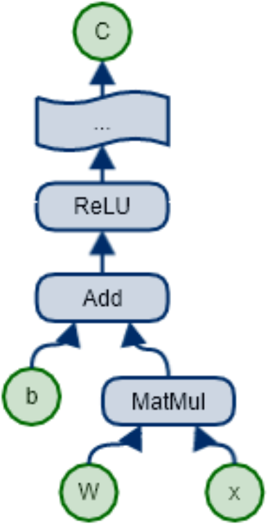
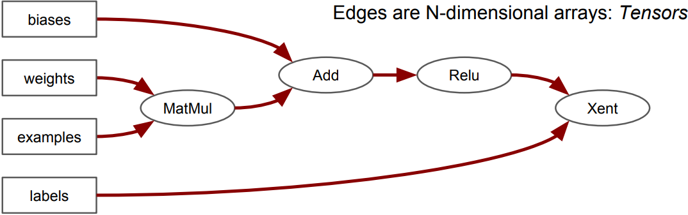
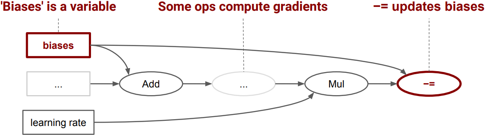

&emsp;&emsp;`TensorFlow`的计算可以表示为一种有向图(`directed graph`)，或者称计算图(`computation graph`)。图中每一个运算操作(`operation`)是一个节点(`node`)，节点之间的连接线称为边(`edge`)。计算图中的节点可以有任意多个输入和任意多个输出，每个节点都只有一个运算操作。在计算图中流动(`flow`)的数据被称为张量(`tensor`)，故得名`TensorFlow`。
&emsp;&emsp;计算图示例如下：

``` python
import tensorflow as tf
​
b = tf.Variable(tf.zeros([100]))  # 生成100维的向量，初始化为0
W = tf.Variable(tf.random_uniform([784, 100], -1, 1))  # 生成“784 * 100”的随机矩阵W
x = tf.placeholder(name = "x")  # 输入的Placeholder
relu = tf.nn.relu(tf.matmul(W, x) + b)  # ReLU(Wx+b)
C = [...]  # 根据ReLU函数的结果计算Cost
s = tf.Session()
​
for step in range(0, 10):
    input = construct 100-D input array  # 为输入创建一个100维的向量
    result = s.run(C, feed_dict = {x: input})  # 获取Cost，供给输入x
    print(step, result)
```



`Session`是用户使用`TensorFlow`时交互的接口。`Session`可以通过`Extend`方法添加节点(`node`)和边(`edge`)，用以创建计算图，然后就可以通过`Session`的`Run`方法执行计算图。`Variable`是一类特殊的运算操作，可以将`tensor`存储在内存或显存中，比如神经网络模型中的参数。

---

&emsp;&emsp;`TensorFlow`是一个编程系统，使用图来表示计算任务。图中的节点被称之为`op`(`operation`的缩写)，一个`op`获得`0`个或多个`Tensor`，执行计算并产生`0`个或多个`Tensor`。每个`Tensor`是一个类型化的多维数组，例如你可以将一小组图像集表示为一个四维浮点数数组，这四个维度分别是`[batch, height, width, channels]`。
&emsp;&emsp;一个`TensorFlow`图描述了计算的过程。为了进行计算，图必须在会话里被启动。会话将图的`op`分发到诸如`CPU`或`GPU`之类的设备上，同时提供执行`op`的方法。这些方法执行后，将产生的`tensor`返回。在`Python`语言中，返回的`tensor`是`numpy`的`ndarray`对象；在`C/C++`语言中，返回的`tensor`是`tensorflow::Tensor`实例。

### 计算图

&emsp;&emsp;`TensorFlow`程序通常被组织成一个构建阶段和一个执行阶段。在构建阶段，`op`的执行步骤被描述成一个图；在执行阶段，使用会话执行执行图中的`op`。例如，通常在构建阶段创建一个图来表示和训练神经网络，然后在执行阶段反复执行图中的训练`op`。

### 构建图

&emsp;&emsp;构建图的第一步是创建源`op`(即`source op`)。源`op`不需要任何输入，例如常量(`Constant`)；源`op`的输出被传递给其它`op`做运算。
&emsp;&emsp;在`Python`库中，`op`构造器的返回值代表被构造出的`op`的输出，这些返回值可以传递给其它`op`构造器作为输入。`TensorFlow`的`Python`库有一个默认图(`default graph`)，`op`构造器可以为其增加节点，这个默认图对许多程序来说已经足够用了。

``` python
import tensorflow as tf
​
# 创建一个常量op，产生一个“1 * 2”矩阵，这个op被作为一个节点加到默认图中
matrix1 = tf.constant([[3., 3.]])
# 创建另外一个常量op，产生一个“2 * 1”矩阵
matrix2 = tf.constant([[2.], [2.]])
# 创建一个矩阵乘法“matmul op”，把matrix1和matrix2作为输入，返回值product代表矩阵乘法的结果
product = tf.matmul(matrix1, matrix2)
```

默认图现在有三个节点，两个`constant`的`op`和一个`matmul`的`op`。为了真正进行矩阵相乘运算，并得到矩阵乘法的结果，你必须在会话里启动这个图。

### 启动图

&emsp;&emsp;构造阶段完成后，才能启动图。启动图的第一步是创建一个`Session`对象，如果无任何创建参数，会话构造器将启动默认图。

``` python
sess = tf.Session()  # 启动默认图
# 调用sess的run方法来执行矩阵乘法op，传入product作为该方法的参数。product代表了矩阵乘法op的输出，
# 传入它是向run方法表明，我们希望取回矩阵乘法op的输出。整个执行过程是自动化的，会话负责传递op所需的
# 全部输入，op通常是并发执行的函数调用run(product)触发了图中三个op(两个常量op和一个矩阵乘法op)
# 的执行，返回值result是一个numpy的ndarray对象
result = sess.run(product)
print(result)  # 结果为[[ 12.]]
sess.close()  # 任务完成，关闭会话
```

`Session`对象在使用完后，需要关闭以释放资源。除了显式调用`close`外，也可以使用`with`代码块来自动完成关闭动作：

``` python
with tf.Session() as sess:
    result = sess.run([product])
    print(result)
```

&emsp;&emsp;`TensorFlow`将图形定义转换成分布式执行的操作，以充分利用可用的计算资源(如`CPU`或`GPU`)。一般你不需要显式指定使用`CPU`还是`GPU`，`TensorFlow`能自动检测。如果检测到`GPU`，`TensorFlow`会尽可能地利用找到的第一个`GPU`来执行操作。如果机器上有超过一个可用的`GPU`，除第一个外的其它`GPU`默认是不参与计算的。为了让`TensorFlow`使用这些`GPU`，你必须将`op`明确指派给它们执行。`with ... Device`语句用来指派特定的`CPU`或`GPU`执行操作：

``` python
with tf.Session() as sess:
    with tf.device("/gpu:1"):
        matrix1 = tf.constant([[3., 3.]])
        matrix2 = tf.constant([[2.], [2.]])
        product = tf.matmul(matrix1, matrix2)
```

---

### Tensors - generalized matrices

&emsp;&emsp;Tensors have a shape that's described with a vector:

``` python
[10000, 256, 256, 3]
```

`10000` images, each image has `256` rows, each row has `256` pixels, each pixel has `3` channels (`RGB`).

### Computation is a dataflow graph

&emsp;&emsp;With tensors:



with state:

