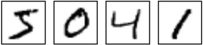
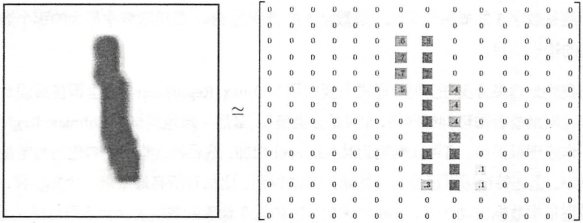
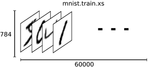
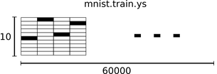
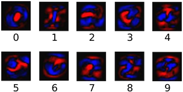
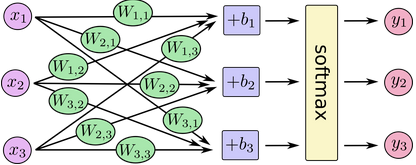
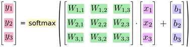
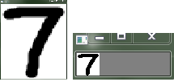

### MNIST数据集

&emsp;&emsp;`MNIST`是一个入门级的计算机视觉数据集，它包含各种手写数字图片：<!--more-->



它也包含每一张图片对应的标签，告诉我们这个是数字几。例如上面这四张图片的标签分别是`5`、`0`、`4`和`1`。
&emsp;&emsp;`MNIST`数据集的官网是`http://yann.lecun.com/exdb/mnist/`。以下的`python`源代码用于自动下载和安装这个数据集：

``` python
from tensorflow.examples.tutorials.mnist import input_data
mnist = input_data.read_data_sets("MNIST_data/", one_hot=True)
```

下载下来的数据集被分成两部分：`60000`行的训练数据集(`mnist.train`)和`10000`行的测试数据集(`mnist.test`)。这样的切分很重要，在机器学习模型设计时，必须有一个单独的测试数据集不用于训练，而是用来评估这个模型的性能，从而更加容易把设计的模型推广到其他数据集上。
&emsp;&emsp;每一个`MNIST`数据单元由两部分组成：一张包含手写数字的图片和一个对应的标签。我们把这些图片设为`xs`，把这些标签设为`ys`。训练数据集和测试数据集都包含`xs`和`ys`，比如训练数据集的图片是`mnist.train.images`，训练数据集的标签是`mnist.train.labels`：

``` python
print(mnist.train.images.shape, mnist.train.labels.shape)
print(mnist.test.images.shape, mnist.test.labels.shape)
print(mnist.validation.images.shape, mnist.validation.labels.shape)
```

&emsp;&emsp;每一张图片包含`28 * 28`个像素点。我们可以用一个数字数组来表示这张图片：



把这个数组展开成一个向量，长度是`28 * 28 = 784`。如何展开这个数组不重要，只要保持各个图片采用相同的方式展开。
&emsp;&emsp;展平图片的数字数组会丢失图片的二维结构信息，这显然是不理想的，最优秀的计算机视觉方法会挖掘并利用这些结构信息。但是在这个教程中，我们忽略这些结构，所介绍的简单数学模型`softmax`回归不会利用这些结构信息。
&emsp;&emsp;因此，在`MNIST`训练数据集中，`mnist.train.images`是一个形状为`[60000, 784]`的张量，第一个维度数字用来索引图片，第二个维度数字用来索引每张图片中的像素点。在此张量里的每一个元素，都表示某张图片里的某个像素的强度值，值介于`0`和`1`之间。



&emsp;&emsp;`MNIST`数据集的标签是介于`0`到`9`之间的数字，用来描述给定图片里表示的数字。我们使标签数据是`one-hot`向量，一个`one-hot`向量除了某一位的数字是`1`以外，其余各维度数字都是`0`。所以在此教程中，数字`n`将表示成一个只有在第`n`维度(从`0`开始)数字为`1`的`10`维向量。比如，标签`0`将表示成`[1, 0, 0, 0, 0, 0, 0, 0, 0, 0, 0]`。因此，`mnist.train.labels`是一个`[60000, 10]`的数字矩阵。



### Softmax回归介绍

&emsp;&emsp;`MNIST`的每一张图片都表示一个数字，我们希望得到给定图片代表每个数字的概率。例如，模型可能推测一张包含`9`的图片代表数字`9`的概率是`80%`，它是`8`的概率是`5%`，然后给予它代表其他数字的概率更小的值。
&emsp;&emsp;这是一个使用`softmax`回归模型的经典案例，`softmax`模型可以用来给不同的对象分配概率。即使以后需要训练更加精细的模型，最后一步也需要用`softmax`来分配概率。
&emsp;&emsp;为了得到一张给定图片属于某个特定数字类的证据`evidence`，我们对图片像素值进行加权求和。如果这个像素具有很强的`evidence`说明这张图片不属于该类，那么相应的权值为负数；相反，如果这个像素拥有有利的`evidence`支持这张图片属于这个类，那么权值是正数。下面的图片显示了一个模型学习到的图片上每个像素对于特定数字类的权值，红色代表负数权值，蓝色代表正数权值：



&emsp;&emsp;我们也需要加入一个额外的偏置量`bias`，因为输入往往会带有一些无关的干扰量。因此对于给定的输入图片$x$，它代表的是数字$i$的证据可以表示为：

$$
evidence_{i} = \sum_{j}W_{i,j}x_{j} + b_{i}
$$

其中$W_{i}$代表权重，$b_{i}$代表数字i类的偏置量，$j$代表给定图片$x$的像素索引用于像素求和。然后用`softmax`函数可以把这些证据转换成概率$y$：

$$
y = softmax(evidence)
$$

这里的`softmax`可以看成是一个激励函数(`activation`)，把我们定义的线性函数的输出转换成我们想要的格式，也就是关于`10`个数字类的概率分布。因此，给定一张图片，它对于每一个数字的吻合度可以被`softmax`函数转换成为一个概率值。`softmax`函数可以定义为：

$$
softmax(x)_{i} = \frac{exp(x_{i})}{\sum_{j}exp(x_{j})}
$$

&emsp;&emsp;对于`softmax`回归模型，可以用下面的图解释，对于输入的$x_{s}$加权求和，再分别加上一个偏置量，最后再输入到`softmax`函数中：



如果把它写成一个等式，我们可以得到：


我们也可以用向量表示这个计算过程：用矩阵乘法和向量相加，这有助于提高计算效率：



更进一步，可以写成更加紧凑的方式：

$$
y = softmax(Wx + b)
$$

### 实现回归模型

&emsp;&emsp;首先载入`TensorFlow`库，并创建一个新的`InteractiveSession`，使用这个命令会将这个`session`注册为默认的`session`，之后的运算也默认跑在这个`session`里，不同`session`之间的数据和运算应该都是相互独立的。接下来创建一个`placeholder`，即输入数据的地方，其第一个参数是数据类型，第二个参数`[None, 784]`代表`tensor`的`shape`，也就是数据的尺寸，这里的`None`代表不限条数的输入(`None`表示此张量的第一个维度可以是任何长度的)，`784`代表每条输入是一个`784`维的向量。

``` python
import tensorflow as tf
sess = tf.InteractiveSession()
x = tf.placeholder(tf.float32, [None, 784])
```

接下来要为`softmax`模型中的权重值`weights`和偏置量`biases`创建`Variable`，`Variable`用来存储模型参数。我们把`weights`和`biases`全部初始化为`0`，因为模型训练时会自动学习适合的值，所以对这个简单模型来说初始值并不重要。不过对于复杂的卷积网络、循环网络或比较深的全连接网络，初始化的方法可以说至关重要。注意这里`W`的`shape`是`[784, 10]`，`784`是特征的维数，`10`代表有`10`类(因为我们想要用`784`维的图片向量乘以它，以得到一个`10`维的证据值向量)，因为`label`在`one-hot`编码后是`10`维的向量。

``` python
W = tf.Variable(tf.zeros([784, 10]))
b = tf.Variable(tf.zeros([10]))
```

接下来要实现`softmax`算法：

``` python
y = tf.nn.softmax(tf.matmul(x, W) + b)
```

首先，我们用`tf.matmul(x, W)`表示`x`乘以`W`，对应之前等式里面的$Wx$，然后再加上$b$，把和输入到`tf.nn.softmax`函数里面。

### 训练模型

&emsp;&emsp;为了训练我们的模型，首先需要定义一个指标来评估这个模型是好的。在机器学习中，我们通常定义指标来表示一个模型是坏的，这个指标称为成本`cost`或损失`loss`，然后尽量最小化这个指标，这两种方式是相同的。
&emsp;&emsp;一个非常常见且漂亮的成本函数是`交叉熵`(`cross-entropy`)。交叉熵产生于信息论里面的信息压缩编码技术，但是它后来演变成为从博弈论到机器学习等其他领域里的重要技术手段，其定义如下：

$$
H_{y'}(y) = -\sum_{i}y'_{i}log(y_{i})
$$

$y$是我们预测的概率分布，$y'$是实际的分布(我们输入的`one-hot`向量)。
&emsp;&emsp;为了计算交叉熵，我们首先需要添加一个新的占位符用于输入正确值：

``` python
y_ = tf.placeholder(tf.float32, [None, 10])
```

然后计算交叉熵：

``` python
cross_entropy = -tf.reduce_sum(y_ * tf.log(y))
```

首先用`tf.log`计算`y`的每个元素的对数，接下来把`y_`的每一个元素和`tf.log(y)`的对应元素相乘，最后用`tf.reduce_sum`计算张量的所有元素的总和。注意，这里的交叉熵不仅仅用来衡量单一的一对预测和真实值，而是所有`100`幅图片的交叉熵的总和(`100`指的是下面的`mini-batch`的大小)。对于`100`个数据点的预测表现，比单一数据点的表现能更好地描述我们的模型的性能。
&emsp;&emsp;现在有了算法`softmax`的定义，又有了损失函数`cross-entropy`的定义，只需要再定义一个优化算法即可开始训练，常见采用随机梯度下降`SGD`。定义好优化算法后，`TensorFlow`就可以根据我们定义的整个计算图自动求导，并根据反向传播算法(`backpropagation algorithm`)进行训练，每一轮迭代时更新参数来减小`loss`。我们直接调用`tf.train.GradientDescentOptimizer`，并设置学习速率为`0.5`，优化目标设定为`cross-entropy`，得到进行训练的操作`train_step`：

``` python
train_step = tf.train.GradientDescentOptimizer(0.5).minimize(cross_entropy)
```

梯度下降算法`gradient descent algorithm`是一个简单的学习过程，`TensorFlow`只是将每个变量一点点地往使成本不断降低的方向移动。当然`TensorFlow`也提供了其他许多优化算法，只要简单地调整一行代码就可以使用其他的算法。`TensorFlow`在这里实际上所做的是：它会在后台给描述你的计算的那张图里面增加一系列新的计算操作单元，用于实现反向传播算法和梯度下降算法，然后返回给你的只是一个单一的操作。当运行这个操作时，它用梯度下降算法训练你的模型，微调你的变量，不断减少成本。
&emsp;&emsp;下一步使用`TensorFlow`的全局参数初始化器`tf.global_variables_initializer`：

``` python
sess.run(tf.global_variables_initializer())
```

最后一步，我们开始迭代地执行训练操作`train_step`。这里每次都随机从训练集中抽取`100`条样本构成一个`mini-batch`，并`feed`给`placeholder`：

``` python
for i in range(1000):
    batch_xs, batch_ys = mnist.train.next_batch(100)
    train_step.run({x: batch_xs, y_: batch_ys})
```

&emsp;&emsp;我们已经完成了训练，接下来就对模型的准确率进行验证。`tf.argmax`是一个非常有用的函数，它能给出某个`tensor`对象在某一维上的其数据最大值所在的索引值。由于标签向量是由`0`和`1`组成，因此最大值`1`所在的索引位置就是类别标签，比如`tf.argmax(y, 1)`返回的是模型对于任一输入`x`预测到的标签值，而`tf.argmax(y_, 1)`代表正确的标签。而`tf.equal`来判断预测的数字是否就是正确的类别(索引位置一样表示匹配)，最后返回计算分类是否正确的操作`correct_prediction`：

``` python
correct_prediction = tf.equal(tf.argmax(y, 1), tf.argmax(y_, 1))
```

这行代码会输出一组布尔值，为了确定正确预测项的比例，我们可以把布尔值转换成浮点数，然后取平均值。例如`[True, False, True, True]`会变成`[1, 0, 1, 1]`，取平均值后得到`0.75`。我们统计全部样本预测的`accuracy`，这里需要先用`tf.cast`将之前`correct_prediction`输出的`bool`值转换为`float32`，再求平均：

``` python
accuracy = tf.reduce_mean(tf.cast(correct_prediction, tf.float32))
```

我们将测试数据的特征和`label`输入评测流程`accuracy`，计算模型在测试集上的准确率，再将结果打印出来：

``` python
print(accuracy.eval({x: mnist.test.images, y_: mnist.test.labels}))
```

以上是一个没有隐含层的最浅的神经网络，整个步骤分为`4`个部分：

1. 定义算法公式，也就是神经网络`forward`时的计算。
2. 定义`loss`，选定优化器，并指定优化器优化`loss`。
3. 迭代地对数据进行训练。
4. 在测试集或验证集对准确率进行评测。

&emsp;&emsp;**补充说明**：如果最后的结果为`0.098`，则修改文件`./tensorflow/contrib/learn/python/learn/datasets/mnist.py`，将`SOURCE_URL`从`https://storage.googleapis.com/cvdf-datasets/mnist/`改为`http://yann.lecun.com/exdb/mnist/`就可以了。

---

&emsp;&emsp;训练代码如下：

``` python
import tensorflow as tf
from tensorflow.examples.tutorials.mnist import input_data

mnist = input_data.read_data_sets('MNIST_data', one_hot=True)

def compute_accuracy(v_xs, v_ys):
    global prediction  # 定义全局变量
    y_pre = sess.run(prediction, feed_dict={xs: v_xs, keep_prob: 1})  
    correct_prediction = tf.equal(tf.argmax(y_pre, 1), tf.argmax(v_ys, 1))  
    accuracy = tf.reduce_mean(tf.cast(correct_prediction, tf.float32))  
    result = sess.run(accuracy, feed_dict={xs: v_xs, ys: v_ys, keep_prob: 1})  
    return result

def weight_variable(shape):
    initial = tf.truncated_normal(shape, stddev=0.1)  
    return tf.Variable(initial, dtype=tf.float32, name='weight')

def bias_variable(shape):
    initial = tf.constant(0.1, shape=shape)
    return tf.Variable(initial, dtype=tf.float32, name='biases')

def conv2d(x, W):
    return tf.nn.conv2d(x, W, strides=[1, 1, 1, 1], padding='SAME')

def max_pool_2x2(x):
    return tf.nn.max_pool(x, ksize=[1, 2, 2, 1], strides=[1, 2, 2, 1], padding='SAME')

xs = tf.placeholder(tf.float32, [None, 784])
ys = tf.placeholder(tf.float32, [None, 10])
keep_prob = tf.placeholder(tf.float32)

x_image = tf.reshape(xs, [-1, 28, 28, 1])
# 卷积层1
W_conv1 = weight_variable([3, 3, 1, 32])
b_conv1 = bias_variable([32])
h_conv1 = tf.nn.relu(conv2d(x_image, W_conv1) + b_conv1)
h_pool1 = max_pool_2x2(h_conv1)
# 卷积层2
W_conv2 = weight_variable([3, 3, 32, 64])
b_conv2 = bias_variable([64])
h_conv2 = tf.nn.relu(conv2d(h_pool1, W_conv2) + b_conv2)
h_pool2 = max_pool_2x2(h_conv2)
# fully connected 1
W_fc1 = weight_variable([7 * 7 * 64, 1024])
b_fc1 = bias_variable([1024])
h_pool2_flat = tf.reshape(h_pool2, [-1, 7 * 7 * 64])
h_fc1 = tf.nn.relu(tf.matmul(h_pool2_flat, W_fc1) + b_fc1)
h_fc1_drop = tf.nn.dropout(h_fc1, keep_prob)
# fully connected 2
W_fc2 = weight_variable([1024, 10])
b_fc2 = bias_variable([10])
prediction = tf.nn.softmax(tf.matmul(h_fc1_drop, W_fc2) + b_fc2)  # 输出层

cross_entropy = tf.reduce_mean(-tf.reduce_sum(ys * tf.log(prediction), reduction_indices=[1]))  
train_step = tf.train.AdamOptimizer(1e-4).minimize(cross_entropy)

saver = tf.train.Saver()

with tf.Session() as sess:
    sess.run(tf.global_variables_initializer())

    for i in range(2000):
        batch_xs, batch_ys = mnist.train.next_batch(250)  # 每次从mnist数据集里面拿100个数据训练
        sess.run(train_step, feed_dict={xs: batch_xs, ys: batch_ys, keep_prob: 0.5})

        if i % 100 == 0:
            print(compute_accuracy(mnist.test.images, mnist.test.labels))

    saver.save(sess, "Model/model.ckpt")
```

&emsp;&emsp;手写一个数字，并使用`opencv`进行处理：

``` python
import cv2
import numpy as np

def normalizepic(pic):
    im_arr = pic
    im_nparr = []

    for x in im_arr:
        x = 1 - x / 255
        im_nparr.append(x)

    im_nparr = np.array([im_nparr])
    return im_nparr

img = cv2.imread("7.jpg")
cv2.imshow("img", img)
res = cv2.resize(img, (28, 28), interpolation=cv2.INTER_CUBIC)
print(img.shape)
emptyImage3 = cv2.cvtColor(res, cv2.COLOR_BGR2GRAY)  # 灰度化
ret, bin = cv2.threshold(emptyImage3, 140, 255, cv2.THRESH_BINARY)
cv2.imshow("result", bin)
print(bin.shape)
img = normalizepic(bin).reshape((1, 784))
img = img.astype(np.float32)
print(img.shape)
cv2.imwrite("t.jpg", img)
cv2.waitKey()
```



这就是`28*28`的二值化后的图片，这样的格式和`MNIST`数据集中的图片格式相同。只有这样，才能将图片输入到网络中进行识别。
&emsp;&emsp;数字识别代码如下：

``` python
import tensorflow as tf
import cv2
import numpy as np

def weight_variable(shape):
    initial = tf.truncated_normal(shape, stddev=0.1)
    return tf.Variable(initial, dtype=tf.float32, name='weight')

def bias_variable(shape):
    initial = tf.constant(0.1, shape=shape)
    return tf.Variable(initial, dtype=tf.float32, name='biases')

def conv2d(x, W):
    return tf.nn.conv2d(x, W, strides=[1, 1, 1, 1], padding='SAME')

def max_pool_2x2(x):
    return tf.nn.max_pool(x, ksize=[1, 2, 2, 1], strides=[1, 2, 2, 1], padding='SAME')

xs = tf.placeholder(tf.float32, [None, 784])
keep_prob = tf.placeholder(tf.float32)
x_image = tf.reshape(xs, [-1, 28, 28, 1])
# 卷积层1
W_conv1 = weight_variable([3, 3, 1, 32])
b_conv1 = bias_variable([32])
h_conv1 = tf.nn.relu(conv2d(x_image, W_conv1) + b_conv1)
h_pool1 = max_pool_2x2(h_conv1)
# 卷积层2
W_conv2 = weight_variable([3, 3, 32, 64])
b_conv2 = bias_variable([64])
h_conv2 = tf.nn.relu(conv2d(h_pool1, W_conv2) + b_conv2)
h_pool2 = max_pool_2x2(h_conv2)
# fully connected 1
W_fc1 = weight_variable([7 * 7 * 64, 1024])
b_fc1 = bias_variable([1024])
h_pool2_flat = tf.reshape(h_pool2, [-1, 7 * 7 * 64])
h_fc1 = tf.nn.relu(tf.matmul(h_pool2_flat, W_fc1) + b_fc1)
h_fc1_drop = tf.nn.dropout(h_fc1, keep_prob)
# fully connected 2
W_fc2 = weight_variable([1024, 10])
b_fc2 = bias_variable([10])
y_conv = tf.nn.softmax(tf.matmul(h_fc1_drop, W_fc2) + b_fc2)

result = cv2.imread("t.jpg", 0)
result = np.asarray(result).flatten()
print(result)

with tf.Session() as sess:
    sess.run(tf.global_variables_initializer())
    saver = tf.train.Saver()
    saver.restore(sess, "Model/model.ckpt")
    prediction = tf.argmax(y_conv, 1)
    predint = prediction.eval(feed_dict={xs: [result], keep_prob: 1.0}, session=sess)
    print(predint[0])
```

执行结果如下：

``` python
[0 0 0 0 0 0 0 0 0 0 0 0 0 0 0 0 0 0 0 0 0 0 0 0 0 0 0 0 0 0 0 0 0 1 1 1 1
 1 1 1 1 1 1 1 1 1 1 1 1 1 1 1 1 1 0 0 0 0 1 1 1 1 1 1 1 1 1 1 1 1 1 1 1 1
 1 1 1 1 1 1 1 1 1 0 0 1 1 1 1 1 1 1 1 1 1 1 1 1 1 1 1 1 1 1 1 1 1 1 1 1 1
 0 0 1 1 1 1 1 1 1 1 1 1 1 1 1 1 1 1 1 1 1 1 1 1 1 1 1 0 0 0 0 1 1 1 1 1 0
 0 0 0 0 0 0 0 0 0 0 0 1 1 1 1 1 1 0 0 0 0 0 0 0 0 0 0 0 0 0 0 0 0 0 0 0 0
 0 0 1 1 1 1 1 0 0 0 0 0 0 0 0 0 0 0 0 0 0 0 0 0 0 0 0 0 0 1 1 1 1 1 0 0 0
 0 0 0 0 0 0 0 0 0 0 0 0 0 0 0 0 0 0 0 1 1 1 1 1 1 0 0 0 0 0 0 0 0 0 0 0 0
 0 0 0 0 0 0 0 0 0 1 1 1 1 1 1 0 0 0 0 0 0 0 0 0 0 0 0 0 0 0 0 0 0 0 0 0 0
 1 1 1 1 1 1 0 0 0 0 0 0 0 0 0 0 0 0 0 0 0 0 0 0 0 0 0 1 1 1 1 1 1 0 0 0 0
 0 0 0 0 0 0 0 0 0 0 0 0 0 0 0 0 0 0 1 1 1 1 1 0 0 0 0 0 0 0 0 0 0 0 0 0 0
 0 0 0 0 0 0 0 0 1 1 1 1 1 1 0 0 0 0 0 0 0 0 0 0 0 0 0 0 0 0 0 0 0 0 0 0 1
 1 1 1 1 0 0 0 0 0 0 0 0 0 0 0 0 0 0 0 0 0 0 0 0 0 0 1 1 1 1 1 0 0 0 0 0 0
 0 0 0 0 0 0 0 0 0 0 0 0 0 0 0 0 0 1 1 1 1 1 0 0 0 0 0 0 0 0 0 0 0 0 0 0 0
 0 0 0 0 0 0 0 1 1 1 1 1 1 0 0 0 0 0 0 0 0 0 0 0 0 0 0 0 0 0 0 0 0 0 0 1 1
 1 1 1 0 0 0 0 0 0 0 0 0 0 0 0 0 0 0 0 0 0 0 0 0 0 1 1 1 1 1 0 0 0 0 0 0 0
 0 0 0 0 0 0 0 0 0 0 0 0 0 0 0 0 1 1 1 1 1 0 0 0 0 0 0 0 0 0 0 0 0 0 0 0 0
 0 0 0 0 0 0 0 1 1 1 1 1 0 0 0 0 0 0 0 0 0 0 0 0 0 0 0 0 0 0 0 0 0 0 0 1 1
 1 1 1 0 0 0 0 0 0 0 0 0 0 0 0 0 0 0 0 0 0 0 0 0 0 0 1 1 1 1 1 0 0 0 0 0 0
 0 0 0 0 0 0 0 0 0 0 0 0 0 0 0 0 0 1 1 1 1 1 0 0 0 0 0 0 0 0 0 0 0 0 0 0 0
 0 0 0 0 0 0 0 0 1 1 1 1 1 0 0 0 0 0 0 0 0 0 0 0 0 0 0 0 0 0 0 0 0 0 0 0 1
 1 1 1 0 0 0 0 0 0 0 0 0 0 0 0 0 0 0 0 0 0 0 0 0 0 0 0 0 1 1 0 0 0 0 0 0 0
 0 0 0 0 0 0 0]
7
```

可以看出，数字`7`被识别出来了。