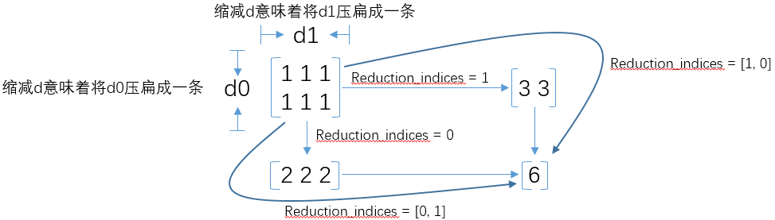

### tf.reduce_max(tf.reduce_min相对)

&emsp;&emsp;The function is:<!--more-->

``` python
reduce_max (
    input_tensor, axis=None, keep_dims=False,
    name=None, reduction_indices=None)
```

Computes the maximum of elements across dimensions of a tensor.
&emsp;&emsp;Reduces `input_tensor` along the dimensions given in `axis`. Unless `keep_dims` is `true`, the rank of the tensor is reduced by `1` for each entry in `axis`. If `keep_dims` is `true`, the reduced dimensions are retained with length `1`.
&emsp;&emsp;If `axis` has no entries, all dimensions are reduced, and a tensor with a single element is returned.

- `input_tensor`: The tensor to reduce. Should have numeric type.
- `axis`: The dimensions to reduce. If `None` (the default), reduces all dimensions. Must be in the range `[-rank(input_tensor), rank(input_tensor))`.
- `keep_dims`: If `true`, retains reduced dimensions with length `1`.
- `name`: A `name` for the operation (optional).
- `reduction_indices`: The old (deprecated) name for `axis`.

Return the reduced tensor.

``` python
import tensorflow as tf
​
x = tf.constant([[1, 4, 3], [4, 2, 6]], dtype=tf.float32)  # x.shape=(2, 3)
y = tf.reduce_max(x, axis=1, keepdims=True)
# 2行3列，“axis = 1”就在列维度操作，n列变成1列，即每一行求max，合到一列里
# 相当于只有第1维有值，而其他几维没东西了，第1维存的是其他几维的max
sess = tf.Session()
print(x.shape)
print(sess.run(y))
print(y.shape)
print("----------")
y = tf.reduce_max(x, axis=0, keepdims=True)
# 2行3列，“axis = 0”就在行维度操作，n行变成1行，即每一列求max，合到一行里
# 相当于只有第0维有值，而其他几维没东西了，第0维存的是其他几维的max
sess = tf.Session()
print(x.shape)
print(sess.run(y))
print(y.shape)
print("----------")
x = tf.constant([
        [[1, 2, 3], [4, 5, 6]],
        [[22, 33, 44], [55, 66, 77]]
    ], dtype=tf.float32)  # x.shape=(2, 2, 3)
y = tf.reduce_max(x, axis=0, keepdims=True)
sess = tf.Session()
print(sess.run(y))
print(y.shape)
print("----------")
y = tf.reduce_max(x, axis=1, keepdims=True)
sess = tf.Session()
print(sess.run(y))
print(y.shape)
print("----------")
y = tf.reduce_max(x, axis=2, keepdims=True)
sess = tf.Session()
print(sess.run(y))
print(y.shape)
```

执行结果：

``` python
[[4.]
[6.]]
(2, 1)
----------
(2, 3)
[[4. 4. 6.]]
(1, 3)
----------
[[[22. 33. 44.]
  [55. 66. 77.]]]
(1, 2, 3)
----------
[[[ 4.  5.  6.]]

[[55. 66. 77.]]]
(2, 1, 3)
----------
[[[ 3.]
  [ 6.]]

[[44.]
  [77.]]]
(2, 2, 1)
```

### tf.reduce_mean

&emsp;&emsp;The function is:

``` python
reduce_mean(
    input_tensor, axis=None, keepdims=None, name=None,
    reduction_indices=None, keep_dims=None
)
```

Defined in `tensorflow/python/ops/math_ops.py`. Computes the mean of elements across dimensions of a tensor (deprecated arguments).
&emsp;&emsp;`SOME ARGUMENTS ARE DEPRECATED!` They will be removed in a future version. Instructions for updating: `keep_dims` is deprecated, use `keepdims` instead.
&emsp;&emsp;Reduces `input_tensor` along the dimensions given in `axis`. Unless `keepdims` is `true`, the rank of the tensor is reduced by `1` for each entry in `axis`. If `keepdims` is `true`, the reduced dimensions are retained with length `1`.
&emsp;&emsp;If `axis` has no entries, all dimensions are reduced, and a tensor with a single element is returned.

``` python
x = tf.constant([[1., 1.], [2., 2.]])
tf.reduce_mean(x)  # 1.5
tf.reduce_mean(x, 0)  # [1.5, 1.5]
tf.reduce_mean(x, 1)  # [1.,  2.]
```

- `input_tensor`: The tensor to reduce. Should have numeric type.
- `axis`: The dimensions to reduce. If `None` (the default), reduces all dimensions. Must be in the range `[-rank(input_tensor), rank(input_tensor))`.
- `keepdims`: If `true`, retains reduced dimensions with length `1`.
- `name`: A `name` for the operation (optional).
- `reduction_indices`: The old (deprecated) name for `axis`.
- `keep_dims`: Deprecated alias for `keepdims`.

Return the reduced tensor. Equivalent to `np.mean`.
&emsp;&emsp;Please note that `np.mean` has a `dtype` parameter that could be used to specify the output type. By default this is `dtype=float64`. On the other hand, `tf.reduce_mean` has an aggressive type inference from `input_tensor`:

``` python
x = tf.constant([1, 0, 1, 0])
tf.reduce_mean(x)  # 0
y = tf.constant([1., 0., 1., 0.])
tf.reduce_mean(y)  # 0.5
```

### tf.reduce_sum

&emsp;&emsp;The function is:

``` python
reduce_sum(
    input_tensor, axis=None, keep_dims=False,
    name=None, reduction_indices=None
)
```

Computes the sum of elements across dimensions of a tensor.
&emsp;&emsp;Reduces `input_tensor` along the dimensions given in `axis`. Unless `keep_dims` is `true`, the rank of the tensor is reduced by `1` for each entry in `axis`. If `keep_dims` is `true`, the reduced dimensions are retained with length `1`.
&emsp;&emsp;If `axis` has no entries, all dimensions are reduced, and a tensor with a single element is returned.

``` python
x = tf.constant([[1, 1, 1], [1, 1, 1]])
tf.reduce_sum(x)  # 6
tf.reduce_sum(x, 0)  # [2, 2, 2]
tf.reduce_sum(x, 1)  # [3, 3]
tf.reduce_sum(x, 1, keep_dims=True)  # [[3], [3]]
tf.reduce_sum(x, [0, 1])  # 6
```

- `input_tensor`: The tensor to reduce. Should have numeric type.
- `axis`: The dimensions to reduce. If `None` (the default), reduces all dimensions. Must be in the range `[-rank(input_tensor), rank(input_tensor))`.
- `keep_dims`: If `true`, retains reduced dimensions with length `1`.
- `name`: A `name` for the operation (optional).
- `reduction_indices`: The old (deprecated) name for `axis`.

Return the reduced tensor.

### 理解reduction_indices

&emsp;&emsp;在`Tensorflow`的使用中，经常会使用`tf.reduce_mean`、`tf.reduce_sum`等函数。在这些函数中，有一个`reduction_indices`参数，表示函数的处理维度：



&emsp;&emsp;需要注意的一点，在很多时候看到别人的代码中并没有`reduction_indices`这个参数，此时该参数取默认值`None`，将把`input_tensor`降到`0`维，也就是一个数。