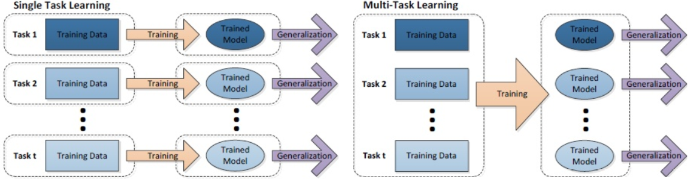
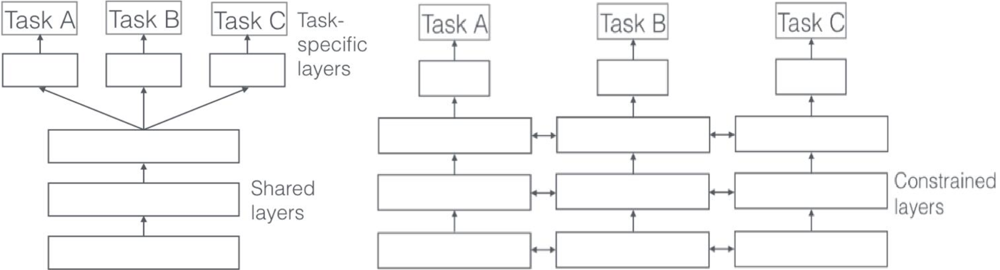
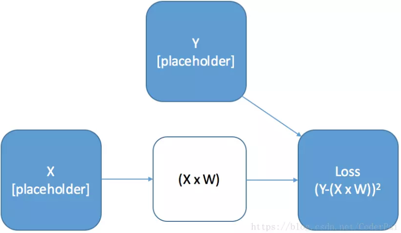
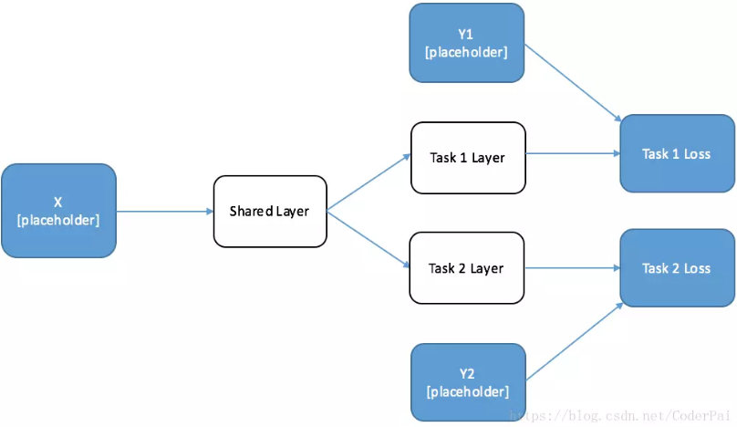
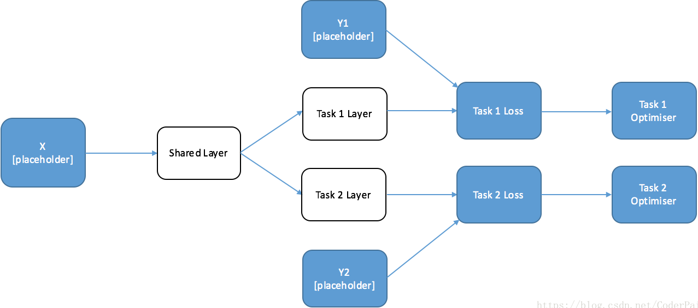
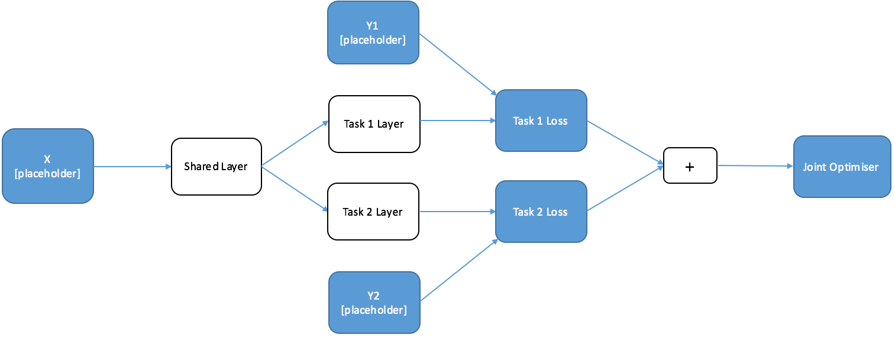

### 单任务学习和多任务学习

&emsp;&emsp;单任务学习一次只学习一个任务(`task`)，大部分的机器学习任务都属于单任务学习；多任务学习是把多个相关(`related`)的任务放在一起学习，同时学习多个任务。
&emsp;&emsp;对于复杂的问题，也可以分解为简单且相互独立的子问题来单独解决，然后再合并结果，得到最初复杂问题的结果。这样做看似合理，其实是不正确的，因为现实世界中很多问题不能分解为几个独立的子问题，即使可以分解，各个子问题之间也是相互关联的，通过一些共享因素或共享表示(`share representation`)联系在一起。把现实问题当做几个独立的单任务处理，忽略了问题之间所富含的丰富的关联信息。
&emsp;&emsp;多任务学习就是为了解决这个问题而诞生的，把多个相关(`related`)的任务(`task`)放在一起学习。这样做真的有效吗？答案是肯定的。多个任务之间共享一些因素，它们可以在学习过程中，共享它们所学到的信息，这是单任务学习所不具备的。相关联的多任务学习比单任务学习具有更好的泛化(`generalization`)效果。
&emsp;&emsp;单任务与多任务对比如下图所示，单任务学习时，各个任务之间的模型空间(`Trained Model`)是相互独立的；多任务学习时，多个任务之间的模型空间是共享的：



### 两种多任务学习模式

&emsp;&emsp;为了使得多任务学习的思想更加具体，如下展示了基于深度神经网络的两种多任务学习模式：隐层参数的硬共享与软共享。

- 参数的硬共享机制(左图)：参数的硬共享机制是神经网络的多任务学习中最常见的一种方式。一般来讲，它可以应用到所有任务的所有隐层上，而保留任务相关的输出层。硬共享机制降低了过拟合的风险。越多任务同时学习，模型就能捕捉到越多任务的同一个表示，从而导致在原始任务上的过拟合风险越小。
- 参数的软共享机制(右图)：每个任务都有自己的模型以及自己的参数，对模型参数的距离进行正则化来保障参数的相似。



### 利用TensorFlow一步一步构建一个多任务学习模型

&emsp;&emsp;当你在思考新事物的时候，通常会利用以前的经验和获得的知识来加速现在的学习过程。例如当学习一门新语言时，尤其是相关的语言时，通常会使用我们以前学过的语言知识来加快这一门新语言的学习过程。这个过程也可以用另一种方式来理解 -- 学习一种新的语言可以帮助你更好的理解和说出自己的想法。
&emsp;&emsp;我们的大脑会同时学习多种不同的任务，无论是想将英文翻译成中文，还是想将中文翻译成德语，都是使用相同的大脑架构，也就是我们自己的脑袋。同理在机器学习模型中，如果采用的是同一个网络来同时完成这两个任务，那么就可以把这个任务称为`多任务学习`。
&emsp;&emsp;多任务学习是最近几年或者说未来几年非常有趣和令人兴奋的一个研究领域，因为这个学习模式从根本上减少了学习新概念所需的数据量。深度学习其中一个最伟大的地方是，我们可以利用模型之间的参数共享来优化我们的模型，而这种方法在多任务学习中将显得尤为突出。
&emsp;&emsp;在开始这个领域的学习之前，我遇到了一些障碍：虽然我们很容易理解实现多任务学习所需要的网络架构，但是很难弄清楚在`TensorFlow`中是如何实现它的。除了`TensorFlow`中的标准网络之外，我们做任何事情都需要对其工作原理有一个很好的理解，但是网上大多数的教程都是没有一个很好的指导教学功能。我希望以下教程可以简单解释一些关键概念，并帮助学习困难的你。

#### 简单的例子(线性变换)

&emsp;&emsp;`TensorFlow`的计算图能让`TensorFlow`运行的更加快，它是深度学习中一个很重要的组成部分，虽然这部分时常让人感到困惑。计算图可以能容易整理清楚模型的组织架构，这对我们进行多任务学习是非常有意义的。首先，对计算图进行简单的计算 -- 对输入数据进行线性变换，并计算平方根损失：

``` python
import tensorflow as tf
import numpy as np
​
# Create Placeholders For X And Y (for feeding in data)
X = tf.placeholder("float", [10, 10], name="X")  # Our input is “10 * 10”
Y = tf.placeholder("float", [10, 1], name="Y")  # Our output is “10 * 1”
​
# Create a Trainable Variable, "W", our weights for the linear transformation
initial_W = np.zeros((10, 1))
W = tf.Variable(initial_W, name="W", dtype="float32")
​
Loss = tf.pow(tf.add(Y, -tf.matmul(X, W)), 2, name="Loss")  # Define Your Loss Function
​
with tf.Session() as sess:  # set up the session
    sess.run(tf.global_variables_initializer())
    Model_Loss = sess.run(
        Loss,  # the first argument is the name of the tensorflow variabl you want to return
        {  # the second argument is the data for the placeholders
            X: np.random.rand(10, 10),
            Y: np.random.rand(10).reshape(-1, 1)
        })
​
    print(Model_Loss)
    sess.close()
```



#### 如何使用计算图来进行多任务学习？

&emsp;&emsp;当创建一个执行多任务学习的神经网络时，我们希望网络中的某些神经元是被共享的，而网络的其它部分则是针对不同任务而单独设计的。当进行训练的时候，我们希望每个独立的任务都可以对共享神经元起到修改功能。
&emsp;&emsp;首先绘制一个简单的双任务网络结构，该网络具有共享层和每个单独任务的特定网络层：

``` python
import tensorflow as tf
import numpy as np
​
# Define the Placeholders
X = tf.placeholder("float", [10, 10], name="X")
Y1 = tf.placeholder("float", [10, 20], name="Y1")
Y2 = tf.placeholder("float", [10, 20], name="Y2")
​
# Define the weights for the layers
initial_shared_layer_weights = np.random.rand(10, 20)
initial_Y1_layer_weights = np.random.rand(20, 20)
initial_Y2_layer_weights = np.random.rand(20, 20)
​
shared_layer_weights = tf.Variable(initial_shared_layer_weights, name="share_W", dtype="float32")
Y1_layer_weights = tf.Variable(initial_Y1_layer_weights, name="share_Y1", dtype="float32")
Y2_layer_weights = tf.Variable(initial_Y2_layer_weights, name="share_Y2", dtype="float32")
​
# Construct the Layers with RELU Activations
shared_layer = tf.nn.relu(tf.matmul(X, shared_layer_weights))
Y1_layer = tf.nn.relu(tf.matmul(shared_layer, Y1_layer_weights))
Y2_layer = tf.nn.relu(tf.matmul(shared_layer, Y2_layer_weights))
​
# Calculate Loss
Y1_Loss = tf.nn.l2_loss(Y1 - Y1_layer)
Y2_Loss = tf.nn.l2_loss(Y2 - Y2_layer)
```



&emsp;&emsp;当训练这个网络时，我们希望在训练任务`2`的时候，不会改变任务`1`的参数。但在训练两个中的任何一个任务时，共享层的参数都会改变。这可能看起来有点困难，通常我们在图中只有一个优化器，因为只优化一个损失函数。值得庆幸的是，我们可以巧妙的利用图的性质来通过两种方式来训练这种模型。

#### 交替训练

&emsp;&emsp;第一种解决方案特别适用于需要一批任务`1`数据，然后再需要一批任务`2`数据的情况。请记住，`TensorFlow`会自动判断你所需要的操作都需要进行哪些计算，并且只进行这些计算。这意味着如果我们只对其中一个任务定义一个优化器，它将只训练计算该任务所需要的参数，并且将其余的参数单独保留下来。由于任务`1`仅依赖于任务`1`层和共享层，所以任务`2`层的参数是不会改变的。

``` python
import tensorflow as tf
import numpy as np
​
# Define the Placeholders
X = tf.placeholder("float", [10, 10], name="X")
Y1 = tf.placeholder("float", [10, 20], name="Y1")
Y2 = tf.placeholder("float", [10, 20], name="Y2")
​
# Define the weights for the layers
initial_shared_layer_weights = np.random.rand(10, 20)
initial_Y1_layer_weights = np.random.rand(20, 20)
initial_Y2_layer_weights = np.random.rand(20, 20)
​
shared_layer_weights = tf.Variable(initial_shared_layer_weights, name="share_W", dtype="float32")
Y1_layer_weights = tf.Variable(initial_Y1_layer_weights, name="share_Y1", dtype="float32")
Y2_layer_weights = tf.Variable(initial_Y2_layer_weights, name="share_Y2", dtype="float32")
​
# Construct the Layers with RELU Activations
shared_layer = tf.nn.relu(tf.matmul(X, shared_layer_weights))
Y1_layer = tf.nn.relu(tf.matmul(shared_layer, Y1_layer_weights))
Y2_layer = tf.nn.relu(tf.matmul(shared_layer, Y2_layer_weights))
​
# Calculate Loss
Y1_Loss = tf.nn.l2_loss(Y1 - Y1_layer)
Y2_Loss = tf.nn.l2_loss(Y2 - Y2_layer)
​
# optimisers
Y1_op = tf.train.AdamOptimizer().minimize(Y1_Loss)
Y2_op = tf.train.AdamOptimizer().minimize(Y2_Loss)
```



我们可以通过交替调用每个任务优化器来进行多任务学习，这意味着可以不断地将每个任务的某些信息传送给另一个任务，因为这是通过共享层来完成的。不严格的说，我们正在发现一些任务之间的`共性`。下面的代码简单地实现了这一个过程：

``` python
with tf.Session() as session:
    session.run(tf.global_variables_initializer())

    for iters in range(10):
        if np.random.rand() < 0.5:
            _, Y1_loss = session.run(
                [Y1_op, Y1_Loss],
                {
                    X: np.random.rand(10, 10) * 10,
                    Y1: np.random.rand(10, 20) * 10,
                    Y2: np.random.rand(10, 20) * 10
                })
            print("Y1_loss:", Y1_loss)
        else:
            _, Y2_loss = session.run(
                [Y2_op, Y2_Loss],
                {
                    X: np.random.rand(10, 10) * 10,
                    Y1: np.random.rand(10, 20) * 10,
                    Y2: np.random.rand(10, 20) * 10
                })
            print("Y2_loss:", Y2_loss)
```

&emsp;&emsp;什么时候适合交替训练？当你为每个不同的任务有不同的数据集的时候，交替训练是一个很好的注意(例如，从英语翻译成法语和从英语翻译成德语)。通过以这种方式设计网络，我们可以提高每项任务的性能，而不需去寻找更多的训练数据。交替训练是我们最常见的一种情况，因为没有那么多的数据集可以同时满足你两个需求。我们来举一个例子，例如在机器视觉中，你可能需要执行其中的一项任务是来预测对象是否进行了旋转，而另一个任务可能需要你去改变相机对象，这两个任务显然是相关。
&emsp;&emsp;什么时候不适合交替训练？交替训练很容易偏向特定的任务，如果你的其中一个任务比别的任务有更大的数据集，那么如果按照数据集的大小比例来进行训练，你的共享层将包含拥有更多数据的任务的信息。

#### 联合训练

&emsp;&emsp;当每个输入都是具有多个标签的数据集时，那么你真正想要的是联合训练这些任务。问题是，你如何保持各个不同任务之间的独立性？答案非常简单，只需要将单个任务的损失函数相加并优化就行了：

``` python
import tensorflow as tf
import numpy as np
​
# Define the Placeholders
X = tf.placeholder("float", [10, 10], name="X")
Y1 = tf.placeholder("float", [10, 20], name="Y1")
Y2 = tf.placeholder("float", [10, 20], name="Y2")
​
# Define the weights for the layers
initial_shared_layer_weights = np.random.rand(10, 20)
initial_Y1_layer_weights = np.random.rand(20, 20)
initial_Y2_layer_weights = np.random.rand(20, 20)
​
shared_layer_weights = tf.Variable(initial_shared_layer_weights, name="share_W", dtype="float32")
Y1_layer_weights = tf.Variable(initial_Y1_layer_weights, name="share_Y1", dtype="float32")
Y2_layer_weights = tf.Variable(initial_Y2_layer_weights, name="share_Y2", dtype="float32")
​
# Construct the Layers with RELU Activations
shared_layer = tf.nn.relu(tf.matmul(X, shared_layer_weights))
Y1_layer = tf.nn.relu(tf.matmul(shared_layer, Y1_layer_weights))
Y2_layer = tf.nn.relu(tf.matmul(shared_layer, Y2_layer_weights))
​
# Calculate Loss
Y1_Loss = tf.nn.l2_loss(Y1 - Y1_layer)
Y2_Loss = tf.nn.l2_loss(Y2 - Y2_layer)
Joint_Loss = Y1_Loss + Y2_Loss
​
# optimisers
Optimiser = tf.train.AdamOptimizer().minimize(Joint_Loss)
Y1_op = tf.train.AdamOptimizer().minimize(Y1_Loss)
Y2_op = tf.train.AdamOptimizer().minimize(Y2_Loss)
​
with tf.Session() as session:
    session.run(tf.global_variables_initializer())
    _, Joint_Loss = session.run(
        [Optimiser, Joint_Loss],
        {
            X: np.random.rand(10, 10) * 10,
            Y1: np.random.rand(10, 20) * 10,
            Y2: np.random.rand(10, 20) * 10
        })
    print(Joint_Loss)
```

