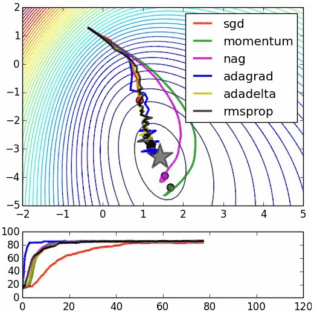
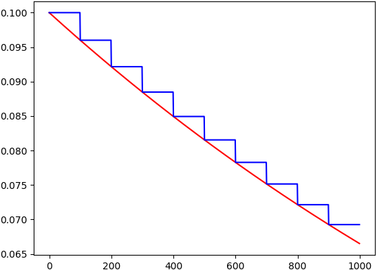
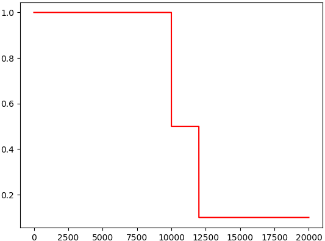

&emsp;&emsp;学习速率(`learning rate`)是神经网络中随着时间推移，信息累积的速度。学习速率决定了网络达到最优值速度，或对于特定期望的输出时，网络的参数达到最优状态的速度。在随机梯度下降(`SGD`)的平面图中，学习速率与误差梯度的形状无关，因为全局学习速率与误差梯度无关。然而，可以对原始`SGD`更新规则进行许多修改，将学习速率与错误梯度的大小和方向相关联。<!--more-->

### 为什么要调整学习速率？

&emsp;&emsp;随着时间的推移，调整学习速率与根据道路条件对汽车的速度进行调整相似。在高速公路等平稳宽阔的道路上，我们可以提高速度(学习速率)；但是在狭窄的丘陵或山谷道路上，我们必须放慢速度。此外，我们不希望在高速公路上行驶得太慢，否则需要太长时间才能到达目的地(由于参数不正确而导致更长的训练时间)。同样，我们也不想在丘陵和狭窄的道路上(如优化损失函数曲面的沟壑)驾驶太快，因为我们很容易失去对汽车的控制(陷入抖动或产生太多的反弹，我们几乎不能做任何改进)或跳过目的地(最佳值)。
&emsp;&emsp;请记住`较高的学习速率表示系统含有太多的动能，参数向量在处于混沌状态下，不断来回反弹，无法稳定到损失函数的一个较深且较窄的最优值`。
&emsp;&emsp;理想的策略是从一个很大的学习速率开始，随后逐渐减半，直到损失值不再分歧(发散)。接近训练结束时，学习速率的衰减应该在`100`倍以上。这种衰减使学习到的网络模型可以抵抗随机波动，这中随机波动可能会扭转学习(陷入发散状态)。我们将从一个小的学习速率开始，测试一小组数据，并选择适当的值。

### 衰减学习速率

&emsp;&emsp;非自适应学习速率可能不是最佳的。学习速率衰减可以通过每几个时间周期做一些较小的常数因子的衰减，或通过指数衰减来实现，指数衰减采用几个时间周期的指数的数学形式来实现。`衰减`通常被认为是一个消极的概念，同样，学习速率的衰减也是消极的：它指的是学习速率下降的程度。然而，这种衰减的结果实际上是我们非常想要的。例如在一辆车上，我们降低速度以适应道路和交通状况，这种减速可以被理解为汽车速度的`衰减`。同样，我们从衰减学习速率得到好处，以适应梯度。
&emsp;&emsp;动量是一种自适应学习速率方法的参数，允许沿浅方向使用较高的速度，同时沿陡峭方向降低速度前进。这种动量被定义为`经典动量`，其对速度进行校正，然后在速度方向上进行大跳跃。动量有助于加速或减速学习速率以适应梯度的变化，最终导致网络学习速率的变化而不是其在损失函数表面上的位置的变化。动量使学习到的网络更能抵抗输入数中的噪声和随机性。
&emsp;&emsp;将学习速率视为超参数的其他更新规则包括：

- `AdaGrad`更新规则：基于每个维度历史的均方误差的和，为每一个维度的梯度增加了一个初度变换的规则。
- `RMSProp`自适应学习速率法：保持每个权重的平方梯度的移动平均值，以规范化(`normalize`)当前梯度。`RMSProp`增加了对波动和随机噪声的更强的抵抗能力。
- `Adam`、`Kingma`和`Ba`：引入了偏差矫正策略以补偿零初始化带来影响。
- `rprop`：只使用梯度的符号来对每个权重的步长自适应调整，这不适用于`mini-batch`训练。

除了这些规则以外，还有基于牛顿的更新规则的二阶方法。然而，二阶方法不将学习速率视为超参数，且由于它们的计算需求很高，所以很少用于大规模的深度学习系统。
&emsp;&emsp;下图显示了在类似超参数设置条件下，不同优化技术的对比：



&emsp;&emsp;从本质上讲，我们的目的不是衰减，而是要通过衰减跳入一个正确的地方。必须选择性地增加或减少学习速率，为了达到一个全局最优值或者是期望的目标值。不要害怕这个，因为我们经常要做一遍又一遍。
&emsp;&emsp;在`Tensorflow`中，为解决设定学习率(`learning rate`)问题，提供了`tf.train.exponential_decay`函数实现指数衰减学习率。首先使用较大学习率，目的是快速得到一个比较优的解；然后通过迭代逐步减小学习率，目的是使模型在训练后期更加稳定：

``` python
decayed_learning_rate = learining_rate * decay_rate^(global_step / decay_steps)
```

- `decayed_learning_rate`：每一轮优化时使用的学习率。
- `learning_rate`：事先设定的初始学习率。
- `decay_rate`：衰减系数。
- `decay_steps`：衰减速度。

`tf.train.exponential_decay`函数原型如下：

``` python
tf.train.exponential_decay(learning_rate, global_, decay_steps, decay_rate, staircase=True/False)
```

代码如下：

``` python
import tensorflow as tf
import matplotlib.pyplot as plt
​
learning_rate = 0.1
decay_rate = 0.96
global_steps = 1000
decay_steps = 100
​
global_ = tf.Variable(tf.constant(0))
c = tf.train.exponential_decay(learning_rate, global_, decay_steps, decay_rate, staircase=True)
d = tf.train.exponential_decay(learning_rate, global_, decay_steps, decay_rate, staircase=False)
​
T_C = []
F_D = []
​
with tf.Session() as sess:
    for i in range(global_steps):
        T_c = sess.run(c, feed_dict={global_: i})
        T_C.append(T_c)
        F_d = sess.run(d, feed_dict={global_: i})
        F_D.append(F_d)
​
plt.figure(1)
plt.plot(range(global_steps), F_D, 'r-')
plt.plot(range(global_steps), T_C, 'b-')
​
plt.show()
```



初始的学习速率是`0.1`，总的迭代次数是`1000`次，如果`staircase=True`，那就表明每`decay_steps`次计算学习速率变化，更新原始学习速率；如果是`False`，那就是每一步都更新学习速率。红色表示`False`，蓝色表示`True`。
&emsp;&emsp;常数分片学习率衰减如下：

``` python
piecewise_constant(x, boundaries, values, name=None)
```

例如前`10000`轮迭代使用`1.0`作为学习率，`10000`轮到`12000`轮使用`0.5`作为学习率，以后使用`0.1`作为学习率：

``` python
import tensorflow as tf
import matplotlib.pyplot as plt
​
global_ = tf.Variable(tf.constant(0), trainable=False)
boundaries = [10000, 12000]
values = [1.0, 0.5, 0.1]
learning_rate = tf.train.piecewise_constant(global_, boundaries, values)
global_steps = 20000
​
T_L = []

with tf.Session() as sess:
    for i in range(global_steps):
        T_l = sess.run(learning_rate, feed_dict={global_: i})
        T_L.append(T_l)
​
plt.figure(1)
plt.plot(range(global_steps), T_L, 'r-')
plt.show()
```

