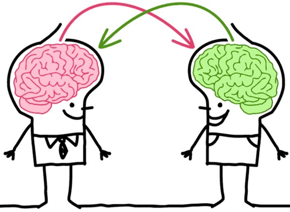
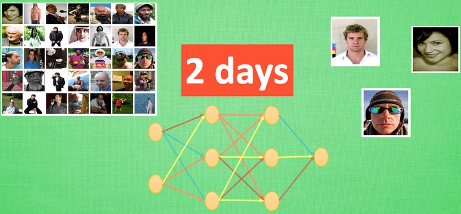
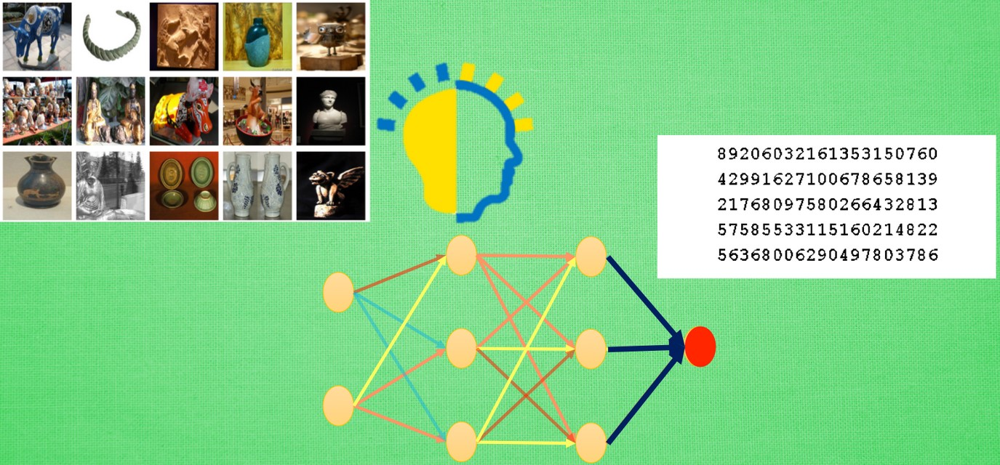
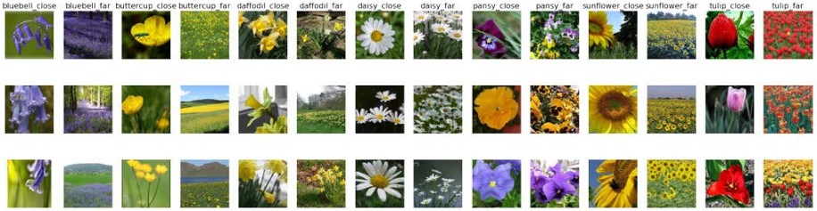
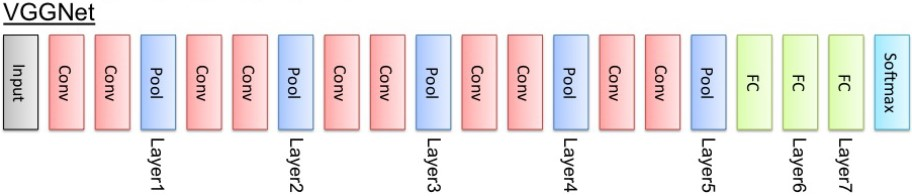
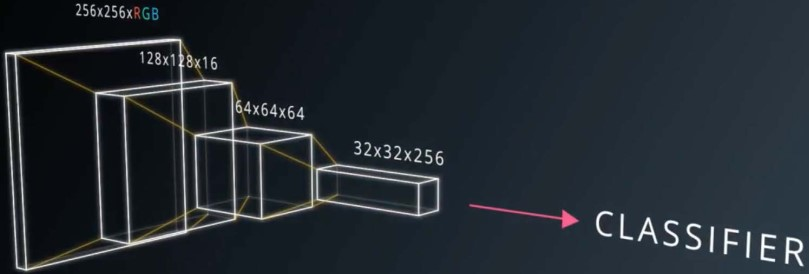
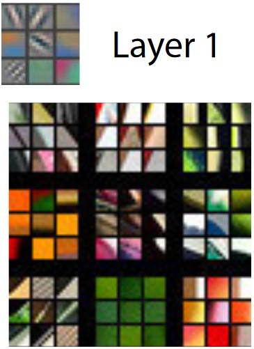
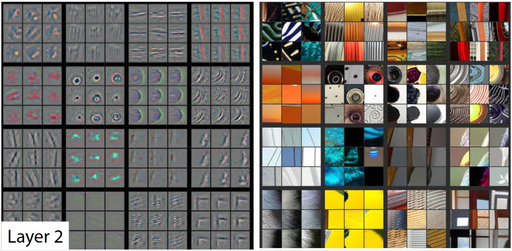
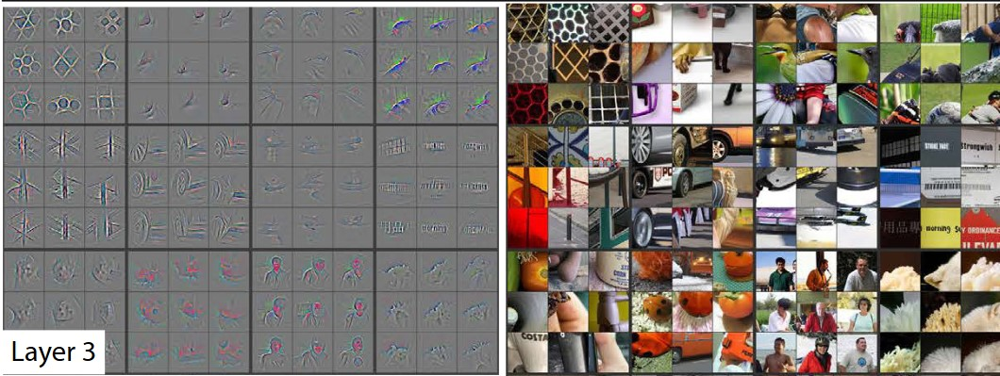
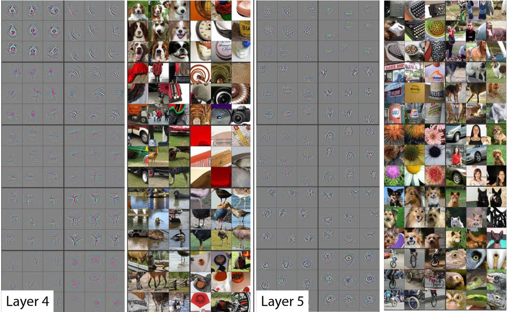

### 迁移学习

&emsp;&emsp;一个人的成功往往取决于先辈们累积的知识，如果把这句话放在机器学习中，这就是迁移学习(`transfer learning`)。



### 怎么迁移

&emsp;&emsp;迁移学习这就好比`KFC`和麦当劳的关系，同一类型的事业不用自己完全从头做，借鉴对方的经验往往能节省很多时间。有这样的思路，我们也能偷偷懒，不用花时间重新训练一个无比庞大的神经网络，借鉴借鉴一个已经训练好的神经网络就行。
&emsp;&emsp;比如这样的一个神经网络，我花了两天训练完之后，它已经能正确区分图片中具体描述的是男人、女人还是眼镜，说明这个神经网络已经具备对图片信息一定的理解能力，这些理解能力就以参数的形式存放在每一个神经节点中。



&emsp;&emsp;不巧的是，领导下达了一个紧急任务，要求今天之内训练出来一个预测图片里实物价值的模型。我想这下可完蛋了，上一个图片模型都要花两天，如果要再搭个模型重新训练，今天肯定出不来呀，于是迁移学习来拯救我了。因为这个训练好的模型中已经有了一些对图片的理解能力，而模型最后输出层的作用是分类之前的图片，对于现在计算价值的任务是用不到的。所以将最后一层替换掉，变为服务于现在这个任务的输出层。接着只训练新加的输出层，让理解力保持始终不变，前面的神经层庞大的参数不用再训练，节省了很多时间。



&emsp;&emsp;但并不是所有的情况都需要用到迁移学习，比如训练小的神经网络并不需要特别多的时间，我们完全可以直接重头开始训练，从头开始训练也是有好处的。如果固定住之前的理解力，或者使用更小的学习率来更新借鉴来的模型，就变得有点像认识一个人时的第一印象。如果迁移前的数据和迁移后的数据差距很大，或者说我对于这个人的第一印象和后续印象差距很大，我还不如不要管我的第一印象。同理，这时迁移来的模型并不会起多大作用，还可能干扰我后续的决策。

---

&emsp;&emsp;深度学习是人工智能领域近年来最火热的话题之一，但是对于个人来说，以往想要玩转深度学习除了要具备高超的编程技巧，还需要有海量的数据和强劲的硬件。不过`TensorFlow`和`Keras`等框架的出现大大降低了编程的复杂度，而迁移学习的思想也允许我们利用现有的模型加上少量数据和训练时间，取得不俗的效果。
&emsp;&emsp;这篇文章将示范如何利用迁移学习训练一个能从图片中分类不同种类的花的模型，它在五种花中能达到`80%`以上的准确度，而且只需要普通的家用电脑就可以完成训练过程。



### 什么是迁移学习

&emsp;&emsp;人类的思维可以将一个领域学习到的知识和经验，应用到其他相似的领域中去。所以当面临新的情景时，如果该情景与之前的经验越相似，那么人就能越快掌握该领域的知识。而传统的机器学习方法则会把不同的任务看成是完全独立的，比如一个识别猫的模型，如果训练集中的图片都是白天的，那么训练出来的模型对于识别夜晚的猫这个任务就可能表现得非常差。迁移学习便是受此启发，试图将模型从源任务上训练到的知识迁移到目标任务的应用上。
&emsp;&emsp;举例来说，源任务可以是识别图片中车辆，而目标任务可以是识别卡车、轿车、公交车等。合理的使用迁移学习可以避免针对每个目标任务单独训练模型，从而极大的节约了计算资源。
&emsp;&emsp;此外，迁移学习并不是一种特定的机器学习模型，它更像是一种优化技巧。通常来说，机器学习任务要求测试集和训练集有相同的概率分布，然而在一些情况下往往会缺乏足够大的有针对性的数据集来满足一个特定的训练任务。迁移学习提出我们可以在一个通用的大数据集上进行一定量的训练后，再用针对性的小数据集进一步强化训练。
&emsp;&emsp;接下来的例子中将示范如何将一个图像识别的深度卷积网络(`VGG`)，迁移到识别花朵类型的新任务上。在原先的任务中，`VGG`只能识别花，但是迁移学习可以让模型不但能识别花，还能识别花的具体品种。

### VGG介绍

&emsp;&emsp;`VGG`是视觉领域竞赛`ILSVRC`在`2014`年的获胜模型，以`7.3%`的错误率在`ImageNet`数据集上大幅刷新了前一年`11.7%`的世界纪录。`VGG16`基本上继承了`AlexNet`的思想，并且发扬光大，做到了更深。`AlexNet`只用到了`8`层网络，而`VGG`的两个版本分别是`16`层网络版和`19`层网络版。在接下来的迁移学习实践中，我们会采用稍微简单的一些的`VGG16`，它和`VGG19`有几乎完全一样的准确度，但是运算起来更快一些。
&emsp;&emsp;`VGG`的结构图如下：



`VGG`的输入数据格式是`244 * 224 * 3`的像素数据，经过一系列的卷积神经网络和池化网络处理之后，输出的是一个`4096`维的特征数据，然后再通过`3`层全连接的神经网络处理，最终由`softmax`规范化得到分类结果。
&emsp;&emsp;`VGG16`模型是一个`npy`文件，本质上是一个巨大的`numpy`对象，包含了`VGG16`模型中的所有参数。该文件大约有`500M`，所以可见如果是从头训练这样一个模型是非常耗时的，借助于迁移学习的思想，我们可以直接在这个模型的基础上进行训练。

### 卷积神经网络

&emsp;&emsp;卷积神经网络在图像数据中使用得尤其多，不同于一般的全连接的神经网络需要对上下两层网络中的任意两个节点之间训练权值，每层卷积网络仅仅训练若干个卷积核，下一层的网络的输入即是前一个层的输出的卷积，因此多层卷积神经网络会把一个薄薄的图片数据，转化为更小但是也更厚的数组，如下图所示：



&emsp;&emsp;卷积神经网络具有良好的统计不变性，而且每个层可以学习到不同层次的知识。比如第一层会学习到识别图片中的简单形状，例如直线和纯色块等。而之后的层将会上升到更高的抽象层次，比如例如形状，物体的组成部分，直到能够识别整个物体。
&emsp;&emsp;如果我们将卷积神经网络中激活神经元的图像可视化出来，那么会得到如下的结果。首先第一层能识别出一些对角线和颜色的分界：



然后第二层网络可以学习到了一些稍微复杂的概念，比如圈和条纹：



第三层学习到了一些简单的物体，比如轮胎和脸：



到了更高的层数，卷积神经网络能够识别出越来越复杂的物体，这个过程也非常符合人类识别物体的过程，即从简单模式越来越复杂的模式：



### 识花数据集

&emsp;&emsp;`flower_photos`数据集有包含如下数据：

花的种类      | 图片数量
-------------|--------
`daisy`      | `633`
`dandelion`  | `898`
`roses`      | `641`
`sunflowers` | `699`
`tulips`     | `799`

&emsp;&emsp;首先我们会将所有的图片交给`VGG16`，利用`VGG16`的深度网络结构中的五轮卷积网络层和池化层，对每张图片得到一个4096维的特征向量，然后我们直接用这个特征向量替代原来的图片，再加若干层全连接的神经网络，对花朵数据集进行训练。
&emsp;&emsp;因此本质上，我们是将`VGG16`作为一个图片特征提取器，然后在此基础上再进行一次普通的神经网络学习，这样就将原先的`244 * 224 * 3`维度的数据转化为了`4096`维的，而每一维度的信息量大大提高，从而大大降低了计算资源的消耗，实现了把学习物体识别中得到的知识应用到特殊的花朵分类问题上。

### 文件结构

&emsp;&emsp;为了更加方便地使用`VGG`网络，我们可以直接使用`tensorflow`提供的`VGG`加载模块。首先保证代码工作目录下有`flowerphotos`、`tensorflowvgg`这两个文件夹，分别是花朵数据集和`tensorflowvgg`，然后将之前下载的`VGG16`拷贝到`tensorflowvgg`文件夹中：

``` python
├── transfer_learning.py(运行代码)
├── flower_phtots
│ ├── daisy
│ ├── dandelion
│ ├── roses
│ └── ...
└── tensorflow_vgg
├── vgg16.py
├── vgg16.npy
└── ...
```

然后导入需要用的`python`模块：

``` python
import os
import numpy as np
import tensorflow as tf
from tensorflow_vgg import vgg16
from tensorflow_vgg import utils
```

### 加载识花数据集

&emsp;&emsp;接下来我们将`flower_photos`文件夹中的花朵图片都载入到进来，并且用图片所在的子文件夹作为标签值：

``` python
data_dir = 'flower_photos/'
contents = os.listdir(data_dir)
classes = [each for each in contents if os.path.isdir(data_dir + each)]
```

### 利用VGG16计算得到特征值

&emsp;&emsp;代码如下：

``` python
batch_size = 10  # 首先设置计算batch的值，运算平台的内存越大，这个值可以设置得越高
codes_list = []  # 用codes_list来存储特征值
labels = []  # 用labels来存储花的类别
batch = []  # batch数组用来临时存储图片数据
codes = None
​
with tf.Session() as sess:
    vgg = vgg16.Vgg16()  # 构建VGG16模型对象
    input_ = tf.placeholder(tf.float32, [None, 224, 224, 3])

    with tf.name_scope("content_vgg"):
        vgg.build(input_)  # 载入VGG16模型

    for each in classes:  # 对每个不同种类的花分别用VGG16计算特征值
        print("Starting {} images".format(each))
        class_path = data_dir + each
        files = os.listdir(class_path)

        for ii, file in enumerate(files, 1):
            img = utils.load_image(os.path.join(class_path, file))  # 载入图片并放入batch数组中
            batch.append(img.reshape((1, 224, 224, 3)))
            labels.append(each)

            if ii % batch_size == 0 or ii == len(files):  # 如果图片数量到了batch_size，则开始运算
                images = np.concatenate(batch)
                feed_dict = {input_: images}
                codes_batch = sess.run(vgg.relu6, feed_dict=feed_dict)  # 计算特征值
​
                if codes is None:  # 将结果放入到codes数组中
                    codes = codes_batch
                else:
                    codes = np.concatenate((codes, codes_batch))

                batch = []  # 清空数组，准备下一个batch的计算
                print('{} images processed'.format(ii))
```

这样就可以得到一个`codes`数组和一个`labels`数组，分别存储了所有花朵的特征值和类别。可以用如下代码将这两个数组保存到硬盘上：

``` python
with open('codes', 'w') as f:
    codes.tofile(f)
​
import csv
​
with open('labels', 'w') as f:
    writer = csv.writer(f, delimiter='\n')
    writer.writerow(labels)
```

### 准备训练集、验证集和测试集

&emsp;&emsp;一次严谨的模型训练一定是要包含验证和测试这两个部分的。首先把`labels`数组中的分类标签用`One Hot Encode`的方式替换：

``` python
from sklearn.preprocessing import LabelBinarizer
​
lb = LabelBinarizer()
lb.fit(labels)
labels_vecs = lb.transform(labels)
```

接下来就是抽取数据，因为不同类型的花的数据数量并不是完全一样的，而且`labels`数组中的数据也还没有被打乱，所以最合适的方法是使用`StratifiedShuffleSplit`方法来进行分层随机划分。假设使用训练集、验证集和测试集的比例是`8:1:1`，那么代码如下：

``` python
from sklearn.model_selection import StratifiedShuffleSplit
​
ss = StratifiedShuffleSplit(n_splits=1, test_size=0.2)
train_idx, val_idx = next(ss.split(codes, labels))
​
half_val_len = int(len(val_idx) / 2)
val_idx, test_idx = val_idx[:half_val_len], val_idx[half_val_len:]
​
train_x, train_y = codes[train_idx], labels_vecs[train_idx]
val_x, val_y = codes[val_idx], labels_vecs[val_idx]
test_x, test_y = codes[test_idx], labels_vecs[test_idx]
​
print("Train shapes (x, y):", train_x.shape, train_y.shape)
print("Validation shapes (x, y):", val_x.shape, val_y.shape)
print("Test shapes (x, y):", test_x.shape, test_y.shape)
```

执行结果：

``` python
Train shapes (x, y): (2936, 4096) (2936, 5)
Validation shapes (x, y): (367, 4096) (367, 5)
Test shapes (x, y): (367, 4096) (367, 5)
```

### 训练网络

&emsp;&emsp;分好了数据集之后，就可以开始对数据集进行训练了。假设我们使用一个`256`维的全连接层，一个`5`维的全连接层(因为我们要分类五种不同类的花朵)和一个`softmax`层。当然这里的网络结构可以任意修改，你可以不断尝试其他的结构。

``` python
inputs_ = tf.placeholder(tf.float32, shape=[None, codes.shape[1]])  # 输入数据的维度
labels_ = tf.placeholder(tf.int64, shape=[None, labels_vecs.shape[1]])  # 标签数据的维度
fc = tf.contrib.layers.fully_connected(inputs_, 256)  # 加入一个256维的全连接的层
logits = tf.contrib.layers.fully_connected(fc, labels_vecs.shape[1], activation_fn=None)  # 加入一个5维的全连接层
cross_entropy = tf.nn.softmax_cross_entropy_with_logits(labels=labels_, logits=logits)  # 计算“cross entropy”值
cost = tf.reduce_mean(cross_entropy)  # 计算损失函数
optimizer = tf.train.AdamOptimizer().minimize(cost)  # 采用AdamOptimizer优化器
predicted = tf.nn.softmax(logits)  # 得到最后的预测分布
# 计算准确度
correct_pred = tf.equal(tf.argmax(predicted, 1), tf.argmax(labels_, 1))
accuracy = tf.reduce_mean(tf.cast(correct_pred, tf.float32))
```

为了方便把数据分成一个个`batch`，还可以再用一个函数专门用来生成`batch`：

``` python
def get_batches(x, y, n_batches=10):
    """ 这是一个生成器函数，按照n_batches的大小将数据划分了小块 """
    batch_size = len(x) // n_batches

    for ii in range(0, n_batches * batch_size, batch_size):
        # 如果不是最后一个batch，那么这个batch中应该有batch_size个数据
        if ii != (n_batches - 1) * batch_size:
            X, Y = x[ii: ii + batch_size], y[ii: ii + batch_size]
        else:  # 否则的话，那剩余的不够batch_size的数据都凑入到一个batch中
            X, Y = x[ii:], y[ii:]

        yield X, Y  # 生成器语法，返回X和Y
```

训练过程如下：

``` python
epochs = 20  # 运行轮次
iteration = 0  # 统计训练的频率
saver = tf.train.Saver()  # 训练模型的保存器
​
with tf.Session() as sess:
    sess.run(tf.global_variables_initializer())

    for e in range(epochs):
        for x, y in get_batches(train_x, train_y):
            feed = {inputs_: x, labels_: y}
            loss, _ = sess.run([cost, optimizer], feed_dict=feed)  # 训练模型
            print("Epoch: {}/{}".format(e + 1, epochs), "Iteration: {}".format(iteration), \
                  "Training loss: {:.5f}".format(loss))
            iteration += 1

            if iteration % 5 == 0:
                feed = {inputs_: val_x, labels_: val_y}
                val_acc = sess.run(accuracy, feed_dict=feed)
                # 输出用验证集验证训练精度
                print("Epoch: {}/{}".format(e, epochs), "Iteration: {}".format(iteration), \
                      "Validation Acc: {:.4f}".format(val_acc))

    saver.save(sess, "checkpoints/flowers.ckpt")  # 保存模型
```

### 测试网络

&emsp;&emsp;接下来就是用测试集来测试模型效果：

``` python
with tf.Session() as sess:
    saver.restore(sess, tf.train.latest_checkpoint('checkpoints'))
    feed = {inputs_: test_x, labels_: test_y}
    test_acc = sess.run(accuracy, feed_dict=feed)
    print("Test accuracy: {:.4f}".format(test_acc))
```