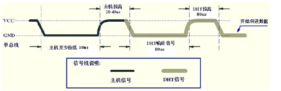
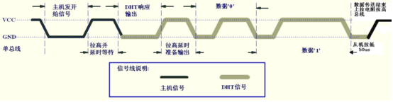
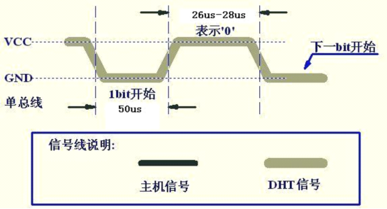
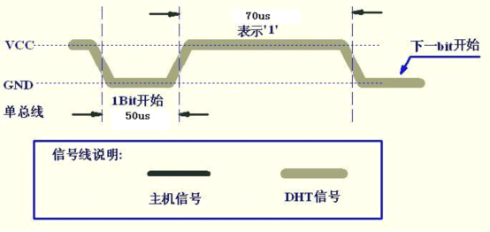

### DHT11数据格式(40bit)

&emsp;&emsp;数据格式为`8bit湿度整数数据 + 8bit湿度小数数据 + 8bi温度整数数据 + 8bit温度小数数据 + 8bit校验和`。其中温度湿度小数部分带扩展，目前读出数据为`0`；校验和数据等于`8bit湿度整数数据 + 8bit湿度小数数据 + 8bi温度整数数据 + 8bit温度小数数据`所得结果的末`8`位。

### 时序编程

&emsp;&emsp;微处理器与`DHT11`之间的通讯和同步采用单总线数据格式，一次通讯时间为`4ms`左右。`DHT11`编程所需要的条件是一个精度在`+/-5%`的`50us`延时函数。

#### 起始信号部分编程

&emsp;&emsp;起始部分时序图如下：



&emsp;&emsp;控制器首先至少拉低`18ms`，然后拉高`20`至`40us`后等待`DHT11`的应答。当`DHT11`检测到信号后，首先将总线拉低约`80us`，然后再拉高`80us`作为应答信号。

``` c
DHT11_DATA = 0; /* 拉低至少18ms */
Hal_WaitUs ( 28000 );
DHT11_DATA = 1; /* 拉高20us至40us */
Hal_WaitUs ( 50 );

if ( !DHT11_DATA ) { /* 判断从机是否低电平应答 */
    while ( !DHT11_DATA );

    while ( DHT11_DATA );

    a = Read_Byte();
    b = Read_Byte();
    c = Read_Byte();
    d = Read_Byte();
}
```

首先主机拉低总线，这里拉低了28ms，然后拉高总线50us，由时序图可以知道：若拉高50us后有从机应答，那么当主机释放总先后应该被DHT11拉低，if判断语句判断是否有DHT11应答，若有应答向下执行读取数据。

#### 数据读取部分编程

&emsp;&emsp;数据读取部分时序图如下：



<p align="center" style="color:green">DHT11通信时序</p>



<p align="center" style="color:green">DHT11的0信号时序图</p>



<p align="center" style="color:green">DHT11的1信号时序图</p>

&emsp;&emsp;DHT11以低电平应答主机，然后拉高总线准备输出。输出0信号和1信号都是以低电平开始高电平结束。DHT11输出0、1信号的低电平时间相同，而高电平的时间不同，输出0信号时高电平约26至28us，而当输出1信号时高电平约为70us。

``` c
uchar Read_Byte ( void ) {
    uchar i, in_data, k;

    for ( i = 0; i < 8; i++ ) { /* 读取8bit */
        while ( !DHT11_DATA ); /* “渡过”数据起始位低电平 */

        Hal_WaitUs ( 50 ); /* 延时50us后检测电平 */
        k = DHT11_DATA; /* 读数据 */

        if ( k == 1 ) { /* 如果读到的数据是1 */
            in_data = in_data | 0x01;

            while ( DHT11_DATA );
        } else {
            in_data = in_data | 0x00;
        }

        in_data = in_data << 1; /* 循环左移1位 */
    }

    return in_data;
}
```

&emsp;&emsp;首先主机拉低总线，这里拉低了28ms，然后拉高总线50us，由时序图可以知道若拉高50us后有从机应答，那么当主机释放总先后应该被DHT11拉低，if判断语句判断是否有DHT11应答，若有应答向下执行读取数据。其中下面两句代码`while(!DHT11_DATA)`和`while(DHT11_DATA);`渡过DHT11的应答信号。
&emsp;&emsp;在读取DHT11数据函数的时候，每次开始都有`while(!DHT11_DATA);`来渡过数据起始时的低电平，当DHT11将数据位拉高后，会在50us后采样。如果DHT11发出的数据是1，那么采样得到的是高电平，而如果DHT11发出的数据是0，那采样时刻获取的是下一个数据周期的起始位(低电平)。从而可以区分DHT11发送的是1还是0。若采集的数据是1，那采样后仍然会有一段高电平，通过`while(DHT11_DATA);`来渡过这段时间，当下一个DHT11发送下一个数据时不满足条件，重新开始循环。